# 软件结构设计说明书

## 1. 文档信息

| 字段 | 值 |
| --- | --- |
| title | 软件结构设计说明书 |
| project_name | create-structure-md |
| project_version |  |
| document_version | 0.1.0 |
| status | draft |
| generated_at | 2026-05-03T23:23:44+08:00 |
| generated_by | Codex |
| language | zh-CN |
| source_type | code |
| scope_summary | 当前仓库 create-structure-md 的技能契约、DSL schema、校验脚本、Markdown 渲染器、安装器、示例与测试结构说明。 |
| not_applicable_policy | 固定 9 章输出；仓库未涉及服务端、数据库或常驻进程时，以空表或文字说明表达不适用内容。 |
| output_file | create-structure-md_STRUCTURE_DESIGN.md |

## 2. 系统概览

create-structure-md 是一个本地 Codex 技能仓库，用于把已经准备好的结构设计 DSL JSON 校验并渲染为单个模块或系统专属 Markdown 结构设计说明书。

通过明确的技能边界、JSON Schema、语义校验、Mermaid 校验和确定性 Markdown 渲染，保证结构设计文档生成过程可重复、可审查、可验证。

| 能力 | 描述 |
| --- | --- |
| 结构设计文档生成 | 把完整 DSL JSON 渲染为固定 9 章的 Markdown 文档，并由输出文件名策略保证文档面向具体模块或系统。 |
| DSL 结构与语义质量门禁 | 结合 Draft 2020-12 JSON Schema 和语义规则检查必填章节、ID 前缀、引用一致性、输出文件名、安全文本和低置信度项。 |
| Mermaid 图校验 | 从 DSL 或已渲染 Markdown 中提取 Mermaid 图，执行静态规则检查，并在严格模式下调用本地 Mermaid CLI 验证可渲染性。 |
| 本地技能安装 | 提供 copy-only 安装器，将运行时所需文件复制到 Codex skills 目录，并避免覆盖已有安装。 |
| 契约测试与示例 | 通过 unittest 测试和最小 DSL 示例覆盖 schema、语义校验、Mermaid 校验、渲染、安装和端到端工作流。 |

支持数据（CAP-SYS-DOC-GENERATION / 结构设计文档生成）

- 依据：EV-SKILL-CONTRACT（技能入口和工作流契约，SKILL.md:1-62）
- 依据：EV-RENDERER（Markdown 渲染器实现，scripts/render_markdown.py）

支持数据（CAP-SYS-DSL-QUALITY / DSL 结构与语义质量门禁）

- 依据：EV-SCHEMA（DSL JSON Schema，schemas/structure-design.schema.json）
- 依据：EV-DSL-VALIDATOR（DSL 校验器实现，scripts/validate_dsl.py）

支持数据（CAP-SYS-MERMAID-QUALITY / Mermaid 图校验）

- 依据：EV-MERMAID-VALIDATOR（Mermaid 校验器实现，scripts/validate_mermaid.py）

支持数据（CAP-SYS-INSTALLATION / 本地技能安装）

- 依据：EV-INSTALLER（copy-only 安装器实现，scripts/install_skill.py）
- 依据：EV-INSTALL-DOC（安装文档，docs/install.md）

支持数据（CAP-SYS-CONTRACT-TESTS / 契约测试与示例）

- 依据：EV-TESTS（unittest 测试集合，tests/test_validate_dsl.py, tests/test_validate_dsl_semantics.py, tests/test_validate_mermaid.py, tests/test_render_markdown.py, tests/test_install_skill.py, tests/test_phase7_e2e.py）
- 依据：EV-EXAMPLES（V2 最小 DSL 示例与成功 fixture，examples/minimal-from-code.dsl.json, examples/minimal-from-requirements.dsl.json, tests/fixtures/valid-v2-foundation.dsl.json）
- 依据：EV-V1-REJECTED（V1 rejected fixture，tests/fixtures/rejected-v1-phase2.dsl.json）

## 3. 架构视图

### 3.1 架构概述

仓库按技能运行时能力拆分为契约文档、DSL schema、DSL 校验、Mermaid 校验、Markdown 渲染、安装和质量保障模块。技能契约规定边界与流程，schema 与校验器负责输入质量，渲染器生成最终 Markdown，安装器发布运行时文件，示例与测试保护这些契约。

### 3.2 各模块介绍

| 模块名称 | 职责 | 输入 | 输出 | 备注 |
| --- | --- | --- | --- | --- |
| 技能契约与参考文档模块 | 定义技能用途、边界、输入就绪条件、固定文档结构、Mermaid 规则和最终复核清单。 | 用户已准备的结构设计内容、仓库理解结果、参考文档规则 | Codex 执行技能时遵循的工作流和文档契约 | 主要由 SKILL.md 与 references 目录承载。 |
| DSL Schema 模块 | 用 JSON Schema 描述结构设计 DSL 的固定章节、字段形状、枚举、文件名和支持数据结构。 | 结构设计 DSL 字段契约 | schemas/structure-design.schema.json | Schema 负责结构形状，语义规则由校验脚本补充。 |
| DSL 校验器模块 | 读取 DSL JSON，先执行 schema 校验，再执行 ID、引用、章节、输出文件名、Markdown 安全和支持数据语义校验。 | structure.dsl.json、schemas/structure-design.schema.json | 校验成功消息、错误或警告报告 | 入口为 scripts/validate_dsl.py。 |
| Mermaid 校验器模块 | 从 DSL 或 Markdown 中提取 Mermaid 图，拒绝不支持的图类型和 DOT 语法，并在严格模式下调用 mmdc。 | DSL JSON 或渲染后的 Markdown、Mermaid CLI 环境 | Mermaid 静态或严格校验报告、严格模式临时 mmd/svg 产物 | 入口为 scripts/validate_mermaid.py。 |
| Markdown 渲染器模块 | 把通过校验的 DSL 渲染为固定 9 章 Markdown，处理表格、Mermaid 代码块、支持数据、转义和输出文件写入策略。 | 通过校验的结构设计 DSL JSON、输出目录参数 | document.output_file 指定的单个 Markdown 文件 | 入口为 scripts/render_markdown.py。 |
| 安装器模块 | 把运行时技能文件复制到 Codex skills 目录，执行安装前后结构检查和依赖状态报告。 | 仓库运行时文件、--codex-home 参数或 CODEX_HOME 环境变量 | 本地 Codex 技能目录中的 create-structure-md 安装副本 | 安装器不覆盖已有目标，也不安装依赖。 |
| 示例与测试模块 | 提供最小 DSL 示例、fixture 和 unittest 契约测试，覆盖校验器、渲染器、Mermaid 校验、安装器和端到端流程。 | examples 目录 DSL、tests 目录测试用例、脚本入口 | 测试结果、回归保护和可参考 DSL 样例 | 测试使用 Python 标准库 unittest。 |

支持数据（MOD-SKILL-CONTRACT / 技能契约与参考文档模块）

- 依据：EV-SKILL-CONTRACT（技能入口和工作流契约，SKILL.md:1-62）
- 依据：EV-DSL-SPEC（DSL 规范，references/dsl-spec.md）

支持数据（MOD-DSL-SCHEMA / DSL Schema 模块）

- 依据：EV-SCHEMA（DSL JSON Schema，schemas/structure-design.schema.json）

支持数据（MOD-DSL-VALIDATOR / DSL 校验器模块）

- 依据：EV-DSL-VALIDATOR（DSL 校验器实现，scripts/validate_dsl.py）

支持数据（MOD-MERMAID-VALIDATOR / Mermaid 校验器模块）

- 依据：EV-MERMAID-VALIDATOR（Mermaid 校验器实现，scripts/validate_mermaid.py）
- 依据：EV-MERMAID-RULES（Mermaid 规则，references/mermaid-rules.md）

支持数据（MOD-MARKDOWN-RENDERER / Markdown 渲染器模块）

- 依据：EV-RENDERER（Markdown 渲染器实现，scripts/render_markdown.py）

支持数据（MOD-INSTALLER / 安装器模块）

- 依据：EV-INSTALLER（copy-only 安装器实现，scripts/install_skill.py）
- 依据：EV-INSTALL-DOC（安装文档，docs/install.md）

支持数据（MOD-EXAMPLES-TESTS / 示例与测试模块）

- 依据：EV-TESTS（unittest 测试集合，tests/test_validate_dsl.py, tests/test_validate_dsl_semantics.py, tests/test_validate_mermaid.py, tests/test_render_markdown.py, tests/test_install_skill.py, tests/test_phase7_e2e.py）
- 依据：EV-EXAMPLES（V2 最小 DSL 示例与成功 fixture，examples/minimal-from-code.dsl.json, examples/minimal-from-requirements.dsl.json, tests/fixtures/valid-v2-foundation.dsl.json）
- 依据：EV-V1-REJECTED（V1 rejected fixture，tests/fixtures/rejected-v1-phase2.dsl.json）

### 3.3 模块关系图

模块关系图

展示 create-structure-md 仓库的主要模块依赖和数据流。

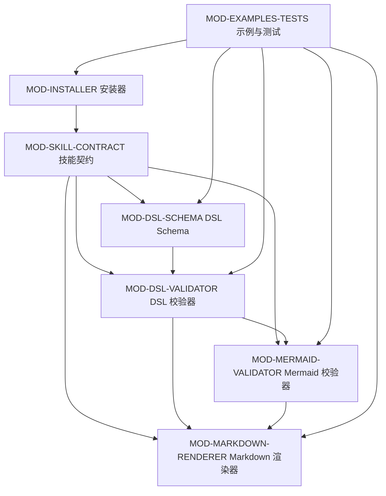

### 3.4 补充架构图表

无补充内容。

## 4. 模块设计

各模块围绕单一职责组织：契约模块定义规则，schema 模块描述 DSL 结构，校验模块检查 DSL 与 Mermaid，渲染模块输出 Markdown，安装模块发布运行时文件，测试模块维护回归保护。

### 4.1 技能契约与参考文档模块

#### 4.1.1 模块概述

该模块是技能的行为入口和规则来源，明确 create-structure-md 只负责把已准备好的结构设计内容渲染成单个 Markdown 文档。

- 依据：EV-SKILL-CONTRACT（技能入口和工作流契约，SKILL.md:1-62）
- 依据：EV-DSL-SPEC（DSL 规范，references/dsl-spec.md）
- 依据：EV-DOCUMENT-STRUCTURE（固定文档结构，references/document-structure.md）
- 依据：EV-MERMAID-RULES（Mermaid 规则，references/mermaid-rules.md）

#### 4.1.2 模块职责

- 定义技能边界和输入就绪条件
- 规定固定 9 章 Markdown 输出结构
- 规定 Mermaid-only 图表边界和严格校验优先级
- 提供最终报告与复核清单

#### 4.1.3 对外能力说明

为 Codex 执行结构设计文档生成任务提供操作契约和复核标准。

使用方：
- Codex
- 仓库维护者

接口风格：Markdown 技能说明和 references 目录参考文档

边界说明：
- 不分析仓库或推理需求
- 不生成 Word、PDF 或图片
- 不自动删除临时产物

#### 4.1.4 对外接口需求清单

| 能力名称 | 接口风格 | 描述 | 输入 | 输出 | 备注 |
| --- | --- | --- | --- | --- | --- |
| 技能工作流约束 | SKILL.md 工作流步骤 | 规定创建临时目录、读取参考、写 DSL、校验 DSL、严格校验 Mermaid、渲染 Markdown 和复核报告的顺序。 | 用户请求和已准备好的结构设计内容 | Codex 可执行的固定流程 | 严格 Mermaid 校验不可用时必须先获得用户接受 static-only。 |
| 参考文档契约 | references/*.md | 用 dsl-spec、document-structure、mermaid-rules 和 review-checklist 分别说明 DSL、章节、图表和复核要求。 | 技能维护者编写的规则文档 | 生成 DSL 和复核 Markdown 的依据 |  |

支持数据（CAP-CONTRACT-WORKFLOW / 技能工作流约束）

- 依据：EV-SKILL-CONTRACT（技能入口和工作流契约，SKILL.md:1-62）

支持数据（CAP-CONTRACT-REFERENCES / 参考文档契约）

- 依据：EV-DSL-SPEC（DSL 规范，references/dsl-spec.md）
- 依据：EV-DOCUMENT-STRUCTURE（固定文档结构，references/document-structure.md）
- 依据：EV-MERMAID-RULES（Mermaid 规则，references/mermaid-rules.md）

#### 4.1.5 模块内部结构关系图

技能契约内部结构

展示技能契约模块内部文件关系。

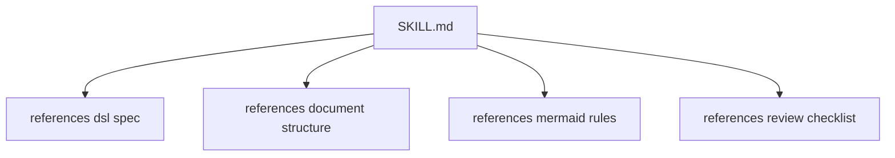

#### 4.1.6 补充说明

无补充内容。

### 4.2 DSL Schema 模块

#### 4.2.1 模块概述

该模块用 JSON Schema 固化 DSL 的顶层章节、重复表格、图表对象、支持数据和安全文件名形状。

- 依据：EV-SCHEMA（DSL JSON Schema，schemas/structure-design.schema.json）

#### 4.2.2 模块职责

- 声明 DSL 顶层字段和固定章节结构
- 定义模块、运行单元、配置、依赖、协作和关键流程对象形状
- 定义 evidence、traceability、risk、assumption 和 source_snippet 支持数据形状
- 限制 diagram_type、confidence、source_type 等枚举值

#### 4.2.3 对外能力说明

为 DSL 校验器提供结构层面的权威 schema。

使用方：
- DSL 校验器模块
- 测试模块
- 维护者

接口风格：Draft 2020-12 JSON Schema 文件

边界说明：
- 结构规则在 schema 内表达
- 跨字段语义仍由 validate_dsl.py 负责

#### 4.2.4 对外接口需求清单

| 能力名称 | 接口风格 | 描述 | 输入 | 输出 | 备注 |
| --- | --- | --- | --- | --- | --- |
| DSL 根结构定义 | JSON Schema required 和 properties | 要求 DSL 包含 document、system_overview、architecture_views、module_design、runtime_view、configuration_data_dependencies、cross_module_collaboration、key_flows 和支持数据数组。 | 结构设计 DSL JSON | 根对象结构验证结果 |  |
| 支持数据结构定义 | JSON Schema definitions | 定义证据、追踪、风险、假设和源码片段的字段形状，供渲染器和校验器引用。 | support arrays | 可被引用和渲染的支持数据对象 |  |

支持数据（CAP-SCHEMA-ROOT / DSL 根结构定义）

- 依据：EV-SCHEMA（DSL JSON Schema，schemas/structure-design.schema.json）

支持数据（CAP-SCHEMA-SUPPORT / 支持数据结构定义）

- 依据：EV-SCHEMA（DSL JSON Schema，schemas/structure-design.schema.json）

#### 4.2.5 模块内部结构关系图

DSL Schema 内部结构

展示 schema 的主要定义分组。

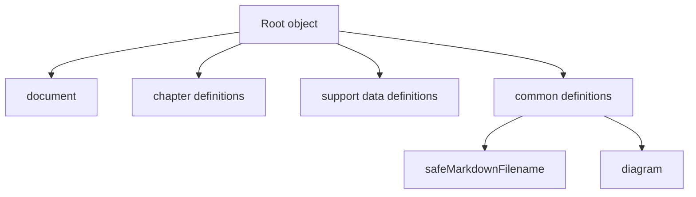

#### 4.2.6 补充说明

无补充内容。

### 4.3 DSL 校验器模块

#### 4.3.1 模块概述

该模块是 DSL 的质量门禁，先用 schema 检查结构，再用语义检查确保章节内容、ID、引用、支持数据和 Markdown 安全符合契约。

- 依据：EV-DSL-VALIDATOR（DSL 校验器实现，scripts/validate_dsl.py）

#### 4.3.2 模块职责

- 加载 DSL JSON 和 schema
- 执行 JSON Schema 校验
- 注册并检查各类 ID 和引用
- 执行章节级必填内容检查
- 检查输出文件名、源码片段安全和低置信度项

#### 4.3.3 对外能力说明

为 DSL 文件提供命令行校验入口，阻止不完整或不安全的结构设计内容进入渲染阶段。

使用方：
- Codex
- Markdown 渲染器前置流程
- 测试模块

接口风格：CLI 脚本

边界说明：
- 不渲染 Markdown
- 不解析 Mermaid 可渲染性
- 不推理仓库含义

#### 4.3.4 对外接口需求清单

| 能力名称 | 接口风格 | 描述 | 输入 | 输出 | 备注 |
| --- | --- | --- | --- | --- | --- |
| Schema 校验 | python scripts/validate_dsl.py structure.dsl.json | 通过 jsonschema Draft202012Validator 校验 DSL 结构。 | DSL JSON 文件 | schema validation failed 或进入语义校验 |  |
| 语义校验 | 内部 ValidationContext 和章节检查函数 | 检查 ID 前缀、重复 ID、引用解析、章节规则、文件名具体性、支持数据引用和低置信度项。 | schema 通过后的 DSL 对象 | 错误、警告或 Validation succeeded |  |

支持数据（CAP-DSLVAL-SCHEMA / Schema 校验）

- 依据：EV-DSL-VALIDATOR（DSL 校验器实现，scripts/validate_dsl.py）
- 依据：EV-SCHEMA（DSL JSON Schema，schemas/structure-design.schema.json）

支持数据（CAP-DSLVAL-SEMANTICS / 语义校验）

- 依据：EV-DSL-VALIDATOR（DSL 校验器实现，scripts/validate_dsl.py）

#### 4.3.5 模块内部结构关系图

DSL 校验器内部结构

展示 DSL 校验器的内部处理阶段。

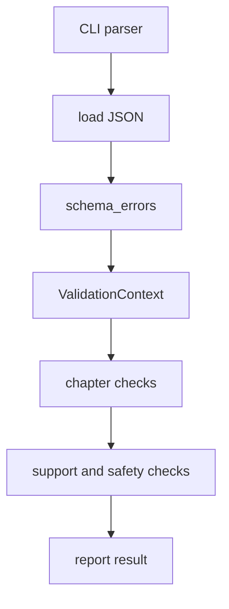

#### 4.3.6 补充说明

无补充内容。

### 4.4 Mermaid 校验器模块

#### 4.4.1 模块概述

该模块独立校验 DSL 或 Markdown 中的 Mermaid 图，确保最终输出只包含支持的 Mermaid 图类型，并在严格模式下证明本地 CLI 可解析。

- 依据：EV-MERMAID-VALIDATOR（Mermaid 校验器实现，scripts/validate_mermaid.py）

#### 4.4.2 模块职责

- 从 DSL 图对象和 Markdown fenced code block 中提取 Mermaid 源
- 执行图类型、空内容、DOT 语法和 fence 规则检查
- 检查 node 和 mmdc 环境
- 严格模式下写入临时 mmd 文件并调用 mmdc 输出 svg

#### 4.4.3 对外能力说明

为结构设计文档中的 Mermaid 图提供静态和严格两级校验入口。

使用方：
- Codex
- Markdown 渲染流程
- 测试模块

接口风格：CLI 脚本

边界说明：
- 最终交付仍是 Markdown Mermaid 代码块
- 严格校验产物只是临时验证文件

#### 4.4.4 对外接口需求清单

| 能力名称 | 接口风格 | 描述 | 输入 | 输出 | 备注 |
| --- | --- | --- | --- | --- | --- |
| Mermaid 静态检查 | python scripts/validate_mermaid.py --from-dsl 或 --from-markdown --static | 检查支持类型、图源非空、Markdown fence、DOT 语法拒绝和图源类型一致性。 | DSL JSON 或 Markdown 文件 | 静态校验错误或成功状态 |  |
| Mermaid 严格检查 | python scripts/validate_mermaid.py --from-dsl structure.dsl.json --strict --work-dir 指定目录 | 在静态检查通过后调用 mmdc，把每个 Mermaid 源写成临时文件并尝试渲染为 svg。 | Mermaid diagram source、node、mmdc、严格校验工作目录 | 严格校验成功消息或 mmdc 错误 |  |

支持数据（CAP-MERVAL-STATIC / Mermaid 静态检查）

- 依据：EV-MERMAID-VALIDATOR（Mermaid 校验器实现，scripts/validate_mermaid.py）

支持数据（CAP-MERVAL-STRICT / Mermaid 严格检查）

- 依据：EV-MERMAID-VALIDATOR（Mermaid 校验器实现，scripts/validate_mermaid.py）
- 依据：EV-MERMAID-RULES（Mermaid 规则，references/mermaid-rules.md）

#### 4.4.5 模块内部结构关系图

Mermaid 校验器内部结构

展示 Mermaid 校验器的内部处理阶段。

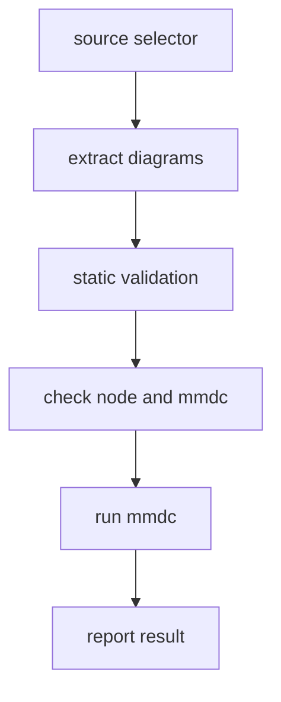

#### 4.4.6 补充说明

无补充内容。

### 4.5 Markdown 渲染器模块

#### 4.5.1 模块概述

该模块把 DSL 转为固定 9 章 Markdown，负责所有可见表格、章节编号、Mermaid code fence、支持数据位置、转义和文件写入策略。

- 依据：EV-RENDERER（Markdown 渲染器实现，scripts/render_markdown.py）

#### 4.5.2 模块职责

- 渲染文档信息、系统概览、架构、模块、运行时、配置依赖、协作、关键流程和第 9 章
- 把模块和运行单元 ID 转换为显示名称
- 在 inline evidence mode 下把证据、追踪和源码片段渲染到相关节点附近
- 对表格、普通文本、标题和代码 fence 进行转义
- 执行输出文件名、默认不覆盖、overwrite 和 backup 写入策略

#### 4.5.3 对外能力说明

为通过校验的 DSL 提供单 Markdown 文件输出能力。

使用方：
- Codex
- 仓库维护者
- 技能使用者

接口风格：CLI 脚本

边界说明：
- 不执行 DSL schema 校验
- 不直接调用 Mermaid CLI
- 默认不覆盖已有输出文件

#### 4.5.4 对外接口需求清单

| 能力名称 | 接口风格 | 描述 | 输入 | 输出 | 备注 |
| --- | --- | --- | --- | --- | --- |
| 固定章节渲染 | render_chapter_1 至 render_chapter_9 | 按照固定 9 章结构渲染各章节和模块重复节。 | DSL document object | Markdown 字符串 |  |
| 安全写入 | python scripts/render_markdown.py structure.dsl.json --output-dir 指定目录 | 校验输出文件名必须具体且安全，并在默认模式下拒绝覆盖已有文件。 | output_dir、document.output_file、overwrite 或 backup 参数 | Markdown 文件或写入错误 |  |

支持数据（CAP-RENDER-CHAPTERS / 固定章节渲染）

- 依据：EV-RENDERER（Markdown 渲染器实现，scripts/render_markdown.py）

支持数据（CAP-RENDER-SAFE-WRITE / 安全写入）

- 依据：EV-RENDERER（Markdown 渲染器实现，scripts/render_markdown.py）

#### 4.5.5 模块内部结构关系图

Markdown 渲染器内部结构

展示 Markdown 渲染器的内部处理阶段。

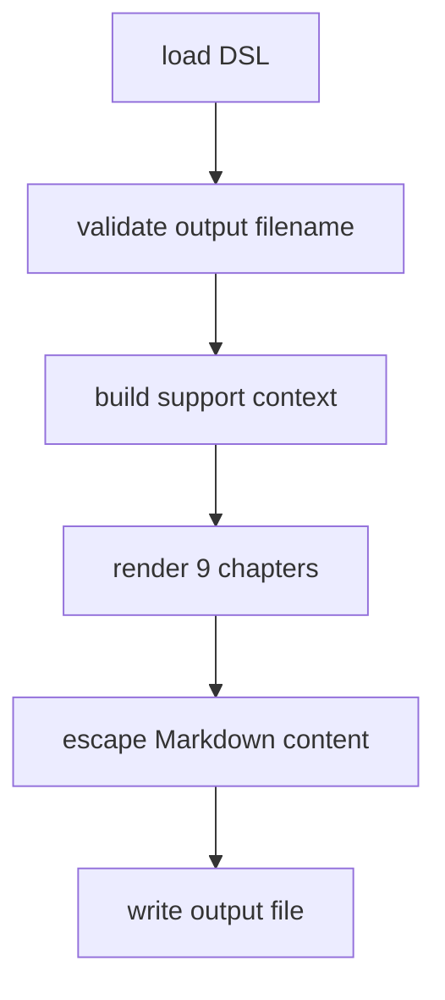

#### 4.5.6 补充说明

无补充内容。

### 4.6 安装器模块

#### 4.6.1 模块概述

该模块提供保守的 copy-only 安装流程，复制运行时技能文件到 Codex skills 目录，同时报告 Python、jsonschema、node 和 mmdc 状态。

- 依据：EV-INSTALLER（copy-only 安装器实现，scripts/install_skill.py）
- 依据：EV-INSTALL-DOC（安装文档，docs/install.md）

#### 4.6.2 模块职责

- 解析 Codex home 和目标技能路径
- 验证源仓库运行时文件和引用文档存在
- 打印 dry-run 安装计划和依赖状态
- 复制运行时文件且拒绝覆盖已有目标
- 安装后再次验证目标目录结构

#### 4.6.3 对外能力说明

为本地使用 create-structure-md 技能提供安装入口。

使用方：
- 仓库维护者
- Codex 使用者

接口风格：CLI 脚本

边界说明：
- 不安装依赖
- 不提供 --force
- 不覆盖或删除已有安装

#### 4.6.4 对外接口需求清单

| 能力名称 | 接口风格 | 描述 | 输入 | 输出 | 备注 |
| --- | --- | --- | --- | --- | --- |
| 安装计划与依赖报告 | python scripts/install_skill.py --dry-run | 打印源路径、Codex home、目标路径、复制条目和依赖状态。 | 可选 --codex-home 参数和当前环境 | dry-run 安装计划 |  |
| 运行时文件复制 | python scripts/install_skill.py | 复制 SKILL.md、requirements.txt、references、schemas、scripts 和 examples 到目标技能目录。 | 源仓库运行时文件和目标 Codex skills 路径 | 安装后的 create-structure-md 技能目录 | docs 和 tests 不属于安装复制范围。 |

支持数据（CAP-INSTALL-PLAN / 安装计划与依赖报告）

- 依据：EV-INSTALLER（copy-only 安装器实现，scripts/install_skill.py）
- 依据：EV-INSTALL-DOC（安装文档，docs/install.md）

支持数据（CAP-INSTALL-COPY / 运行时文件复制）

- 依据：EV-INSTALLER（copy-only 安装器实现，scripts/install_skill.py）
- 依据：EV-INSTALL-DOC（安装文档，docs/install.md）

#### 4.6.5 模块内部结构关系图

安装器内部结构

展示安装器的内部处理阶段。

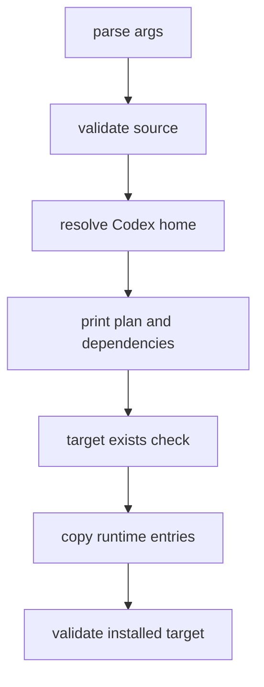

#### 4.6.6 补充说明

无补充内容。

### 4.7 示例与测试模块

#### 4.7.1 模块概述

该模块通过示例 DSL 和 unittest 测试保证技能契约可被真实脚本执行，覆盖各阶段的结构、语义、Mermaid、渲染、安装和端到端流程。

- 依据：EV-TESTS（unittest 测试集合，tests/test_validate_dsl.py, tests/test_validate_dsl_semantics.py, tests/test_validate_mermaid.py, tests/test_render_markdown.py, tests/test_install_skill.py, tests/test_phase7_e2e.py）
- 依据：EV-EXAMPLES（V2 最小 DSL 示例与成功 fixture，examples/minimal-from-code.dsl.json, examples/minimal-from-requirements.dsl.json, tests/fixtures/valid-v2-foundation.dsl.json）
- 依据：EV-V1-REJECTED（V1 rejected fixture，tests/fixtures/rejected-v1-phase2.dsl.json）

#### 4.7.2 模块职责

- 提供 from-code 和 from-requirements 最小 DSL 示例
- 提供 valid-v2-foundation fixture 作为 schema、Mermaid 与渲染测试基础
- 保留 rejected-v1-phase2 fixture 仅作为 V1 rejected fixture
- 测试 DSL schema 和语义校验行为
- 测试 Mermaid 静态和严格校验边界
- 测试 Markdown 渲染章节、转义和支持数据位置
- 测试安装器 copy-only 行为和端到端工作流

#### 4.7.3 对外能力说明

为仓库维护提供可执行回归保护和示例输入。

使用方：
- 仓库维护者
- Codex
- CI 或本地测试运行者

接口风格：examples/*.dsl.json 与 python -m unittest discover

边界说明：
- 测试不属于安装后的运行时复制范围
- 示例用于说明 DSL 形状而不是分析真实业务系统

#### 4.7.4 对外接口需求清单

| 能力名称 | 接口风格 | 描述 | 输入 | 输出 | 备注 |
| --- | --- | --- | --- | --- | --- |
| 回归测试 | python -m unittest discover -s tests -v | 运行 unittest 测试集，覆盖校验、渲染、安装和端到端流程。 | tests 目录和仓库脚本 | 测试通过或失败报告 |  |
| 最小 DSL 示例 | examples/*.dsl.json | 提供从代码来源和需求来源生成结构设计文档的最小 DSL 样例。 | 示例结构设计内容 | 可被校验器和渲染器处理的示例 DSL |  |

支持数据（CAP-TESTS-REGRESSION / 回归测试）

- 依据：EV-TESTS（unittest 测试集合，tests/test_validate_dsl.py, tests/test_validate_dsl_semantics.py, tests/test_validate_mermaid.py, tests/test_render_markdown.py, tests/test_install_skill.py, tests/test_phase7_e2e.py）
- 依据：EV-INSTALL-DOC（安装文档，docs/install.md）

支持数据（CAP-EXAMPLES-MINIMAL / 最小 DSL 示例）

- 依据：EV-EXAMPLES（V2 最小 DSL 示例与成功 fixture，examples/minimal-from-code.dsl.json, examples/minimal-from-requirements.dsl.json, tests/fixtures/valid-v2-foundation.dsl.json）
- 依据：EV-V1-REJECTED（V1 rejected fixture，tests/fixtures/rejected-v1-phase2.dsl.json）

#### 4.7.5 模块内部结构关系图

示例与测试内部结构

展示示例和测试的内部关系。

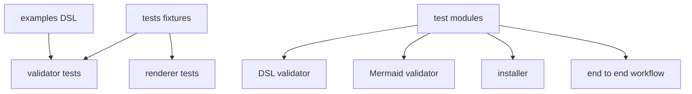

#### 4.7.6 补充说明

无补充内容。

## 5. 运行时视图

### 5.1 运行时概述

仓库没有常驻服务进程，运行时以命令行脚本和 unittest 命令为主。典型生成流程由 Codex 先准备 DSL，再依次调用 DSL 校验、Mermaid 严格校验、Markdown 渲染和渲染后 Mermaid 静态校验。

### 5.2 运行单元说明

| 运行单元 | 类型 | 入口 | 入口不适用原因 | 职责 | 关联模块 | 外部环境原因 | 备注 |
| --- | --- | --- | --- | --- | --- | --- | --- |
| DSL 校验命令 | CLI script | /home/hyx/miniconda3/envs/agent/bin/python scripts/validate_dsl.py |  | 对 structure.dsl.json 执行 schema 和语义校验。 | DSL Schema 模块、DSL 校验器模块 |  | 依赖 jsonschema。 |
| Mermaid 校验命令 | CLI script | /home/hyx/miniconda3/envs/agent/bin/python scripts/validate_mermaid.py |  | 对 DSL 或 Markdown 中 Mermaid 图执行静态或严格校验。 | Mermaid 校验器模块 |  | 严格模式依赖 node 和 mmdc。 |
| Markdown 渲染命令 | CLI script | /home/hyx/miniconda3/envs/agent/bin/python scripts/render_markdown.py |  | 把 DSL 渲染到 document.output_file 指定的 Markdown 文件。 | Markdown 渲染器模块 |  | 默认拒绝覆盖已有输出文件。 |
| 技能安装命令 | CLI script | /home/hyx/miniconda3/envs/agent/bin/python scripts/install_skill.py |  | 执行 copy-only 本地技能安装或 dry-run 计划检查。 | 安装器模块、技能契约与参考文档模块 |  | 目标已存在时失败并给出用户自行清理命令。 |
| unittest 测试命令 | CLI command | /home/hyx/miniconda3/envs/agent/bin/python -m unittest discover -s tests -v |  | 运行仓库回归测试，验证 schema、脚本和端到端契约。 | 示例与测试模块、DSL 校验器模块、Mermaid 校验器模块、Markdown 渲染器模块、安装器模块 |  | 使用 Python 标准库 unittest。 |

支持数据（RUN-VALIDATE-DSL / DSL 校验命令）

- 依据：EV-DSL-VALIDATOR（DSL 校验器实现，scripts/validate_dsl.py）
- 依据：EV-SCHEMA（DSL JSON Schema，schemas/structure-design.schema.json）

支持数据（RUN-VALIDATE-MERMAID / Mermaid 校验命令）

- 依据：EV-MERMAID-VALIDATOR（Mermaid 校验器实现，scripts/validate_mermaid.py）

支持数据（RUN-RENDER-MARKDOWN / Markdown 渲染命令）

- 依据：EV-RENDERER（Markdown 渲染器实现，scripts/render_markdown.py）

支持数据（RUN-INSTALL-SKILL / 技能安装命令）

- 依据：EV-INSTALLER（copy-only 安装器实现，scripts/install_skill.py）
- 依据：EV-INSTALL-DOC（安装文档，docs/install.md）

支持数据（RUN-TEST-SUITE / unittest 测试命令）

- 依据：EV-TESTS（unittest 测试集合，tests/test_validate_dsl.py, tests/test_validate_dsl_semantics.py, tests/test_validate_mermaid.py, tests/test_render_markdown.py, tests/test_install_skill.py, tests/test_phase7_e2e.py）
- 依据：EV-INSTALL-DOC（安装文档，docs/install.md）

### 5.3 运行时流程图

运行时流程图

展示结构设计文档生成的主运行时流程。

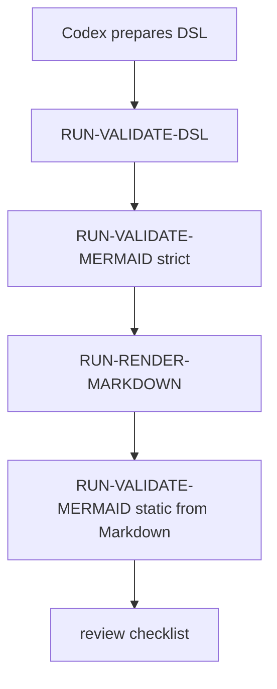

### 5.4 运行时序图（推荐）

运行时时序图

展示 Codex、校验器和渲染器的调用顺序。

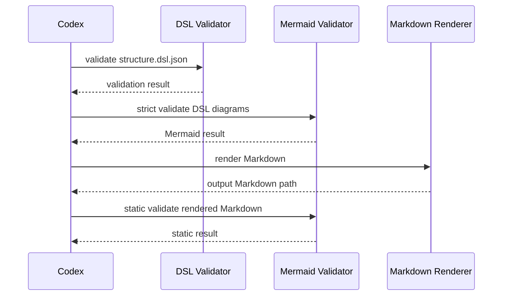

### 5.5 补充运行时图表

无补充内容。

## 6. 配置、数据与依赖关系

仓库配置主要来自 CLI 参数、环境变量和 requirements.txt；结构数据主要是 DSL JSON、schema、Markdown 输出和安装目标目录；外部依赖保持精简，严格 Mermaid 校验另需 node 与 mmdc。

### 6.1 配置项说明

| 配置项 | 来源 | 使用方 | 用途 | 备注 |
| --- | --- | --- | --- | --- |
| Markdown 输出目录 | render_markdown.py --output-dir | Markdown 渲染器 | 指定最终 Markdown 文件写入目录。 | 默认值为当前目录。 |
| 输出写入模式 | render_markdown.py --overwrite 或 --backup | Markdown 渲染器 | 控制已有输出文件的替换或备份策略。 | 默认拒绝覆盖。 |
| Mermaid 校验模式 | validate_mermaid.py --strict 或 --static | Mermaid 校验器 | 决定执行严格 CLI 渲染验证还是仅执行静态检查。 | 技能流程默认要求严格模式。 |
| Mermaid 严格校验工作目录 | validate_mermaid.py --work-dir | Mermaid 校验器 | 保存严格模式写出的 mmd 和 svg 临时验证产物。 | 该目录中的产物不是最终交付。 |
| Codex home | install_skill.py --codex-home、CODEX_HOME 或 ~/.codex | 安装器 | 确定本地技能安装目标目录。 | 解析顺序由安装脚本和安装文档说明。 |
| Python 依赖清单 | requirements.txt | DSL 校验器和安装文档 | 声明运行时 Python 依赖 jsonschema。 | 测试使用标准库 unittest。 |

支持数据（CFG-OUTPUT-DIR / Markdown 输出目录）

- 依据：EV-RENDERER（Markdown 渲染器实现，scripts/render_markdown.py）

支持数据（CFG-OUTPUT-WRITE-MODE / 输出写入模式）

- 依据：EV-RENDERER（Markdown 渲染器实现，scripts/render_markdown.py）

支持数据（CFG-MERMAID-MODE / Mermaid 校验模式）

- 依据：EV-MERMAID-VALIDATOR（Mermaid 校验器实现，scripts/validate_mermaid.py）
- 依据：EV-MERMAID-RULES（Mermaid 规则，references/mermaid-rules.md）

支持数据（CFG-MERMAID-WORK-DIR / Mermaid 严格校验工作目录）

- 依据：EV-MERMAID-VALIDATOR（Mermaid 校验器实现，scripts/validate_mermaid.py）
- 依据：EV-MERMAID-RULES（Mermaid 规则，references/mermaid-rules.md）

支持数据（CFG-CODEX-HOME / Codex home）

- 依据：EV-INSTALLER（copy-only 安装器实现，scripts/install_skill.py）
- 依据：EV-INSTALL-DOC（安装文档，docs/install.md）

支持数据（CFG-PYTHON-DEPS / Python 依赖清单）

- 依据：EV-REQUIREMENTS（Python 依赖清单，requirements.txt）
- 依据：EV-INSTALL-DOC（安装文档，docs/install.md）

### 6.2 关键结构数据与产物

| 数据/产物 | 类型 | 归属 | 生产方 | 消费方 | 备注 |
| --- | --- | --- | --- | --- | --- |
| 结构设计 DSL 文件 | JSON | 技能契约与参考文档模块 | Codex | DSL 校验器、Mermaid 校验器、Markdown 渲染器 | 通常命名为 structure.dsl.json，位于技能临时目录。 |
| DSL Schema | JSON Schema | DSL Schema 模块 | 仓库维护者 | DSL 校验器、测试模块 | 路径为 schemas/structure-design.schema.json。 |
| 结构设计 Markdown 输出 | Markdown | Markdown 渲染器模块 | render_markdown.py | 用户、渲染后 Mermaid 静态校验 | 文件名由 document.output_file 决定。 |
| Mermaid 严格校验临时产物 | mmd/svg temporary files | Mermaid 校验器模块 | validate_mermaid.py strict mode | 严格校验流程 | 不是最终交付物。 |
| 已安装技能目录 | directory | 安装器模块 | install_skill.py | Codex | 目标为 $CODEX_HOME/skills/create-structure-md。 |
| 最小 DSL 示例与 fixture | JSON | 示例与测试模块 | 仓库维护者 | 用户、测试模块、Codex | 位于 examples 和 tests/fixtures。 |

支持数据（DATA-DSL-JSON / 结构设计 DSL 文件）

- 依据：EV-SKILL-CONTRACT（技能入口和工作流契约，SKILL.md:1-62）
- 依据：EV-DSL-SPEC（DSL 规范，references/dsl-spec.md）

支持数据（DATA-SCHEMA / DSL Schema）

- 依据：EV-SCHEMA（DSL JSON Schema，schemas/structure-design.schema.json）

支持数据（DATA-RENDERED-MD / 结构设计 Markdown 输出）

- 依据：EV-RENDERER（Markdown 渲染器实现，scripts/render_markdown.py）
- 依据：EV-DOCUMENT-STRUCTURE（固定文档结构，references/document-structure.md）

支持数据（DATA-MERMAID-ARTIFACTS / Mermaid 严格校验临时产物）

- 依据：EV-MERMAID-VALIDATOR（Mermaid 校验器实现，scripts/validate_mermaid.py）

支持数据（DATA-INSTALLED-SKILL / 已安装技能目录）

- 依据：EV-INSTALLER（copy-only 安装器实现，scripts/install_skill.py）
- 依据：EV-INSTALL-DOC（安装文档，docs/install.md）

支持数据（DATA-EXAMPLES / 最小 DSL 示例与 fixture）

- 依据：EV-EXAMPLES（V2 最小 DSL 示例与成功 fixture，examples/minimal-from-code.dsl.json, examples/minimal-from-requirements.dsl.json, tests/fixtures/valid-v2-foundation.dsl.json）
- 依据：EV-V1-REJECTED（V1 rejected fixture，tests/fixtures/rejected-v1-phase2.dsl.json）
- 依据：EV-TESTS（unittest 测试集合，tests/test_validate_dsl.py, tests/test_validate_dsl_semantics.py, tests/test_validate_mermaid.py, tests/test_render_markdown.py, tests/test_install_skill.py, tests/test_phase7_e2e.py）

### 6.3 依赖项说明

| 依赖项 | 类型 | 使用方 | 用途 | 备注 |
| --- | --- | --- | --- | --- |
| Python 3 | runtime | 所有 scripts/*.py 和 unittest | 运行校验器、渲染器、安装器和测试。 | 当前工作流使用 /home/hyx/miniconda3/envs/agent/bin/python。 |
| jsonschema | Python package | DSL 校验器 | 执行 Draft 2020-12 JSON Schema 校验。 | requirements.txt 中唯一运行时 Python 依赖。 |
| Node.js | optional runtime | Mermaid 严格校验 | 运行 Mermaid CLI。 | 静态校验不需要 Node。 |
| mmdc | optional runtime CLI | Mermaid 严格校验 | 把 Mermaid 源渲染为临时 svg，以证明图源可被 Mermaid CLI 解析。 | 必须在 PATH 上才可执行严格校验。 |
| unittest | Python standard library | 示例与测试模块 | 运行仓库测试集。 | 不需要第三方测试框架。 |
| 本地文件系统 | runtime environment | 安装器、渲染器、校验器 | 读取 DSL、schema、参考文件，写入 Markdown、安装目标和 Mermaid 严格校验临时产物。 |  |

支持数据（DEP-PYTHON / Python 3）

- 依据：EV-INSTALL-DOC（安装文档，docs/install.md）

支持数据（DEP-JSONSCHEMA / jsonschema）

- 依据：EV-REQUIREMENTS（Python 依赖清单，requirements.txt）
- 依据：EV-DSL-VALIDATOR（DSL 校验器实现，scripts/validate_dsl.py）

支持数据（DEP-NODE / Node.js）

- 依据：EV-MERMAID-VALIDATOR（Mermaid 校验器实现，scripts/validate_mermaid.py）
- 依据：EV-INSTALL-DOC（安装文档，docs/install.md）

支持数据（DEP-MMDC / mmdc）

- 依据：EV-MERMAID-VALIDATOR（Mermaid 校验器实现，scripts/validate_mermaid.py）
- 依据：EV-INSTALL-DOC（安装文档，docs/install.md）

支持数据（DEP-UNITTEST / unittest）

- 依据：EV-TESTS（unittest 测试集合，tests/test_validate_dsl.py, tests/test_validate_dsl_semantics.py, tests/test_validate_mermaid.py, tests/test_render_markdown.py, tests/test_install_skill.py, tests/test_phase7_e2e.py）
- 依据：EV-INSTALL-DOC（安装文档，docs/install.md）

支持数据（DEP-FILESYSTEM / 本地文件系统）

- 依据：EV-INSTALLER（copy-only 安装器实现，scripts/install_skill.py）
- 依据：EV-RENDERER（Markdown 渲染器实现，scripts/render_markdown.py）
- 依据：EV-MERMAID-VALIDATOR（Mermaid 校验器实现，scripts/validate_mermaid.py）

### 6.4 补充图表

无补充内容。

## 7. 跨模块协作关系

### 7.1 协作关系概述

多模块协作以顺序命令和共享数据契约为主。技能契约规定流程，schema 和 DSL 校验器先保证内容结构，再由 Mermaid 校验器验证图，Markdown 渲染器输出最终文档，安装器只复制运行时集合，测试模块持续验证所有边界。

### 7.2 跨模块协作说明

| 场景 | 发起模块 | 参与模块 | 协作方式 | 描述 |
| --- | --- | --- | --- | --- |
| 契约驱动 DSL 结构 | 技能契约与参考文档模块 | DSL Schema 模块、DSL 校验器模块、Markdown 渲染器模块 | 共享参考文档和 DSL 字段契约 | 技能契约和参考文档定义 DSL 与输出章节，schema、校验器和渲染器分别落实结构、质量和呈现。 |
| DSL schema 与语义校验协作 | DSL 校验器模块 | DSL Schema 模块 | validate_dsl.py 加载 schema 后追加语义规则 | schema 先拒绝字段形状错误，语义校验随后检查跨字段引用、章节内容和安全文本。 |
| 生成文档质量门禁 | DSL 校验器模块 | Mermaid 校验器模块、Markdown 渲染器模块 | 顺序 CLI 调用 | DSL 校验通过后，Mermaid 校验器严格检查图源，随后渲染器生成 Markdown，并对渲染后的 Mermaid fence 做静态复核。 |
| 安装运行时集合 | 安装器模块 | 技能契约与参考文档模块、DSL Schema 模块、DSL 校验器模块、Mermaid 校验器模块、Markdown 渲染器模块 | 复制白名单运行时条目 | 安装器只复制 SKILL.md、requirements.txt、references、schemas、scripts 和 examples，形成可用的本地技能目录。 |
| 测试覆盖模块契约 | 示例与测试模块 | DSL Schema 模块、DSL 校验器模块、Mermaid 校验器模块、Markdown 渲染器模块、安装器模块 | unittest 调用脚本和示例 fixture | 测试模块通过 fixtures、示例和脚本入口验证结构、语义、Mermaid、渲染、安装和端到端行为。 |

支持数据（COL-CONTRACT-SCHEMA / 契约驱动 DSL 结构）

- 依据：EV-SKILL-CONTRACT（技能入口和工作流契约，SKILL.md:1-62）
- 依据：EV-DSL-SPEC（DSL 规范，references/dsl-spec.md）
- 依据：EV-DOCUMENT-STRUCTURE（固定文档结构，references/document-structure.md）

支持数据（COL-SCHEMA-DSLVAL / DSL schema 与语义校验协作）

- 依据：EV-SCHEMA（DSL JSON Schema，schemas/structure-design.schema.json）
- 依据：EV-DSL-VALIDATOR（DSL 校验器实现，scripts/validate_dsl.py）

支持数据（COL-DSLVAL-MERVAL-RENDER / 生成文档质量门禁）

- 依据：EV-SKILL-CONTRACT（技能入口和工作流契约，SKILL.md:1-62）
- 依据：EV-MERMAID-VALIDATOR（Mermaid 校验器实现，scripts/validate_mermaid.py）
- 依据：EV-RENDERER（Markdown 渲染器实现，scripts/render_markdown.py）

支持数据（COL-INSTALL-RUNTIME / 安装运行时集合）

- 依据：EV-INSTALLER（copy-only 安装器实现，scripts/install_skill.py）
- 依据：EV-INSTALL-DOC（安装文档，docs/install.md）

支持数据（COL-TESTS-CONTRACTS / 测试覆盖模块契约）

- 依据：EV-TESTS（unittest 测试集合，tests/test_validate_dsl.py, tests/test_validate_dsl_semantics.py, tests/test_validate_mermaid.py, tests/test_render_markdown.py, tests/test_install_skill.py, tests/test_phase7_e2e.py）
- 依据：EV-EXAMPLES（V2 最小 DSL 示例与成功 fixture，examples/minimal-from-code.dsl.json, examples/minimal-from-requirements.dsl.json, tests/fixtures/valid-v2-foundation.dsl.json）
- 依据：EV-V1-REJECTED（V1 rejected fixture，tests/fixtures/rejected-v1-phase2.dsl.json）

### 7.3 跨模块协作关系图

跨模块协作关系图

展示核心模块在生成、安装和测试场景中的协作关系。

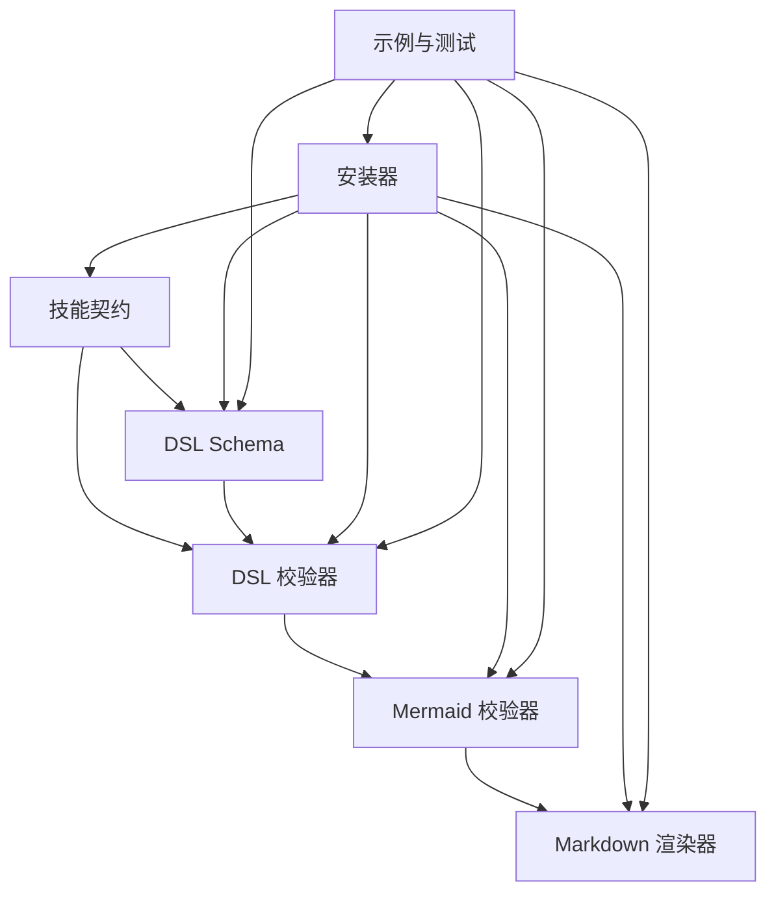

### 7.4 补充协作图表

无补充内容。

## 8. 关键流程

### 8.1 关键流程概述

关键流程覆盖结构设计文档生成、DSL 校验、Mermaid 校验、Markdown 渲染、技能安装和测试回归。每个流程都以 CLI 或 Codex 操作串联仓库模块。

### 8.2 关键流程清单

| 流程 | 触发条件 | 参与模块 | 参与运行单元 | 主要步骤 | 输出结果 | 备注 |
| --- | --- | --- | --- | --- | --- | --- |
| 生成结构设计文档 | Codex 已在技能外完成仓库理解并准备完整 DSL 内容。 | 技能契约与参考文档模块、DSL 校验器模块、Mermaid 校验器模块、Markdown 渲染器模块 | DSL 校验命令、Mermaid 校验命令、Markdown 渲染命令 | 写入 DSL、校验 DSL、严格校验 Mermaid、渲染 Markdown、静态复核渲染后 Mermaid、按清单复核。 | create-structure-md_STRUCTURE_DESIGN.md |  |
| 校验 DSL | structure.dsl.json 已存在。 | DSL Schema 模块、DSL 校验器模块 | DSL 校验命令 | 加载 JSON、执行 schema 校验、注册 ID、检查引用和章节语义、输出结果。 | Validation succeeded 或错误警告报告。 |  |
| 校验 Mermaid | DSL 或 Markdown 中包含 Mermaid 图源。 | Mermaid 校验器模块 | Mermaid 校验命令 | 提取图源、静态检查、检查环境、严格模式调用 mmdc。 | Mermaid validation succeeded 或错误报告。 |  |
| 渲染 Markdown | DSL 和 Mermaid 校验已通过。 | Markdown 渲染器模块 | Markdown 渲染命令 | 加载 DSL、校验输出文件名、构建支持数据上下文、渲染 9 章、写入文件。 | document.output_file 指定的 Markdown 文件。 |  |
| 安装本地技能 | 用户运行安装脚本。 | 安装器模块、技能契约与参考文档模块、DSL Schema 模块、DSL 校验器模块、Mermaid 校验器模块、Markdown 渲染器模块 | 技能安装命令 | 解析目标、验证源、打印计划和依赖、检查目标不存在、复制运行时条目、验证安装结果。 | $CODEX_HOME/skills/create-structure-md 目录。 |  |
| 运行回归测试 | 维护者需要验证仓库行为。 | 示例与测试模块、DSL Schema 模块、DSL 校验器模块、Mermaid 校验器模块、Markdown 渲染器模块、安装器模块 | unittest 测试命令 | 发现 tests 目录、加载 fixtures 和脚本模块、执行 unittest 用例、报告失败或通过。 | unittest 测试结果。 |  |

### 8.3 生成结构设计文档

#### 8.3.1 流程概述

该流程是技能主路径，把已准备好的 DSL 内容转化为单个结构设计 Markdown 文件。

- 依据：EV-SKILL-CONTRACT（技能入口和工作流契约，SKILL.md:1-62）

关联模块：技能契约与参考文档模块、DSL 校验器模块、Mermaid 校验器模块、Markdown 渲染器模块

关联运行单元：DSL 校验命令、Mermaid 校验命令、Markdown 渲染命令

#### 8.3.2 步骤说明

| 序号 | 执行方 | 说明 | 输入 | 输出 | 关联模块 | 关联运行单元 |
| --- | --- | --- | --- | --- | --- | --- |
| 1 | Codex | 在技能外完成仓库理解并把结构信息写入临时目录中的 structure.dsl.json。 | 仓库结构信息和技能参考规则 | structure.dsl.json | 技能契约与参考文档模块 |  |
| 2 | Codex | 调用 DSL 校验命令检查 schema 和语义。 | structure.dsl.json | DSL 校验结果 | DSL 校验器模块、DSL Schema 模块 | DSL 校验命令 |
| 3 | Codex | 调用 Mermaid 校验命令以严格模式检查 DSL 中的图。 | structure.dsl.json 和 Mermaid work-dir | 严格 Mermaid 校验结果 | Mermaid 校验器模块 | Mermaid 校验命令 |
| 4 | Codex | 调用 Markdown 渲染命令写出 document.output_file。 | 校验通过的 structure.dsl.json | create-structure-md_STRUCTURE_DESIGN.md | Markdown 渲染器模块 | Markdown 渲染命令 |
| 5 | Codex | 对渲染后的 Markdown 执行 Mermaid 静态校验并按复核清单检查结果。 | 渲染后的 Markdown 文件 | 最终报告依据 | Mermaid 校验器模块、技能契约与参考文档模块 | Mermaid 校验命令 |

支持数据（STEP-GENERATE-001 / 在技能外完成仓库理解并把结构信息写入临时目录中的 structure.dsl.json。）

- 依据：EV-SKILL-CONTRACT（技能入口和工作流契约，SKILL.md:1-62）
- 依据：EV-DSL-SPEC（DSL 规范，references/dsl-spec.md）

支持数据（STEP-GENERATE-002 / 调用 DSL 校验命令检查 schema 和语义。）

- 依据：EV-DSL-VALIDATOR（DSL 校验器实现，scripts/validate_dsl.py）

支持数据（STEP-GENERATE-003 / 调用 Mermaid 校验命令以严格模式检查 DSL 中的图。）

- 依据：EV-MERMAID-VALIDATOR（Mermaid 校验器实现，scripts/validate_mermaid.py）
- 依据：EV-MERMAID-RULES（Mermaid 规则，references/mermaid-rules.md）

支持数据（STEP-GENERATE-004 / 调用 Markdown 渲染命令写出 document.output_file。）

- 依据：EV-RENDERER（Markdown 渲染器实现，scripts/render_markdown.py）

支持数据（STEP-GENERATE-005 / 对渲染后的 Markdown 执行 Mermaid 静态校验并按复核清单检查结果。）

- 依据：EV-SKILL-CONTRACT（技能入口和工作流契约，SKILL.md:1-62）
- 依据：EV-REVIEW-CHECKLIST（复核清单，references/review-checklist.md）

#### 8.3.3 异常/分支说明

| 条件 | 处理方式 | 关联模块 | 关联运行单元 |
| --- | --- | --- | --- |
| DSL 或 Mermaid 校验失败 | 停止渲染或停止完成报告，修正 DSL 或图源后重新执行相应校验。 | DSL 校验器模块、Mermaid 校验器模块 | DSL 校验命令、Mermaid 校验命令 |
| 目标 Markdown 文件已存在且未指定 overwrite 或 backup | 渲染器拒绝写入并提示使用明确写入策略。 | Markdown 渲染器模块 | Markdown 渲染命令 |

支持数据（BR-GENERATE-VALIDATION-FAIL / DSL 或 Mermaid 校验失败）

- 依据：EV-SKILL-CONTRACT（技能入口和工作流契约，SKILL.md:1-62）

支持数据（BR-GENERATE-OUTPUT-EXISTS / 目标 Markdown 文件已存在且未指定 overwrite 或 backup）

- 依据：EV-RENDERER（Markdown 渲染器实现，scripts/render_markdown.py）

#### 8.3.4 流程图

生成结构设计文档流程图

展示从 DSL 准备到最终复核的主流程。

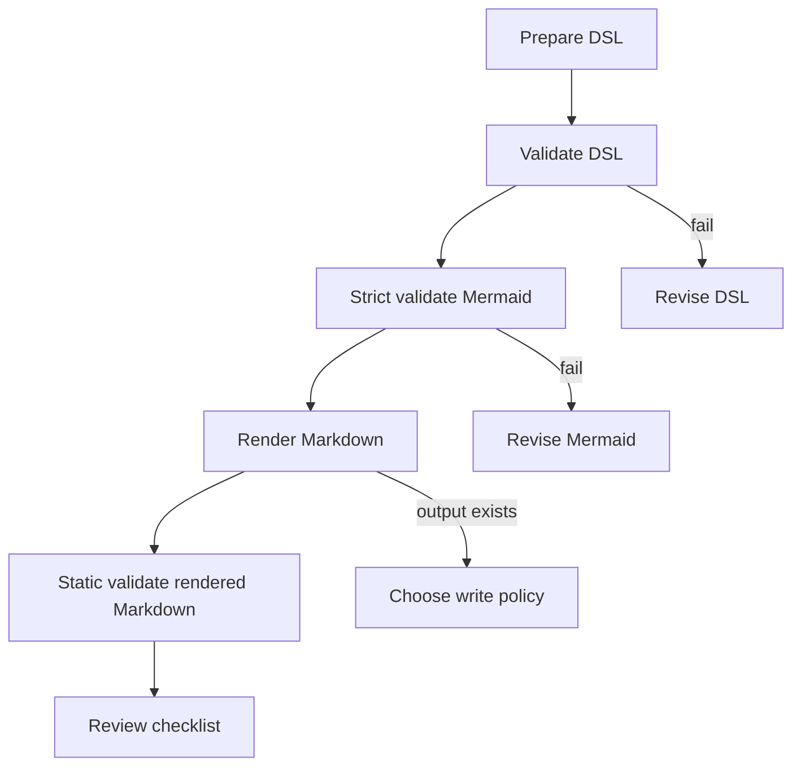

### 8.4 校验 DSL

#### 8.4.1 流程概述

该流程保证 DSL JSON 在结构、引用和语义上足以安全渲染。

- 依据：EV-DSL-VALIDATOR（DSL 校验器实现，scripts/validate_dsl.py）

关联模块：DSL Schema 模块、DSL 校验器模块

关联运行单元：DSL 校验命令

#### 8.4.2 步骤说明

| 序号 | 执行方 | 说明 | 输入 | 输出 | 关联模块 | 关联运行单元 |
| --- | --- | --- | --- | --- | --- | --- |
| 1 | DSL 校验器 | 解析命令行参数并读取 DSL JSON。 | DSL 文件路径 | Python dict 对象或读取错误 | DSL 校验器模块 | DSL 校验命令 |
| 2 | DSL 校验器 | 加载 schema 并执行 Draft 2020-12 schema 校验。 | DSL 对象和 schema 文件 | schema 错误或进入语义校验 | DSL 校验器模块、DSL Schema 模块 | DSL 校验命令 |
| 3 | DSL 校验器 | 构建 ValidationContext 并注册所有定义型 ID。 | schema 通过后的 DSL 对象 | 按 kind 组织的 ID 注册表 | DSL 校验器模块 | DSL 校验命令 |
| 4 | DSL 校验器 | 执行章节规则、引用解析、支持数据、源码片段和 Markdown 安全检查。 | ValidationContext 和 DSL 对象 | 错误、警告或成功状态 | DSL 校验器模块 | DSL 校验命令 |

支持数据（STEP-DSLVAL-001 / 解析命令行参数并读取 DSL JSON。）

- 依据：EV-DSL-VALIDATOR（DSL 校验器实现，scripts/validate_dsl.py）

支持数据（STEP-DSLVAL-002 / 加载 schema 并执行 Draft 2020-12 schema 校验。）

- 依据：EV-DSL-VALIDATOR（DSL 校验器实现，scripts/validate_dsl.py）
- 依据：EV-SCHEMA（DSL JSON Schema，schemas/structure-design.schema.json）

支持数据（STEP-DSLVAL-003 / 构建 ValidationContext 并注册所有定义型 ID。）

- 依据：EV-DSL-VALIDATOR（DSL 校验器实现，scripts/validate_dsl.py）

支持数据（STEP-DSLVAL-004 / 执行章节规则、引用解析、支持数据、源码片段和 Markdown 安全检查。）

- 依据：EV-DSL-VALIDATOR（DSL 校验器实现，scripts/validate_dsl.py）

#### 8.4.3 异常/分支说明

| 条件 | 处理方式 | 关联模块 | 关联运行单元 |
| --- | --- | --- | --- |
| schema 校验失败 | 返回错误码并提示先修复 DSL 形状。 | DSL 校验器模块、DSL Schema 模块 | DSL 校验命令 |

支持数据（BR-DSLVAL-SCHEMA-FAIL / schema 校验失败）

- 依据：EV-DSL-VALIDATOR（DSL 校验器实现，scripts/validate_dsl.py）

#### 8.4.4 流程图

DSL 校验流程图

展示 DSL 校验器的处理流程。

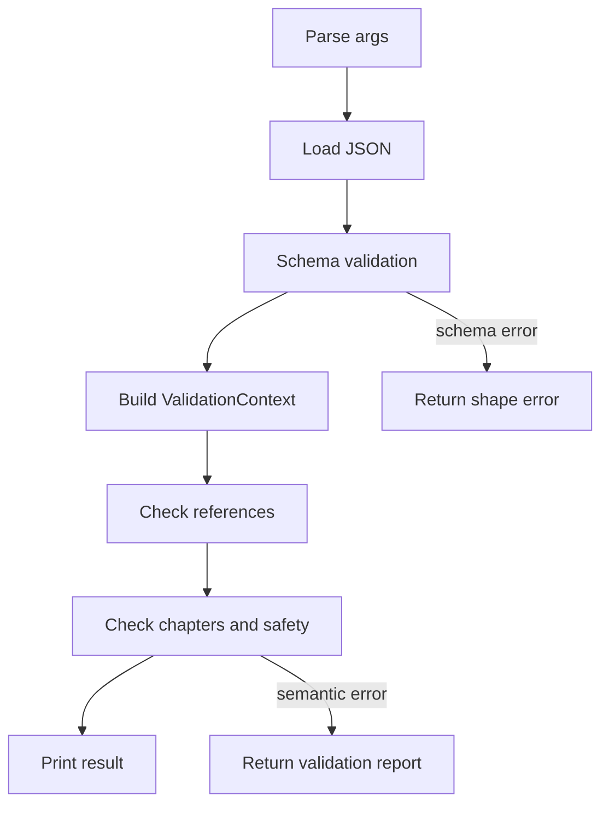

### 8.5 校验 Mermaid

#### 8.5.1 流程概述

该流程保证 DSL 或 Markdown 中的图只使用支持的 Mermaid 语法，并在严格模式下由本地 mmdc 验证。

- 依据：EV-MERMAID-VALIDATOR（Mermaid 校验器实现，scripts/validate_mermaid.py）

关联模块：Mermaid 校验器模块

关联运行单元：Mermaid 校验命令

#### 8.5.2 步骤说明

| 序号 | 执行方 | 说明 | 输入 | 输出 | 关联模块 | 关联运行单元 |
| --- | --- | --- | --- | --- | --- | --- |
| 1 | Mermaid 校验器 | 解析数据来源参数，从 DSL 或 Markdown 中抽取 Mermaid 图。 | --from-dsl 或 --from-markdown | MermaidDiagram 列表 | Mermaid 校验器模块 | Mermaid 校验命令 |
| 2 | Mermaid 校验器 | 执行静态检查，包括图类型、空内容、DOT 语法和 fence 规则。 | MermaidDiagram 列表 | 静态检查结果 | Mermaid 校验器模块 | Mermaid 校验命令 |
| 3 | Mermaid 校验器 | 严格模式下检查 node 和 mmdc，并准备工作目录。 | --strict 和可选 --work-dir | 严格校验环境或工具缺失错误 | Mermaid 校验器模块 | Mermaid 校验命令 |
| 4 | Mermaid 校验器 | 逐个写入 mmd 临时文件并调用 mmdc 输出 svg。 | Mermaid source | svg 临时产物和严格校验结果 | Mermaid 校验器模块 | Mermaid 校验命令 |

支持数据（STEP-MERVAL-001 / 解析数据来源参数，从 DSL 或 Markdown 中抽取 Mermaid 图。）

- 依据：EV-MERMAID-VALIDATOR（Mermaid 校验器实现，scripts/validate_mermaid.py）

支持数据（STEP-MERVAL-002 / 执行静态检查，包括图类型、空内容、DOT 语法和 fence 规则。）

- 依据：EV-MERMAID-VALIDATOR（Mermaid 校验器实现，scripts/validate_mermaid.py）

支持数据（STEP-MERVAL-003 / 严格模式下检查 node 和 mmdc，并准备工作目录。）

- 依据：EV-MERMAID-VALIDATOR（Mermaid 校验器实现，scripts/validate_mermaid.py）
- 依据：EV-MERMAID-RULES（Mermaid 规则，references/mermaid-rules.md）

支持数据（STEP-MERVAL-004 / 逐个写入 mmd 临时文件并调用 mmdc 输出 svg。）

- 依据：EV-MERMAID-VALIDATOR（Mermaid 校验器实现，scripts/validate_mermaid.py）

#### 8.5.3 异常/分支说明

| 条件 | 处理方式 | 关联模块 | 关联运行单元 |
| --- | --- | --- | --- |
| 严格模式缺少 node 或 mmdc | 报告严格校验未执行，按技能规则需要用户明确接受 static-only 才能继续。 | Mermaid 校验器模块、技能契约与参考文档模块 | Mermaid 校验命令 |
| 图源使用不支持的图类型或 DOT 语法 | 返回错误并要求改为支持的 Mermaid MVP 类型。 | Mermaid 校验器模块 | Mermaid 校验命令 |

支持数据（BR-MERVAL-TOOLING-MISSING / 严格模式缺少 node 或 mmdc）

- 依据：EV-SKILL-CONTRACT（技能入口和工作流契约，SKILL.md:1-62）
- 依据：EV-MERMAID-VALIDATOR（Mermaid 校验器实现，scripts/validate_mermaid.py）

支持数据（BR-MERVAL-UNSUPPORTED / 图源使用不支持的图类型或 DOT 语法）

- 依据：EV-MERMAID-VALIDATOR（Mermaid 校验器实现，scripts/validate_mermaid.py）
- 依据：EV-MERMAID-RULES（Mermaid 规则，references/mermaid-rules.md）

#### 8.5.4 流程图

Mermaid 校验流程图

展示 Mermaid 校验器静态和严格模式流程。

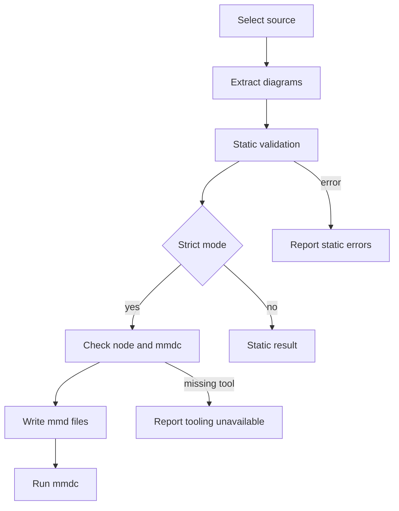

### 8.6 渲染 Markdown

#### 8.6.1 流程概述

该流程把 DSL 内容确定性地渲染为固定 9 章 Markdown，并控制输出文件安全。

- 依据：EV-RENDERER（Markdown 渲染器实现，scripts/render_markdown.py）

关联模块：Markdown 渲染器模块

关联运行单元：Markdown 渲染命令

#### 8.6.2 步骤说明

| 序号 | 执行方 | 说明 | 输入 | 输出 | 关联模块 | 关联运行单元 |
| --- | --- | --- | --- | --- | --- | --- |
| 1 | Markdown 渲染器 | 读取 DSL JSON 并校验 document.output_file 是安全且具体的 Markdown 文件名。 | DSL 文件路径和 output_dir | 输出文件路径或输入错误 | Markdown 渲染器模块 | Markdown 渲染命令 |
| 2 | Markdown 渲染器 | 构建模块和运行单元显示名，以及 evidence、traceability 和 source snippet 支持数据上下文。 | DSL 支持数据数组 | 渲染上下文 | Markdown 渲染器模块 | Markdown 渲染命令 |
| 3 | Markdown 渲染器 | 依次渲染文档信息、系统概览、架构视图、模块设计、运行时、配置依赖、协作、关键流程和第 9 章。 | DSL document object | Markdown 字符串 | Markdown 渲染器模块 | Markdown 渲染命令 |
| 4 | Markdown 渲染器 | 按默认不覆盖、overwrite 或 backup 策略写入输出文件。 | Markdown 字符串和输出路径 | Markdown 文件或写入错误 | Markdown 渲染器模块 | Markdown 渲染命令 |

支持数据（STEP-RENDER-001 / 读取 DSL JSON 并校验 document.output_file 是安全且具体的 Markdown 文件名。）

- 依据：EV-RENDERER（Markdown 渲染器实现，scripts/render_markdown.py）

支持数据（STEP-RENDER-002 / 构建模块和运行单元显示名，以及 evidence、traceability 和 source snippet 支持数据上下文。）

- 依据：EV-RENDERER（Markdown 渲染器实现，scripts/render_markdown.py）

支持数据（STEP-RENDER-003 / 依次渲染文档信息、系统概览、架构视图、模块设计、运行时、配置依赖、协作、关键流程和第 9 章。）

- 依据：EV-RENDERER（Markdown 渲染器实现，scripts/render_markdown.py）
- 依据：EV-DOCUMENT-STRUCTURE（固定文档结构，references/document-structure.md）

支持数据（STEP-RENDER-004 / 按默认不覆盖、overwrite 或 backup 策略写入输出文件。）

- 依据：EV-RENDERER（Markdown 渲染器实现，scripts/render_markdown.py）

#### 8.6.3 异常/分支说明

| 条件 | 处理方式 | 关联模块 | 关联运行单元 |
| --- | --- | --- | --- |
| document.output_file 泛化、含路径片段或不以 .md 结尾 | 返回输入错误，不写入文件。 | Markdown 渲染器模块 | Markdown 渲染命令 |
| 目标文件存在且用户选择 backup | 先写入带时间戳的备份文件，再写入新 Markdown。 | Markdown 渲染器模块 | Markdown 渲染命令 |

支持数据（BR-RENDER-FILENAME / document.output_file 泛化、含路径片段或不以 .md 结尾）

- 依据：EV-RENDERER（Markdown 渲染器实现，scripts/render_markdown.py）

支持数据（BR-RENDER-BACKUP / 目标文件存在且用户选择 backup）

- 依据：EV-RENDERER（Markdown 渲染器实现，scripts/render_markdown.py）

#### 8.6.4 流程图

Markdown 渲染流程图

展示 Markdown 渲染器的核心流程。

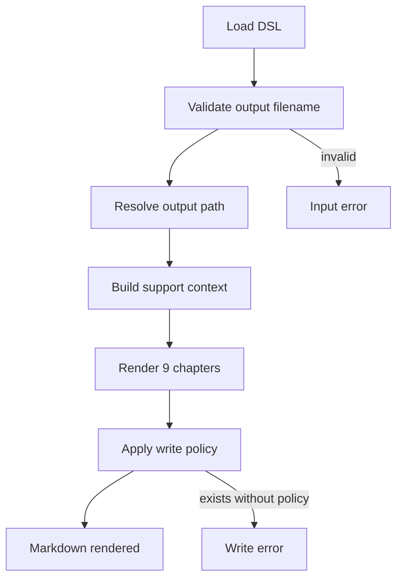

### 8.7 安装本地技能

#### 8.7.1 流程概述

该流程把仓库中的运行时技能文件复制到 Codex skills 目录，采用保守策略避免覆盖已有安装。

- 依据：EV-INSTALLER（copy-only 安装器实现，scripts/install_skill.py）
- 依据：EV-INSTALL-DOC（安装文档，docs/install.md）

关联模块：安装器模块、技能契约与参考文档模块、DSL Schema 模块、DSL 校验器模块、Mermaid 校验器模块、Markdown 渲染器模块

关联运行单元：技能安装命令

#### 8.7.2 步骤说明

| 序号 | 执行方 | 说明 | 输入 | 输出 | 关联模块 | 关联运行单元 |
| --- | --- | --- | --- | --- | --- | --- |
| 1 | 安装器 | 解析 --codex-home 和 dry-run 参数，并定位源仓库和目标技能路径。 | 命令行参数和环境变量 | source、codex_home 和 target | 安装器模块 | 技能安装命令 |
| 2 | 安装器 | 验证源仓库包含必需文件、目录和 SKILL.md 参考文件。 | 源仓库路径 | 源结构验证结果 | 安装器模块、技能契约与参考文档模块 | 技能安装命令 |
| 3 | 安装器 | 打印计划和依赖状态；dry-run 模式到此结束。 | 源路径、目标路径、当前环境 | 安装计划和依赖状态 | 安装器模块 | 技能安装命令 |
| 4 | 安装器 | 目标不存在时创建目录并复制运行时白名单条目。 | 运行时文件和目标路径 | 安装目录 | 安装器模块、技能契约与参考文档模块、DSL Schema 模块、DSL 校验器模块、Mermaid 校验器模块、Markdown 渲染器模块 | 技能安装命令 |
| 5 | 安装器 | 对安装后的目标目录再次执行结构验证并报告安装成功。 | 安装目标路径 | Installed create-structure-md to target | 安装器模块 | 技能安装命令 |

支持数据（STEP-INSTALL-001 / 解析 --codex-home 和 dry-run 参数，并定位源仓库和目标技能路径。）

- 依据：EV-INSTALLER（copy-only 安装器实现，scripts/install_skill.py）

支持数据（STEP-INSTALL-002 / 验证源仓库包含必需文件、目录和 SKILL.md 参考文件。）

- 依据：EV-INSTALLER（copy-only 安装器实现，scripts/install_skill.py）

支持数据（STEP-INSTALL-003 / 打印计划和依赖状态；dry-run 模式到此结束。）

- 依据：EV-INSTALLER（copy-only 安装器实现，scripts/install_skill.py）
- 依据：EV-INSTALL-DOC（安装文档，docs/install.md）

支持数据（STEP-INSTALL-004 / 目标不存在时创建目录并复制运行时白名单条目。）

- 依据：EV-INSTALLER（copy-only 安装器实现，scripts/install_skill.py）
- 依据：EV-INSTALL-DOC（安装文档，docs/install.md）

支持数据（STEP-INSTALL-005 / 对安装后的目标目录再次执行结构验证并报告安装成功。）

- 依据：EV-INSTALLER（copy-only 安装器实现，scripts/install_skill.py）

#### 8.7.3 异常/分支说明

| 条件 | 处理方式 | 关联模块 | 关联运行单元 |
| --- | --- | --- | --- |
| 目标技能目录已经存在 | 安装器失败退出，并打印用户可自行执行的清理命令。 | 安装器模块 | 技能安装命令 |
| 复制过程中发生异常 | 安装器报告需要人工检查，并给出由用户审查后执行的清理命令。 | 安装器模块 | 技能安装命令 |

支持数据（BR-INSTALL-TARGET-EXISTS / 目标技能目录已经存在）

- 依据：EV-INSTALLER（copy-only 安装器实现，scripts/install_skill.py）
- 依据：EV-INSTALL-DOC（安装文档，docs/install.md）

支持数据（BR-INSTALL-PARTIAL / 复制过程中发生异常）

- 依据：EV-INSTALLER（copy-only 安装器实现，scripts/install_skill.py）

#### 8.7.4 流程图

技能安装流程图

展示 copy-only 安装器的主流程。

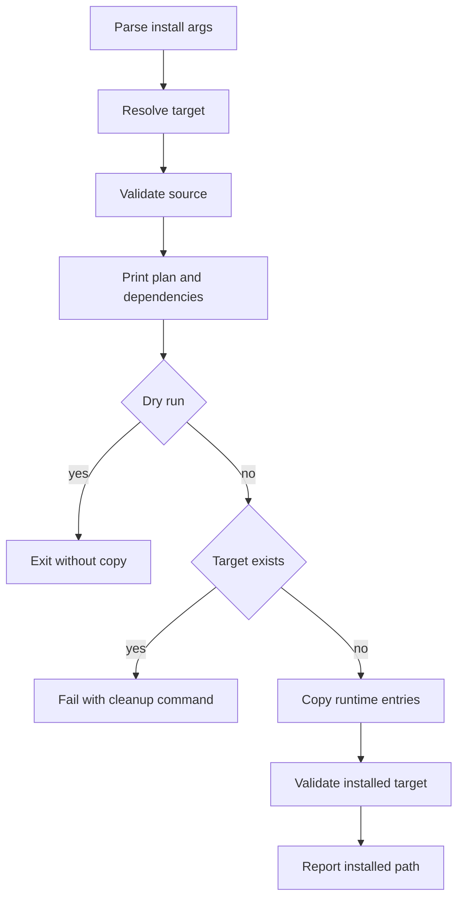

### 8.8 运行回归测试

#### 8.8.1 流程概述

该流程使用 Python 标准库 unittest 发现并执行测试，验证仓库脚本、示例和文档契约。

- 依据：EV-TESTS（unittest 测试集合，tests/test_validate_dsl.py, tests/test_validate_dsl_semantics.py, tests/test_validate_mermaid.py, tests/test_render_markdown.py, tests/test_install_skill.py, tests/test_phase7_e2e.py）
- 依据：EV-EXAMPLES（V2 最小 DSL 示例与成功 fixture，examples/minimal-from-code.dsl.json, examples/minimal-from-requirements.dsl.json, tests/fixtures/valid-v2-foundation.dsl.json）
- 依据：EV-V1-REJECTED（V1 rejected fixture，tests/fixtures/rejected-v1-phase2.dsl.json）

关联模块：示例与测试模块、DSL Schema 模块、DSL 校验器模块、Mermaid 校验器模块、Markdown 渲染器模块、安装器模块

关联运行单元：unittest 测试命令

#### 8.8.2 步骤说明

| 序号 | 执行方 | 说明 | 输入 | 输出 | 关联模块 | 关联运行单元 |
| --- | --- | --- | --- | --- | --- | --- |
| 1 | 测试运行者 | 运行 unittest discover 发现 tests 目录中的测试模块。 | tests 目录 | 测试套件 | 示例与测试模块 | unittest 测试命令 |
| 2 | 测试模块 | 测试用例加载示例、fixture 和脚本模块。 | examples、fixtures、scripts | 可执行测试上下文 | 示例与测试模块、DSL Schema 模块、DSL 校验器模块、Mermaid 校验器模块、Markdown 渲染器模块、安装器模块 | unittest 测试命令 |
| 3 | 测试模块 | 执行 schema、语义、Mermaid、渲染、安装和端到端断言。 | 测试上下文 | 测试通过或失败报告 | 示例与测试模块、DSL 校验器模块、Mermaid 校验器模块、Markdown 渲染器模块、安装器模块 | unittest 测试命令 |

支持数据（STEP-TESTS-001 / 运行 unittest discover 发现 tests 目录中的测试模块。）

- 依据：EV-TESTS（unittest 测试集合，tests/test_validate_dsl.py, tests/test_validate_dsl_semantics.py, tests/test_validate_mermaid.py, tests/test_render_markdown.py, tests/test_install_skill.py, tests/test_phase7_e2e.py）
- 依据：EV-INSTALL-DOC（安装文档，docs/install.md）

支持数据（STEP-TESTS-002 / 测试用例加载示例、fixture 和脚本模块。）

- 依据：EV-TESTS（unittest 测试集合，tests/test_validate_dsl.py, tests/test_validate_dsl_semantics.py, tests/test_validate_mermaid.py, tests/test_render_markdown.py, tests/test_install_skill.py, tests/test_phase7_e2e.py）
- 依据：EV-EXAMPLES（V2 最小 DSL 示例与成功 fixture，examples/minimal-from-code.dsl.json, examples/minimal-from-requirements.dsl.json, tests/fixtures/valid-v2-foundation.dsl.json）
- 依据：EV-V1-REJECTED（V1 rejected fixture，tests/fixtures/rejected-v1-phase2.dsl.json）

支持数据（STEP-TESTS-003 / 执行 schema、语义、Mermaid、渲染、安装和端到端断言。）

- 依据：EV-TESTS（unittest 测试集合，tests/test_validate_dsl.py, tests/test_validate_dsl_semantics.py, tests/test_validate_mermaid.py, tests/test_render_markdown.py, tests/test_install_skill.py, tests/test_phase7_e2e.py）

#### 8.8.3 异常/分支说明

| 条件 | 处理方式 | 关联模块 | 关联运行单元 |
| --- | --- | --- | --- |
| 任一测试断言失败 | unittest 报告失败用例，维护者根据失败模块定位契约或实现回归。 | 示例与测试模块 | unittest 测试命令 |

支持数据（BR-TESTS-FAILURE / 任一测试断言失败）

- 依据：EV-TESTS（unittest 测试集合，tests/test_validate_dsl.py, tests/test_validate_dsl_semantics.py, tests/test_validate_mermaid.py, tests/test_render_markdown.py, tests/test_install_skill.py, tests/test_phase7_e2e.py）

#### 8.8.4 流程图

回归测试流程图

展示测试发现和执行流程。

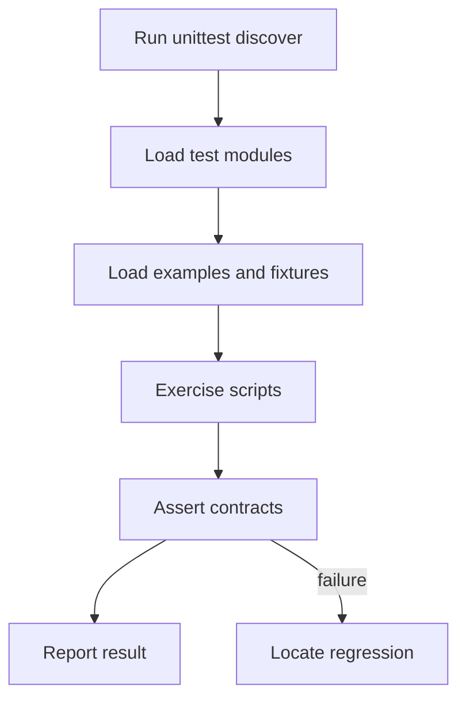

## 9. 结构问题与改进建议

当前仓库职责边界清晰，核心运行时依赖精简，安装器采用保守复制策略，适合作为本地 Codex 技能维护。建议补充顶层 README 或 pyproject 元数据，方便非 IDE 场景快速识别项目入口、测试命令和安装方式。建议在未来版本中把严格 Mermaid 校验的浏览器环境要求写得更具体，降低 mmdc 已安装但运行环境异常时的排查成本。

### 风险

| ID | 风险 | 影响 | 缓解措施 | 置信度 |
| --- | --- | --- | --- | --- |
| RISK-MERMAID-LOCAL-ENV | 严格 Mermaid 校验依赖本地 node、mmdc 和其浏览器运行环境，工具安装完整但运行环境异常时仍可能导致严格校验失败。 | 文档生成会在严格校验阶段停止，需要维护者先处理本地 Mermaid CLI 环境或明确接受静态校验降级。 | 保留 --check-env 检查，失败时按技能规则报告限制并获得用户接受后再使用 static-only。 | inferred |
| RISK-DOC-METADATA-DISCOVERY | 仓库缺少顶层 README 和 pyproject 元数据时，新维护者需要从 SKILL.md、docs/install.md 和测试文件中拼出项目入口。 | 降低首次接手时定位入口、依赖和测试命令的效率。 | 补充简短 README 或 pyproject 元数据，并复用 docs/install.md 中的安装和测试说明。 | observed |

支持数据（RISK-MERMAID-LOCAL-ENV / 严格 Mermaid 校验依赖本地 node、mmdc 和其浏览器运行环境，工具安装完整但运行环境异常时仍可能导致严格校验失败。）

- 依据：EV-SKILL-CONTRACT（技能入口和工作流契约，SKILL.md:1-62）
- 依据：EV-MERMAID-VALIDATOR（Mermaid 校验器实现，scripts/validate_mermaid.py）
- 依据：EV-MERMAID-RULES（Mermaid 规则，references/mermaid-rules.md）

支持数据（RISK-DOC-METADATA-DISCOVERY / 仓库缺少顶层 README 和 pyproject 元数据时，新维护者需要从 SKILL.md、docs/install.md 和测试文件中拼出项目入口。）

- 依据：EV-INSTALL-DOC（安装文档，docs/install.md）
- 依据：EV-TESTS（unittest 测试集合，tests/test_validate_dsl.py, tests/test_validate_dsl_semantics.py, tests/test_validate_mermaid.py, tests/test_render_markdown.py, tests/test_install_skill.py, tests/test_phase7_e2e.py）
