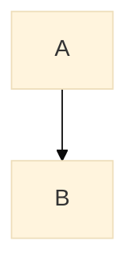
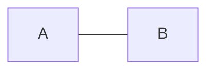
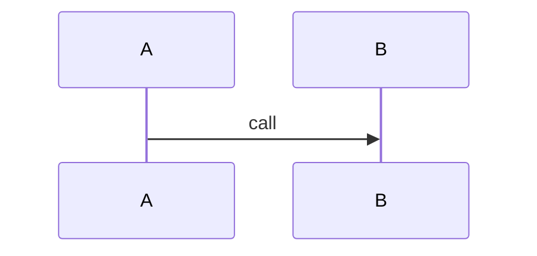
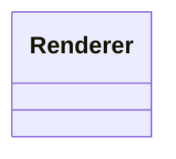
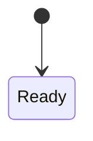
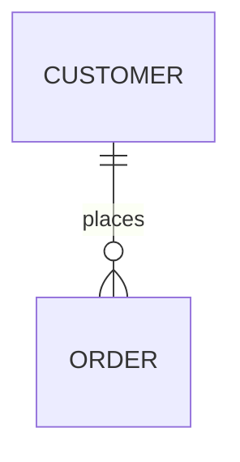

# Phase 4 Mermaid Validator Implementation Plan

> **For agentic workers:** REQUIRED SUB-SKILL: Use superpowers:subagent-driven-development (recommended) or superpowers:executing-plans to implement this plan task-by-task. Steps use checkbox (`- [ ]`) syntax for tracking.

**Goal:** Implement `scripts/validate_mermaid.py` as an independent Mermaid validator for create-structure-md DSL files and rendered Markdown files.

**Architecture:** Replace the Phase 1 stub with one focused Python script that exposes a CLI, pure extraction helpers, deterministic static validation, and a strict validation adapter around local Mermaid CLI tooling. DSL mode extracts non-empty diagram objects from known DSL locations and reports diagram IDs plus JSON paths; Markdown mode extracts fenced `mermaid` code blocks and reports block indexes plus line numbers. Static validation remains intentionally lightweight and fail-closed, while strict validation proves renderability only by invoking local `mmdc`.

**Tech Stack:** Python 3, standard-library `argparse`, `contextlib`, `dataclasses`, `io`, `json`, `re`, `shutil`, `subprocess`, `tempfile`, `pathlib`, `unittest`, and `unittest.mock`; existing `jsonschema` remains in `requirements.txt`; no new Python dependencies, browser automation, renderer implementation, or network access.

---

## File Structure

- Modify: `scripts/validate_mermaid.py`
  - Owns the public CLI, report formatting, environment checks, DSL extraction, Markdown fence extraction, static checks, and strict Mermaid CLI adapter.
  - Exit codes: `0` for validation success, `1` for validation failure or missing strict tooling, `2` for CLI misuse, unreadable input, invalid JSON, or unsupported argument combinations.
  - Output contract: successes and `--check-env` status go to stdout; validation and input errors go to stderr; the script never claims diagrams are renderable unless strict mode completed through `mmdc`.
- Modify: `tests/test_validate_mermaid.py`
  - Keep existing skill metadata tests.
  - Add validator unit and CLI tests using only `unittest` and `unittest.mock`.
- Modify: `tests/test_validate_dsl.py`
  - Remove `scripts/validate_mermaid.py` from Phase 1 stub expectations once this phase makes it real.
- Verify only: `scripts/validate_dsl.py`
  - Requiredness of empty DSL diagram sources stays here. Do not duplicate source-required rules in `validate_mermaid.py`.
- Verify only: `tests/test_validate_dsl_semantics.py`
  - Existing semantic tests already cover DSL requiredness and Mermaid fence rejection at the DSL semantic boundary.
- Verify only: `references/mermaid-rules.md`
  - Phase 4 implements the current rules: MVP diagram types, strict/static distinction, and no Graphviz/DOT output.
- Verify only: `references/review-checklist.md`
  - The final workflow still distinguishes strict validation from user-accepted static-only fallback.
- Verify only: `examples/minimal-from-code.dsl.json`
  - Must pass `validate_mermaid.py --from-dsl examples/minimal-from-code.dsl.json --static`.
- Verify only: `examples/minimal-from-requirements.dsl.json`
  - Must pass `validate_mermaid.py --from-dsl examples/minimal-from-requirements.dsl.json --static`.
- Verify only: `requirements.txt`
  - Must remain runtime-only with `jsonschema`; do not add Mermaid, Markdown, pytest, browser, or renderer packages.

Implementation constraint from the workspace instructions: do not run deletion commands such as `rm`, `rmdir`, `git clean`, `git reset --hard`, checkout-discard commands, worktree removal, or branch deletion. If cleanup is needed, provide the command for the user to run.

Use the agent Python for every test command:

```bash
PYTHONDONTWRITEBYTECODE=1 /home/hyx/miniconda3/envs/agent/bin/python -m unittest discover -s tests -v
```

---

### Task 1: CLI Skeleton, Report Model, And Environment Check

**Files:**
- Modify: `tests/test_validate_mermaid.py`
- Modify: `tests/test_validate_dsl.py`
- Modify: `scripts/validate_mermaid.py`

- [ ] **Step 1: Write failing CLI and environment tests**

Append these imports near the top of `tests/test_validate_mermaid.py`:

```python
import contextlib
import importlib.util
import io
import json
import subprocess
import sys
import tempfile
from copy import deepcopy
from unittest import mock
```

Append these helpers after the existing `ROOT` constant:

```python
VALIDATOR = ROOT / "scripts/validate_mermaid.py"
FIXTURE = ROOT / "tests/fixtures/valid-phase2.dsl.json"
PYTHON = sys.executable


def load_validator_module():
    spec = importlib.util.spec_from_file_location("validate_mermaid_under_test", VALIDATOR)
    module = importlib.util.module_from_spec(spec)
    spec.loader.exec_module(module)
    return module


def call_main(module, argv):
    stdout = io.StringIO()
    stderr = io.StringIO()
    with contextlib.redirect_stdout(stdout), contextlib.redirect_stderr(stderr):
        code = module.main(argv)
    return code, stdout.getvalue(), stderr.getvalue()


def valid_document():
    return deepcopy(json.loads(FIXTURE.read_text(encoding="utf-8")))


def write_json(tmpdir, name, document):
    path = Path(tmpdir) / name
    path.write_text(json.dumps(document, ensure_ascii=False, indent=2), encoding="utf-8")
    return path
```

Append this test class:

```python
class MermaidCliContractTests(unittest.TestCase):
    def test_from_dsl_and_from_markdown_are_mutually_exclusive(self):
        completed = subprocess.run(
            [
                PYTHON,
                str(VALIDATOR),
                "--from-dsl",
                "structure.dsl.json",
                "--from-markdown",
                "output.md",
                "--static",
            ],
            cwd=ROOT,
            text=True,
            capture_output=True,
            check=False,
        )
        self.assertEqual(2, completed.returncode)
        self.assertIn("not allowed with argument", completed.stderr)

    def test_static_and_strict_are_mutually_exclusive(self):
        completed = subprocess.run(
            [PYTHON, str(VALIDATOR), "--from-dsl", str(FIXTURE), "--static", "--strict"],
            cwd=ROOT,
            text=True,
            capture_output=True,
            check=False,
        )
        self.assertEqual(2, completed.returncode)
        self.assertIn("--strict and --static are mutually exclusive", completed.stderr)

    def test_check_env_must_be_used_by_itself(self):
        completed = subprocess.run(
            [PYTHON, str(VALIDATOR), "--check-env", "--from-dsl", str(FIXTURE)],
            cwd=ROOT,
            text=True,
            capture_output=True,
            check=False,
        )
        self.assertEqual(2, completed.returncode)
        self.assertIn("--check-env must be used by itself", completed.stderr)

    def test_check_env_reports_node_and_mmdc_without_input(self):
        module = load_validator_module()

        def fake_which(command):
            return "/usr/bin/node" if command == "node" else None

        with mock.patch.object(module.shutil, "which", side_effect=fake_which):
            code, stdout, stderr = call_main(module, ["--check-env"])

        self.assertEqual(1, code)
        self.assertIn("node: found at /usr/bin/node", stdout)
        self.assertIn("mmdc: missing", stdout)
        self.assertEqual("", stderr)

    def test_check_env_reports_version_when_node_and_mmdc_are_available(self):
        module = load_validator_module()

        def fake_which(command):
            return {
                "node": "/usr/bin/node",
                "mmdc": "/usr/local/bin/mmdc",
            }.get(command)

        completed = subprocess.CompletedProcess(["mmdc", "--version"], 0, stdout="10.9.1\n", stderr="")
        with mock.patch.object(module.shutil, "which", side_effect=fake_which), mock.patch.object(
            module.subprocess, "run", return_value=completed
        ):
            code, stdout, stderr = call_main(module, ["--check-env"])

        self.assertEqual(0, code)
        self.assertIn("node: found at /usr/bin/node", stdout)
        self.assertIn("mmdc: found at /usr/local/bin/mmdc", stdout)
        self.assertIn("mermaid-cli: 10.9.1", stdout)
        self.assertEqual("", stderr)

    def test_work_dir_is_valid_when_mode_defaults_to_strict(self):
        module = load_validator_module()
        parser = module.build_parser()
        args = parser.parse_args(["--from-dsl", "structure.dsl.json", "--work-dir", "mermaid-work"])
        module.validate_args(args, parser)
        self.assertEqual("strict", module.effective_mode(args))

    def test_static_with_work_dir_fails_because_work_dir_is_strict_only(self):
        completed = subprocess.run(
            [
                PYTHON,
                str(VALIDATOR),
                "--from-markdown",
                "output.md",
                "--static",
                "--work-dir",
                "mermaid-work",
            ],
            cwd=ROOT,
            text=True,
            capture_output=True,
            check=False,
        )
        self.assertEqual(2, completed.returncode)
        self.assertIn("--work-dir is valid only in strict mode", completed.stderr)

    def test_no_source_and_no_check_env_returns_two(self):
        completed = subprocess.run(
            [PYTHON, str(VALIDATOR)],
            cwd=ROOT,
            text=True,
            capture_output=True,
            check=False,
        )
        self.assertEqual(2, completed.returncode)
        self.assertIn("one of --from-dsl, --from-markdown, or --check-env is required", completed.stderr)
```

In `tests/test_validate_dsl.py`, replace `SCRIPT_CASES` with only the remaining Phase 1 renderer stub:

```python
SCRIPT_CASES = [
    (
        "scripts/render_markdown.py",
        ["structure.dsl.json", "--output-dir", "."],
        "Markdown rendering is not implemented in Phase 1",
    ),
]
```

- [ ] **Step 2: Run CLI tests to verify RED**

Run:

```bash
PYTHONDONTWRITEBYTECODE=1 /home/hyx/miniconda3/envs/agent/bin/python -m unittest tests.test_validate_mermaid.MermaidCliContractTests tests.test_validate_dsl.ScriptStubTests -v
```

Expected RED output includes:

```text
FAIL: test_static_and_strict_are_mutually_exclusive
FAIL: test_check_env_must_be_used_by_itself
ERROR: test_check_env_reports_node_and_mmdc_without_input
ERROR: test_check_env_reports_version_when_node_and_mmdc_are_available
ERROR: test_work_dir_is_valid_when_mode_defaults_to_strict
FAIL: test_no_source_and_no_check_env_returns_two
```

`test_from_dsl_and_from_markdown_are_mutually_exclusive` may already pass because the Phase 1 stub used an argparse mutually exclusive source group. `tests.test_validate_dsl.ScriptStubTests` should pass after removing `validate_mermaid.py` from `SCRIPT_CASES`.

- [ ] **Step 3: Implement the CLI skeleton and environment check**

Replace the Phase 1 stub in `scripts/validate_mermaid.py` with these concrete public names and behavior:

```python
#!/usr/bin/env python3
import argparse
import json
import re
import shutil
import subprocess
import sys
import tempfile
from dataclasses import dataclass, field
from pathlib import Path


SUPPORTED_TYPES = {"flowchart", "graph", "sequenceDiagram", "classDiagram", "stateDiagram-v2"}
ROOT = Path(__file__).resolve().parents[1]


@dataclass(frozen=True)
class MermaidIssue:
    level: str
    location: str
    message: str
    hint: str = ""

    def format(self):
        suffix = f" Hint: {self.hint}" if self.hint else ""
        return f"{self.level}: {self.location}: {self.message}.{suffix}"


@dataclass(frozen=True)
class MermaidDiagram:
    diagram_id: str
    source: str
    diagram_type: str = ""
    json_path: str = ""
    markdown_block_index: int | None = None
    line_start: int | None = None

    def label(self):
        if self.json_path:
            return f"{self.json_path} ({self.diagram_id})"
        return f"Mermaid block {self.markdown_block_index} line {self.line_start}"


@dataclass
class MermaidReport:
    errors: list[MermaidIssue] = field(default_factory=list)

    def error(self, location, message, hint=""):
        self.errors.append(MermaidIssue("ERROR", location, message, hint))


def build_parser():
    parser = argparse.ArgumentParser(description="Validate create-structure-md Mermaid diagrams.")
    source_group = parser.add_mutually_exclusive_group()
    source_group.add_argument("--from-dsl", dest="dsl_file", help="Path to structure DSL JSON.")
    source_group.add_argument("--from-markdown", dest="markdown_file", help="Path to rendered Markdown.")
    parser.add_argument("--strict", action="store_true", help="Validate with local Mermaid CLI tooling.")
    parser.add_argument("--static", action="store_true", help="Run deterministic static checks only.")
    parser.add_argument("--work-dir", help="Directory for strict-mode validation artifacts.")
    parser.add_argument("--check-env", action="store_true", help="Report local Mermaid validation tooling status.")
    return parser


def effective_mode(args):
    return "static" if args.static else "strict"


def validate_args(args, parser):
    if args.strict and args.static:
        parser.error("--strict and --static are mutually exclusive")
    if args.check_env and (args.dsl_file or args.markdown_file or args.strict or args.static or args.work_dir):
        parser.error("--check-env must be used by itself")
    if not args.check_env and not (args.dsl_file or args.markdown_file):
        parser.error("one of --from-dsl, --from-markdown, or --check-env is required")
    if args.work_dir and effective_mode(args) != "strict":
        parser.error("--work-dir is valid only in strict mode")


def check_environment():
    node_path = shutil.which("node")
    mmdc_path = shutil.which("mmdc")
    lines = [
        f"node: found at {node_path}" if node_path else "node: missing",
        f"mmdc: found at {mmdc_path}" if mmdc_path else "mmdc: missing",
    ]
    if mmdc_path:
        completed = subprocess.run(["mmdc", "--version"], text=True, capture_output=True, check=False)
        version = completed.stdout.strip() or completed.stderr.strip() or "version unavailable"
        lines.append(f"mermaid-cli: {version}")
    return node_path is not None and mmdc_path is not None, lines


def print_report(report):
    for issue in report.errors:
        print(issue.format(), file=sys.stderr)


def main(argv=None):
    parser = build_parser()
    args = parser.parse_args(argv)
    validate_args(args, parser)

    if args.check_env:
        ok, lines = check_environment()
        for line in lines:
            print(line)
        return 0 if ok else 1

    print("ERROR: validation mode requires Task 2 static extraction", file=sys.stderr)
    return 2


if __name__ == "__main__":
    raise SystemExit(main())
```

This code intentionally leaves non-`--check-env` modes returning `ERROR: validation mode requires Task 2 static extraction` until Task 2 replaces that branch. Do not print the old Phase 1 stub message.

- [ ] **Step 4: Run CLI tests to verify GREEN**

Run:

```bash
PYTHONDONTWRITEBYTECODE=1 /home/hyx/miniconda3/envs/agent/bin/python -m unittest tests.test_validate_mermaid.MermaidCliContractTests tests.test_validate_dsl.ScriptStubTests -v
```

Expected GREEN output:

```text
Ran 10 tests

OK
```

- [ ] **Step 5: Commit Task 1**

```bash
git add scripts/validate_mermaid.py tests/test_validate_mermaid.py tests/test_validate_dsl.py
git commit -m "feat: add mermaid validator cli shell"
```

---

### Task 2: DSL Diagram Extraction And Static Type Checks

**Files:**
- Modify: `tests/test_validate_mermaid.py`
- Modify: `scripts/validate_mermaid.py`

- [ ] **Step 1: Write failing DSL extraction and static validation tests**

Append this helper to `tests/test_validate_mermaid.py`:

```python
def write_markdown(tmpdir, name, text):
    path = Path(tmpdir) / name
    path.write_text(text, encoding="utf-8")
    return path
```

Append this test class:

```python
class DslMermaidStaticTests(unittest.TestCase):
    def test_extracts_non_empty_diagrams_from_all_known_dsl_paths_and_skips_empty_optional_sources(self):
        module = load_validator_module()
        document = valid_document()
        document["module_design"]["modules"][0]["internal_structure"]["diagram"]["source"] = "flowchart TD\n  Schema --> Validator"
        document["architecture_views"]["extra_diagrams"] = [
            {
                "id": "MER-ARCH-EXTRA",
                "kind": "extra",
                "title": "extra",
                "diagram_type": "graph",
                "description": "",
                "source": "graph LR\n  A --> B",
                "confidence": "observed",
            },
            {
                "id": "MER-ARCH-EMPTY",
                "kind": "extra",
                "title": "empty",
                "diagram_type": "flowchart",
                "description": "",
                "source": "  ",
                "confidence": "observed",
            }
        ]
        document["module_design"]["modules"][0]["external_capability_details"]["extra_diagrams"] = [
            {
                "id": "MER-CAP-EXTRA",
                "kind": "extra",
                "title": "cap",
                "diagram_type": "sequenceDiagram",
                "description": "",
                "source": "sequenceDiagram\n  A->>B: call",
                "confidence": "observed",
            }
        ]
        document["module_design"]["modules"][0]["extra_diagrams"] = [
            {
                "id": "MER-MOD-EXTRA",
                "kind": "extra",
                "title": "mod",
                "diagram_type": "classDiagram",
                "description": "",
                "source": "classDiagram\n  class Renderer",
                "confidence": "observed",
            }
        ]
        document["runtime_view"]["extra_diagrams"] = [
            {
                "id": "MER-RUNTIME-EXTRA",
                "kind": "extra",
                "title": "runtime",
                "diagram_type": "stateDiagram-v2",
                "description": "",
                "source": "stateDiagram-v2\n  [*] --> Ready",
                "confidence": "observed",
            }
        ]
        document["runtime_view"]["runtime_sequence_diagram"] = {
            "id": "MER-RUNTIME-SEQUENCE",
            "kind": "runtime_sequence",
            "title": "runtime sequence",
            "diagram_type": "sequenceDiagram",
            "description": "",
            "source": "sequenceDiagram\n  Codex->>Validator: validate",
            "confidence": "observed",
        }
        document["configuration_data_dependencies"]["extra_diagrams"] = [
            {
                "id": "MER-CONFIG-EXTRA",
                "kind": "extra",
                "title": "config",
                "diagram_type": "flowchart",
                "description": "",
                "source": "flowchart TD\n  Config --> Runtime",
                "confidence": "observed",
            }
        ]
        document["cross_module_collaboration"]["extra_diagrams"] = [
            {
                "id": "MER-COLLAB-EXTRA",
                "kind": "extra",
                "title": "collab",
                "diagram_type": "graph",
                "description": "",
                "source": "graph TD\n  Caller --> Callee",
                "confidence": "observed",
            }
        ]
        document["key_flows"]["extra_diagrams"] = [
            {
                "id": "MER-KEY-FLOWS-EXTRA",
                "kind": "extra",
                "title": "key flows",
                "diagram_type": "flowchart",
                "description": "",
                "source": "flowchart TD\n  Start --> Done",
                "confidence": "observed",
            }
        ]

        diagrams = module.extract_diagrams_from_dsl(document)
        paths = {diagram.diagram_id: diagram.json_path for diagram in diagrams}
        expected_paths = {
            "MER-ARCH-MODULES": "$.architecture_views.module_relationship_diagram",
            "MER-ARCH-EXTRA": "$.architecture_views.extra_diagrams[0]",
            "MER-MOD-SKILL-STRUCT": "$.module_design.modules[0].internal_structure.diagram",
            "MER-CAP-EXTRA": "$.module_design.modules[0].external_capability_details.extra_diagrams[0]",
            "MER-MOD-EXTRA": "$.module_design.modules[0].extra_diagrams[0]",
            "MER-RUNTIME-FLOW": "$.runtime_view.runtime_flow_diagram",
            "MER-RUNTIME-SEQUENCE": "$.runtime_view.runtime_sequence_diagram",
            "MER-RUNTIME-EXTRA": "$.runtime_view.extra_diagrams[0]",
            "MER-CONFIG-EXTRA": "$.configuration_data_dependencies.extra_diagrams[0]",
            "MER-COLLABORATION-RELATIONSHIP": "$.cross_module_collaboration.collaboration_relationship_diagram",
            "MER-COLLAB-EXTRA": "$.cross_module_collaboration.extra_diagrams[0]",
            "MER-FLOW-GENERATE": "$.key_flows.flows[0].diagram",
            "MER-KEY-FLOWS-EXTRA": "$.key_flows.extra_diagrams[0]",
        }
        self.assertEqual(expected_paths, {diagram_id: paths[diagram_id] for diagram_id in expected_paths})
        self.assertNotIn("MER-ARCH-EMPTY", paths)

    def test_from_dsl_static_accepts_valid_fixture(self):
        module = load_validator_module()
        code, stdout, stderr = call_main(module, ["--from-dsl", str(FIXTURE), "--static"])
        self.assertEqual(0, code, stderr)
        self.assertIn("Mermaid validation succeeded", stdout)
        self.assertIn("static mode", stdout)
        self.assertEqual("", stderr)

    def test_from_dsl_missing_file_exits_two_with_stderr_error(self):
        module = load_validator_module()
        code, stdout, stderr = call_main(module, ["--from-dsl", str(ROOT / "missing.dsl.json"), "--static"])
        self.assertEqual(2, code)
        self.assertEqual("", stdout)
        self.assertIn("ERROR", stderr)
        self.assertIn("could not read file", stderr)

    def test_from_dsl_directory_path_exits_two_with_read_error(self):
        module = load_validator_module()
        with tempfile.TemporaryDirectory() as tmpdir:
            code, stdout, stderr = call_main(module, ["--from-dsl", tmpdir, "--static"])

        self.assertEqual(2, code)
        self.assertEqual("", stdout)
        self.assertIn("ERROR", stderr)
        self.assertIn("could not read file", stderr)

    def test_from_dsl_invalid_json_exits_two_with_stderr_error(self):
        module = load_validator_module()
        with tempfile.TemporaryDirectory() as tmpdir:
            path = Path(tmpdir) / "broken.dsl.json"
            path.write_text("{ not json", encoding="utf-8")
            code, stdout, stderr = call_main(module, ["--from-dsl", str(path), "--static"])

        self.assertEqual(2, code)
        self.assertEqual("", stdout)
        self.assertIn("ERROR", stderr)
        self.assertIn("invalid JSON", stderr)

    def test_dsl_static_rejects_diagram_type_first_line_mismatch(self):
        module = load_validator_module()
        with tempfile.TemporaryDirectory() as tmpdir:
            document = valid_document()
            document["architecture_views"]["module_relationship_diagram"]["diagram_type"] = "sequenceDiagram"
            document["architecture_views"]["module_relationship_diagram"]["source"] = "flowchart TD\n  A --> B"
            path = write_json(tmpdir, "mismatch.dsl.json", document)
            code, stdout, stderr = call_main(module, ["--from-dsl", str(path), "--static"])

        self.assertEqual(1, code)
        self.assertEqual("", stdout)
        self.assertIn("$.architecture_views.module_relationship_diagram", stderr)
        self.assertIn("MER-ARCH-MODULES", stderr)
        self.assertIn("first meaningful line starts with flowchart but diagram_type is sequenceDiagram", stderr)

    def test_dsl_static_rejects_unsupported_diagram_type(self):
        module = load_validator_module()
        with tempfile.TemporaryDirectory() as tmpdir:
            document = valid_document()
            document["architecture_views"]["module_relationship_diagram"]["diagram_type"] = "erDiagram"
            document["architecture_views"]["module_relationship_diagram"]["source"] = "erDiagram\n  CUSTOMER ||--o{ ORDER : places"
            path = write_json(tmpdir, "unsupported-type.dsl.json", document)
            code, stdout, stderr = call_main(module, ["--from-dsl", str(path), "--static"])

        self.assertEqual(1, code)
        self.assertEqual("", stdout)
        self.assertIn("$.architecture_views.module_relationship_diagram", stderr)
        self.assertIn("unsupported Mermaid diagram type erDiagram", stderr)

    def test_optional_full_diagram_object_with_empty_source_is_skipped(self):
        module = load_validator_module()
        document = valid_document()
        document["runtime_view"]["runtime_sequence_diagram"] = {
            "id": "MER-RUNTIME-SEQUENCE-EMPTY",
            "kind": "runtime_sequence",
            "title": "optional empty sequence",
            "diagram_type": "sequenceDiagram",
            "description": "",
            "source": "",
            "confidence": "observed",
        }

        diagrams = module.extract_diagrams_from_dsl(document)
        paths = {diagram.diagram_id: diagram.json_path for diagram in diagrams}
        self.assertNotIn("MER-RUNTIME-SEQUENCE-EMPTY", paths)

    def test_dsl_static_rejects_duplicate_diagram_ids(self):
        module = load_validator_module()
        with tempfile.TemporaryDirectory() as tmpdir:
            document = valid_document()
            document["runtime_view"]["runtime_flow_diagram"]["id"] = "MER-ARCH-MODULES"
            path = write_json(tmpdir, "duplicate-mermaid-id.dsl.json", document)
            code, stdout, stderr = call_main(module, ["--from-dsl", str(path), "--static"])

        self.assertEqual(1, code)
        self.assertEqual("", stdout)
        self.assertIn("$.runtime_view.runtime_flow_diagram", stderr)
        self.assertIn("duplicate Mermaid diagram ID MER-ARCH-MODULES", stderr)

    def test_dsl_static_rejects_markdown_fences_inside_source(self):
        module = load_validator_module()
        with tempfile.TemporaryDirectory() as tmpdir:
            document = valid_document()
            document["architecture_views"]["module_relationship_diagram"]["source"] = "```mermaid\nflowchart TD\n  A --> B\n```"
            path = write_json(tmpdir, "fenced-source.dsl.json", document)
            code, stdout, stderr = call_main(module, ["--from-dsl", str(path), "--static"])

        self.assertEqual(1, code)
        self.assertIn("$.architecture_views.module_relationship_diagram", stderr)
        self.assertIn("DSL Mermaid source must not include Markdown fences", stderr)

    def test_type_inference_uses_token_boundaries_and_fails_closed(self):
        module = load_validator_module()
        for first_line in ["graphical TD", "flowchartish TD", "stateDiagram-v20"]:
            with tempfile.TemporaryDirectory() as tmpdir:
                document = valid_document()
                document["architecture_views"]["module_relationship_diagram"]["diagram_type"] = "flowchart"
                document["architecture_views"]["module_relationship_diagram"]["source"] = first_line + "\n  A --> B"
                path = write_json(tmpdir, "bad-prefix.dsl.json", document)
                code, stdout, stderr = call_main(module, ["--from-dsl", str(path), "--static"])
            with self.subTest(first_line=first_line):
                self.assertEqual(1, code)
                self.assertEqual("", stdout)
                self.assertIn("first meaningful line does not start with a supported Mermaid diagram type", stderr)
```

- [ ] **Step 2: Run DSL static tests to verify RED**

Run:

```bash
PYTHONDONTWRITEBYTECODE=1 /home/hyx/miniconda3/envs/agent/bin/python -m unittest tests.test_validate_mermaid.DslMermaidStaticTests -v
```

Expected RED output includes:

```text
ERROR: test_extracts_non_empty_diagrams_from_all_known_dsl_paths_and_skips_empty_optional_sources
FAIL: test_from_dsl_static_accepts_valid_fixture
FAIL: test_from_dsl_missing_file_exits_two_with_stderr_error
FAIL: test_from_dsl_directory_path_exits_two_with_read_error
FAIL: test_from_dsl_invalid_json_exits_two_with_stderr_error
FAIL: test_dsl_static_rejects_diagram_type_first_line_mismatch
FAIL: test_dsl_static_rejects_unsupported_diagram_type
ERROR: test_optional_full_diagram_object_with_empty_source_is_skipped
FAIL: test_dsl_static_rejects_duplicate_diagram_ids
FAIL: test_dsl_static_rejects_markdown_fences_inside_source
FAIL: test_type_inference_uses_token_boundaries_and_fails_closed
```

- [ ] **Step 3: Implement DSL extraction and static type checks**

Add these helpers and constants to `scripts/validate_mermaid.py`:

```python
TYPE_PREFIXES = {
    "flowchart": re.compile(r"^flowchart(?:\s|$)"),
    "graph": re.compile(r"^graph(?:\s|$)"),
    "sequenceDiagram": re.compile(r"^sequenceDiagram(?:\s|$)"),
    "classDiagram": re.compile(r"^classDiagram(?:\s|$)"),
    "stateDiagram-v2": re.compile(r"^stateDiagram-v2(?:\s|$)"),
}


def json_path(parts):
    path = "$"
    for part in parts:
        path += f"[{part}]" if isinstance(part, int) else f".{part}"
    return path


def is_diagram_object(value):
    return isinstance(value, dict) and {"id", "diagram_type", "source"}.issubset(value.keys())


def first_meaningful_line(source):
    for line_number, line in enumerate(source.splitlines(), start=1):
        stripped = line.strip()
        if not stripped:
            continue
        if stripped.startswith("%%{") and stripped.endswith("}%%"):
            continue
        if stripped.startswith("%%"):
            continue
        return stripped, line_number
    return "", None


def infer_type_from_source(source):
    line, line_number = first_meaningful_line(source)
    for diagram_type, pattern in TYPE_PREFIXES.items():
        if pattern.match(line):
            return diagram_type, line, line_number
    return "", line, line_number
```

Add this complete `extract_diagrams_from_dsl(document)` implementation with exact known paths from the Phase 4 spec. It appends only diagram objects whose `source.strip()` is non-empty:

```python
def append_diagram(diagrams, value, parts):
    if is_diagram_object(value) and value.get("source", "").strip():
        diagrams.append(
            MermaidDiagram(
                diagram_id=value.get("id", ""),
                source=value.get("source", ""),
                diagram_type=value.get("diagram_type", ""),
                json_path=json_path(parts),
            )
        )


def append_diagram_array(diagrams, values, parts):
    for index, value in enumerate(values or []):
        append_diagram(diagrams, value, [*parts, index])


def extract_diagrams_from_dsl(document):
    diagrams = []

    architecture_views = document.get("architecture_views", {})
    append_diagram(diagrams, architecture_views.get("module_relationship_diagram"), ["architecture_views", "module_relationship_diagram"])
    append_diagram_array(diagrams, architecture_views.get("extra_diagrams", []), ["architecture_views", "extra_diagrams"])

    for module_index, module in enumerate(document.get("module_design", {}).get("modules", [])):
        append_diagram(
            diagrams,
            module.get("internal_structure", {}).get("diagram"),
            ["module_design", "modules", module_index, "internal_structure", "diagram"],
        )
        append_diagram_array(
            diagrams,
            module.get("external_capability_details", {}).get("extra_diagrams", []),
            ["module_design", "modules", module_index, "external_capability_details", "extra_diagrams"],
        )
        append_diagram_array(
            diagrams,
            module.get("extra_diagrams", []),
            ["module_design", "modules", module_index, "extra_diagrams"],
        )

    runtime_view = document.get("runtime_view", {})
    append_diagram(diagrams, runtime_view.get("runtime_flow_diagram"), ["runtime_view", "runtime_flow_diagram"])
    append_diagram(diagrams, runtime_view.get("runtime_sequence_diagram"), ["runtime_view", "runtime_sequence_diagram"])
    append_diagram_array(diagrams, runtime_view.get("extra_diagrams", []), ["runtime_view", "extra_diagrams"])

    configuration = document.get("configuration_data_dependencies", {})
    append_diagram_array(
        diagrams,
        configuration.get("extra_diagrams", []),
        ["configuration_data_dependencies", "extra_diagrams"],
    )

    collaboration = document.get("cross_module_collaboration", {})
    append_diagram(
        diagrams,
        collaboration.get("collaboration_relationship_diagram"),
        ["cross_module_collaboration", "collaboration_relationship_diagram"],
    )
    append_diagram_array(
        diagrams,
        collaboration.get("extra_diagrams", []),
        ["cross_module_collaboration", "extra_diagrams"],
    )

    key_flows = document.get("key_flows", {})
    for flow_index, flow in enumerate(key_flows.get("flows", [])):
        append_diagram(diagrams, flow.get("diagram"), ["key_flows", "flows", flow_index, "diagram"])
    append_diagram_array(diagrams, key_flows.get("extra_diagrams", []), ["key_flows", "extra_diagrams"])

    return diagrams
```

Implement `validate_static(diagrams, source_kind)`:

```python
def validate_static(diagrams, source_kind):
    report = MermaidReport()
    seen_ids = {}
    for diagram in diagrams:
        location = diagram.label()
        if not diagram.source.strip():
            report.error(location, "Mermaid block body must be non-empty")
            continue
        if diagram.diagram_type and diagram.diagram_type not in SUPPORTED_TYPES:
            report.error(location, f"unsupported Mermaid diagram type {diagram.diagram_type}")
        if source_kind == "dsl" and "```" in diagram.source:
            report.error(location, "DSL Mermaid source must not include Markdown fences", "Store raw Mermaid source only")
        inferred_type, first_line, line_number = infer_type_from_source(diagram.source)
        if diagram.diagram_type:
            if inferred_type and inferred_type != diagram.diagram_type:
                report.error(
                    location,
                    f"first meaningful line starts with {inferred_type} but diagram_type is {diagram.diagram_type}",
                )
            if not inferred_type:
                report.error(location, "first meaningful line does not start with a supported Mermaid diagram type")
        elif not inferred_type:
            report.error(location, "could not infer supported Mermaid diagram type from first meaningful line")
        if source_kind == "dsl":
            if diagram.diagram_id in seen_ids:
                report.error(location, f"duplicate Mermaid diagram ID {diagram.diagram_id}", f"First seen at {seen_ids[diagram.diagram_id]}")
            else:
                seen_ids[diagram.diagram_id] = diagram.json_path
    return report
```

Add these input-loading and DSL static execution helpers:

```python
def load_json_file(path):
    try:
        return json.loads(Path(path).read_text(encoding="utf-8"))
    except OSError as exc:
        raise ValueError(f"could not read file: {path}: {exc}")
    except json.JSONDecodeError as exc:
        raise ValueError(f"invalid JSON at line {exc.lineno}, column {exc.colno}: {exc.msg}")


def run_static_validation(diagrams, source_kind):
    report = validate_static(diagrams, source_kind)
    if report.errors:
        print_report(report)
        return 1
    print(f"Mermaid validation succeeded: {len(diagrams)} diagram(s) checked in static mode.")
    return 0
```

Replace the non-`--check-env` branch in `main()` with this DSL-only static branch. Markdown and strict modes still return `2` until later tasks:

```python
    mode = effective_mode(args)

    try:
        if args.dsl_file:
            document = load_json_file(args.dsl_file)
            diagrams = extract_diagrams_from_dsl(document)
            if mode == "static":
                return run_static_validation(diagrams, "dsl")
            print("ERROR: strict validation requires Task 5 Mermaid CLI adapter", file=sys.stderr)
            return 2
        print("ERROR: Markdown validation requires Task 3 fence extraction", file=sys.stderr)
        return 2
    except ValueError as exc:
        print(f"ERROR: {exc}", file=sys.stderr)
        return 2
```

The DSL static success expression is:

```text
Mermaid validation succeeded: {len(diagrams)} diagram(s) checked in static mode.
```

Invalid JSON or unreadable files, including missing files and directory paths, must return `2` and write one `ERROR:` line to stderr.

- [ ] **Step 4: Run DSL static tests to verify GREEN**

Run:

```bash
PYTHONDONTWRITEBYTECODE=1 /home/hyx/miniconda3/envs/agent/bin/python -m unittest tests.test_validate_mermaid.DslMermaidStaticTests -v
```

Expected GREEN output:

```text
Ran 11 tests

OK
```

- [ ] **Step 5: Commit Task 2**

```bash
git add scripts/validate_mermaid.py tests/test_validate_mermaid.py
git commit -m "feat: validate mermaid diagrams from dsl statically"
```

---

### Task 3: Markdown Mermaid Fence Extraction And Inference

**Files:**
- Modify: `tests/test_validate_mermaid.py`
- Modify: `scripts/validate_mermaid.py`

- [ ] **Step 1: Write failing Markdown extraction tests**

Append this test class:

```python
class MarkdownMermaidStaticTests(unittest.TestCase):
    def test_from_markdown_static_accepts_all_supported_types_and_skips_comments_and_init(self):
        module = load_validator_module()
        markdown = """# Output










"""
        with tempfile.TemporaryDirectory() as tmpdir:
            path = write_markdown(tmpdir, "output.md", markdown)
            code, stdout, stderr = call_main(module, ["--from-markdown", str(path), "--static"])

        self.assertEqual(0, code, stderr)
        self.assertIn("Mermaid validation succeeded: 5 diagram(s) checked in static mode.", stdout)
        self.assertEqual("", stderr)

    def test_markdown_static_rejects_empty_mermaid_block_with_line_number(self):
        module = load_validator_module()
        markdown = "# Output\n\n```mermaid\n\n```\n"
        with tempfile.TemporaryDirectory() as tmpdir:
            path = write_markdown(tmpdir, "empty.md", markdown)
            code, stdout, stderr = call_main(module, ["--from-markdown", str(path), "--static"])

        self.assertEqual(1, code)
        self.assertEqual("", stdout)
        self.assertIn("Mermaid block 1 line 3", stderr)
        self.assertIn("Mermaid block body must be non-empty", stderr)

    def test_from_markdown_directory_path_exits_two_with_read_error(self):
        module = load_validator_module()
        with tempfile.TemporaryDirectory() as tmpdir:
            code, stdout, stderr = call_main(module, ["--from-markdown", tmpdir, "--static"])

        self.assertEqual(2, code)
        self.assertEqual("", stdout)
        self.assertIn("ERROR", stderr)
        self.assertIn("could not read file", stderr)

    def test_markdown_static_rejects_missing_or_unsupported_inferred_type(self):
        module = load_validator_module()
        markdown = """```mermaid
A --> B
```


"""
        with tempfile.TemporaryDirectory() as tmpdir:
            path = write_markdown(tmpdir, "unsupported.md", markdown)
            code, stdout, stderr = call_main(module, ["--from-markdown", str(path), "--static"])

        self.assertEqual(1, code)
        self.assertIn("Mermaid block 1 line 1", stderr)
        self.assertIn("could not infer supported Mermaid diagram type", stderr)
        self.assertIn("Mermaid block 2 line 5", stderr)
        self.assertIn("unsupported Mermaid diagram type erDiagram", stderr)

    def test_markdown_static_rejects_unbalanced_fences(self):
        module = load_validator_module()
        markdown = "# Output\n\n```mermaid\nflowchart TD\n  A --> B\n"
        with tempfile.TemporaryDirectory() as tmpdir:
            path = write_markdown(tmpdir, "unbalanced.md", markdown)
            code, stdout, stderr = call_main(module, ["--from-markdown", str(path), "--static"])

        self.assertEqual(1, code)
        self.assertIn("Mermaid block 1 line 3", stderr)
        self.assertIn("unbalanced fenced code block starting at line 3", stderr)

    def test_markdown_static_rejects_unclosed_non_mermaid_fence_with_markdown_line(self):
        module = load_validator_module()
        markdown = "# Output\n\n```python\nprint('not mermaid')\n"
        with tempfile.TemporaryDirectory() as tmpdir:
            path = write_markdown(tmpdir, "unclosed-python.md", markdown)
            code, stdout, stderr = call_main(module, ["--from-markdown", str(path), "--static"])

        self.assertEqual(1, code)
        self.assertEqual("", stdout)
        self.assertIn("Markdown line 3", stderr)
        self.assertIn("unbalanced fenced code block starting at line 3", stderr)
```

- [ ] **Step 2: Run Markdown static tests to verify RED**

Run:

```bash
PYTHONDONTWRITEBYTECODE=1 /home/hyx/miniconda3/envs/agent/bin/python -m unittest tests.test_validate_mermaid.MarkdownMermaidStaticTests -v
```

Expected RED output includes:

```text
FAIL: test_from_markdown_static_accepts_all_supported_types_and_skips_comments_and_init
FAIL: test_markdown_static_rejects_empty_mermaid_block_with_line_number
FAIL: test_from_markdown_directory_path_exits_two_with_read_error
FAIL: test_markdown_static_rejects_missing_or_unsupported_inferred_type
FAIL: test_markdown_static_rejects_unbalanced_fences
FAIL: test_markdown_static_rejects_unclosed_non_mermaid_fence_with_markdown_line
```

- [ ] **Step 3: Implement Markdown fence extraction and inference**

Add `extract_diagrams_from_markdown(markdown_text)` to `scripts/validate_mermaid.py`:

```python
FENCE_RE = re.compile(r"^\s*(```+|~~~+)\s*([A-Za-z0-9_-]+)?\s*$")


def extract_diagrams_from_markdown(markdown_text):
    diagrams = []
    report = MermaidReport()
    in_fence = False
    fence_marker = ""
    fence_language = ""
    fence_start_line = 0
    body_lines = []
    block_index = 0

    for line_number, line in enumerate(markdown_text.splitlines(), start=1):
        match = FENCE_RE.match(line)
        if match and not in_fence:
            in_fence = True
            fence_marker = match.group(1)
            fence_language = (match.group(2) or "").lower()
            fence_start_line = line_number
            body_lines = []
            continue
        if match and in_fence:
            closing_marker = match.group(1)
            if closing_marker[0] == fence_marker[0] and len(closing_marker) >= len(fence_marker):
                if fence_language == "mermaid":
                    block_index += 1
                    source = "\n".join(body_lines)
                    inferred_type, first_line, first_line_offset = infer_type_from_source(source)
                    if not inferred_type and first_line:
                        first_token = first_line.split()[0]
                        inferred_type = first_token
                    diagrams.append(
                        MermaidDiagram(
                            diagram_id=f"markdown-block-{block_index}",
                            source=source,
                            diagram_type=inferred_type if inferred_type in SUPPORTED_TYPES else "",
                            markdown_block_index=block_index,
                            line_start=fence_start_line,
                        )
                    )
                    if inferred_type and inferred_type not in SUPPORTED_TYPES:
                        report.error(
                            f"Mermaid block {block_index} line {fence_start_line}",
                            f"unsupported Mermaid diagram type {inferred_type}",
                        )
                in_fence = False
                fence_marker = ""
                fence_language = ""
                fence_start_line = 0
                body_lines = []
                continue
        if in_fence:
            body_lines.append(line)

    if in_fence:
        if fence_language == "mermaid":
            report.error(
                f"Mermaid block {block_index + 1} line {fence_start_line}",
                f"unbalanced fenced code block starting at line {fence_start_line}",
            )
        else:
            report.error(f"Markdown line {fence_start_line}", f"unbalanced fenced code block starting at line {fence_start_line}")
    return diagrams, report
```

Replace `run_static_validation()` with this version so extraction errors and static errors are merged before output:

```python
def merge_reports(*reports):
    merged = MermaidReport()
    for report in reports:
        merged.errors.extend(report.errors)
    return merged


def run_static_validation(diagrams, source_kind, extraction_report=None):
    static_report = validate_static(diagrams, source_kind)
    report = merge_reports(extraction_report or MermaidReport(), static_report)
    if report.errors:
        print_report(report)
        return 1
    print(f"Mermaid validation succeeded: {len(diagrams)} diagram(s) checked in static mode.")
    return 0
```

Add this Markdown loader:

```python
def load_text_file(path):
    try:
        return Path(path).read_text(encoding="utf-8")
    except OSError as exc:
        raise ValueError(f"could not read file: {path}: {exc}")
```

Replace the non-`--check-env` branch in `main()` with this static-capable DSL and Markdown branch. Strict modes still return `2` until Task 5:

```python
    mode = effective_mode(args)

    try:
        if args.dsl_file:
            document = load_json_file(args.dsl_file)
            diagrams = extract_diagrams_from_dsl(document)
            if mode == "static":
                return run_static_validation(diagrams, "dsl")
            print("ERROR: strict validation requires Task 5 Mermaid CLI adapter", file=sys.stderr)
            return 2

        markdown_text = load_text_file(args.markdown_file)
        diagrams, extraction_report = extract_diagrams_from_markdown(markdown_text)
        if mode == "static":
            return run_static_validation(diagrams, "markdown", extraction_report)
        print("ERROR: strict validation requires Task 5 Mermaid CLI adapter", file=sys.stderr)
        return 2
    except ValueError as exc:
        print(f"ERROR: {exc}", file=sys.stderr)
        return 2
```

The Markdown static success expression is:

```text
Mermaid validation succeeded: {len(diagrams)} diagram(s) checked in static mode.
```

- [ ] **Step 4: Run Markdown static tests to verify GREEN**

Run:

```bash
PYTHONDONTWRITEBYTECODE=1 /home/hyx/miniconda3/envs/agent/bin/python -m unittest tests.test_validate_mermaid.MarkdownMermaidStaticTests -v
```

Expected GREEN output:

```text
Ran 6 tests

OK
```

- [ ] **Step 5: Commit Task 3**

```bash
git add scripts/validate_mermaid.py tests/test_validate_mermaid.py
git commit -m "feat: validate mermaid fences from markdown"
```

---

### Task 4: Graphviz/DOT Rejection And Actionable Diagnostics

**Files:**
- Modify: `tests/test_validate_mermaid.py`
- Modify: `scripts/validate_mermaid.py`

- [ ] **Step 1: Write failing static boundary tests**

Append this test class:

```python
class MermaidStaticBoundaryTests(unittest.TestCase):
    def test_static_rejects_graphviz_digraph_and_rankdir(self):
        module = load_validator_module()
        with tempfile.TemporaryDirectory() as tmpdir:
            document = valid_document()
            document["architecture_views"]["module_relationship_diagram"]["source"] = "digraph G {\n  rankdir=LR;\n  A -> B;\n}"
            path = write_json(tmpdir, "dot.dsl.json", document)
            code, stdout, stderr = call_main(module, ["--from-dsl", str(path), "--static"])

        self.assertEqual(1, code)
        self.assertEqual("", stdout)
        self.assertIn("$.architecture_views.module_relationship_diagram", stderr)
        self.assertIn("Graphviz/DOT syntax is not supported", stderr)
        self.assertIn("line 1", stderr)

    def test_static_allows_common_mermaid_arrows(self):
        module = load_validator_module()
        markdown = """```mermaid
flowchart TD
  A --> B
  B --- C
  C -->|label| D
```


"""
        with tempfile.TemporaryDirectory() as tmpdir:
            path = write_markdown(tmpdir, "arrows.md", markdown)
            code, stdout, stderr = call_main(module, ["--from-markdown", str(path), "--static"])

        self.assertEqual(0, code, stderr)
        self.assertIn("2 diagram(s)", stdout)

    def test_static_rejects_dot_style_single_arrow_statement_without_rejecting_sequence_arrows(self):
        module = load_validator_module()
        markdown = """```mermaid
flowchart TD
  node -> other;
```
"""
        with tempfile.TemporaryDirectory() as tmpdir:
            path = write_markdown(tmpdir, "dot-arrow.md", markdown)
            code, stdout, stderr = call_main(module, ["--from-markdown", str(path), "--static"])

        self.assertEqual(1, code)
        self.assertIn("Mermaid block 1 line 1", stderr)
        self.assertIn("Graphviz/DOT syntax is not supported", stderr)
        self.assertIn("line 2", stderr)
```

- [ ] **Step 2: Run static boundary tests to verify RED**

Run:

```bash
PYTHONDONTWRITEBYTECODE=1 /home/hyx/miniconda3/envs/agent/bin/python -m unittest tests.test_validate_mermaid.MermaidStaticBoundaryTests -v
```

Expected RED output includes:

```text
FAIL: test_static_rejects_graphviz_digraph_and_rankdir
FAIL: test_static_rejects_dot_style_single_arrow_statement_without_rejecting_sequence_arrows
```

The Mermaid-arrow positive test may already pass after Task 3. Keep it in this task to prevent over-broad DOT regexes.

- [ ] **Step 3: Implement Graphviz/DOT detection**

Add these patterns and helper:

```python
DOT_PATTERNS = [
    re.compile(r"(?im)^\s*digraph\b"),
    re.compile(r"(?im)^\s*rankdir\s*="),
    re.compile(r"(?m)^\s*[A-Za-z_][\w.-]*\s*->\s*[A-Za-z_][\w.-]*\s*;?\s*$"),
]


def find_dot_syntax(source):
    findings = []
    for line_number, line in enumerate(source.splitlines(), start=1):
        for pattern in DOT_PATTERNS:
            if pattern.search(line):
                findings.append((line_number, line.strip()))
                break
    return findings
```

Replace `validate_static(diagrams, source_kind)` with this complete version. The DOT check runs after basic source/fence checks and before first-line inference, so a DOT source produces an explicit Graphviz/DOT diagnostic without hiding duplicate-ID checks for DSL input:

```python
def validate_static(diagrams, source_kind):
    report = MermaidReport()
    seen_ids = {}
    for diagram in diagrams:
        location = diagram.label()
        if not diagram.source.strip():
            report.error(location, "Mermaid block body must be non-empty")
            continue
        if diagram.diagram_type and diagram.diagram_type not in SUPPORTED_TYPES:
            report.error(location, f"unsupported Mermaid diagram type {diagram.diagram_type}")
        if source_kind == "dsl" and "```" in diagram.source:
            report.error(location, "DSL Mermaid source must not include Markdown fences", "Store raw Mermaid source only")

        dot_findings = find_dot_syntax(diagram.source)
        if dot_findings:
            line_number, line = dot_findings[0]
            report.error(
                location,
                f"Graphviz/DOT syntax is not supported at line {line_number}: {line}",
                "Use Mermaid syntax only; final Graphviz, DOT, SVG, PNG, and image export are out of scope",
            )

        inferred_type, first_line, line_number = infer_type_from_source(diagram.source)
        if diagram.diagram_type:
            if inferred_type and inferred_type != diagram.diagram_type:
                report.error(
                    location,
                    f"first meaningful line starts with {inferred_type} but diagram_type is {diagram.diagram_type}",
                )
            if not inferred_type:
                report.error(location, "first meaningful line does not start with a supported Mermaid diagram type")
        elif not inferred_type:
            report.error(location, "could not infer supported Mermaid diagram type from first meaningful line")
        if source_kind == "dsl":
            if diagram.diagram_id in seen_ids:
                report.error(location, f"duplicate Mermaid diagram ID {diagram.diagram_id}", f"First seen at {seen_ids[diagram.diagram_id]}")
            else:
                seen_ids[diagram.diagram_id] = diagram.json_path
    return report
```

Do not reject Mermaid arrows `-->`, `---`, `->>`, or `-->|label|`.

- [ ] **Step 4: Run static boundary tests to verify GREEN**

Run:

```bash
PYTHONDONTWRITEBYTECODE=1 /home/hyx/miniconda3/envs/agent/bin/python -m unittest tests.test_validate_mermaid.MermaidStaticBoundaryTests -v
```

Expected GREEN output:

```text
Ran 3 tests

OK
```

- [ ] **Step 5: Commit Task 4**

```bash
git add scripts/validate_mermaid.py tests/test_validate_mermaid.py
git commit -m "feat: reject graphviz syntax in mermaid validator"
```

---

### Task 5: Strict Mermaid CLI Validation And Work Directory Artifacts

**Files:**
- Modify: `tests/test_validate_mermaid.py`
- Modify: `scripts/validate_mermaid.py`

- [ ] **Step 1: Write failing strict-mode tests with mocked local tooling**

Append this test class:

```python
class MermaidStrictValidationTests(unittest.TestCase):
    def test_default_mode_is_strict_and_missing_tooling_is_explicit(self):
        module = load_validator_module()
        with tempfile.TemporaryDirectory() as tmpdir:
            path = write_json(tmpdir, "valid.dsl.json", valid_document())

            with mock.patch.object(module.shutil, "which", return_value=None):
                code, stdout, stderr = call_main(module, ["--from-dsl", str(path)])

        self.assertEqual(1, code)
        self.assertEqual("", stdout)
        self.assertIn("Mermaid strict validation was not performed", stderr)
        self.assertIn("local Mermaid CLI tooling unavailable", stderr)
        self.assertIn("mmdc", stderr)
        self.assertNotIn("proven renderable", stdout + stderr)

    def test_strict_mode_writes_mmd_files_and_preserves_work_dir_artifacts(self):
        module = load_validator_module()
        with tempfile.TemporaryDirectory() as tmpdir:
            dsl_path = write_json(tmpdir, "valid.dsl.json", valid_document())
            work_dir = Path(tmpdir) / "mermaid-work"

            def fake_which(command):
                return f"/usr/bin/{command}" if command in {"node", "mmdc"} else None

            completed = subprocess.CompletedProcess(["mmdc"], 0, stdout="", stderr="")
            with mock.patch.object(module.shutil, "which", side_effect=fake_which), mock.patch.object(
                module.subprocess, "run", return_value=completed
            ) as mocked_run:
                code, stdout, stderr = call_main(
                    module,
                    ["--from-dsl", str(dsl_path), "--strict", "--work-dir", str(work_dir)],
                )

                self.assertEqual(0, code, stderr)
                self.assertIn("Mermaid validation succeeded", stdout)
                self.assertIn("strict mode", stdout)
                self.assertTrue((work_dir / "MER-ARCH-MODULES.mmd").is_file())
                self.assertTrue((work_dir / "MER-ARCH-MODULES.svg").parent.is_dir())
                command = mocked_run.call_args_list[0].args[0]
                self.assertEqual("mmdc", command[0])
                self.assertIn("-i", command)
                self.assertIn("-o", command)
                self.assertEqual(work_dir / "MER-ARCH-MODULES.mmd", Path(command[command.index("-i") + 1]))
                self.assertEqual(work_dir / "MER-ARCH-MODULES.svg", Path(command[command.index("-o") + 1]))

    def test_default_strict_mode_accepts_work_dir_without_explicit_strict_flag_for_dsl(self):
        module = load_validator_module()
        with tempfile.TemporaryDirectory() as tmpdir:
            dsl_path = write_json(tmpdir, "valid.dsl.json", valid_document())
            work_dir = Path(tmpdir) / "default-strict-work"

            def fake_which(command):
                return f"/usr/bin/{command}" if command in {"node", "mmdc"} else None

            completed = subprocess.CompletedProcess(["mmdc"], 0, stdout="", stderr="")
            with mock.patch.object(module.shutil, "which", side_effect=fake_which), mock.patch.object(
                module.subprocess, "run", return_value=completed
            ):
                code, stdout, stderr = call_main(module, ["--from-dsl", str(dsl_path), "--work-dir", str(work_dir)])

                self.assertEqual(0, code, stderr)
                self.assertIn("strict mode", stdout)
                self.assertTrue((work_dir / "MER-ARCH-MODULES.mmd").is_file())

    def test_default_strict_mode_accepts_work_dir_without_explicit_strict_flag_for_markdown(self):
        module = load_validator_module()
        markdown = "```mermaid\nflowchart TD\n  A --> B\n```\n"
        with tempfile.TemporaryDirectory() as tmpdir:
            markdown_path = write_markdown(tmpdir, "output.md", markdown)
            work_dir = Path(tmpdir) / "markdown-work"

            def fake_which(command):
                return f"/usr/bin/{command}" if command in {"node", "mmdc"} else None

            completed = subprocess.CompletedProcess(["mmdc"], 0, stdout="", stderr="")
            with mock.patch.object(module.shutil, "which", side_effect=fake_which), mock.patch.object(
                module.subprocess, "run", return_value=completed
            ):
                code, stdout, stderr = call_main(
                    module,
                    ["--from-markdown", str(markdown_path), "--work-dir", str(work_dir)],
                )

                self.assertEqual(0, code, stderr)
                self.assertIn("strict mode", stdout)
                self.assertTrue((work_dir / "markdown-block-1.mmd").is_file())

    def test_strict_mode_reports_mmdc_failure_with_diagram_location(self):
        module = load_validator_module()
        with tempfile.TemporaryDirectory() as tmpdir:
            dsl_path = write_json(tmpdir, "valid.dsl.json", valid_document())

            def fake_which(command):
                return f"/usr/bin/{command}" if command in {"node", "mmdc"} else None

            completed = subprocess.CompletedProcess(["mmdc"], 1, stdout="", stderr="Parse error on line 2")
            with mock.patch.object(module.shutil, "which", side_effect=fake_which), mock.patch.object(
                module.subprocess, "run", return_value=completed
            ):
                code, stdout, stderr = call_main(module, ["--from-dsl", str(dsl_path), "--strict"])

        self.assertEqual(1, code)
        self.assertEqual("", stdout)
        self.assertIn("$.architecture_views.module_relationship_diagram", stderr)
        self.assertIn("MER-ARCH-MODULES", stderr)
        self.assertIn("mmdc failed", stderr)
        self.assertIn("Parse error on line 2", stderr)

    def test_strict_dsl_static_errors_stop_before_mmdc(self):
        module = load_validator_module()
        with tempfile.TemporaryDirectory() as tmpdir:
            document = valid_document()
            document["architecture_views"]["module_relationship_diagram"]["source"] = "digraph G {\n  A -> B;\n}"
            dsl_path = write_json(tmpdir, "dot.dsl.json", document)

            def fake_which(command):
                return f"/usr/bin/{command}" if command in {"node", "mmdc"} else None

            with mock.patch.object(module.shutil, "which", side_effect=fake_which), mock.patch.object(
                module.subprocess, "run"
            ) as mocked_run:
                code, stdout, stderr = call_main(module, ["--from-dsl", str(dsl_path), "--strict"])

        self.assertEqual(1, code)
        self.assertEqual("", stdout)
        self.assertIn("Graphviz/DOT syntax is not supported", stderr)
        mocked_run.assert_not_called()

    def test_strict_markdown_unbalanced_fence_stops_before_mmdc(self):
        module = load_validator_module()
        markdown = "```mermaid\nflowchart TD\n  A --> B\n"
        with tempfile.TemporaryDirectory() as tmpdir:
            markdown_path = write_markdown(tmpdir, "unbalanced.md", markdown)

            def fake_which(command):
                return f"/usr/bin/{command}" if command in {"node", "mmdc"} else None

            with mock.patch.object(module.shutil, "which", side_effect=fake_which), mock.patch.object(
                module.subprocess, "run"
            ) as mocked_run:
                code, stdout, stderr = call_main(module, ["--from-markdown", str(markdown_path), "--strict"])

        self.assertEqual(1, code)
        self.assertEqual("", stdout)
        self.assertIn("Mermaid block 1 line 1", stderr)
        self.assertIn("unbalanced fenced code block starting at line 1", stderr)
        mocked_run.assert_not_called()

    def test_strict_markdown_unsupported_type_stops_before_mmdc(self):
        module = load_validator_module()
        markdown = "```mermaid\nerDiagram\n  A ||--o{ B : owns\n```\n"
        with tempfile.TemporaryDirectory() as tmpdir:
            markdown_path = write_markdown(tmpdir, "unsupported.md", markdown)

            def fake_which(command):
                return f"/usr/bin/{command}" if command in {"node", "mmdc"} else None

            with mock.patch.object(module.shutil, "which", side_effect=fake_which), mock.patch.object(
                module.subprocess, "run"
            ) as mocked_run:
                code, stdout, stderr = call_main(module, ["--from-markdown", str(markdown_path), "--strict"])

        self.assertEqual(1, code)
        self.assertEqual("", stdout)
        self.assertIn("unsupported Mermaid diagram type erDiagram", stderr)
        mocked_run.assert_not_called()

    def test_strict_markdown_unclosed_non_mermaid_fence_stops_before_mmdc(self):
        module = load_validator_module()
        markdown = "# Output\n\n```python\nprint('not mermaid')\n"
        with tempfile.TemporaryDirectory() as tmpdir:
            markdown_path = write_markdown(tmpdir, "unclosed-python.md", markdown)

            def fake_which(command):
                return f"/usr/bin/{command}" if command in {"node", "mmdc"} else None

            with mock.patch.object(module.shutil, "which", side_effect=fake_which), mock.patch.object(
                module.subprocess, "run"
            ) as mocked_run:
                code, stdout, stderr = call_main(module, ["--from-markdown", str(markdown_path), "--strict"])

        self.assertEqual(1, code)
        self.assertEqual("", stdout)
        self.assertIn("Markdown line 3", stderr)
        self.assertIn("unbalanced fenced code block starting at line 3", stderr)
        mocked_run.assert_not_called()
```

- [ ] **Step 2: Run strict tests to verify RED**

Run:

```bash
PYTHONDONTWRITEBYTECODE=1 /home/hyx/miniconda3/envs/agent/bin/python -m unittest tests.test_validate_mermaid.MermaidStrictValidationTests -v
```

Expected RED output includes:

```text
FAIL: test_default_mode_is_strict_and_missing_tooling_is_explicit
FAIL: test_strict_mode_writes_mmd_files_and_preserves_work_dir_artifacts
FAIL: test_default_strict_mode_accepts_work_dir_without_explicit_strict_flag_for_dsl
FAIL: test_default_strict_mode_accepts_work_dir_without_explicit_strict_flag_for_markdown
FAIL: test_strict_mode_reports_mmdc_failure_with_diagram_location
FAIL: test_strict_dsl_static_errors_stop_before_mmdc
FAIL: test_strict_markdown_unbalanced_fence_stops_before_mmdc
FAIL: test_strict_markdown_unsupported_type_stops_before_mmdc
FAIL: test_strict_markdown_unclosed_non_mermaid_fence_stops_before_mmdc
```

- [ ] **Step 3: Implement strict validation adapter**

Add these helpers to `scripts/validate_mermaid.py`:

```python
SAFE_FILENAME_RE = re.compile(r"[^A-Za-z0-9_.-]+")


def safe_artifact_stem(diagram):
    raw = diagram.diagram_id or f"markdown-block-{diagram.markdown_block_index}"
    stem = SAFE_FILENAME_RE.sub("_", raw).strip("._")
    return stem or "mermaid-diagram"


def ensure_strict_tooling(report):
    node_path = shutil.which("node")
    mmdc_path = shutil.which("mmdc")
    if not node_path or not mmdc_path:
        missing = []
        if not node_path:
            missing.append("node")
        if not mmdc_path:
            missing.append("mmdc")
        report.error(
            "strict Mermaid validation",
            "Mermaid strict validation was not performed because local Mermaid CLI tooling unavailable: "
            + ", ".join(missing),
            "Install node and @mermaid-js/mermaid-cli with mmdc on PATH, or ask the user before using --static for this run",
        )
        return False
    return True


def run_strict_validation(diagrams, work_dir=None):
    report = MermaidReport()
    if not ensure_strict_tooling(report):
        return report

    if work_dir:
        root = Path(work_dir)
        root.mkdir(parents=True, exist_ok=True)
        cleanup_context = None
    else:
        cleanup_context = tempfile.TemporaryDirectory(prefix="create-structure-md-mermaid-")
        root = Path(cleanup_context.__enter__())

    try:
        for diagram in diagrams:
            stem = safe_artifact_stem(diagram)
            input_path = root / f"{stem}.mmd"
            output_path = root / f"{stem}.svg"
            input_path.write_text(diagram.source, encoding="utf-8")
            completed = subprocess.run(
                ["mmdc", "-i", str(input_path), "-o", str(output_path)],
                text=True,
                capture_output=True,
                check=False,
            )
            if completed.returncode != 0:
                detail = completed.stderr.strip() or completed.stdout.strip() or f"exit code {completed.returncode}"
                report.error(diagram.label(), f"mmdc failed: {detail}")
    finally:
        if cleanup_context is not None:
            cleanup_context.__exit__(None, None, None)

    return report
```

Add this strict execution helper. It merges Markdown extraction errors with static errors and stops before checking tooling or invoking `mmdc` when any preflight error exists:

```python
def run_strict_mode(diagrams, source_kind, extraction_report=None, work_dir=None):
    preflight_report = merge_reports(extraction_report or MermaidReport(), validate_static(diagrams, source_kind))
    if preflight_report.errors:
        print_report(preflight_report)
        return 1

    strict_report = run_strict_validation(diagrams, work_dir)
    if strict_report.errors:
        print_report(strict_report)
        return 1
    print(f"Mermaid validation succeeded: {len(diagrams)} diagram(s) checked in strict mode.")
    return 0
```

Replace the non-`--check-env` branch in `main()` with this final mode dispatch:

```python
    mode = effective_mode(args)

    try:
        if args.dsl_file:
            document = load_json_file(args.dsl_file)
            diagrams = extract_diagrams_from_dsl(document)
            extraction_report = MermaidReport()
            source_kind = "dsl"
        else:
            markdown_text = load_text_file(args.markdown_file)
            diagrams, extraction_report = extract_diagrams_from_markdown(markdown_text)
            source_kind = "markdown"
    except ValueError as exc:
        print(f"ERROR: {exc}", file=sys.stderr)
        return 2

    if mode == "static":
        return run_static_validation(diagrams, source_kind, extraction_report)
    return run_strict_mode(diagrams, source_kind, extraction_report, args.work_dir)
```

Default mode is strict when neither `--static` nor `--strict` is supplied. Strict success expression:

```text
Mermaid validation succeeded: {len(diagrams)} diagram(s) checked in strict mode.
```

Temporary render artifacts are validation-only. When `--work-dir` is supplied, preserve `.mmd` and render output paths under that directory. When `--work-dir` is omitted, use an implementation-local `tempfile.TemporaryDirectory`.

- [ ] **Step 4: Run strict tests to verify GREEN**

Run:

```bash
PYTHONDONTWRITEBYTECODE=1 /home/hyx/miniconda3/envs/agent/bin/python -m unittest tests.test_validate_mermaid.MermaidStrictValidationTests -v
```

Expected GREEN output:

```text
Ran 9 tests

OK
```

- [ ] **Step 5: Commit Task 5**

```bash
git add scripts/validate_mermaid.py tests/test_validate_mermaid.py
git commit -m "feat: validate mermaid diagrams with local cli"
```

---

### Task 6: Integration Coverage, Examples, And Final Regression

**Files:**
- Modify: `tests/test_validate_mermaid.py`
- Verify only: `examples/minimal-from-code.dsl.json`
- Verify only: `examples/minimal-from-requirements.dsl.json`
- Verify only: `requirements.txt`
- Verify only: `references/mermaid-rules.md`
- Verify only: `references/review-checklist.md`

- [ ] **Step 1: Write failing integration regression tests**

Append this test class:

```python
class MermaidIntegrationRegressionTests(unittest.TestCase):
    def test_static_validation_accepts_both_minimal_examples(self):
        module = load_validator_module()
        for relative_path in [
            "examples/minimal-from-code.dsl.json",
            "examples/minimal-from-requirements.dsl.json",
        ]:
            with self.subTest(relative_path=relative_path):
                code, stdout, stderr = call_main(module, ["--from-dsl", str(ROOT / relative_path), "--static"])
                self.assertEqual(0, code, stderr)
                self.assertIn("Mermaid validation succeeded", stdout)
                self.assertEqual("", stderr)

    def test_requirements_remain_runtime_only(self):
        requirements = (ROOT / "requirements.txt").read_text(encoding="utf-8")
        dependency_lines = [
            line.strip()
            for line in requirements.splitlines()
            if line.strip() and not line.strip().startswith("#")
        ]
        self.assertEqual(["jsonschema"], dependency_lines)
        for forbidden in ["pytest", "markdown", "mermaid", "playwright", "selenium"]:
            with self.subTest(forbidden=forbidden):
                self.assertNotIn(forbidden, requirements)

    def test_mermaid_reference_rules_match_validator_supported_types(self):
        module = load_validator_module()
        text = (ROOT / "references/mermaid-rules.md").read_text(encoding="utf-8")
        for diagram_type in sorted(module.SUPPORTED_TYPES):
            with self.subTest(diagram_type=diagram_type):
                self.assertIn(diagram_type, text)
        self.assertIn("Graphviz", text)
        self.assertIn("DOT", text)

    def test_review_checklist_keeps_strict_or_static_acceptance_boundary_visible(self):
        text = (ROOT / "references/review-checklist.md").read_text(encoding="utf-8")
        self.assertIn("strict validation", text)
        self.assertIn("static-only validation", text)
        self.assertIn("explicit acceptance", text)
        self.assertIn("strict validation was not performed", text)
        self.assertIn("local Mermaid CLI tooling unavailable", text)
        self.assertIn("user accepted static-only validation", text)
```

The last checklist test is expected to fail if the current checklist does not yet mention static-only acceptance clearly. If it fails, update `references/review-checklist.md` in the implementation phase with exact acceptance wording instead of weakening the test.

- [ ] **Step 2: Run integration tests to verify RED or existing gaps**

Run:

```bash
PYTHONDONTWRITEBYTECODE=1 /home/hyx/miniconda3/envs/agent/bin/python -m unittest tests.test_validate_mermaid.MermaidIntegrationRegressionTests -v
```

Expected RED output before Task 5 is complete may include:

```text
FAIL: test_static_validation_accepts_both_minimal_examples
```

After Task 5's final `main()` dispatch is present, `test_static_validation_accepts_both_minimal_examples` may already pass. If the only remaining RED test is `test_review_checklist_keeps_strict_or_static_acceptance_boundary_visible`, treat that as a documentation gap in this integration task and fix the checklist wording.

- [ ] **Step 3: Apply integration fixes**

If `test_review_checklist_keeps_strict_or_static_acceptance_boundary_visible` fails, replace the Mermaid section in `references/review-checklist.md` with this exact text:


```markdown
## Mermaid Validation

- Confirm DSL Mermaid sources passed strict validation, or record the user's explicit acceptance of static-only validation.
- Confirm rendered Markdown contains Mermaid fences only where Mermaid sources exist.
- If static-only validation was used, confirm the final report states that strict validation was not performed, local Mermaid CLI tooling unavailable was the reason, and the user accepted static-only validation for this run.
```

If `test_requirements_remain_runtime_only` fails because dependencies were added, replace `requirements.txt` with this exact content:

```text
jsonschema
```

If `test_static_validation_accepts_both_minimal_examples` fails, inspect the stderr. The expected fix is in `scripts/validate_mermaid.py`, not in the examples: the final `main()` dispatch from Task 5 must be present exactly so `--from-dsl examples/minimal-from-code.dsl.json --static` and `--from-dsl examples/minimal-from-requirements.dsl.json --static` call `run_static_validation(diagrams, "dsl", MermaidReport())` and return `0` when `validate_static()` has no errors.

- [ ] **Step 4: Run the integration tests to verify GREEN**

Run:

```bash
PYTHONDONTWRITEBYTECODE=1 /home/hyx/miniconda3/envs/agent/bin/python -m unittest tests.test_validate_mermaid.MermaidIntegrationRegressionTests -v
```

Expected GREEN output:

```text
Ran 4 tests

OK
```

- [ ] **Step 5: Run the complete test suite**

Run:

```bash
PYTHONDONTWRITEBYTECODE=1 /home/hyx/miniconda3/envs/agent/bin/python -m unittest discover -s tests -v
```

Expected GREEN output:

```text
OK
```

The output should include all existing DSL tests plus the new Mermaid validator tests. No test may require real Mermaid CLI installation because strict tests mock `shutil.which` and `subprocess.run`.

- [ ] **Step 6: Manual CLI smoke checks**

Run:

```bash
PYTHONDONTWRITEBYTECODE=1 /home/hyx/miniconda3/envs/agent/bin/python scripts/validate_mermaid.py --from-dsl examples/minimal-from-code.dsl.json --static
```

Expected output:

```text
Mermaid validation succeeded: 4 diagram(s) checked in static mode.
```

Run:

```bash
PYTHONDONTWRITEBYTECODE=1 /home/hyx/miniconda3/envs/agent/bin/python scripts/validate_mermaid.py --check-env
```

Example stdout when Mermaid CLI is not installed but `node` exists at `/usr/bin/node`:

```text
node: found at /usr/bin/node
mmdc: missing
```

Expected exit code in that environment: `1`.

Example stdout when both tools are installed at `/usr/bin/node` and `/usr/local/bin/mmdc`, with `mmdc --version` returning `10.9.1`:

```text
node: found at /usr/bin/node
mmdc: found at /usr/local/bin/mmdc
mermaid-cli: 10.9.1
```

Expected exit code in that environment: `0`.

- [ ] **Step 7: Commit Task 6**

```bash
git add scripts/validate_mermaid.py tests/test_validate_mermaid.py references/review-checklist.md requirements.txt
git commit -m "test: cover mermaid validator integration"
```

---

## Acceptance Boundaries

- Static validation proves only deterministic local checks: non-empty source, supported or inferable MVP type, first meaningful line compatibility, balanced Markdown fences, no DSL Markdown fences, no common Graphviz/DOT source, and unique DSL Mermaid IDs.
- Strict validation is the only path that can claim renderability, and it can claim that only after local `mmdc` succeeds for every extracted diagram.
- If strict tooling is missing, `validate_mermaid.py` fails clearly. It must not choose static fallback on its own because user acceptance is recorded by the surrounding skill workflow, not by this script.
- Requiredness of DSL diagram source remains in `scripts/validate_dsl.py`. `scripts/validate_mermaid.py --from-dsl` skips empty optional diagram sources.
- Renderer implementation, final image generation, browser use, network installation, Mermaid semantic modeling, and support for non-MVP diagram types are out of scope for Phase 4.

## Self-Review Notes

- Spec coverage: CLI contract is covered by Task 1 and Task 5, including default-strict `--work-dir` handling and `--static --work-dir` rejection; DSL extraction by Task 2 covers all 13 known spec paths with JSON path assertions; Markdown fence extraction and first-line inference by Task 3; static validation boundaries by Tasks 2-4; strict local CLI validation, `--work-dir`, and `--check-env` by Tasks 1 and 5; examples and references by Task 6.
- Output diagnostics: DSL errors include JSON path plus diagram ID through `MermaidDiagram.label()`; Markdown errors include block index and fence start line, including unclosed Mermaid fences; DOT checks add source-relative line number.
- Fail-closed type recognition: `infer_type_from_source()` uses token-boundary regexes, and tests reject `graphical TD`, `flowchartish TD`, and `stateDiagram-v20`.
- Strict preflight boundary: `run_strict_mode()` merges Markdown extraction errors and static errors before tooling checks, and tests assert malformed Markdown and malformed DSL do not invoke `mmdc`.
- Input loader boundary: `load_json_file()` and `load_text_file()` convert `OSError` into exit-code-2 `could not read file` diagnostics; tests cover missing paths and directory paths.
- Test count review: expected GREEN counts are Task 1 `Ran 10 tests`, Task 2 `Ran 11 tests`, Task 3 `Ran 6 tests`, Task 4 `Ran 3 tests`, Task 5 `Ran 9 tests`, and Task 6 `Ran 4 tests`.
- Dependency boundary: the plan uses only stdlib plus existing `jsonschema`; no renderer, network, browser, image export, Graphviz, or Mermaid Python package is introduced.
- Static-only acceptance boundary: the script reports missing tooling and stops; user acceptance and final reporting remain outside Phase 4 script behavior.
- Existing-test compatibility: Task 1 removes `validate_mermaid.py` from Phase 1 stub tests so the new real validator does not conflict with scaffold expectations.
