# 软件结构设计说明书

## 1. 文档信息

| 字段 | 值 |
| --- | --- |
| title | EasyFlash 软件结构设计说明书 |
| project_name | EasyFlash |
| project_version | 4.1.99 |
| document_version | 0.1.0 |
| status | draft |
| generated_at | 2026-05-11T23:18:15+08:00 |
| generated_by | Codex |
| language | zh-CN |
| source_type | code |
| scope_summary | 覆盖 easyflash 主库、端口适配骨架、ENV NG 与 legacy 实现、IAP、Log、CRC 工具以及 Types 插件；demo 与第三方平台库仅作为集成边界参考。 |
| not_applicable_policy | 固定章节均保留；不适用项以空表原因或已知限制说明，不凭空补齐目标平台实现。 |
| output_file | EasyFlash_STRUCTURE_DESIGN.md |

### 1.1 本次仓库分析记录

| 字段 | 值 |
| --- | --- |
| analysis_tool | repo-analysis-tools |
| analysis_command | repo-analysis-tools rebuild_repo_snapshot |
| scan_id | scan_139d4fc74130 |
| repo_root | /home/hyx/easyflash |
| scan_time | 2026-05-11T23:18:15+08:00 |
| file_count | 1585 |
| function_count | 5001 |
| symbol_count | 70566 |
| call_edge_count | 9840 |

本次结构说明基于 `repo-analysis-tools` 重新扫描当前工作目录后的结果生成，并结合源码、README 与中文设计/API/移植文档进行人工复核。工具推荐的高优先级 EasyFlash 主库文件包括 `easyflash/src/ef_env.c`、`easyflash/src/ef_env_legacy.c`、`easyflash/src/ef_env_legacy_wl.c`、`easyflash/src/ef_log.c`、`easyflash/src/ef_iap.c`、`easyflash/plugins/types/ef_types.c`、`easyflash/inc/easyflash.h` 与 `easyflash/port/ef_port.c`。

| 复核来源 | 用途 |
| --- | --- |
| README.md | 项目定位、三大功能、ENV NG/legacy 模式差异与平台支持范围。 |
| docs/zh/design.md | ENV NG 扇区状态、节点状态、GC 与掉电保护设计。 |
| docs/zh/api.md | 公共 API 分组、参数语义与使用边界。 |
| docs/zh/port.md | 移植层契约、Flash 擦写粒度和备份区配置说明。 |
| easyflash/inc/easyflash.h / ef_def.h / ef_cfg.h | 公共接口、错误码、配置宏和跨模块数据对象。 |
| easyflash/src/*.c / easyflash/port/ef_port.c / easyflash/plugins/types/* | 初始化、ENV、IAP、Log、CRC、端口适配与 Types 插件实现。 |

## 2. 系统概览

EasyFlash 是面向 MCU Flash 的轻量级嵌入式存储库，围绕编译期开关裁剪 ENV 键值存储、IAP 备份升级、Flash 日志和可选类型插件能力。

为无文件系统或资源受限的嵌入式产品提供可移植的掉电保存、升级缓存和日志存储基础设施，并把平台相关 Flash 操作隔离在端口层。

| 能力 | 描述 |
| --- | --- |
| ENV 键值存储 | 以 Flash 分区上的 KV 节点保存产品参数，NG 模式支持 blob 值、状态元数据、掉电恢复和 GC。 |
| IAP 备份升级操作 | 提供备份区擦除、分片写入、从备份区拷贝到应用或 Bootloader 区的 API。 |
| Flash 日志存储 | 在 Log 分区内以 Flash 扇区环形缓冲方式追加日志，并支持读取、清理和容量查询。 |
| 平台移植隔离 | 通过 ef_port_read、ef_port_erase、ef_port_write、锁和打印回调隔离目标芯片、RTOS 和日志输出差异。 |
| 可选类型插件 | 在 EasyFlash 字符串 ENV API 之上封装基础类型、数组和结构体 JSON 序列化访问。 |

- 仓库根部 easyflash/inc/ef_cfg.h 是模板配置，真实工程通常在移植或 demo 目录中给出具体宏值。
- 默认文档范围不展开 demo/env 下的大量 RT-Thread、CMSIS、STM32 标准库文件。

## 3. 架构视图

### 3.1 架构概述

系统采用 C 静态库式组织：公共头文件定义 API 和配置契约，easyflash.c 编排初始化，功能模块经宏选择参与编译，所有 Flash 访问最终落到端口层。

### 3.2 各模块介绍

| 模块名称 | 职责 | 输入 | 输出 | 备注 |
| --- | --- | --- | --- | --- |
| 核心 API 与初始化模块 | 定义公共 API、错误码、配置宏和初始化编排。 | 应用调用、ef_cfg.h 宏、端口层默认 ENV 集合 | 初始化后的 ENV/IAP/Log 子模块状态与公共 API 契约 | 包含 ef_utils.c 的 CRC32 工具函数。 |
| 端口适配模块 | 承接目标平台 Flash 读、擦、写、锁和打印实现。 | 目标芯片 Flash 驱动、RTOS 同步原语、日志输出函数 | EasyFlash 内部统一调用的端口 API | 仓库中的 ef_port.c 是待移植骨架。 |
| ENV NG 模块 | 在 ENV 分区上以扇区元数据和 ENV 节点实现 blob KV 存储、查找、更新、删除、GC 和恢复。 | 默认 ENV 集、ENV API 调用、Flash 端口读写结果 | 持久化 ENV 节点、打印输出、环境变量读取结果 | 默认 ENV 模式，未定义 EF_ENV_USING_LEGACY_MODE 时编译。 |
| ENV legacy 兼容模块 | 保留 V3 风格字符串 ENV、RAM 缓存、可选写平衡和掉电保护兼容实现。 | legacy 编译宏、默认 ENV 集、字符串 ENV API 调用 | legacy ENV 缓存保存结果和兼容 API 行为 | 文档中标注 legacy 已不推荐继续使用。 |
| IAP 模块 | 管理备份应用区地址，并提供擦除、写入和拷贝应用或 Bootloader 的升级辅助 API。 | 应用分片数据、目标地址、用户可选擦写函数 | 备份区内容或目标应用区写入结果 | IAP API 需要调用方控制擦除、下载协议和升级时机。 |
| Flash Log 模块 | 在日志分区上维护扇区状态和环形写入游标，提供日志追加、读取、清理和容量查询。 | 日志数据块、读取索引、Log 分区配置 | Flash 中的日志记录和容量统计 | 要求日志读写大小按 4 字节对齐。 |
| Types 插件模块 | 在 ENV 字符串 API 之上提供基础类型、数组和结构体 JSON 访问封装。 | 类型化 API 调用、struct2json 回调、cJSON 内存钩子 | 字符串 ENV 或 JSON 字符串形式的持久化值 | 插件依赖 struct2json/cJSON，并不是主库初始化路径的一部分。 |

### 3.3 模块关系图

EasyFlash 模块关系图

展示公共 API、功能模块、端口层和插件之间的结构关系。

<!-- diagram-id: MER-ARCH-MODULES -->
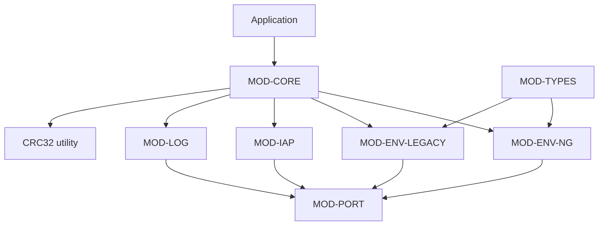

### 3.4 补充架构图表

无补充内容。

## 4. 模块设计

模块设计围绕公共 API、编译期开关、Flash 分区元数据和平台移植接口展开；核心库保持平台无关，端口层承担硬件差异。

### 4.1 核心 API 与初始化模块

#### 4.1.1 模块定位与源码/产物范围

核心模块提供公共头文件契约、初始化入口、错误码、配置宏和 CRC32 工具。

覆盖 easyflash.c、easyflash.h、ef_def.h、ef_cfg.h 与 ef_utils.c。

| 文件 | 角色 | 语言 | 备注 |
| --- | --- | --- | --- |
| easyflash/src/easyflash.c | 统一初始化入口 | C | 按端口层、ENV、IAP、Log 顺序初始化。 |
| easyflash/inc/easyflash.h | 公共 API 声明 | C | 按 EF_USING_ENV、EF_USING_IAP、EF_USING_LOG 暴露接口。 |
| easyflash/inc/ef_def.h | 版本、错误码和公共数据定义 | C | 定义 EF_SW_VERSION、EfErrCode、env_node_obj 等。 |
| easyflash/inc/ef_cfg.h | 配置模板 | C | 保留需要用户按平台填值的宏。 |
| easyflash/src/ef_utils.c | CRC32 工具 | C | 提供 ef_calc_crc32。 |

消费输入：
- ef_cfg.h 编译期开关和地址/粒度宏
- ef_port_init 返回的默认 ENV 集合
- 应用层调用 easyflash_init 与公共 API

拥有输出：
- EasyFlash 初始化成功或失败状态
- 公共 API 与错误码契约
- CRC32 计算结果

不负责范围：
- 不直接访问具体 Flash 控制器
- 不实现下载协议或目标平台驱动

#### 4.1.2 配置

核心配置来自 ef_cfg.h，决定功能裁剪、分区基址和 Flash 操作粒度。

| 原型 | 当前/默认值 | 来源 | 含义 |
| --- | --- | --- | --- |
| EF_USING_ENV / EF_USING_IAP / EF_USING_LOG | ENV 默认开启，IAP 和 LOG 在模板中注释关闭 | config_file | 控制 ENV、IAP、Log 源码是否参与编译和初始化。 |
| EF_START_ADDR / ENV_AREA_SIZE / LOG_AREA_SIZE | 模板要求用户定义 | config_file | 定义备份区起始地址，以及 ENV 和 Log 子分区大小。 |
| EF_ERASE_MIN_SIZE / EF_WRITE_GRAN | 模板要求用户定义 | config_file | 约束 Flash 擦除最小单位和写入粒度，是 ENV 与 Log 状态表编码的基础。 |

#### 4.1.3 依赖

核心模块依赖端口初始化，并按编译期开关调用功能模块初始化。

| 名称 | 类型 | 关系 | 用途 | 失败行为 |
| --- | --- | --- | --- | --- |
| 端口初始化 | internal_module | invokes | 获取默认 ENV 集合并完成目标平台资源初始化。 | 端口初始化失败时 easyflash_init 终止后续功能初始化。 |
| ENV 初始化 | internal_module | invokes | EF_USING_ENV 开启时加载或恢复 ENV 分区。 | ENV 初始化失败会导致 easyflash_init 返回错误。 |
| 可选 IAP 与 Log 初始化 | internal_module | invokes | EF_USING_IAP 或 EF_USING_LOG 开启时建立对应运行状态。 | 任一可选模块返回错误会阻止整体初始化成功。 |

#### 4.1.4 数据对象

核心模块拥有公共配置、错误码、ENV 对象和版本信息等跨模块契约。

| 名称 | 类型 | 角色 | 生产方 | 消费方 | 结构/契约 |
| --- | --- | --- | --- | --- | --- |
| ef_cfg.h 配置宏 | C preprocessor macros | 编译期配置契约 | 移植工程或模板配置 | 所有 EasyFlash 源文件 | 功能开关、Flash 起始地址、分区大小、擦写粒度和调试宏。 |
| EfErrCode | enum | 跨模块错误返回码 | ef_def.h | 公共 API、端口层和功能模块 | EF_NO_ERR、EF_ERASE_ERR、EF_READ_ERR、EF_WRITE_ERR、ENV 相关错误等。 |
| ef_env 与 env_node_obj | struct | 默认 ENV 输入和 ENV 节点对象契约 | ef_def.h 与端口层默认表 | ENV 初始化、ENV 对象读取 API | ef_env 保存 key、value、value_len；env_node_obj 保存状态、CRC、名称、长度和地址。 |

#### 4.1.5 对外接口

核心模块对外提供初始化入口、CRC32 工具和公共头文件配置/API 契约。

| 接口名称 | 接口功能描述 | 接口类型 |
| --- | --- | --- |
| easyflash_init | 初始化端口层及按宏启用的 ENV、IAP、Log 组件。 | function |
| ef_calc_crc32 | 提供 CRC32 增量计算工具。 | function |
| easyflash.h / ef_cfg.h / ef_def.h | 定义公共 API、配置宏、版本号、错误码和跨模块数据结构。 | configuration_contract |

##### 4.1.5.1 easyflash_init

原型：EfErrCode easyflash_init(void)

用途：作为应用层使用 EasyFlash 前的统一初始化入口。

位置：easyflash/src/easyflash.c#easyflash_init

无入参。

| 返回名 | 返回类型 | 描述 | 条件 |
| --- | --- | --- | --- |
| result | EfErrCode | 初始化成功时为 EF_NO_ERR，否则返回失败模块传出的错误码。 | 函数返回时。 |

easyflash_init 执行流程

展示核心初始化入口如何串联端口与功能模块。

<!-- diagram-id: MER-IFACE-CORE-INIT -->
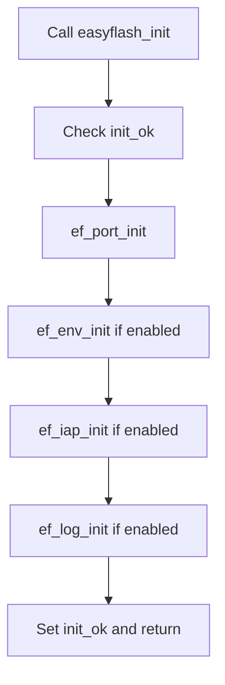

副作用：
- 初始化静态 init_ok 状态
- 调用端口层和可选功能模块初始化
- 输出初始化日志

| 条件 | 行为 |
| --- | --- |
| 端口层或任一功能模块返回错误 | 停止后续成功路径并返回该错误码。 |

使用方：
- 应用层启动代码
- demo 工程

##### 4.1.5.2 ef_calc_crc32

原型：uint32_t ef_calc_crc32(uint32_t crc, const void *buf, size_t size)

用途：为 ENV 节点、legacy 缓存和调用方提供 CRC32 计算能力。

位置：easyflash/src/ef_utils.c#ef_calc_crc32

| 参数名 | 参数类型 | 参数描述 | 输入/输出 |
| --- | --- | --- | --- |
| crc | uint32_t | 初始或前一段 CRC 值。 | input |
| buf | const void * | 待计算数据缓冲区。 | input |
| size | size_t | 待计算字节数。 | input |

| 返回名 | 返回类型 | 描述 | 条件 |
| --- | --- | --- | --- |
| crc32 | uint32_t | 计算后的 CRC32 值。 | 函数返回时。 |

CRC32 计算流程

展示 CRC32 工具的输入输出关系。

<!-- diagram-id: MER-IFACE-CORE-CRC32 -->
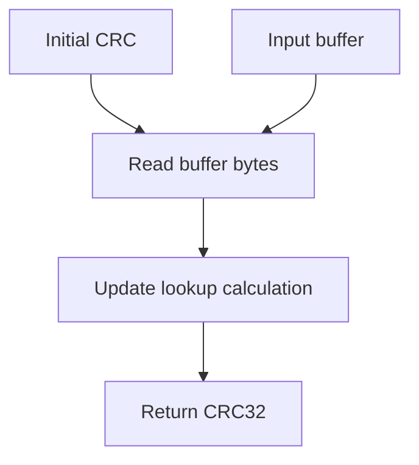

副作用：
- 无持久化副作用

| 条件 | 行为 |
| --- | --- |
| 调用方传入无效缓冲区 | 源码未显式防御，行为依赖 C 运行环境。 |

使用方：
- MOD-ENV-NG
- MOD-ENV-LEGACY
- 应用层可选校验逻辑

##### 4.1.5.3 easyflash.h / ef_cfg.h / ef_def.h

用途：约束编译期开关、公共符号和错误码，供应用、端口层和功能模块共同使用。

位置：easyflash/inc/easyflash.h

契约范围：EasyFlash 公共 C API 和编译配置。

契约位置：easyflash/inc/easyflash.h; easyflash/inc/ef_cfg.h; easyflash/inc/ef_def.h

必填项：按目标平台定义 EF_START_ADDR、按目标 Flash 定义 EF_ERASE_MIN_SIZE 和 EF_WRITE_GRAN、按需启用 EF_USING_ENV、EF_USING_IAP、EF_USING_LOG

约束：
- ENV_AREA_SIZE 和 LOG_AREA_SIZE 必须与擦除粒度对齐
- NG ENV 要求 EF_WRITE_GRAN 为支持值

使用方：
- 应用层
- MOD-ENV-NG
- MOD-IAP
- MOD-LOG
- MOD-PORT

校验行为：部分配置缺失会触发预处理 #error 或运行期 EF_ASSERT。

#### 4.1.6 实现机制说明

核心机制是初始化编排与公共契约聚合：以 init_ok 防止重复初始化，再按宏顺序调用子模块。

| 机制 | 用途 | 输入 | 处理方式 | 输出 | 结构意义 |
| --- | --- | --- | --- | --- | --- |
| 初始化编排 | 确保端口层先就绪，再初始化依赖 Flash 分区的功能模块。 | 应用调用 easyflash_init | 检查 init_ok，调用 ef_port_init，再按宏条件调用 ef_env_init、ef_iap_init、ef_log_init。 | 初始化状态和日志输出 | 统一了使用入口，并将平台初始化放在功能模块之前。 |
| 公共契约聚合 | 让应用和内部模块共享同一套 API、配置宏、错误码和数据结构。 | 公共头文件和配置模板 | 通过预处理宏裁剪接口声明和源码编译路径。 | 统一的 C 头文件契约 | 降低平台移植时跨文件契约不一致的风险。 |

###### 4.1.6.1 初始化编排

**初始化顺序说明**

easyflash_init 先调用 ef_port_init 取得默认 ENV 集合并完成平台资源初始化；只有当前一步返回 EF_NO_ERR 时，才继续初始化已启用的 ENV、IAP 和 Log 模块。函数使用静态 init_ok 标记避免重复初始化。

###### 4.1.6.2 公共契约聚合

**公共契约说明**

easyflash.h 暴露应用可调用 API，并用 EF_USING_ENV、EF_USING_IAP、EF_USING_LOG 条件化声明；ef_def.h 保存版本、错误码与通用结构；ef_cfg.h 是目标工程必须落地的配置模板。

#### 4.1.7 已知限制

核心模块依赖编译期配置正确性，且不提供运行期配置加载。

| 限制 | 影响 | 缓解/后续 |
| --- | --- | --- |
| 仓库根部 ef_cfg.h 含未赋值宏模板，不能直接作为目标平台完整配置使用。 | 缺少实际宏值时编译会失败或断言失败。 | 在目标工程或 demo 配置中按 Flash 规格给出 EF_START_ADDR、EF_ERASE_MIN_SIZE、EF_WRITE_GRAN 和分区大小。 |

### 4.2 端口适配模块

#### 4.2.1 模块定位与源码/产物范围

端口模块是 EasyFlash 与具体 Flash、RTOS、日志输出环境之间的适配层。

覆盖 easyflash/port/ef_port.c 及移植文档定义的端口函数。

| 文件 | 角色 | 语言 | 备注 |
| --- | --- | --- | --- |
| easyflash/port/ef_port.c | 平台移植骨架 | C | 默认函数体为空，需要用户填充。 |
| docs/zh/port.md | 端口契约说明 | Markdown | 说明 Flash 读、擦、写、锁与打印接口。 |

消费输入：
- 目标平台 Flash 驱动
- 默认 ENV 集合定义
- 可选 RTOS 锁或中断控制
- 日志打印输出实现

拥有输出：
- 统一端口函数返回码
- 默认 ENV 集合指针和数量
- 调试和普通打印输出

不负责范围：
- 主库不自带任何具体芯片 Flash 驱动实现
- 不管理下载协议或应用业务锁策略

#### 4.2.2 配置

端口层本身没有独立配置文件，但必须遵守核心 Flash 粒度和分区配置。

| 原型 | 当前/默认值 | 来源 | 含义 |
| --- | --- | --- | --- |
| static const ef_env default_env_set[] | 模板为空数组 | config_file | 定义首次初始化或恢复默认时写入的产品默认环境变量。 |
| ef_port_env_lock / ef_port_env_unlock | 模板为空实现 | config_file | 为 ENV 缓存和 Flash 元数据操作提供并发保护。 |

#### 4.2.3 依赖

端口模块依赖目标平台提供真实 Flash 操作和输出能力。

| 名称 | 类型 | 关系 | 用途 | 失败行为 |
| --- | --- | --- | --- | --- |
| 目标 Flash 驱动 | external_service | uses | 实现 ef_port_read、ef_port_erase、ef_port_write。 | 读写擦任一失败会向上返回 EF_READ_ERR、EF_ERASE_ERR 或 EF_WRITE_ERR。 |
| 同步与打印环境 | external_service | uses | 在多任务环境保护 ENV 操作，并输出调试日志。 | 锁为空实现时多线程调用需由应用自行保证互斥。 |

#### 4.2.4 数据对象

端口层持有默认 ENV 表，并通过参数传回核心模块。

| 名称 | 类型 | 角色 | 生产方 | 消费方 | 结构/契约 |
| --- | --- | --- | --- | --- | --- |
| default_env_set | static const ef_env[] | 默认环境变量集合 | 目标工程移植文件 | easyflash_init 和 ENV 初始化 | 每项包含 key、value、value_len；字符串默认值可用 value_len 为 0 表示自动计算长度。 |
| Flash 读写缓冲参数 | addr + uint32_t buffer + size | 硬件访问调用契约 | EasyFlash 内部模块 | 端口层读写擦实现 | 读写接口以 uint32_t 缓冲区承载数据，size 使用字节数。 |

#### 4.2.5 对外接口

端口模块对主库暴露一组必须由用户移植实现的回调函数。

| 接口名称 | 接口功能描述 | 接口类型 |
| --- | --- | --- |
| ef_port_read / ef_port_erase / ef_port_write | Flash 读、擦、写适配接口。 | library_api |
| ef_port_init / lock / unlock / print | 端口初始化、ENV 互斥和打印输出接口。 | library_api |

##### 4.2.5.1 ef_port_read / ef_port_erase / ef_port_write

原型：EfErrCode ef_port_read(uint32_t addr, uint32_t *buf, size_t size); EfErrCode ef_port_erase(uint32_t addr, size_t size); EfErrCode ef_port_write(uint32_t addr, const uint32_t *buf, size_t size)

用途：把 EasyFlash 的物理 Flash 访问请求转交目标平台驱动。

位置：easyflash/port/ef_port.c

| 参数名 | 参数类型 | 参数描述 | 输入/输出 |
| --- | --- | --- | --- |
| addr | uint32_t | Flash 访问起始地址。 | input |
| buf | uint32_t * | 读写数据缓冲区。 | input/output |
| size | size_t | 访问字节数。 | input |

| 返回名 | 返回类型 | 描述 | 条件 |
| --- | --- | --- | --- |
| result | EfErrCode | 平台操作成功或失败码。 | 端口函数返回时。 |

端口 Flash 访问流程

展示内部模块如何通过端口层访问目标 Flash。

<!-- diagram-id: MER-IFACE-PORT-FLASH -->
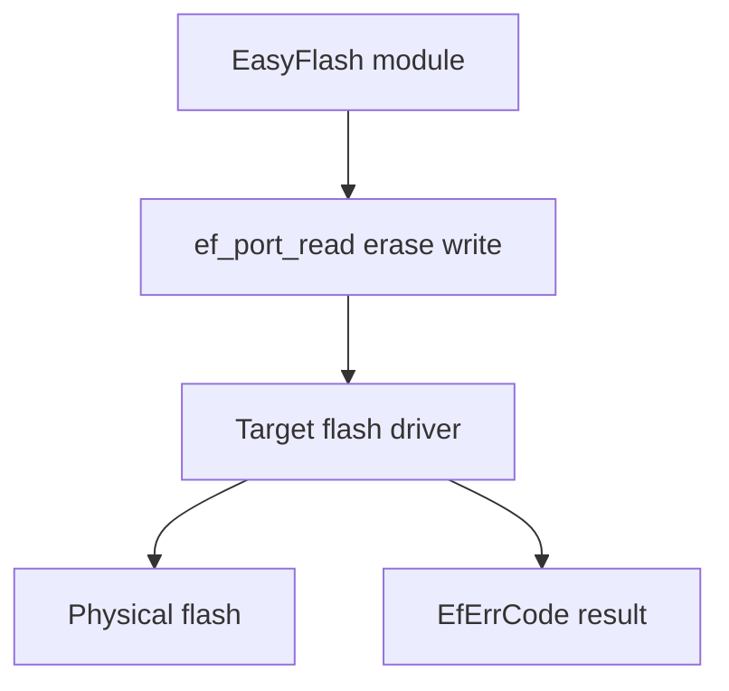

副作用：
- 读接口填充缓冲区
- 擦除和写入会改变目标 Flash 内容

| 条件 | 行为 |
| --- | --- |
| 底层 Flash 操作失败 | 端口层应返回对应 EfErrCode，调用方中止或进入恢复路径。 |

使用方：
- MOD-ENV-NG
- MOD-ENV-LEGACY
- MOD-IAP
- MOD-LOG

##### 4.2.5.2 ef_port_init / lock / unlock / print

原型：EfErrCode ef_port_init(ef_env const **default_env, size_t *default_env_size); void ef_port_env_lock(void); void ef_port_env_unlock(void); void ef_log_info(const char *format, ...)

用途：初始化平台资源、传出默认 ENV 集合，并提供互斥和输出能力。

位置：easyflash/port/ef_port.c

| 参数名 | 参数类型 | 参数描述 | 输入/输出 |
| --- | --- | --- | --- |
| default_env | ef_env const ** | 返回默认 ENV 集合地址。 | output |
| default_env_size | size_t * | 返回默认 ENV 项数量。 | output |

| 返回名 | 返回类型 | 描述 | 条件 |
| --- | --- | --- | --- |
| result | EfErrCode | 端口初始化成功或失败状态。 | ef_port_init 返回时。 |

端口初始化与锁输出流程

展示端口层非 Flash 访问接口的责任。

<!-- diagram-id: MER-IFACE-PORT-INIT -->
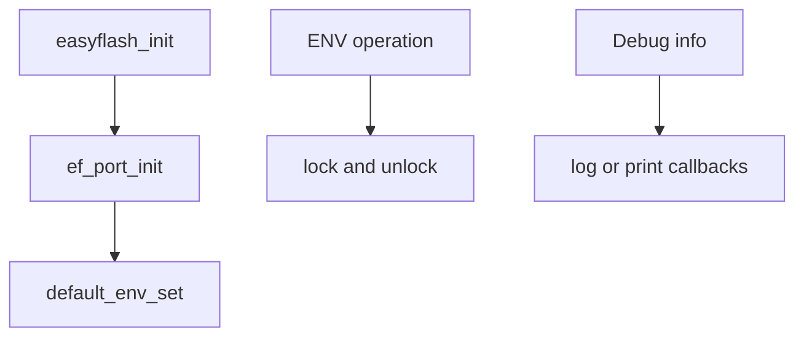

副作用：
- 可能初始化平台资源
- 可能进入或退出临界区
- 可能输出日志

| 条件 | 行为 |
| --- | --- |
| 端口初始化失败 | easyflash_init 不继续初始化功能模块。 |

使用方：
- MOD-CORE
- MOD-ENV-NG
- MOD-ENV-LEGACY

#### 4.2.6 实现机制说明

端口机制是反向控制：主库固定调用端口函数，平台工程在端口文件中填入具体驱动逻辑。

| 机制 | 用途 | 输入 | 处理方式 | 输出 | 结构意义 |
| --- | --- | --- | --- | --- | --- |
| 平台适配反转 | 隔离不同 MCU、片外 Flash 或 OS 的实现差异。 | 主库传入的地址、缓冲区、长度和日志格式化参数 | 端口函数映射到目标平台 Flash 驱动、锁或输出函数。 | 统一 EfErrCode 或日志输出 | 让 ENV/IAP/Log 共享同一物理访问边界。 |

###### 4.2.6.1 平台适配反转

**端口适配说明**

端口文件中的 Flash 读、擦、写、锁和打印函数由目标工程实现。主库不直接依赖具体芯片寄存器或驱动库，只以 EfErrCode 判断端口调用结果。

#### 4.2.7 已知限制

端口骨架本身不可直接用于真实设备。

| 限制 | 影响 | 缓解/后续 |
| --- | --- | --- |
| 仓库默认 ef_port.c 中核心端口函数为空实现。 | 未经移植时读写擦不会真正操作 Flash，功能行为不可信。 | 参考 docs/zh/port.md 和 demo 中对应平台端口实现，补齐 Flash 驱动、锁和输出函数。 |

### 4.3 ENV NG 模块

#### 4.3.1 模块定位与源码/产物范围

ENV NG 模块以 Flash 扇区为单位存放 sector header 和 ENV node，使用状态表实现单向状态迁移、掉电恢复和垃圾回收。

覆盖 easyflash/src/ef_env.c 及 V4.0 ENV 设计文档中描述的 NG 存储算法。

| 文件 | 角色 | 语言 | 备注 |
| --- | --- | --- | --- |
| easyflash/src/ef_env.c | ENV NG 实现 | C | 未定义 EF_ENV_USING_LEGACY_MODE 时启用。 |
| docs/zh/design.md | ENV NG 设计说明 | Markdown | 描述扇区状态、ENV 状态、GC 与数据结构。 |

消费输入：
- 默认 ENV 集
- ENV API key/value 入参
- EF_WRITE_GRAN、ENV_AREA_SIZE、EF_ERASE_MIN_SIZE
- 端口层 Flash 读写擦和锁

拥有输出：
- ENV 分区 sector header
- ENV 节点 header、key 和 value
- ENV 缓存表更新结果
- ENV 读取和打印输出

不负责范围：
- 当前源码中超单扇区大数据模式尚未实现
- 不直接支持加密或压缩落地实现

#### 4.3.2 配置

ENV NG 的配置决定分区容量、写入粒度、状态表编码、缓存规模和 GC 触发阈值。

| 原型 | 当前/默认值 | 来源 | 含义 |
| --- | --- | --- | --- |
| EF_WRITE_GRAN | 模板要求用户定义；源码支持 1、8、32、64 | config_file | 决定状态表编码和数据写入对齐宽度。 |
| ENV_AREA_SIZE | 模板要求用户定义 | config_file | 定义 ENV 分区总容量，至少需要两个擦除扇区以支持 GC。 |
| EF_ENV_CACHE_TABLE_SIZE / EF_SECTOR_CACHE_TABLE_SIZE | 16 / 4 | default | 启用 ENV 名称缓存和使用中扇区空闲地址缓存，提高查找和写入速度。 |
| EF_ENV_AUTO_UPDATE / EF_ENV_VER_NUM | 默认关闭；版本号模板提示用户定义 | config_file | 版本变化时按默认 ENV 集追加新增键。 |

#### 4.3.3 依赖

ENV NG 依赖核心配置、端口层 Flash 操作和 CRC32 工具。

| 名称 | 类型 | 关系 | 用途 | 失败行为 |
| --- | --- | --- | --- | --- |
| 端口层 Flash 操作 | internal_module | invokes | 读取扇区和 ENV header，擦除扇区，写入状态表、key 与 value。 | 端口错误会导致 ENV 初始化、读取、写入或 GC 返回错误。 |
| CRC32 工具 | internal_module | invokes | 校验 ENV 节点 name_len、value_len、name 和 value 数据完整性。 | CRC 不匹配时节点被视为读取错误或进入恢复处理。 |

#### 4.3.4 数据对象

ENV NG 的结构数据集中在扇区头、ENV 节点头、运行时元数据对象和可选缓存表。

| 名称 | 类型 | 角色 | 生产方 | 消费方 | 结构/契约 |
| --- | --- | --- | --- | --- | --- |
| sector_hdr_data / sector_meta_data | struct | 扇区元数据 | format_sector、read_sector_meta_data | 分配、GC、恢复和打印统计 | 包含 store/dirty 状态表、magic、combined、remain 和 empty_env 等信息。 |
| env_hdr_data / env_node_obj | struct | ENV 节点元数据和读取对象 | create_env_blob、read_env | 查找、读取、移动、删除和打印 | 包含 ENV 状态表、KV magic、节点总长、CRC32、name_len、value_len、name 和 value 地址。 |
| env_cache_table / sector_cache_table | static arrays | 查找和写入加速缓存 | find_env、read_sector_meta_data、create_env_blob | 后续 ENV 查找和扇区空闲地址定位 | ENV 缓存以名称 CRC 低 16 位和地址保存；扇区缓存保存扇区起点与 empty_addr。 |

#### 4.3.5 对外接口

ENV NG 在公共头文件下实现 blob API、兼容字符串 API、对象读取、删除、默认恢复、加载和打印接口。

| 接口名称 | 接口功能描述 | 接口类型 |
| --- | --- | --- |
| ENV 读取 API 组 | 按 key 读取 blob、字符串或 ENV 对象。 | library_api |
| ENV 写入与删除 API 组 | 设置 blob 或字符串 ENV，删除 ENV，并兼容旧保存接口。 | library_api |
| ENV 维护 API 组 | 加载、恢复默认、打印 ENV 和读取写入统计。 | library_api |

##### 4.3.5.1 ENV 读取 API 组

原型：size_t ef_get_env_blob(const char *key, void *value_buf, size_t buf_len, size_t *saved_value_len); bool ef_get_env_obj(const char *key, env_node_obj_t env)

用途：按 key 查找 ENV，并将值复制到调用方缓冲区或返回节点对象。

位置：easyflash/src/ef_env.c

| 参数名 | 参数类型 | 参数描述 | 输入/输出 |
| --- | --- | --- | --- |
| key | const char * | ENV 名称。 | input |
| value_buf | void * | 保存读取值的调用方缓冲区。 | output |
| buf_len | size_t | 缓冲区长度。 | input |

| 返回名 | 返回类型 | 描述 | 条件 |
| --- | --- | --- | --- |
| read_len | size_t | 实际复制到缓冲区的字节数；未找到时为 0。 | 读取完成后。 |

ENV NG 读取流程

展示 ENV 读取如何经过锁、缓存、遍历和端口读取。

<!-- diagram-id: MER-IFACE-ENVNG-READ -->
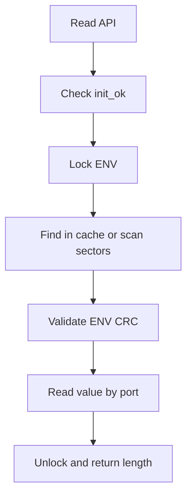

副作用：
- 可能更新 ENV 查找缓存活跃度
- 读取 Flash 内容到调用方缓冲区

| 条件 | 行为 |
| --- | --- |
| ENV 未初始化 | 输出提示并返回 0 或 false。 |
| CRC 校验失败或 key 不存在 | 不返回有效值，saved_value_len 可被置为 0。 |

使用方：
- 应用层
- MOD-TYPES

##### 4.3.5.2 ENV 写入与删除 API 组

原型：EfErrCode ef_set_env_blob(const char *key, const void *value_buf, size_t buf_len); EfErrCode ef_del_env(const char *key)

用途：新增、修改或删除 Flash 中的 ENV 节点。

位置：easyflash/src/ef_env.c

| 参数名 | 参数类型 | 参数描述 | 输入/输出 |
| --- | --- | --- | --- |
| key | const char * | ENV 名称。 | input |
| value_buf | const void * | 待写入值；为 NULL 时按删除处理。 | input |
| buf_len | size_t | 待写入值长度。 | input |

| 返回名 | 返回类型 | 描述 | 条件 |
| --- | --- | --- | --- |
| result | EfErrCode | 写入、删除或空间分配结果。 | API 返回时。 |

ENV NG 写入流程

展示 set_env 的新节点分配、旧节点预删除、写入和 GC。

<!-- diagram-id: MER-IFACE-ENVNG-WRITE -->
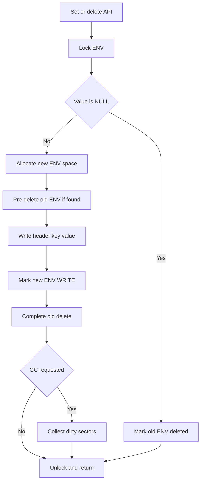

副作用：
- 写入 Flash ENV 节点和状态表
- 可能标记旧节点删除
- 可能触发 GC 并擦除脏扇区

| 条件 | 行为 |
| --- | --- |
| key 过长或 ENV 空间不足 | 返回 EF_ENV_NAME_ERR 或 EF_ENV_FULL。 |
| 端口写入或擦除失败 | 返回端口错误，旧节点在预删除状态下可由恢复流程处理。 |

使用方：
- 应用层
- MOD-TYPES
- 自动更新流程

##### 4.3.5.3 ENV 维护 API 组

原型：EfErrCode ef_load_env(void); EfErrCode ef_env_set_default(void); void ef_print_env(void); EfErrCode ef_save_env(void)

用途：加载和恢复 ENV 分区，格式化默认 ENV，打印 ENV，并兼容旧保存接口。

位置：easyflash/src/ef_env.c

维护 API 组中的主要函数无业务入参。

| 返回名 | 返回类型 | 描述 | 条件 |
| --- | --- | --- | --- |
| result | EfErrCode | 加载、恢复或兼容保存结果。 | API 返回时。 |

ENV NG 维护流程

展示加载时的扇区检查、GC 恢复和默认 ENV 恢复。

<!-- diagram-id: MER-IFACE-ENVNG-MAINTAIN -->
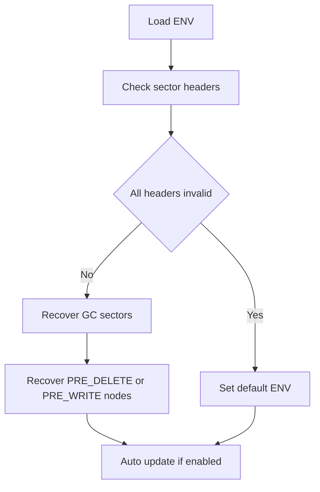

副作用：
- 可能格式化 ENV 分区
- 可能移动 ENV 节点或继续 GC
- ef_print_env 会输出当前 ENV 列表

| 条件 | 行为 |
| --- | --- |
| 所有扇区头校验失败 | 恢复为默认 ENV 集。 |
| 发现未完成写入或删除状态 | 标记错误或移动有效旧节点进行恢复。 |

使用方：
- MOD-CORE
- 应用层维护命令

#### 4.3.6 实现机制说明

ENV NG 机制由状态表、顺序追加、旧节点标记删除、GC 搬移和启动恢复构成。

| 机制 | 用途 | 输入 | 处理方式 | 输出 | 结构意义 |
| --- | --- | --- | --- | --- | --- |
| 状态表单向迁移 | 在不擦除的前提下记录扇区和 ENV 节点生命周期。 | store/dirty/env 状态目标值 | 按 EF_WRITE_GRAN 把状态表从 0xFF 逐步写 0。 | 可从 Flash header 反推的状态值 | 支撑掉电恢复和脏扇区识别。 |
| GC 搬移与扇区回收 | 在空扇区不足时回收包含已删除节点的脏扇区。 | 脏扇区和仍有效的 ENV 节点 | 将有效节点 move_env 到新位置，再 format_sector 擦除旧扇区。 | 新增空扇区和保留的有效 ENV | 实现磨损平衡和空间复用。 |
| 启动恢复 | 在启动时修复断电留下的中间状态。 | Flash 上的扇区 header 和 ENV node 状态 | 检查扇区 magic、恢复 GC 状态、移动 PRE_DELETE 有效节点、标记未完成 PRE_WRITE。 | 一致的 ENV 分区状态 | 保证掉电保护能力。 |

###### 4.3.6.1 状态表单向迁移

**状态编码说明**

扇区使用 store 状态表示 unused、empty、using、full，dirty 状态表示 clean、dirty、gc；ENV 节点状态表示 pre-write、write、pre-delete、deleted 和 header error。状态写入只做位或字节从 1 到 0 的变化，避免频繁擦除。

###### 4.3.6.2 GC 搬移与扇区回收

**GC 说明**

写入新 ENV 时优先使用 using 扇区，空扇区数量低于阈值或分配失败时触发 gc_request。GC 遍历 dirty 或 GC 状态扇区，把仍有效的 ENV 节点搬移到新位置，然后格式化旧扇区。

###### 4.3.6.3 启动恢复

**恢复说明**

ef_load_env 在 in_recovery_check 下先检查所有扇区头，必要时恢复默认 ENV；随后恢复处于 GC 的扇区，并处理 PRE_DELETE 与 PRE_WRITE 节点，避免断电中间状态破坏可读 ENV。

#### 4.3.7 已知限制

ENV NG 有明确的 Flash 特性和单节点尺寸限制。

| 限制 | 影响 | 缓解/后续 |
| --- | --- | --- |
| 当前 create_env_blob 在 ENV 节点长度超过单扇区可用空间时返回 EF_ENV_FULL。 | README 中提及的大数据跨扇区模式在当前源码中不是可用能力。 | 大数据需求需等待实现或采用应用层分片方案。 |
| NG 模式依赖 Flash 可按状态表单向写入，部分 Flash 不适用。 | 例如文档提到 STM32L4 片内 Flash 不适合使用 NG 模式。 | 在不满足写入特性的 Flash 上使用 legacy/V3 兼容路径或更换存储介质。 |

### 4.4 ENV legacy 兼容模块

#### 4.4.1 模块定位与源码/产物范围

legacy 模块保留 V3 风格字符串 ENV 实现，通过 RAM 缓存统一保存到 Flash，并提供可选写平衡和掉电保护路径。

覆盖 ef_env_legacy.c 和 ef_env_legacy_wl.c，两者由 EF_ENV_USING_WL_MODE 决定选择。

| 文件 | 角色 | 语言 | 备注 |
| --- | --- | --- | --- |
| easyflash/src/ef_env_legacy.c | legacy 普通模式实现 | C | EF_ENV_USING_LEGACY_MODE 且未启用 WL 时使用。 |
| easyflash/src/ef_env_legacy_wl.c | legacy 写平衡模式实现 | C | EF_ENV_USING_WL_MODE 时使用。 |

消费输入：
- ENV_USER_SETTING_SIZE
- ENV_AREA_SIZE
- legacy 字符串 ENV API 调用
- 端口层 Flash 读写擦

拥有输出：
- RAM 中 env_cache
- legacy ENV 系统段和数据段内容
- 可选 PFS 双区保存记录

不负责范围：
- 不支持 NG blob 节点元数据模型
- 不推荐新项目继续采用

#### 4.4.2 配置

legacy 配置集中在兼容模式、RAM 缓存大小、写平衡和掉电保护宏。

| 原型 | 当前/默认值 | 来源 | 含义 |
| --- | --- | --- | --- |
| EF_ENV_USING_LEGACY_MODE | 默认未定义 | config_file | 启用 legacy ENV 实现并排除 NG 实现。 |
| EF_ENV_USING_WL_MODE / EF_ENV_USING_PFS_MODE | 默认未定义 | config_file | 控制 legacy 写平衡模式和双区掉电保护模式。 |
| ENV_USER_SETTING_SIZE | legacy 模式要求用户定义 | config_file | 定义 RAM ENV 缓存大小和用户 ENV 容量。 |

#### 4.4.3 依赖

legacy 模块依赖端口层和 CRC32 工具。

| 名称 | 类型 | 关系 | 用途 | 失败行为 |
| --- | --- | --- | --- | --- |
| 端口层 Flash 操作 | internal_module | invokes | 读取、擦除和写入 legacy ENV 缓存区域。 | 保存失败时返回端口错误，WL 模式会尝试移动到下一个可用位置。 |
| CRC32 工具 | internal_module | invokes | 保存前计算 env_cache CRC，加载时校验完整性。 | CRC 不匹配时恢复默认 ENV 或选择有效 PFS 区。 |

#### 4.4.4 数据对象

legacy 数据模型以 RAM 缓存和 Flash 系统段/数据段为核心。

| 名称 | 类型 | 角色 | 生产方 | 消费方 | 结构/契约 |
| --- | --- | --- | --- | --- | --- |
| env_cache | uint32_t[] | legacy ENV RAM 缓存 | ef_load_env、ef_set_env、ef_del_env | ef_get_env、ef_save_env、CRC 校验 | 前部保存 end_addr、saved_count、version、CRC 等参数，后部保存 key=value\0 字符串数据。 |
| cur_using_data_addr / next_save_area_addr | uint32_t | 写平衡与 PFS 地址游标 | legacy WL 初始化和保存流程 | ef_save_env 和加载选择逻辑 | 系统段保存当前使用数据段地址，PFS 下维护双区保存计数和下一保存区。 |

#### 4.4.5 对外接口

legacy 模块复用 ENV 公共 API 名称，主要面向字符串 ENV 兼容。

| 接口名称 | 接口功能描述 | 接口类型 |
| --- | --- | --- |
| legacy ENV API 组 | ef_load_env、ef_get_env、ef_set_env、ef_del_env、ef_save_env 等兼容接口。 | library_api |

##### 4.4.5.1 legacy ENV API 组

原型：char *ef_get_env(const char *key); EfErrCode ef_set_env(const char *key, const char *value); EfErrCode ef_save_env(void)

用途：以旧版本字符串 ENV 方式在 RAM 缓存中增删改查，并由 save 接口统一写回 Flash。

位置：easyflash/src/ef_env_legacy.c

| 参数名 | 参数类型 | 参数描述 | 输入/输出 |
| --- | --- | --- | --- |
| key | const char * | 环境变量名称。 | input |
| value | const char * | 字符串环境变量值。 | input |

| 返回名 | 返回类型 | 描述 | 条件 |
| --- | --- | --- | --- |
| result | EfErrCode 或 char * | 设置保存结果或字符串值指针。 | API 返回时。 |

legacy ENV 保存流程

展示 legacy API 从 RAM 缓存到 Flash 保存的流程。

<!-- diagram-id: MER-IFACE-LEGACY-ENV -->
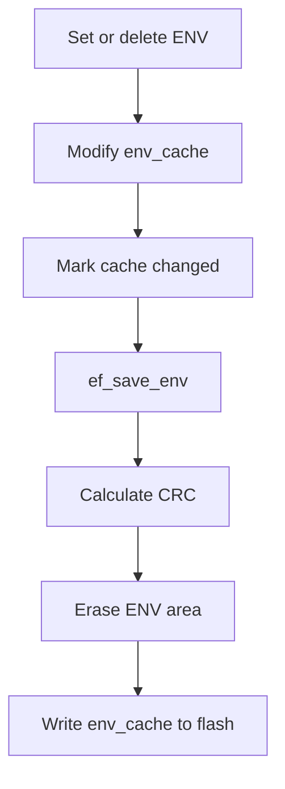

副作用：
- 修改 RAM 缓存
- ef_save_env 会擦写 ENV 区或 WL 当前数据段

| 条件 | 行为 |
| --- | --- |
| 缓存空间不足或 Flash 保存失败 | 返回 EF_ENV_FULL、EF_ERASE_ERR 或 EF_WRITE_ERR。 |

使用方：
- 旧应用代码
- MOD-TYPES

#### 4.4.6 实现机制说明

legacy 机制是 RAM 缓存修改后批量保存；WL 模式在保存失败或空间前进时移动当前数据段地址。

| 机制 | 用途 | 输入 | 处理方式 | 输出 | 结构意义 |
| --- | --- | --- | --- | --- | --- |
| RAM 缓存批量保存 | 简化旧版 ENV 字符串管理。 | key/value 修改和 env_cache_changed 标记 | 修改 RAM 中 key=value 数据，计算 CRC，擦除并写回 ENV 区。 | Flash 上完整 legacy ENV 镜像 | 与 NG 的顺序追加不同，legacy 依赖完整缓存镜像。 |
| legacy 写平衡和掉电保护 | 在 legacy 模式下减少固定位置磨损，并在 PFS 下保留双区有效副本。 | 当前数据段地址、保存计数、保存结果 | 保存失败时按擦除粒度移动数据段，PFS 下切换 area0/area1 并用保存计数判定新旧。 | 新的当前使用数据段地址或有效 PFS 区 | 在旧模型中补偿全量擦写的可靠性与寿命问题。 |

###### 4.4.6.1 RAM 缓存批量保存

**legacy 缓存说明**

普通 legacy 模式把 ENV 参数和 key=value 数据全部放在 env_cache 中。增删改先修改缓存并置 env_cache_changed，ef_save_env 再擦除对应区域并写入完整缓存。

###### 4.4.6.2 legacy 写平衡和掉电保护

**legacy WL/PFS 说明**

写平衡版本把系统段与数据段分离，通过保存当前数据段地址来选择有效镜像；擦写失败时向后移动一个擦除粒度。PFS 模式下数据段按双区组织，保存时切换当前区并增加保存计数。

#### 4.4.7 已知限制

legacy 模式保留兼容价值，但资源和寿命表现不如 NG。

| 限制 | 影响 | 缓解/后续 |
| --- | --- | --- |
| 文档说明 legacy 已废弃且不建议继续使用。 | 新项目继续采用会承担更高 RAM 占用和整区擦写成本。 | 优先使用 ENV NG；仅在 Flash 写入特性不适合 NG 时考虑 legacy/V3 路径。 |

### 4.5 IAP 模块

#### 4.5.1 模块定位与源码/产物范围

IAP 模块计算备份应用区起始地址，并提供擦除备份区、写入下载数据、擦除/拷贝用户应用和 Bootloader 的辅助函数。

覆盖 easyflash/src/ef_iap.c 和公共头文件中的 IAP API 声明。

| 文件 | 角色 | 语言 | 备注 |
| --- | --- | --- | --- |
| easyflash/src/ef_iap.c | IAP 辅助 API 实现 | C | 仅在 EF_USING_IAP 启用时编译。 |
| demo/iap/README.md | IAP demo 使用说明 | Markdown | 说明 Ymodem + RT-Thread demo 场景。 |

消费输入：
- EF_START_ADDR、ENV_AREA_SIZE、LOG_AREA_SIZE
- 应用或 Bootloader 目标地址和大小
- 下载到备份区的数据分片
- 可选用户指定 erase/write 函数

拥有输出：
- bak_app_start_addr
- 备份区写入进度
- 目标应用区或 Bootloader 写入结果

不负责范围：
- 不实现通信下载协议
- 不决定何时跳转或重启
- 不在源码 IAP 拷贝流程中自动执行 CRC 校验

#### 4.5.2 配置

IAP 的地址布局由已启用的 ENV 和 Log 分区大小推导。

| 原型 | 当前/默认值 | 来源 | 含义 |
| --- | --- | --- | --- |
| EF_USING_IAP | 模板中注释关闭 | config_file | 控制 IAP API 是否参与编译和初始化。 |
| EF_START_ADDR + optional ENV_AREA_SIZE + optional LOG_AREA_SIZE | 运行时计算 | computed | 确定下载应用备份区的起始地址。 |

#### 4.5.3 依赖

IAP 依赖端口层擦写读接口，并与分区配置共享地址布局。

| 名称 | 类型 | 关系 | 用途 | 失败行为 |
| --- | --- | --- | --- | --- |
| 端口层 Flash 操作 | internal_module | invokes | 擦除备份区、写入备份区、读取备份区并写入目标区域。 | 返回 EF_ERASE_ERR 或 EF_WRITE_ERR 并输出警告。 |
| 备份区分区配置 | data_object | uses | 根据 ENV 和 Log 分区大小推导 IAP 备份区起点。 | 分区宏不正确会导致备份区覆盖其他数据或目标区域。 |

#### 4.5.4 数据对象

IAP 的持久结构很少，主要维护备份应用起始地址和调用方写入进度。

| 名称 | 类型 | 角色 | 生产方 | 消费方 | 结构/契约 |
| --- | --- | --- | --- | --- | --- |
| bak_app_start_addr | static uint32_t | IAP 备份区运行时地址 | ef_iap_init | IAP 擦除、写入和拷贝 API | 从 EF_START_ADDR 开始，按已启用 ENV 和 Log 分区顺序偏移。 |
| IAP copy buffer | uint32_t[32] | 备份区到目标区的拷贝缓冲 | ef_copy_spec_app_from_bak / ef_copy_bl_from_bak | 目标区域写入函数 | 循环中每次从备份区读取 32 words 再写入目标地址。 |

#### 4.5.5 对外接口

IAP 公开备份区擦写、用户区/Bootloader 擦除、备份拷贝和备份地址查询 API。

| 接口名称 | 接口功能描述 | 接口类型 |
| --- | --- | --- |
| IAP 升级 API 组 | ef_erase_bak_app、ef_write_data_to_bak、ef_copy_app_from_bak 等。 | library_api |

##### 4.5.5.1 IAP 升级 API 组

原型：EfErrCode ef_write_data_to_bak(uint8_t *data, size_t size, size_t *cur_size, size_t total_size); EfErrCode ef_copy_app_from_bak(uint32_t user_app_addr, size_t app_size)

用途：辅助 Bootloader 或升级流程把下载固件保存到备份区，并复制到应用或 Bootloader 目标区。

位置：easyflash/src/ef_iap.c

| 参数名 | 参数类型 | 参数描述 | 输入/输出 |
| --- | --- | --- | --- |
| data | uint8_t * | 下载得到的应用数据分片。 | input |
| cur_size | size_t * | 当前已写入备份区的累计大小。 | input/output |
| user_app_addr | uint32_t | 用户应用目标入口地址。 | input |

| 返回名 | 返回类型 | 描述 | 条件 |
| --- | --- | --- | --- |
| result | EfErrCode | 擦除、写入或拷贝结果。 | API 返回时。 |

IAP 升级辅助流程

展示 IAP API 组的典型下载和拷贝路径。

<!-- diagram-id: MER-IFACE-IAP-UPGRADE -->
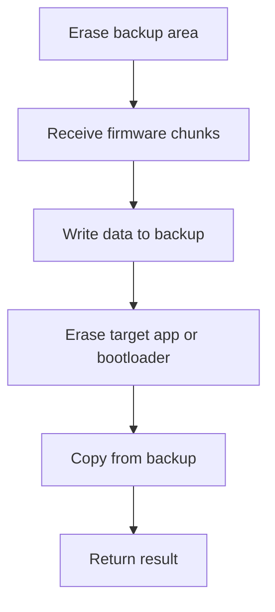

副作用：
- 擦除备份区或目标区
- 写入备份区和目标应用/Bootloader 区
- 更新 cur_size

| 条件 | 行为 |
| --- | --- |
| 擦除或写入失败 | 返回端口错误并输出警告，调用方应中止升级。 |
| 写入分片超过 total_size | 源码会裁剪本次写入大小以不超过 total_size。 |

使用方：
- Bootloader
- 应用升级管理逻辑
- demo/iap

#### 4.5.6 实现机制说明

IAP 机制是地址推导和固定缓冲拷贝；擦写行为全部委托端口层或用户指定函数。

| 机制 | 用途 | 输入 | 处理方式 | 输出 | 结构意义 |
| --- | --- | --- | --- | --- | --- |
| 备份区地址推导 | 在统一备份区布局中定位下载应用区。 | EF_START_ADDR、ENV_AREA_SIZE、LOG_AREA_SIZE 和功能宏 | 从 EF_START_ADDR 起按已启用 ENV、Log 分区依次偏移。 | bak_app_start_addr | 保证 IAP 不覆盖 ENV 和 Log 分区。 |
| 备份区拷贝 | 把已下载到备份区的应用或 Bootloader 写入目标地址。 | 备份区数据、目标地址、应用大小和写函数 | 循环读取固定缓冲并写入目标区域。 | 目标 Flash 区域内容 | 把下载保存和最终覆盖动作分离。 |

###### 4.5.6.1 备份区地址推导

**IAP 地址推导说明**

ef_iap_init 先把 bak_app_start_addr 置为 EF_START_ADDR；如果启用了 ENV，则加上 ENV_AREA_SIZE；如果启用了 Log，则继续加上 LOG_AREA_SIZE。IAP 备份区因此位于 ENV 与 Log 分区之后。

###### 4.5.6.2 备份区拷贝

**IAP 拷贝说明**

拷贝 API 使用 32 words 缓冲，从备份区按 app_size 循环读取并写入目标地址。默认版本调用 ef_port_write，也提供 spec 版本接收用户指定写函数以适配不同 Flash。

#### 4.5.7 已知限制

IAP API 只提供 Flash 操作辅助，不覆盖完整升级策略。

| 限制 | 影响 | 缓解/后续 |
| --- | --- | --- |
| API 文档提示不要在应用或 Bootloader 中擦除和拷贝自身。 | 错误调用上下文可能破坏正在运行的固件区域。 | 由 Bootloader 与应用明确职责边界，升级前校验目标地址和执行上下文。 |
| IAP 拷贝源码未在拷贝前后执行内置 CRC 校验。 | 下载完整性需要由调用方或协议层补充，否则可能写入损坏固件。 | 使用 ef_calc_crc32 或协议校验在写入和拷贝前确认镜像有效。 |

### 4.6 Flash Log 模块

#### 4.6.1 模块定位与源码/产物范围

Log 模块把日志分区抽象成 Flash 环形缓冲，使用每扇区 header 记录 empty、using、full 状态。

覆盖 easyflash/src/ef_log.c 和公共头文件中的日志 API。

| 文件 | 角色 | 语言 | 备注 |
| --- | --- | --- | --- |
| easyflash/src/ef_log.c | Flash Log 实现 | C | 仅在 EF_USING_LOG 启用时编译。 |
| demo/log/easylogger.c | EasyLogger 集成示例 | C | 示例不属于主库运行时必需模块。 |

消费输入：
- LOG_AREA_SIZE、EF_ERASE_MIN_SIZE
- 日志写入缓冲区和读取索引
- 端口层 Flash 读写擦

拥有输出：
- log_start_addr 和 log_end_addr
- 扇区日志 header
- Flash 日志数据与容量统计

不负责范围：
- 不提供日志格式化和级别过滤
- 不提供文件系统抽象

#### 4.6.2 配置

Log 配置包括功能开关、日志分区大小和擦除粒度。

| 原型 | 当前/默认值 | 来源 | 含义 |
| --- | --- | --- | --- |
| EF_USING_LOG | 模板中注释关闭 | config_file | 控制 Flash Log 模块是否编译和初始化。 |
| LOG_AREA_SIZE | 使用日志功能时要求用户定义 | config_file | 定义日志环形缓冲分区大小，需为擦除粒度整数倍且至少两个扇区。 |

#### 4.6.3 依赖

Log 模块依赖端口层 Flash 操作和分区配置。

| 名称 | 类型 | 关系 | 用途 | 失败行为 |
| --- | --- | --- | --- | --- |
| 端口层 Flash 操作 | internal_module | invokes | 读取扇区 header、追加日志、擦除循环覆盖扇区。 | header 读取失败或写入失败时返回 EF_READ_ERR/EF_WRITE_ERR。 |
| 分区配置 | data_object | uses | 计算日志分区起始地址、总扇区数和环形地址。 | 配置不满足断言时初始化失败或进入断言。 |

#### 4.6.4 数据对象

Log 模块的数据对象包括扇区 header 状态、环形游标和日志数据区域。

| 名称 | 类型 | 角色 | 生产方 | 消费方 | 结构/契约 |
| --- | --- | --- | --- | --- | --- |
| Log sector header | 3 words header | 日志扇区状态记录 | write_sector_status、ef_log_clean、ef_log_write | find_start_and_end_addr、ef_log_write | 包含 LOG_SECTOR_MAGIC、USING magic、FULL magic；状态从 empty 到 using 到 full。 |
| log_start_addr / log_end_addr | static uint32_t | 日志环形缓冲起止游标 | ef_log_init、find_start_and_end_addr、ef_log_write、ef_log_clean | ef_log_read、ef_log_write、容量查询 | start 表示最早日志位置，end 表示下次写入位置；可跨分区尾部回绕。 |

#### 4.6.5 对外接口

Log 模块公开日志读、写、清理和容量查询 API。

| 接口名称 | 接口功能描述 | 接口类型 |
| --- | --- | --- |
| Flash Log API 组 | ef_log_read、ef_log_write、ef_log_clean、ef_log_get_used_size、ef_log_get_total_size。 | library_api |

##### 4.6.5.1 Flash Log API 组

原型：EfErrCode ef_log_write(const uint32_t *log, size_t size); EfErrCode ef_log_read(size_t index, uint32_t *log, size_t size)

用途：将日志数据追加保存到 Flash，并按索引读取历史日志。

位置：easyflash/src/ef_log.c

| 参数名 | 参数类型 | 参数描述 | 输入/输出 |
| --- | --- | --- | --- |
| log | uint32_t * | 待写入或读取的日志缓冲区。 | input/output |
| size | size_t | 读写字节数，要求 4 字节对齐。 | input |
| index | size_t | 读取时的逻辑日志索引。 | input |

| 返回名 | 返回类型 | 描述 | 条件 |
| --- | --- | --- | --- |
| result | EfErrCode | 日志读写或清理结果。 | API 返回时。 |

Flash Log 写入流程

展示日志写入如何处理当前扇区和环形覆盖。

<!-- diagram-id: MER-IFACE-LOG-API -->
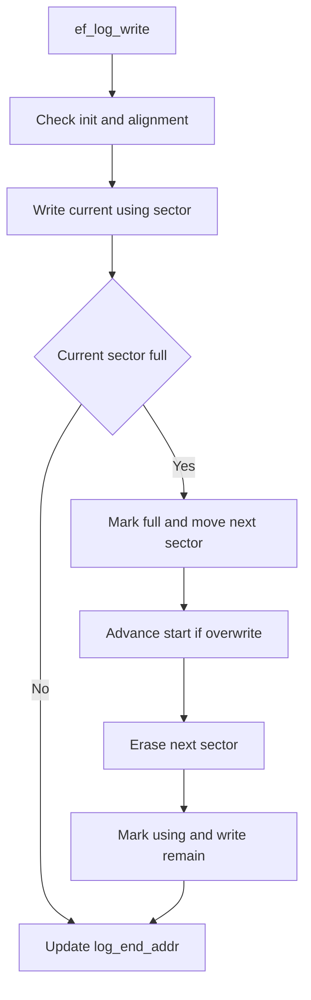

副作用：
- 写入日志数据到 Flash
- 可能擦除最旧日志所在扇区
- 更新 log_start_addr 和 log_end_addr

| 条件 | 行为 |
| --- | --- |
| size 未按 4 字节对齐或 index 越界 | 返回 EF_READ_ERR 或触发断言。 |
| 检测到日志扇区状态异常 | 初始化扫描中会清理全部日志区域。 |

使用方：
- 应用日志系统
- EasyLogger 集成示例

#### 4.6.6 实现机制说明

Log 机制通过每扇区状态 header 和环形地址映射跳过 header 读写，实现无文件系统日志覆盖。

| 机制 | 用途 | 输入 | 处理方式 | 输出 | 结构意义 |
| --- | --- | --- | --- | --- | --- |
| Flash 环形缓冲 | 在固定大小 Log 分区内持续追加日志并覆盖最旧数据。 | 当前 log_start_addr、log_end_addr 和新日志数据 | 写满扇区后标记 full，移动到下一扇区，必要时前移 start 并擦除旧扇区。 | 新的日志游标和持久化日志数据 | 使日志功能不依赖文件系统。 |
| 启动扫描与异常清理 | 根据扇区 header 恢复日志起止地址。 | Log 分区各扇区状态 header | 扫描 empty、using、full 状态组合；状态不合法时清理日志区。 | log_start_addr、log_end_addr 或清理后的空日志区 | 让日志写入在重启后可继续追加。 |

###### 4.6.6.1 Flash 环形缓冲

**日志环形缓冲说明**

Log 分区由多个擦除扇区组成，每个扇区开头保留 12 字节 header。写入时跳过 header 区，当前扇区写满后置 full，随后擦除下一扇区并置 using；如果下一扇区正是最旧日志位置，则 log_start_addr 前移。

###### 4.6.6.2 启动扫描与异常清理

**日志恢复说明**

ef_log_init 根据 LOG_AREA_SIZE 和 EF_ERASE_MIN_SIZE 断言分区合法，然后调用 find_start_and_end_addr 扫描各扇区状态。若发现 impossible 状态或 header 错误，会调用 ef_log_clean 重新初始化日志区。

#### 4.6.7 已知限制

Log 模块偏底层，不承担格式化、索引结构和非对齐数据处理。

| 限制 | 影响 | 缓解/后续 |
| --- | --- | --- |
| 日志读写 size 要求 4 字节对齐。 | 非对齐日志内容需要调用方自行填充或聚合。 | 在日志适配层统一按 word 对齐写入。 |

### 4.7 Types 插件模块

#### 4.7.1 模块定位与源码/产物范围

Types 插件在 ENV 字符串 API 之上提供类型化读写便利层，数组和结构体通过 JSON 序列化保存。

覆盖 easyflash/plugins/types 下的插件源码与内置 struct2json/cJSON 源码。

| 文件 | 角色 | 语言 | 备注 |
| --- | --- | --- | --- |
| easyflash/plugins/types/ef_types.c | Types 插件实现 | C | 调用 ef_get_env 和 ef_set_env。 |
| easyflash/plugins/types/ef_types.h | Types 插件公共头文件 | C | 声明基础类型、数组和结构体 API。 |
| easyflash/plugins/types/struct2json/src/s2j.c | 结构体 JSON 转换库 | C | 与 cJSON 配合完成结构体转换。 |

消费输入：
- EasyFlash 字符串 ENV API
- S2jHook 内存钩子
- 用户提供的结构体转 JSON 与 JSON 转结构体回调

拥有输出：
- 类型化 API 返回值
- JSON 字符串 ENV 值
- 动态分配的结构体对象

不负责范围：
- 不直接使用 NG blob API
- 不管理调用方结构体生命周期之外的业务对象

#### 4.7.2 配置

Types 插件主要通过初始化 hook 配置内存管理方式。

| 原型 | 当前/默认值 | 来源 | 含义 |
| --- | --- | --- | --- |
| void ef_types_init(S2jHook *hook) | 未调用或 hook 为 NULL 时使用 C 库 malloc/free | default | 配置 struct2json/cJSON 使用的内存分配和释放函数。 |

#### 4.7.3 依赖

Types 插件依赖主库 ENV 字符串接口和 struct2json/cJSON。

| 名称 | 类型 | 关系 | 用途 | 失败行为 |
| --- | --- | --- | --- | --- |
| EasyFlash 字符串 ENV API | internal_module | invokes | 保存和读取类型化值的底层字符串表示。 | ef_get_env 返回 NULL 时插件返回默认值或空指针并输出提示。 |
| cJSON / struct2json | library | uses | 数组与结构体 JSON 序列化和反序列化。 | 内存分配或 JSON 解析失败时返回 EF_ENV_FULL、NULL 或输出错误提示。 |

#### 4.7.4 数据对象

Types 插件的结构数据是 JSON 字符串、cJSON 对象和用户结构体回调。

| 名称 | 类型 | 角色 | 生产方 | 消费方 | 结构/契约 |
| --- | --- | --- | --- | --- | --- |
| 类型化 ENV JSON 字符串 | char * / cJSON | 数组和结构体存储表示 | ef_set_array、ef_set_struct | ef_get_array、ef_get_struct | 数组使用 JSON array；结构体由用户回调转换为 cJSON object。 |
| ef_types_set_cb / ef_types_get_cb | function pointer | 结构体与 JSON 互转契约 | 插件头文件和调用方 | ef_set_struct、ef_get_struct | set 回调返回 cJSON*，get 回调从 cJSON* 构造动态结构体对象。 |

#### 4.7.5 对外接口

Types 插件公开基础类型、数组和结构体读写 API。

| 接口名称 | 接口功能描述 | 接口类型 |
| --- | --- | --- |
| 基础类型 API 组 | bool、char、short、int、long、float、double 的 get/set 封装。 | library_api |
| 数组与结构体 API 组 | 数组 JSON 读写和结构体 JSON 回调读写。 | library_api |

##### 4.7.5.1 基础类型 API 组

原型：bool ef_get_bool(const char *key); EfErrCode ef_set_int(const char *key, int value); EfErrCode ef_set_double(const char *key, double value)

用途：将基础 C 类型转换为字符串 ENV 保存，并在读取时解析回目标类型。

位置：easyflash/plugins/types/ef_types.c

| 参数名 | 参数类型 | 参数描述 | 输入/输出 |
| --- | --- | --- | --- |
| key | const char * | ENV 名称。 | input |
| value | primitive C type | 待保存基础类型值。 | input |

| 返回名 | 返回类型 | 描述 | 条件 |
| --- | --- | --- | --- |
| value_or_result | primitive 或 EfErrCode | 读取 API 返回解析值，写入 API 返回 EasyFlash 错误码。 | API 返回时。 |

Types 基础类型流程

展示基础类型在字符串 ENV 上的转换。

<!-- diagram-id: MER-IFACE-TYPES-PRIMITIVE -->
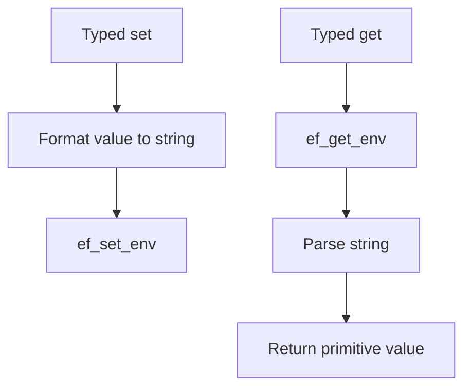

副作用：
- 写入底层字符串 ENV
- 读取时可能输出未找到提示

| 条件 | 行为 |
| --- | --- |
| ENV 不存在 | 读取 API 输出提示并返回 false、0 或 NULL 风格默认值。 |

使用方：
- 使用 Types 插件的应用层

##### 4.7.5.2 数组与结构体 API 组

原型：EfErrCode ef_set_int_array(const char *key, int *value, size_t len); EfErrCode ef_set_struct(const char *key, void *value, ef_types_set_cb set_cb)

用途：把数组和结构体转换为 JSON 字符串保存到 ENV，再按调用方类型读回。

位置：easyflash/plugins/types/ef_types.c

| 参数名 | 参数类型 | 参数描述 | 输入/输出 |
| --- | --- | --- | --- |
| value | array pointer 或 void * | 待保存数组或结构体对象。 | input |
| len | size_t | 数组长度。 | input |
| set_cb / get_cb | function pointer | 结构体与 JSON 互转回调。 | input |

| 返回名 | 返回类型 | 描述 | 条件 |
| --- | --- | --- | --- |
| result_or_object | EfErrCode 或 void * | 写入结果或动态分配的结构体对象。 | API 返回时。 |

Types 数组与结构体流程

展示 JSON 作为复杂类型中间表示。

<!-- diagram-id: MER-IFACE-TYPES-COMPLEX -->
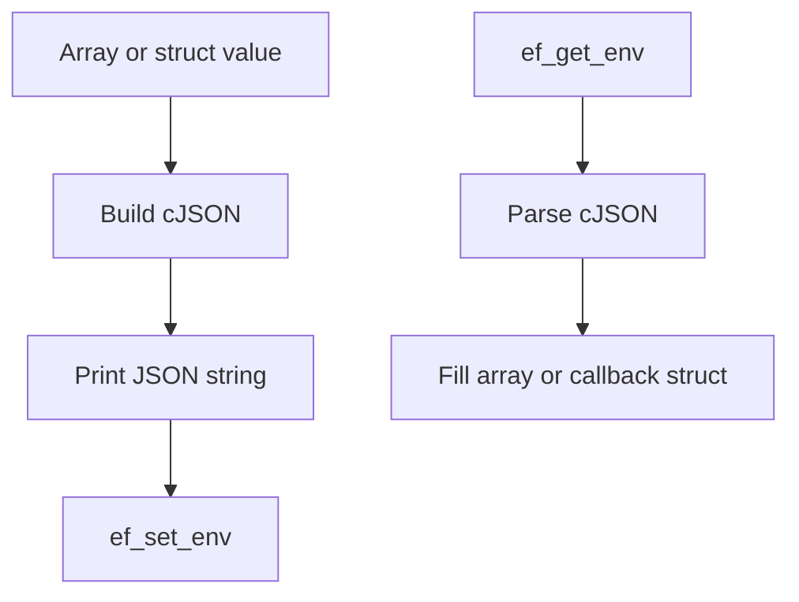

副作用：
- 分配和释放 JSON 字符串或 cJSON 对象
- 结构体读取返回动态分配对象，由调用方释放

| 条件 | 行为 |
| --- | --- |
| cJSON 创建或打印失败 | 返回 EF_ENV_FULL 并输出内存不足提示。 |
| JSON 解析失败 | 输出类型错误提示或返回 NULL。 |

使用方：
- 使用 Types 插件的应用层

#### 4.7.6 实现机制说明

Types 机制是适配层转换：基础类型经 snprintf/atoi/atol/atof 转换，复杂类型经 cJSON 与 struct2json 转换。

| 机制 | 用途 | 输入 | 处理方式 | 输出 | 结构意义 |
| --- | --- | --- | --- | --- | --- |
| 类型到字符串/JSON 转换 | 让应用用类型化 API 访问底层字符串 ENV。 | 基础类型、数组或结构体对象 | 基础类型格式化为字符串；数组和结构体生成 JSON 字符串。 | 写入 ENV 的字符串值或解析后的类型值 | 在不改变主库存储模型的前提下扩展易用性。 |

###### 4.7.6.1 类型到字符串/JSON 转换

**类型转换说明**

基础类型 set API 使用固定长度字符数组格式化数值并调用 ef_set_env；get API 使用 ef_get_env 返回字符串后再解析。数组 API 创建 cJSON array，结构体 API 由用户回调创建或解析 cJSON object。

#### 4.7.7 已知限制

Types 插件建立在字符串 ENV 与动态 JSON 内存之上。

| 限制 | 影响 | 缓解/后续 |
| --- | --- | --- |
| 插件读取依赖 ef_get_env，而 NG 文档已将 ef_get_env 标为不推荐且不可重入。 | 连续读取或并发读取可能受到内部静态缓冲限制。 | 新代码优先使用 blob API 或为插件补充基于 ef_get_env_blob 的实现。 |
| 数组和结构体路径需要动态内存与 cJSON 对象。 | 极小 RAM 平台上可能因内存不足返回错误。 | 通过 ef_types_init 注入平台内存管理，并限制 JSON 数据大小。 |

## 5. 运行时视图

### 5.1 运行时概述

EasyFlash 作为嵌入式 C 库嵌入应用进程或固件镜像运行；运行时没有独立进程，主要运行单元是初始化入口和各功能 API 调用路径。

### 5.2 运行单元说明

| 运行单元 | 类型 | 入口 | 职责 | 关联模块 | 备注 |
| --- | --- | --- | --- | --- | --- |
| 系统初始化路径 | library call | easyflash_init | 初始化端口层和启用的 ENV、IAP、Log 模块。 | 核心 API 与初始化模块、端口适配模块、ENV NG 模块、IAP 模块、Flash Log 模块 | legacy ENV 启用时替代 MOD-ENV-NG 参与初始化。 |
| ENV 读写路径 | library call | ef_get_env_blob / ef_set_env_blob / ef_del_env | 处理运行期参数读取、更新、删除、GC 与恢复后的访问。 | ENV NG 模块、端口适配模块、核心 API 与初始化模块 | legacy 模式下使用同名字符串 API 的 legacy 实现。 |
| IAP 升级辅助路径 | library call | ef_write_data_to_bak / ef_copy_app_from_bak | 在升级流程中擦写备份区和目标应用区。 | IAP 模块、端口适配模块、核心 API 与初始化模块 | 下载协议和升级调度由 Bootloader 或应用层提供。 |
| 日志追加读取路径 | library call | ef_log_write / ef_log_read | 追加日志、按索引读取日志并维护环形缓冲游标。 | Flash Log 模块、端口适配模块、核心 API 与初始化模块 | 常见集成方式是由 EasyLogger 或应用日志层调用。 |
| Types 插件类型化访问路径 | library call | ef_set_struct / ef_get_struct / ef_set_int | 把类型化数据转换为字符串或 JSON 并调用 ENV API。 | Types 插件模块、ENV NG 模块、ENV legacy 兼容模块 | 插件不是 easyflash_init 的默认初始化分支，需要应用按需调用 ef_types_init。 |

### 5.3 运行时流程图

EasyFlash 运行时流程图

展示应用调用 EasyFlash 后的主要运行路径。

<!-- diagram-id: MER-RUNTIME-FLOW -->
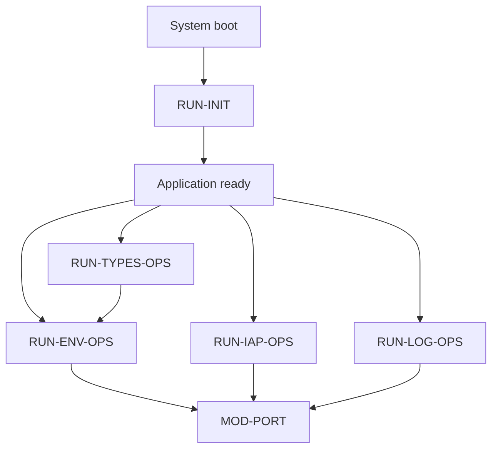

### 5.4 运行时序图（推荐）

初始化与 ENV 操作时序图

展示应用初始化后执行 ENV 写入的典型时序。

<!-- diagram-id: MER-RUNTIME-SEQUENCE -->
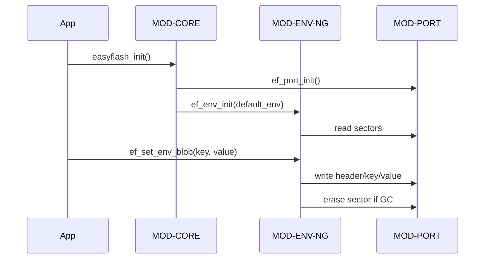

### 5.5 补充运行时图表

无补充内容。

## 6. 配置、数据与依赖关系

系统关键结构由编译期配置、Flash 分区布局、持久化元数据和平台/第三方依赖共同决定。

### 6.1 配置项说明

| 配置项 | 来源 | 使用方 | 用途 | 备注 |
| --- | --- | --- | --- | --- |
| 功能开关 | easyflash/inc/ef_cfg.h | MOD-CORE | 裁剪 ENV、IAP、Log 功能及公共头文件声明。 | ENV 默认开启，IAP 和 Log 在模板中注释。 |
| Flash 擦写粒度 | easyflash/inc/ef_cfg.h | MOD-ENV-NG, MOD-LOG, MOD-PORT | 决定擦除对齐、写入对齐和状态表编码。 | EF_WRITE_GRAN 取值必须匹配目标 Flash。 |
| 备份区分区 | easyflash/inc/ef_cfg.h | MOD-ENV-NG, MOD-IAP, MOD-LOG | 定义 ENV、Log 和 IAP 下载区在 Flash 中的顺序布局。 | 所有区域应按 EF_ERASE_MIN_SIZE 对齐。 |
| ENV 模式与版本 | easyflash/inc/ef_cfg.h | MOD-ENV-NG, MOD-ENV-LEGACY | 选择 NG 或 legacy 模式，并配置 ENV 自动升级版本。 | EF_ENV_AUTO_UPDATE 默认关闭。 |

### 6.2 关键结构数据与产物

| 数据/产物 | 类型 | 归属 | 生产方 | 消费方 | 备注 |
| --- | --- | --- | --- | --- | --- |
| Backup Area 分区布局 | Flash address layout | MOD-CORE | ef_cfg.h 配置和初始化计算 | MOD-ENV-NG, MOD-LOG, MOD-IAP | 顺序为 ENV 区、Log 区、IAP 下载应用区。 |
| ENV NG Flash 数据格式 | sector and kv-node layout | MOD-ENV-NG | format_sector 和 create_env_blob | read_env、find_env、GC、恢复流程 | 含 sector magic、store/dirty 状态、ENV magic、CRC、key 和 value。 |
| Log 扇区格式 | ring-buffer sector header | MOD-LOG | ef_log_clean 和 ef_log_write | ef_log_init、ef_log_read、ef_log_write | 每扇区 12 字节 header 后接日志数据。 |
| Types JSON 表示 | JSON string | MOD-TYPES | cJSON / struct2json | ENV 字符串 API | 用于数组和结构体类型 ENV。 |

### 6.3 依赖项说明

| 依赖项 | 类型 | 使用方 | 用途 | 备注 |
| --- | --- | --- | --- | --- |
| C 标准库 | library | MOD-CORE, MOD-ENV-NG, MOD-ENV-LEGACY, MOD-TYPES | 提供 stdint、stddef、stdbool、string、stdlib、stdio、stdarg 等基础能力。 | 嵌入式工具链需提供对应 C 运行库子集。 |
| 目标 Flash 硬件和驱动 | external_service | MOD-PORT | 执行真实读、擦、写操作。 | 可以是片内 Flash 或 SPI Flash。 |
| 可选 RTOS 或临界区机制 | external_service | MOD-PORT | 实现 ENV 操作互斥和 demo 中的 shell/升级任务环境。 | 裸机可用关中断等方式实现锁。 |
| cJSON / struct2json | library | MOD-TYPES | 支持数组和结构体 JSON 序列化。 | 源码随插件目录提供。 |
| EasyLogger | library | demo/log | 示例中把应用日志接入 EasyFlash Log。 | 不是主库编译必需依赖。 |

### 6.4 补充图表

无补充内容。

## 7. 跨模块协作关系

### 7.1 协作关系概述

EasyFlash 的主要协作关系是核心初始化编排、功能模块共享端口层、分区布局在 ENV/Log/IAP 之间传递，以及 Types 插件通过 ENV API 扩展上层易用性。

### 7.2 跨模块协作说明

| 场景 | 发起模块 | 参与模块 | 协作方式 | 描述 |
| --- | --- | --- | --- | --- |
| 系统启动初始化 | 核心 API 与初始化模块 | 端口适配模块、ENV NG 模块、IAP 模块、Flash Log 模块 | 函数调用和编译期条件分支 | easyflash_init 先初始化端口层，再按启用宏初始化 ENV、IAP 和 Log。 |
| 功能模块访问 Flash | ENV NG 模块 | 端口适配模块、IAP 模块、Flash Log 模块、ENV legacy 兼容模块 | 共享端口 API | ENV、IAP、Log 和 legacy ENV 统一调用 ef_port_read、ef_port_erase、ef_port_write，将硬件差异交给端口层。 |
| 备份区地址协作 | 核心 API 与初始化模块 | ENV NG 模块、Flash Log 模块、IAP 模块 | 共享配置宏和运行时地址计算 | ENV、Log 和 IAP 使用同一个 EF_START_ADDR 下的连续分区，IAP 和 Log 根据前序分区大小计算起始地址。 |
| 类型化数据保存 | Types 插件模块 | ENV NG 模块、ENV legacy 兼容模块 | 调用 ENV 字符串 API | Types 插件把基础类型、数组和结构体转换为字符串或 JSON 后，调用 ef_set_env/ef_get_env 完成持久化访问。 |

### 7.3 跨模块协作关系图

跨模块协作关系图

展示初始化、Flash 访问、分区和插件协作。

<!-- diagram-id: MER-COLLAB-RELATION -->
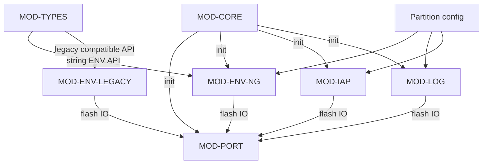

### 7.4 补充协作图表

无补充内容。

## 8. 关键流程

### 8.1 关键流程概述

关键流程覆盖初始化、ENV 写入与 GC、IAP 升级、日志写入覆盖和 Types 插件类型化保存。

### 8.2 关键流程清单

| 流程 | 触发条件 | 参与模块 | 参与运行单元 | 主要步骤 | 输出结果 | 备注 |
| --- | --- | --- | --- | --- | --- | --- |
| EasyFlash 初始化 | 应用启动后调用 easyflash_init。 | 核心 API 与初始化模块、端口适配模块、ENV NG 模块、IAP 模块、Flash Log 模块 | 系统初始化路径 | 检查 init_ok、端口初始化、ENV/IAP/Log 条件初始化、返回整体结果。 | EasyFlash 进入可用状态或返回失败错误码。 | legacy ENV 启用时替代 ENV NG。 |
| ENV 设置与 GC | 应用调用 ef_set_env_blob 或 ef_set_env。 | ENV NG 模块、端口适配模块、核心 API 与初始化模块 | ENV 读写路径 | 加锁、分配空间、预删除旧值、写入新节点、完成旧删除、按需 GC。 | 新的 ENV 值持久化，旧值被删除或脏扇区被回收。 | 删除操作通过 value_buf 为 NULL 或 ef_del_env 进入。 |
| IAP 下载与拷贝 | Bootloader 或应用升级逻辑接收到固件数据。 | IAP 模块、端口适配模块、核心 API 与初始化模块 | IAP 升级辅助路径 | 擦除备份区、分片写入备份区、擦除目标区、从备份区拷贝。 | 目标应用区或 Bootloader 区被写入新镜像。 | 完整性校验和重启策略由调用方负责。 |
| 日志追加与环形覆盖 | 应用日志层调用 ef_log_write。 | Flash Log 模块、端口适配模块、核心 API 与初始化模块 | 日志追加读取路径 | 校验状态、写当前 using 扇区、扇区满则标记并移动、必要时覆盖最旧扇区。 | 日志数据追加到 Flash，游标更新。 | 写入大小需要 word 对齐。 |
| Types 插件保存复杂类型 | 应用调用 ef_set_*_array 或 ef_set_struct。 | Types 插件模块、ENV NG 模块、ENV legacy 兼容模块 | Types 插件类型化访问路径、ENV 读写路径 | 构造 cJSON、生成紧凑 JSON 字符串、调用 ef_set_env 保存、释放 JSON 内存。 | 复杂类型以 JSON 字符串形式保存为 ENV。 | 读取结构体时返回的动态对象需要调用方释放。 |

### 8.3 EasyFlash 初始化

#### 8.3.1 流程概述

应用启动时通过 easyflash_init 建立 EasyFlash 的平台和功能模块状态。

关联模块：核心 API 与初始化模块、端口适配模块、ENV NG 模块、IAP 模块、Flash Log 模块

关联运行单元：系统初始化路径

#### 8.3.2 步骤说明

| 序号 | 执行方 | 说明 | 输入 | 输出 | 关联模块 | 关联运行单元 |
| --- | --- | --- | --- | --- | --- | --- |
| 1 | Application | 应用调用 easyflash_init，函数检查静态 init_ok 避免重复初始化。 | 启动调用 | 进入初始化分支或直接返回 EF_NO_ERR | 核心 API 与初始化模块 | 系统初始化路径 |
| 2 | MOD-CORE | 核心模块调用 ef_port_init 取得默认 ENV 集合并完成平台初始化。 | default_env 指针参数 | default_env_set 和 default_env_set_size | 核心 API 与初始化模块、端口适配模块 | 系统初始化路径 |
| 3 | MOD-CORE | 按启用宏依次初始化 ENV、IAP 和 Log。 | 功能宏和端口初始化结果 | 功能模块初始化结果 | ENV NG 模块、IAP 模块、Flash Log 模块 | 系统初始化路径 |

#### 8.3.3 异常/分支说明

| 条件 | 处理方式 | 关联模块 | 关联运行单元 |
| --- | --- | --- | --- |
| 端口或功能模块返回非 EF_NO_ERR | easyflash_init 输出失败日志并返回错误码，不设置 init_ok。 | 核心 API 与初始化模块、端口适配模块 | 系统初始化路径 |

#### 8.3.4 流程图

EasyFlash 初始化流程图

展示初始化主流程和失败分支。

<!-- diagram-id: MER-FLOW-INIT -->
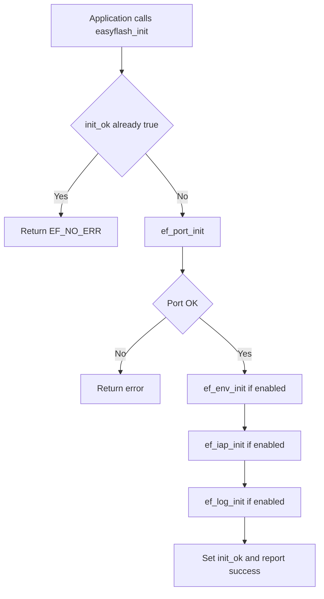

### 8.4 ENV 设置与 GC

#### 8.4.1 流程概述

ENV NG 写入以顺序追加新节点和标记旧节点删除为基础，在空扇区不足时搬移有效节点并回收脏扇区。

关联模块：ENV NG 模块、端口适配模块、核心 API 与初始化模块

关联运行单元：ENV 读写路径

#### 8.4.2 步骤说明

| 序号 | 执行方 | 说明 | 输入 | 输出 | 关联模块 | 关联运行单元 |
| --- | --- | --- | --- | --- | --- | --- |
| 1 | Application | ef_set_env_blob 检查 init_ok 并加 ENV 锁。 | key、value_buf、buf_len | 进入 set_env | ENV NG 模块、端口适配模块 | ENV 读写路径 |
| 2 | MOD-ENV-NG | 为新 KV 计算 ENV 节点长度并在 using 或 empty 扇区中分配空间。 | key 长度和值长度 | 新 ENV 节点起始地址或 EF_ENV_FULL | ENV NG 模块 | ENV 读写路径 |
| 3 | MOD-ENV-NG | 若旧 key 已存在，则先把旧节点标记为 PRE_DELETE，并把扇区标记为 dirty。 | 旧 ENV 节点对象 | 旧节点预删除状态 | ENV NG 模块、端口适配模块 | ENV 读写路径 |
| 4 | MOD-ENV-NG | 写入新节点 header、key、value 和 WRITE 状态。 | 新节点地址和 key/value 数据 | 持久化的新 ENV 节点 | ENV NG 模块、端口适配模块、核心 API 与初始化模块 | ENV 读写路径 |
| 5 | MOD-ENV-NG | 写入成功后把旧节点从 PRE_DELETE 完成到 DELETED，并在 gc_request 为真时执行 GC。 | 旧节点状态和 GC 请求标志 | 已删除旧节点和可能回收的空扇区 | ENV NG 模块、端口适配模块 | ENV 读写路径 |

#### 8.4.3 异常/分支说明

| 条件 | 处理方式 | 关联模块 | 关联运行单元 |
| --- | --- | --- | --- |
| 断电发生在 PRE_WRITE 或 PRE_DELETE 中间状态 | 下次 ef_load_env 扫描时标记未完成写入为错误，或移动 PRE_DELETE 的旧有效节点恢复。 | ENV NG 模块 | ENV 读写路径、系统初始化路径 |
| 无法找到可用扇区或节点超过单扇区可用空间 | 返回 EF_ENV_FULL；若只是空扇区不足则先尝试 GC 后重试。 | ENV NG 模块 | ENV 读写路径 |

#### 8.4.4 流程图

ENV 设置与 GC 流程图

展示 ENV 写入、旧值删除和 GC 回收。

<!-- diagram-id: MER-FLOW-ENV-SET-GC -->
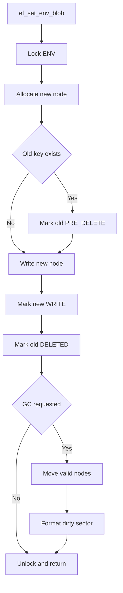

### 8.5 IAP 下载与拷贝

#### 8.5.1 流程概述

IAP API 把下载镜像先写入备份区，再由 Bootloader 或安全上下文擦除目标区并从备份区拷贝。

关联模块：IAP 模块、端口适配模块、核心 API 与初始化模块

关联运行单元：IAP 升级辅助路径

#### 8.5.2 步骤说明

| 序号 | 执行方 | 说明 | 输入 | 输出 | 关联模块 | 关联运行单元 |
| --- | --- | --- | --- | --- | --- | --- |
| 1 | Bootloader or updater | 调用 ef_erase_bak_app 按 app_size 擦除备份区。 | app_size | 已擦除备份区 | IAP 模块、端口适配模块 | IAP 升级辅助路径 |
| 2 | Download protocol | 下载协议分片调用 ef_write_data_to_bak 写入备份区，并更新 cur_size。 | data、size、cur_size、total_size | 备份区固件镜像 | IAP 模块、端口适配模块 | IAP 升级辅助路径 |
| 3 | Bootloader or updater | 调用方擦除目标应用或 Bootloader 区。 | 目标地址和大小 | 已擦除目标区 | IAP 模块、端口适配模块 | IAP 升级辅助路径 |
| 4 | MOD-IAP | 从备份区循环读取 32 words 缓冲并写入目标区。 | 备份区镜像和目标写函数 | 目标区新镜像 | IAP 模块、端口适配模块 | IAP 升级辅助路径 |

#### 8.5.3 异常/分支说明

| 条件 | 处理方式 | 关联模块 | 关联运行单元 |
| --- | --- | --- | --- |
| 任一步擦除或写入返回错误 | 输出警告并返回错误码，由调用方决定是否回滚或停止升级。 | IAP 模块、端口适配模块 | IAP 升级辅助路径 |

#### 8.5.4 流程图

IAP 下载与拷贝流程图

展示 IAP 典型升级路径。

<!-- diagram-id: MER-FLOW-IAP-UPGRADE -->
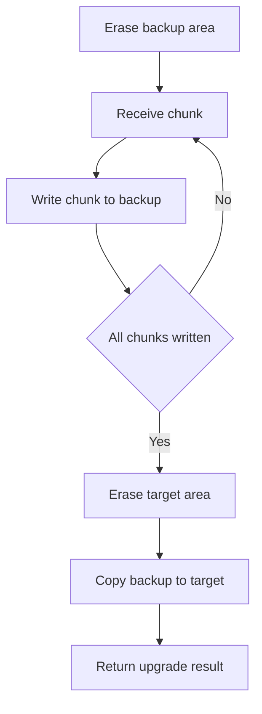

### 8.6 日志追加与环形覆盖

#### 8.6.1 流程概述

Log 写入在当前 using 扇区追加数据，写满后转入下一扇区并覆盖最旧日志。

关联模块：Flash Log 模块、端口适配模块

关联运行单元：日志追加读取路径

#### 8.6.2 步骤说明

| 序号 | 执行方 | 说明 | 输入 | 输出 | 关联模块 | 关联运行单元 |
| --- | --- | --- | --- | --- | --- | --- |
| 1 | Application logger | ef_log_write 检查初始化状态、size 对齐和当前扇区 header。 | log 缓冲区和 size | 可写地址或错误 | Flash Log 模块 | 日志追加读取路径 |
| 2 | MOD-LOG | 向当前 using 或 empty 扇区剩余区域写入日志。 | 当前 log_end_addr | 已写入当前扇区的数据 | Flash Log 模块、端口适配模块 | 日志追加读取路径 |
| 3 | MOD-LOG | 若当前扇区写满，则标记 full 并移动到下一扇区。 | 剩余日志数据和当前扇区位置 | 下一扇区写入准备状态 | Flash Log 模块、端口适配模块 | 日志追加读取路径 |
| 4 | MOD-LOG | 擦除下一扇区并写入 header，然后继续写入剩余日志，必要时前移 log_start_addr。 | 剩余日志数据 | 新的 log_start_addr 和 log_end_addr | Flash Log 模块、端口适配模块 | 日志追加读取路径 |

#### 8.6.3 异常/分支说明

| 条件 | 处理方式 | 关联模块 | 关联运行单元 |
| --- | --- | --- | --- |
| 初始化扫描发现 header 状态不合法 | 调用 ef_log_clean 清理全部日志区域并重建扇区 header。 | Flash Log 模块、端口适配模块 | 日志追加读取路径 |

#### 8.6.4 流程图

日志写入环形流程图

展示日志扇区写满后如何回绕覆盖。

<!-- diagram-id: MER-FLOW-LOG-WRITE -->
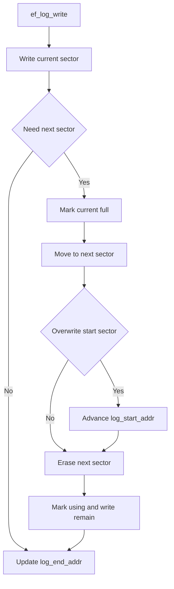

### 8.7 Types 插件保存复杂类型

#### 8.7.1 流程概述

Types 插件把数组或结构体转换为 JSON 字符串，再调用底层 ENV 字符串写入接口保存。

关联模块：Types 插件模块、ENV NG 模块、ENV legacy 兼容模块

关联运行单元：Types 插件类型化访问路径、ENV 读写路径

#### 8.7.2 步骤说明

| 序号 | 执行方 | 说明 | 输入 | 输出 | 关联模块 | 关联运行单元 |
| --- | --- | --- | --- | --- | --- | --- |
| 1 | Application | 应用调用数组或结构体 set API，并传入数组长度或结构体转换回调。 | key、value、len 或 set_cb | 进入 JSON 构造逻辑 | Types 插件模块 | Types 插件类型化访问路径 |
| 2 | MOD-TYPES | 插件创建 cJSON array 或通过 set_cb 创建 cJSON object。 | 数组元素或结构体对象 | cJSON 对象 | Types 插件模块 | Types 插件类型化访问路径 |
| 3 | MOD-TYPES | 插件把 cJSON 打印为紧凑字符串并调用 ef_set_env。 | JSON 字符串 | 底层 ENV 写入请求 | Types 插件模块、ENV NG 模块、ENV legacy 兼容模块 | Types 插件类型化访问路径、ENV 读写路径 |
| 4 | MOD-TYPES | 写入结束后释放 cJSON 和 JSON 字符串内存。 | 写入结果和动态内存对象 | EfErrCode 返回值 | Types 插件模块 | Types 插件类型化访问路径 |

#### 8.7.3 异常/分支说明

| 条件 | 处理方式 | 关联模块 | 关联运行单元 |
| --- | --- | --- | --- |
| cJSON 创建或字符串打印失败 | 返回 EF_ENV_FULL 并输出内存不足提示。 | Types 插件模块 | Types 插件类型化访问路径 |

#### 8.7.4 流程图

Types 复杂类型保存流程图

展示 Types 插件如何把复杂类型保存为 ENV。

<!-- diagram-id: MER-FLOW-TYPES-SAVE -->
```mermaid
flowchart TD
  A["Application value"] --> B{"Array or struct"}
  B -->|Array| C["Create cJSON array"]
  B -->|Struct| D["Call set_cb"]
  C --> E["Print JSON string"]
  D --> E
  E --> F["ef_set_env"]
  F --> G["Free JSON memory"]
  G --> H["Return result"]
```

## 9. 结构问题与改进建议

### 9.1 风险清单

| ID | 风险 | 影响 | 缓解措施 | 置信度 |
| --- | --- | --- | --- | --- |
| RISK-PORT-SKELETON | 默认端口层函数为空实现，若未移植就集成主库，功能测试可能出现假成功。 | ENV/IAP/Log 无法真实读写 Flash，甚至掩盖平台配置错误。 | 移植时必须补齐 ef_port_read、ef_port_erase、ef_port_write、锁和打印函数，并用目标板验证。 | observed |
| RISK-IAP-SELF-ERASE | IAP 擦除和拷贝接口如果在错误固件上下文调用，可能擦除正在运行的应用或 Bootloader。 | 设备可能无法启动或升级中断。 | 在 Bootloader 与应用设计中固定调用边界，并在执行前校验目标地址、镜像和状态。 | observed |
| RISK-FLASH-GRANULARITY | EF_WRITE_GRAN 或 EF_ERASE_MIN_SIZE 与目标 Flash 规格不一致时，状态表和对齐写入会失效。 | ENV 节点状态、日志 header 或分区擦写可能损坏。 | 按芯片手册和移植文档确认擦除粒度、写入粒度，并在 demo 上做掉电和重复写入验证。 | observed |

### 9.2 假设清单

| ID | 假设 | 依据 | 验证建议 | 置信度 |
| --- | --- | --- | --- | --- |
| ASM-SCOPE-MAIN-LIB | 本说明书聚焦 easyflash 主库与插件源码，不展开 demo 下 RT-Thread、CMSIS、STM32 标准库等第三方或平台工程代码。 | 用户要求阅读 easyflash 仓库构造结构设计说明书，主库结构足以说明软件架构，demo 主要是移植和集成样例。 | 若需要目标 demo 级设计，可另行生成 stm32f10x 或 stm32f4xx demo 专项结构说明。 | inferred |
| ASM-LEGACY-AS-COMPAT | legacy ENV 被视为兼容模块，而非新项目首选实现。 | README 和移植文档均说明 NG 是默认模式，legacy 已不推荐继续使用。 | 确认目标产品的 Flash 写入特性是否支持 NG；若不支持，再确认 legacy 版本选择。 | observed |
| ASM-NO-BUILD-VERIFICATION | 本次结构设计基于源码和文档静态阅读，未尝试构建嵌入式 demo 工程。 | 仓库包含 IAR/Keil/RT-Thread/STM32 平台工程，当前任务是结构文档生成，不要求目标工具链编译。 | 在目标平台工具链中编译选定 demo，并运行 ENV/IAP/Log 功能验证。 | inferred |

### 9.3 低置信度项目

无低置信度项目。

### 9.4 结构问题与改进建议

EasyFlash 的结构边界清晰，但当前仓库保留了模板端口、legacy 兼容实现和若干未来功能描述，落地使用时需要明确目标平台配置与实际启用模块。

#### 结构改进建议

建议在目标工程中把 ef_cfg.h、ef_port.c 和默认 ENV 集合作为平台适配包管理，并在文档中明确启用的是 ENV NG 还是 legacy 模式。对于 IAP，应把镜像校验、执行上下文和回滚策略写入 Bootloader 设计，而不是只依赖 EasyFlash 的拷贝 API。

#### 结构问题与改进方向

| 问题 | 影响 | 改进方向 |
| --- | --- | --- |
| 端口层模板为空实现 | 新用户容易误以为主库可直接操作目标 Flash。 | 在目标平台目录提供已填充端口文件，并将模板文件显式标注为 skeleton。 |
| legacy 与 NG 共用公共 API | 阅读者可能混淆同名函数在不同模式下的存储机制。 | 在项目级文档中声明本固件使用的 ENV 模式，并排除未使用源文件。 |
| IAP 只封装 Flash 操作辅助 | 缺少镜像校验和上下文约束时升级流程风险较高。 | 在 Bootloader 设计中补充 CRC、签名、版本和回滚策略。 |
