# 软件结构设计说明书

## 1. 文档信息

| 字段 | 值 |
| --- | --- |
| title | create-structure-md 软件结构设计说明书 |
| project_name | create-structure-md |
| project_version |  |
| document_version | 0.2.0 |
| status | draft |
| generated_at | 2026-05-05T22:42:25+08:00 |
| generated_by | Codex |
| language | zh-CN |
| source_type | code |
| scope_summary | 当前工程 create-structure-md 的技能契约、V2 DSL schema、共享语义规则、DSL 校验、Mermaid 门禁、Markdown 渲染、安装、示例与测试结构说明。 |
| not_applicable_policy | 固定 9 章输出；无常驻进程、数据库或外部服务时，以不适用说明、空表或运行单元备注表达。 |
| output_file | create-structure-md_STRUCTURE_DESIGN.md |

## 2. 系统概览

create-structure-md 是一个本地 Codex 技能工程，用于把已经准备好的结构设计 DSL JSON 校验、审查 Mermaid 图并渲染为单个模块或系统专属 Markdown 结构设计说明书。

通过明确技能边界、V2 DSL 契约、schema/语义校验、Mermaid 严格门禁和确定性 Markdown 渲染，让结构设计文档生成过程可重复、可审查、可验证。

| 能力 | 描述 |
| --- | --- |
| 结构设计文档生成 | 将完整 V2 DSL 渲染为固定 9 章 Markdown，并保证输出文件名面向具体工程或模块。 |
| DSL 结构与语义门禁 | 通过 JSON Schema、V2 全局规则、模块模型和内容块语义检查 DSL 输入质量。 |
| Mermaid 可读性与严格门禁 | 用可读性复核工件、预渲染 strict 校验、渲染完整性检查和渲染后 strict 校验保护图表输出。 |
| 本地技能安装 | 用 copy-only 安装器把运行时白名单文件安装到 Codex skills 目录。 |
| 契约测试与示例 | 通过 V2 示例、fixture 和 unittest 覆盖校验器、渲染器、Mermaid 门禁、安装器和端到端流程。 |

- 当前仓库未声明 pyproject 或顶层 README；入口主要由 SKILL.md、docs/install.md、references 和 tests 体现。

## 3. 架构视图

### 3.1 架构概述

工程按技能运行时职责组织为八个结构模块：契约文档、DSL schema、V2 共享规则、DSL 校验、Mermaid 门禁、Markdown 渲染、安装器、示例与测试。

### 3.2 各模块介绍

| 模块名称 | 职责 | 输入 | 输出 | 备注 |
| --- | --- | --- | --- | --- |
| 技能契约与参考文档模块 | 定义技能边界、输入就绪条件、V2 工作流、固定结构和复核规则。 | 用户请求、已准备结构内容、仓库理解结果 | Codex 执行规则和最终复核依据 | 主要由 SKILL.md 和 references 目录承载。 |
| DSL Schema 模块 | 定义 V2 DSL 的 JSON Schema 结构契约。 | DSL 字段与章节模型 | schemas/structure-design.schema.json | 结构校验权威来源。 |
| V2 共享规则模块 | 提供版本门禁、枚举、not_applicable、ID 作用域和全局规则检查。 | 已解析 DSL document | RuleViolation 列表和共享常量 | 被校验器、渲染器和 Mermaid 门禁导入。 |
| DSL 校验器模块 | 校验 DSL schema、语义、引用、支持数据和文本安全。 | structure.dsl.json、schema、V2 共享规则 | 校验报告或成功状态 | 入口为 scripts/validate_dsl.py。 |
| Mermaid 校验与门禁模块 | 校验 Mermaid 图，验证复核工件和渲染后图完整性。 | DSL、Markdown、Mermaid review artifact、node/mmdc | Mermaid 校验结果和门禁结果 | 最终输出仍为 Markdown Mermaid fence，不是图片。 |
| Markdown 渲染器模块 | 把 V2 DSL 渲染为固定 9 章结构设计 Markdown。 | V2 DSL JSON、输出目录、evidence-mode | document.output_file 指定的 Markdown 文件 | 入口为 scripts/render_markdown.py。 |
| 安装器模块 | 执行 copy-only 本地技能安装和依赖状态报告。 | 仓库运行时文件、--codex-home 或 CODEX_HOME | Codex skills 目录中的安装副本 | 不覆盖已有目标，不安装依赖。 |
| 示例与测试模块 | 提供 V2 示例、fixture 和 unittest 回归保护。 | examples、fixtures、scripts、schema、本地工具环境 | 测试结果、示例验证结果、临时测试产物 | tests 和 docs 不属于安装器运行时白名单。 |

### 3.3 模块关系图

模块关系图

展示 create-structure-md 当前工程的主要模块依赖和验证关系。

<!-- diagram-id: MER-ARCH-MODULES -->
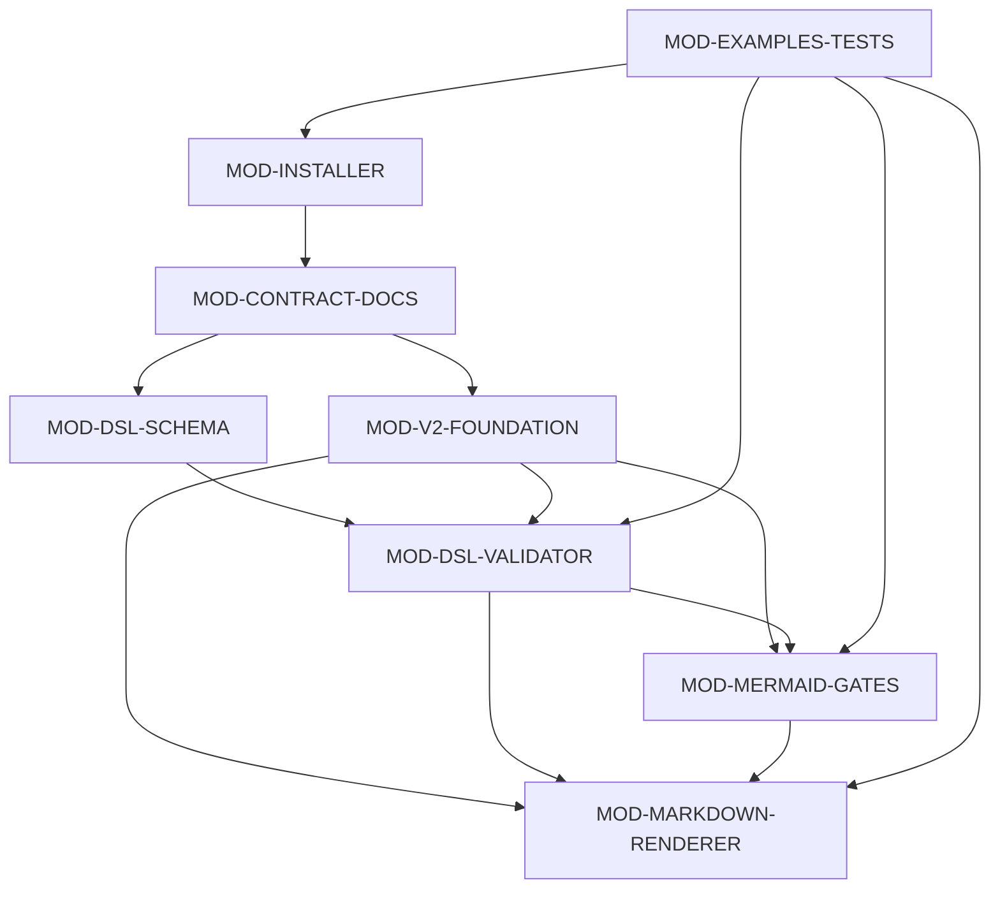

### 3.4 补充架构图表

无补充内容。

## 4. 模块设计

模块按规则来源、结构契约、共享语义、校验门禁、渲染输出、安装发布和回归保护分层，避免把仓库分析能力混入文档渲染技能本身。

### 4.1 技能契约与参考文档模块

#### 4.1.1 模块定位与源码/产物范围

定义 create-structure-md 的技能边界、输入就绪条件、V2 工作流、固定文档结构、Mermaid 规则和最终复核要求。

覆盖技能入口和 references 目录中可被 Codex 执行流程直接使用的规则文档。

| 文件 | 角色 | 语言 | 备注 |
| --- | --- | --- | --- |
| SKILL.md | 技能入口、边界和工作流 | markdown |  |
| references/dsl-spec.md | V2 DSL 规范 | markdown |  |
| references/document-structure.md | 固定 Markdown 输出结构 | markdown |  |
| references/mermaid-rules.md | Mermaid 规则 | markdown |  |
| references/review-checklist.md | 最终复核清单 | markdown |  |

消费输入：
- 已准备的结构设计内容
- 仓库理解阶段整理出的模块、接口、流程和依赖事实

拥有输出：
- Codex 执行时的文档生成工作流约束
- 最终报告复核依据

不负责范围：
- 不分析仓库源码
- 不推理缺失需求
- 不生成多文档、Word、PDF 或图像导出

#### 4.1.2 配置

该模块是静态文档契约，不读取运行参数。

该模块没有独立运行配置。

#### 4.1.3 依赖

该模块以 Markdown 文档为规则来源，不依赖运行时库。

该模块没有需要单独说明的模块级依赖。

#### 4.1.4 数据对象

该模块拥有规则文档对象。

| 名称 | 类型 | 角色 | 生产方 | 消费方 | 结构/契约 |
| --- | --- | --- | --- | --- | --- |
| 技能与参考规则文档 | markdown | 规则契约 | 仓库维护者 | Codex 和测试模块 | SKILL.md 与 references/*.md |

#### 4.1.5 对外接口

通过技能说明和参考文档对 Codex 暴露工作流契约。

| 接口名称 | 接口功能描述 | 接口类型 |
| --- | --- | --- |
| create-structure-md 技能契约 | 规定技能边界、输入就绪、DSL 生成、Mermaid 门禁、渲染和最终报告要求。 | document_contract |
| references 参考文档契约 | 为 DSL、文档结构、Mermaid 规则和复核清单提供细分规则来源。 | document_contract |

##### 4.1.5.1 create-structure-md 技能契约

用途：规定技能边界、输入就绪、DSL 生成、Mermaid 门禁、渲染和最终报告要求。

位置：SKILL.md

契约范围：Codex 执行 create-structure-md 结构设计文档生成任务时遵循的行为契约。

契约位置：SKILL.md

必填项：dsl_version 0.2.0、structure.dsl.json、mermaid-readability-review.json、单个 Markdown 输出文件

约束：
- 不负责仓库分析
- 不生成 Word/PDF/图片
- 临时文件保留供审查

使用方：
- Codex
- 仓库维护者

校验行为：Codex 按工作流步骤执行；缺失输入时先在技能外补齐结构理解。

##### 4.1.5.2 references 参考文档契约

用途：为 DSL、文档结构、Mermaid 规则和复核清单提供细分规则来源。

位置：references/

契约范围：覆盖 DSL 形状、固定章节、图表规则和最终报告复核要求。

契约位置：references/

必填项：dsl-spec.md、document-structure.md、mermaid-rules.md、review-checklist.md

约束：
- 固定 9 章结构
- Mermaid-only 输出
- strict validation 是最终门禁

使用方：
- Codex
- 测试模块
- 仓库维护者

校验行为：作为生成 DSL、渲染和复核的规则依据，由测试检查关键短语。

#### 4.1.6 实现机制说明

通过一个入口文件和四类 reference 文档拆分执行规则，使 DSL、渲染结构、Mermaid 和复核职责分离。

| 机制 | 用途 | 输入 | 处理方式 | 输出 | 结构意义 |
| --- | --- | --- | --- | --- | --- |
| 规则分层 | 把技能工作流、DSL 形状、输出结构、图表规则和复核标准分开维护。 | 用户请求和结构设计内容 | SKILL.md 引导流程，references 提供专项约束。 | 可执行的结构文档生成流程 | 避免把 DSL schema、Mermaid 规则和最终复核混在单一说明中。 |

###### 4.1.6.1 规则分层

**规则分层说明**

技能入口只描述边界和总流程；DSL 规范、文档结构、Mermaid 规则和复核清单分别承载专项规则，生成文档时按这些规则组合执行。

**规则文件职责**

| 文件 | 职责 |
| --- | --- |
| SKILL.md | 规定技能边界、输入就绪和步骤顺序。 |
| references/dsl-spec.md | 规定 DSL 字段、ID 和支持数据契约。 |
| references/document-structure.md | 规定固定 9 章 Markdown 输出。 |
| references/mermaid-rules.md | 规定 Mermaid-only 和 strict/static 差异。 |

#### 4.1.7 已知限制

契约模块刻意保持生成边界清晰。

| 限制 | 影响 | 缓解/后续 |
| --- | --- | --- |
| 技能自身不执行仓库分析或需求推理。 | 调用方必须先在技能外准备完整结构内容。 | 当前任务由 Codex 先扫描仓库，再进入 DSL 渲染流程。 |
| 临时文件不会自动删除。 | 多次运行会留下 .codex-tmp 产物，需要人工审查后决定是否清理。 | 如需清理，只给出命令，由用户执行。 |

### 4.2 DSL Schema 模块

#### 4.2.1 模块定位与源码/产物范围

用 Draft 2020-12 JSON Schema 描述 V2 DSL 的顶层章节、表格行、模块模型、图表对象和支持数据结构。

该模块由单个 schema 文件承载，负责结构形状和枚举，不负责跨字段语义。

| 文件 | 角色 | 语言 | 备注 |
| --- | --- | --- | --- |
| schemas/structure-design.schema.json | V2 DSL JSON Schema | json |  |

消费输入：
- 结构设计 DSL JSON

拥有输出：
- schema validation result
- 字段形状和枚举契约

不负责范围：
- 不执行跨字段引用解析
- 不调用 Mermaid CLI
- 不写 Markdown

#### 4.2.2 配置

Schema 文件自身没有运行参数。

该模块没有独立运行配置。

#### 4.2.3 依赖

Schema 文件是静态契约，不直接依赖运行时库。

该模块没有需要单独说明的模块级依赖。

#### 4.2.4 数据对象

该模块拥有 DSL schema 契约数据。

| 名称 | 类型 | 角色 | 生产方 | 消费方 | 结构/契约 |
| --- | --- | --- | --- | --- | --- |
| structure-design.schema.json | json schema | DSL 结构契约 | DSL Schema 模块 | DSL 校验器模块和测试模块 | Draft 2020-12 JSON Schema，包含 V2 DSL 顶层字段与 $defs |

#### 4.2.5 对外接口

通过 JSON Schema 文件暴露 DSL 结构契约。

| 接口名称 | 接口功能描述 | 接口类型 |
| --- | --- | --- |
| structure-design.schema.json | 定义 create-structure-md V2 DSL 的对象形状、必填字段、枚举和安全文件名约束。 | schema_contract |

##### 4.2.5.1 structure-design.schema.json

用途：定义 create-structure-md V2 DSL 的对象形状、必填字段、枚举和安全文件名约束。

位置：schemas/structure-design.schema.json

契约范围：覆盖 document、system_overview、architecture_views、module_design、runtime_view、configuration_data_dependencies、cross_module_collaboration、key_flows、structure_issues_and_suggestions 和支持数据数组。

契约位置：schemas/structure-design.schema.json

必填项：dsl_version、document、module_design、key_flows、evidence

约束：
- dsl_version 必须为 0.2.0
- diagram_type 只允许 MVP Mermaid 类型
- output_file 必须是安全 Markdown 文件名

使用方：
- validate_dsl.py
- 测试模块
- DSL 作者

校验行为：validate_dsl.py 使用 Draft202012Validator 执行结构校验，失败时不进入语义校验。

#### 4.2.6 实现机制说明

schema 以顶层 properties 和 $defs 组织固定章节、模块模型、运行视图、关键流程和支持数据。

| 机制 | 用途 | 输入 | 处理方式 | 输出 | 结构意义 |
| --- | --- | --- | --- | --- | --- |
| Schema 定义分组 | 把固定章节和可复用对象定义为可被 jsonschema 校验的结构。 | DSL JSON | 根对象 required 字段绑定章节，$defs 描述表格行、接口、图表和支持数据。 | schema 校验错误或进入语义校验 | 保证 renderer 与 validator 面对一致的输入形状。 |

###### 4.2.6.1 Schema 定义分组

**Schema 分组说明**

顶层 required 固定九章和支持数据数组，$defs 定义 moduleDesignItem、runtimeView、keyFlow、diagram、evidence 等对象，具体跨引用一致性留给语义校验器。

**Schema 主要分组**

| 分组 | 用途 |
| --- | --- |
| document/system/architecture | 定义文档信息、系统概览和模块介绍。 |
| moduleDesignItem | 定义 V2 Chapter 4 七个固定子节的数据形状。 |
| support data | 定义 evidence、traceability、risk、assumption 和 sourceSnippet。 |

#### 4.2.7 已知限制

Schema 只负责结构约束。

| 限制 | 影响 | 缓解/后续 |
| --- | --- | --- |
| 跨字段语义无法完全由 schema 表达。 | 需要 validate_dsl.py 补充 ID、引用、not_applicable 和低置信度检查。 | 保持 schema 与语义校验脚本分层。 |

### 4.3 V2 共享规则模块

#### 4.3.1 模块定位与源码/产物范围

提供 V2 DSL 版本、枚举、not_applicable 门禁、ID 作用域、依赖前缀和全局规则检查，供校验器、渲染器和 Mermaid 门禁复用。

该模块由 v2_foundation.py 承载，是多个 CLI 脚本共享的规则基础。

| 文件 | 角色 | 语言 | 备注 |
| --- | --- | --- | --- |
| scripts/v2_foundation.py | V2 共享常量与全局语义规则 | python |  |

消费输入：
- 已解析 DSL document

拥有输出：
- V2 版本错误
- RuleViolation 列表
- 枚举和规则常量

不负责范围：
- 不读取文件
- 不执行 schema 校验
- 不渲染 Markdown

#### 4.3.2 配置

该模块通过函数参数接收 DSL 对象，不读取独立配置。

该模块没有独立运行配置。

#### 4.3.3 依赖

仅依赖 Python 标准库 dataclasses。

| 名称 | 类型 | 关系 | 用途 | 失败行为 |
| --- | --- | --- | --- | --- |
| Python 3 | runtime | uses | 运行共享规则模块。 | 导入失败或脚本无法执行。 |

#### 4.3.4 数据对象

该模块拥有 V2 常量和全局规则对象。

| 名称 | 类型 | 角色 | 生产方 | 消费方 | 结构/契约 |
| --- | --- | --- | --- | --- | --- |
| V2 版本与枚举常量 | python constants | 共享规则数据 | V2 共享规则模块 | DSL 校验器、渲染器、Mermaid 门禁 | 包含 V2_DSL_VERSION、EVIDENCE_MODES、枚举值和 gate 列表 |
| RuleViolation | dataclass | 规则违规对象 | V2 共享规则模块 | 调用方脚本 | path 和 message 字段 |

#### 4.3.5 对外接口

通过 Python library API 被仓库内脚本复用。

| 接口名称 | 接口功能描述 | 接口类型 |
| --- | --- | --- |
| V2 基础规则库 | 为校验器、渲染器和 Mermaid 门禁提供共享 V2 版本门禁、枚举和全局语义规则。 | library_api |

##### 4.3.5.1 V2 基础规则库

原型：require_v2_dsl_version(document); v2_global_rule_violations(document)

用途：为校验器、渲染器和 Mermaid 门禁提供共享 V2 版本门禁、枚举和全局语义规则。

位置：scripts/v2_foundation.py

| 参数名 | 参数类型 | 参数描述 | 输入/输出 |
| --- | --- | --- | --- |
| document | dict | 已解析的 DSL JSON 对象。 | input |

| 返回名 | 返回类型 | 描述 | 条件 |
| --- | --- | --- | --- |
| violations | list[RuleViolation] | 全局规则违规列表。 | 调用 v2_global_rule_violations 时返回。 |

V2 基础规则库 调用流程

展示 V2 基础规则库 被内部调用时的输入与输出。

<!-- diagram-id: MER-IFACE-V2-FOUNDATION-RULES -->
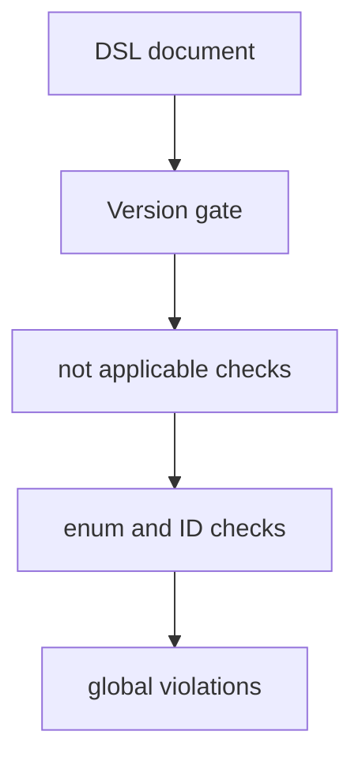

副作用：
- 不写入文件；只返回校验结果或抛出调用方处理的异常。

| 条件 | 行为 |
| --- | --- |
| dsl_version 不是 0.2.0 | require_v2_dsl_version 抛出 ValueError，调用方转换为错误码或渲染错误。 |

使用方：
- validate_dsl.py
- render_markdown.py
- verify_v2_mermaid_gates.py

#### 4.3.6 实现机制说明

先检查版本，再组合 not_applicable、枚举、位置、ID、diagram/table 和依赖前缀规则。

| 机制 | 用途 | 输入 | 处理方式 | 输出 | 结构意义 |
| --- | --- | --- | --- | --- | --- |
| V2 全局规则聚合 | 把分散的全局语义约束汇总为调用方可消费的违规列表。 | DSL document | 依次运行 not_applicable、reason 字段、枚举、location、ID 作用域、diagram/table ID 和 dependency prefix 检查。 | RuleViolation 列表 | 让校验器、渲染器和 Mermaid 门禁共享同一套基础约束。 |

###### 4.3.6.1 V2 全局规则聚合

**全局规则说明**

共享规则模块不读取文件，只面向已解析的 DSL 对象工作；调用方负责加载 JSON、选择错误码和输出格式。

**全局规则类别**

| 规则 | 目的 |
| --- | --- |
| require_v2_dsl_version | 拒绝非 0.2.0 DSL。 |
| not_applicable_mapping_violations | 检查内容与 not_applicable_reason 互斥。 |
| id_scope_violations | 检查定义型 ID 和引用型 ID 的作用域。 |

#### 4.3.7 已知限制

共享规则模块自身不提供完整 CLI。

| 限制 | 影响 | 缓解/后续 |
| --- | --- | --- |
| 调用方必须负责加载 JSON 和错误输出。 | 单独运行该文件不会产生用户可见校验报告。 | 通过 validate_dsl.py、render_markdown.py 或 verify_v2_mermaid_gates.py 调用。 |

### 4.4 DSL 校验器模块

#### 4.4.1 模块定位与源码/产物范围

读取结构设计 DSL JSON，执行 V2 版本门禁、JSON Schema 校验、模块模型语义校验、内容块检查、引用解析、文本安全和支持数据检查。

覆盖 validate_dsl.py 入口以及 V2 Phase 2/3 语义扩展模块。

| 文件 | 角色 | 语言 | 备注 |
| --- | --- | --- | --- |
| scripts/validate_dsl.py | DSL 校验 CLI 和 ValidationContext | python |  |
| scripts/v2_phase2.py | Chapter 4 V2 模块模型语义检查 | python |  |
| scripts/v2_phase3.py | 内容块语义检查 | python |  |

消费输入：
- structure.dsl.json
- schemas/structure-design.schema.json
- V2 共享规则模块

拥有输出：
- Validation succeeded
- schema/semantic warnings and errors

不负责范围：
- 不渲染 Markdown
- 不调用 Mermaid CLI
- 不推理仓库缺失内容

#### 4.4.2 配置

校验器配置来自命令行参数。

| 原型 | 当前/默认值 | 来源 | 含义 |
| --- | --- | --- | --- |
| dsl_file | 必填路径参数 | cli_argument | 指定待校验的 DSL JSON 文件。 |
| --allow-long-snippets | False | default | 源码片段超过 50 行时是否降级为警告。 |

#### 4.4.3 依赖

校验器依赖 Python、jsonschema、DSL schema 和 V2 共享规则。

| 名称 | 类型 | 关系 | 用途 | 失败行为 |
| --- | --- | --- | --- | --- |
| Python 3 | runtime | uses | 运行校验脚本。 | 命令无法启动。 |
| jsonschema | library | validates_against | 执行 Draft 2020-12 JSON Schema 校验。 | schema 校验不可用。 |
| DSL Schema 模块 | internal_module | validates_against | 提供结构契约。 | 无法判断 DSL 结构是否符合 schema。 |
| V2 共享规则模块 | internal_module | imports | 复用版本门禁和全局规则。 | V2 全局语义规则不可用。 |

#### 4.4.4 数据对象

校验器消费 DSL 和 schema，并产出校验报告。

| 名称 | 类型 | 角色 | 生产方 | 消费方 | 结构/契约 |
| --- | --- | --- | --- | --- | --- |
| structure.dsl.json | json | 校验输入 | Codex 或上游分析者 | DSL 校验器模块 | 符合 V2 DSL schema 的 JSON 文档 |
| ValidationReport | python object/stdout | 校验输出 | DSL 校验器模块 | Codex、测试模块、维护者 | 包含 errors 和 warnings |

#### 4.4.5 对外接口

通过 validate_dsl.py CLI 暴露校验能力。

| 接口名称 | 接口功能描述 | 接口类型 |
| --- | --- | --- |
| validate_dsl.py | 校验 DSL JSON 的 schema、V2 全局规则、模块模型、内容块、引用、安全文本和支持数据。 | command_line |

##### 4.4.5.1 validate_dsl.py

原型：python3 scripts/validate_dsl.py structure.dsl.json [--allow-long-snippets]

用途：校验 DSL JSON 的 schema、V2 全局规则、模块模型、内容块、引用、安全文本和支持数据。

位置：scripts/validate_dsl.py#main

| 参数名 | 参数类型 | 参数描述 | 输入/输出 |
| --- | --- | --- | --- |
| dsl_file | path | 待校验的 structure DSL JSON 文件。 | input |
| --allow-long-snippets | flag | 允许超过 50 行的源码片段降级为警告。 | input |

| 返回名 | 返回类型 | 描述 | 条件 |
| --- | --- | --- | --- |
| exit_code | int | 0 表示成功，1 表示语义错误，2 表示输入或版本错误。 | 命令结束时返回。 |

validate_dsl.py 执行流程

展示 validate_dsl.py 的命令行处理路径。

<!-- diagram-id: MER-IFACE-DSL-VALIDATE-CLI -->
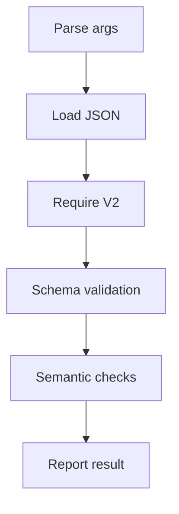

副作用：
- 读取 DSL 文件。
- 向 stdout 或 stderr 输出校验结果。

| 条件 | 行为 |
| --- | --- |
| 文件不存在或 JSON 无效 | 输出输入错误并返回 2。 |
| schema 或语义校验失败 | 输出错误报告并返回非 0。 |

使用方：
- Codex
- 测试模块
- 仓库维护者

#### 4.4.6 实现机制说明

校验过程按版本门禁、schema 校验、上下文注册、章节语义和支持数据安全检查推进。

| 机制 | 用途 | 输入 | 处理方式 | 输出 | 结构意义 |
| --- | --- | --- | --- | --- | --- |
| DSL 校验管线 | 阻止不符合契约的 DSL 输入进入渲染和 Mermaid 门禁。 | DSL JSON 文件 | 读取 JSON，执行 V2 版本检查、schema_errors、ValidationContext 注册和 run_semantic_checks。 | 成功消息、警告或错误报告 | 保证后续渲染器面对的 DSL 字段、ID 和引用稳定。 |

###### 4.4.6.1 DSL 校验管线

**校验管线说明**

validate_dsl.py 先加载 JSON 并拒绝非 V2 输入，再执行 schema 校验；schema 通过后注册 ID、检查章节规则、支持数据引用、源码片段安全和 Markdown 安全文本。

**校验阶段**

| 阶段 | 职责 |
| --- | --- |
| Version | 拒绝非 dsl_version 0.2.0。 |
| Schema | 使用 Draft202012Validator 检查结构形状。 |
| Semantics | 检查 ID、引用、章节内容、安全文本和低置信度项。 |

#### 4.4.7 已知限制

校验器只检查 DSL，不补充内容。

| 限制 | 影响 | 缓解/后续 |
| --- | --- | --- |
| validate_dsl.py 不证明 Mermaid 可渲染性。 | 仍需运行 Mermaid strict gate。 | 使用 verify_v2_mermaid_gates.py 执行前后置门禁。 |
| 校验器不会从源码推理缺失模块或流程。 | DSL 缺少内容时只能报错或渲染已给出的内容。 | 在进入技能前完成仓库理解。 |

### 4.5 Mermaid 校验与门禁模块

#### 4.5.1 模块定位与源码/产物范围

提取 DSL 或 Markdown 中的 Mermaid 图，执行静态和严格校验，并用 V2 门禁检查可读性复核工件与渲染完整性。

覆盖 Mermaid 校验 CLI、V2 期望图收集与门禁 CLI。

| 文件 | 角色 | 语言 | 备注 |
| --- | --- | --- | --- |
| scripts/validate_mermaid.py | Mermaid 静态和严格校验 CLI | python |  |
| scripts/v2_phase4.py | 期望图收集、复核工件和渲染完整性规则 | python |  |
| scripts/verify_v2_mermaid_gates.py | V2 Mermaid 门禁 CLI | python |  |

消费输入：
- structure.dsl.json
- rendered Markdown
- mermaid-readability-review.json
- node/mmdc 环境

拥有输出：
- Mermaid validation succeeded
- pre-render/post-render gate result
- 临时 mmd/svg 验证产物

不负责范围：
- 不把 SVG/PNG 作为最终交付
- 不替代人工或独立可读性复核
- 不修复 Mermaid 源

#### 4.5.2 配置

Mermaid 校验与门禁通过 CLI 参数选择输入来源、严格模式和工作目录。

| 原型 | 当前/默认值 | 来源 | 含义 |
| --- | --- | --- | --- |
| --from-dsl 或 --from-markdown | 二选一必填 | cli_argument | 指定 Mermaid 图来源。 |
| --strict | 默认 strict，--static 显式静态 | default | 控制 Mermaid CLI 是否参与校验。 |
| --work-dir | 严格模式必填或由门禁拼接 | cli_argument | 保存严格校验 mmd/svg 临时产物。 |
| --mermaid-review-artifact | V2 门禁必填 | cli_argument | 绑定可读性复核工件。 |

#### 4.5.3 依赖

严格校验依赖 Python、Node、mmdc、V2 共享规则和 Mermaid 规则文档。

| 名称 | 类型 | 关系 | 用途 | 失败行为 |
| --- | --- | --- | --- | --- |
| Python 3 | runtime | uses | 运行 Mermaid 校验脚本。 | 命令无法启动。 |
| node | tool | invokes | 运行 Mermaid CLI。 | 严格校验无法执行。 |
| mmdc | tool | invokes | 将 Mermaid 源交给 Mermaid CLI 解析。 | 严格校验无法作为最终门禁通过。 |
| V2 共享规则模块 | internal_module | imports | 门禁复用 V2 版本和全局规则。 | 门禁无法先行拒绝无效 DSL。 |

#### 4.5.4 数据对象

该模块消费 Mermaid 源和复核工件，并生成临时校验产物。

| 名称 | 类型 | 角色 | 生产方 | 消费方 | 结构/契约 |
| --- | --- | --- | --- | --- | --- |
| MermaidDiagram 列表 | python dataclass list | 校验输入模型 | Mermaid 校验器模块 | 静态校验和严格校验 | diagram_id、source、diagram_type、json_path 或 markdown block index |
| mermaid-readability-review.json | json | 可读性复核工件 | Codex 工作流 | V2 Mermaid 门禁 | artifact_schema_version 1.0，覆盖每个 expected diagram id |
| 严格校验临时产物 | mmd/svg | 验证产物 | validate_mermaid.py | Codex 和维护者 | --work-dir 下的 pre-render/post-render 临时文件，不是最终交付物 |

#### 4.5.5 对外接口

提供基础 Mermaid 校验 CLI 和 V2 门禁 CLI。

| 接口名称 | 接口功能描述 | 接口类型 |
| --- | --- | --- |
| validate_mermaid.py | 从 DSL 或 Markdown 中提取 Mermaid 图并执行静态或严格校验。 | command_line |
| verify_v2_mermaid_gates.py | 验证 V2 DSL 全局规则、Mermaid 可读性复核工件、预渲染严格校验、渲染后完整性和严格 Markdown Mermaid 校验。 | command_line |

##### 4.5.5.1 validate_mermaid.py

原型：python3 scripts/validate_mermaid.py --from-dsl structure.dsl.json --strict --work-dir &lt;dir&gt;

用途：从 DSL 或 Markdown 中提取 Mermaid 图并执行静态或严格校验。

位置：scripts/validate_mermaid.py#main

| 参数名 | 参数类型 | 参数描述 | 输入/输出 |
| --- | --- | --- | --- |
| --from-dsl | path | 从 DSL JSON 中提取图。 | input |
| --from-markdown | path | 从渲染后的 Markdown 中提取图。 | input |
| --strict | flag | 调用本地 Mermaid CLI 验证可渲染性。 | input |
| --work-dir | path | 严格校验临时产物目录。 | input |

| 返回名 | 返回类型 | 描述 | 条件 |
| --- | --- | --- | --- |
| exit_code | int | 0 表示 Mermaid 校验成功，非 0 表示环境或图源错误。 | 命令结束时返回。 |

validate_mermaid.py 执行流程

展示 validate_mermaid.py 的命令行处理路径。

<!-- diagram-id: MER-IFACE-MERMAID-VALIDATE-CLI -->
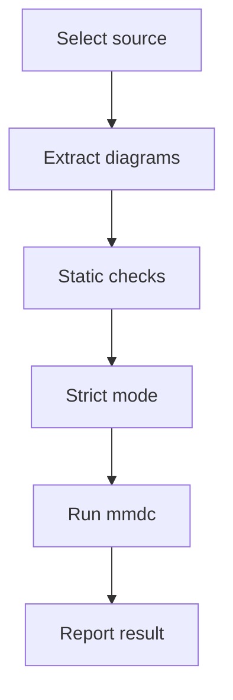

副作用：
- 读取 DSL 或 Markdown 文件。
- 严格模式下写入临时 mmd/svg 验证产物。

| 条件 | 行为 |
| --- | --- |
| 图源含 DOT 或不支持类型 | 报告静态校验错误并返回 1。 |
| node 或 mmdc 缺失 | 严格模式返回错误，不能作为最终门禁通过。 |

使用方：
- Codex
- V2 Mermaid 门禁 CLI
- 测试模块

##### 4.5.5.2 verify_v2_mermaid_gates.py

原型：python3 scripts/verify_v2_mermaid_gates.py structure.dsl.json --mermaid-review-artifact review.json --pre-render --work-dir &lt;dir&gt;

用途：验证 V2 DSL 全局规则、Mermaid 可读性复核工件、预渲染严格校验、渲染后完整性和严格 Markdown Mermaid 校验。

位置：scripts/verify_v2_mermaid_gates.py#main

| 参数名 | 参数类型 | 参数描述 | 输入/输出 |
| --- | --- | --- | --- |
| dsl_file | path | V2 DSL JSON 文件。 | input |
| --mermaid-review-artifact | path | Mermaid 可读性复核 JSON 工件。 | input |
| --pre-render 或 --post-render | mode | 选择预渲染或渲染后门禁。 | input |
| --rendered-markdown | path | post-render 模式下的 Markdown 输出文件。 | input |

| 返回名 | 返回类型 | 描述 | 条件 |
| --- | --- | --- | --- |
| exit_code | int | 0 表示门禁通过，1 表示校验失败，2 表示输入或版本错误。 | 命令结束时返回。 |

verify_v2_mermaid_gates.py 执行流程

展示 verify_v2_mermaid_gates.py 的命令行处理路径。

<!-- diagram-id: MER-IFACE-MERMAID-GATE-CLI -->
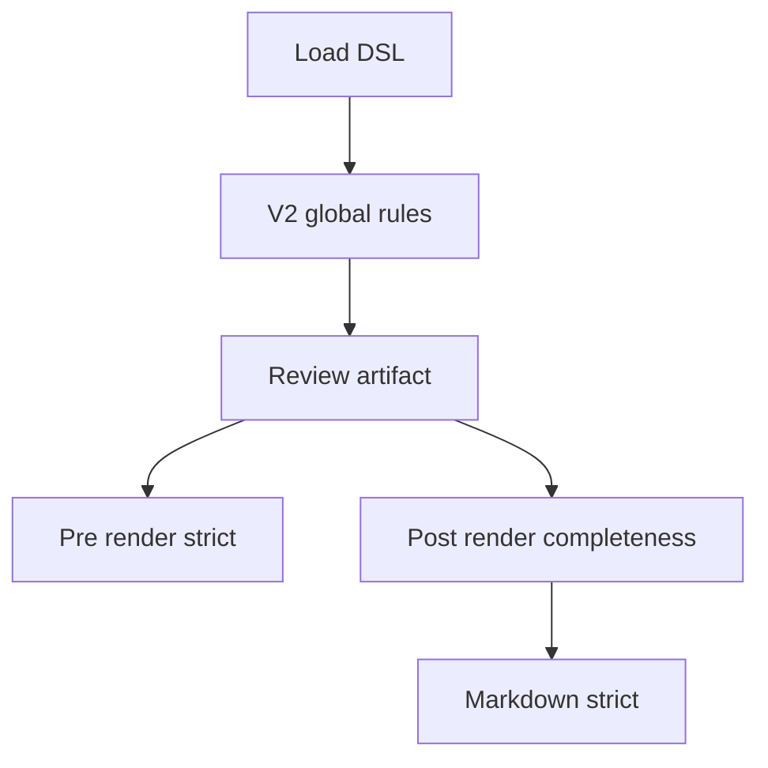

副作用：
- 读取 DSL、复核工件和可选 Markdown。
- 调用 validate_mermaid.py 并写入严格校验临时产物。

| 条件 | 行为 |
| --- | --- |
| 复核工件缺失、损坏或覆盖不完整 | 返回错误并阻止 Mermaid 严格门禁继续。 |
| post-render 缺少 rendered Markdown | argparse 报错。 |

使用方：
- Codex
- 测试模块

#### 4.5.6 实现机制说明

先执行 Mermaid 静态检查；严格模式检查 node/mmdc 并调用 mmdc；V2 门禁在此基础上验证可读性复核和渲染完整性。

| 机制 | 用途 | 输入 | 处理方式 | 输出 | 结构意义 |
| --- | --- | --- | --- | --- | --- |
| Mermaid 静态与严格校验 | 证明图源属于支持的 Mermaid MVP 类型，并在严格模式下可由本地 Mermaid CLI 解析。 | DSL 或 Markdown Mermaid 源 | 提取图、拒绝 DOT/不支持类型、检查严格工具、写入 mmd 并调用 mmdc。 | Mermaid 校验报告 | 保证最终 Markdown 中 Mermaid fence 的可渲染性。 |
| V2 Mermaid 门禁 | 把可读性复核、预渲染严格校验、渲染后完整性和严格 Markdown 校验串联。 | DSL、复核工件、可选 Markdown | 验证复核工件绑定同一 DSL，收集 expected diagrams，检查 diagram-id 元数据，再调用 Mermaid 校验。 | pre-render 或 post-render gate result | 防止 DSL 中的图被遗漏或只靠标题匹配误判。 |

###### 4.5.6.1 Mermaid 静态与严格校验

**Mermaid 校验说明**

validate_mermaid.py 支持从 DSL 或 Markdown 提取 flowchart、graph、sequenceDiagram、classDiagram、stateDiagram-v2，并在 strict 模式下调用 mmdc。

**Mermaid 校验层次**

| 层次 | 含义 |
| --- | --- |
| static | 检查图源类型、空内容、DOT 语法和 Markdown fence。 |
| strict | 在 static 通过后调用本地 Mermaid CLI。 |

###### 4.5.6.2 V2 Mermaid 门禁

**V2 门禁说明**

verify_v2_mermaid_gates.py 要求复核工件先覆盖 expected diagrams；post-render 模式还要求每个 expected diagram 在 Markdown 中以相邻 diagram-id 注释绑定到 Mermaid fence。

#### 4.5.7 已知限制

Mermaid 严格校验受本地环境影响。

| 限制 | 影响 | 缓解/后续 |
| --- | --- | --- |
| strict validation 依赖 node、mmdc 和其浏览器运行环境。 | 工具缺失或浏览器无法启动时，最终 Mermaid 门禁无法完整通过。 | 先运行 --check-env；若只能 static，需要用户明确接受该限制。 |
| 严格校验产物不是最终交付物。 | 不能把 svg/png 作为结构设计说明书输出。 | 最终只交付 Markdown Mermaid fence。 |

### 4.6 Markdown 渲染器模块

#### 4.6.1 模块定位与源码/产物范围

把 V2 DSL 渲染为固定 9 章 Markdown，处理章节编号、表格列、Mermaid fence、diagram-id 元数据、支持数据显示模式和输出文件写入策略。

该模块由 render_markdown.py 承载，是最终 Markdown 输出入口。

| 文件 | 角色 | 语言 | 备注 |
| --- | --- | --- | --- |
| scripts/render_markdown.py | Markdown 渲染 CLI 和渲染函数 | python |  |

消费输入：
- 通过准备和校验的 V2 DSL JSON
- 输出目录参数
- evidence-mode 参数

拥有输出：
- document.output_file 指定的 Markdown 文件

不负责范围：
- 不执行完整 schema 校验
- 不调用 Mermaid CLI
- 默认不覆盖已有输出文件

#### 4.6.2 配置

渲染器配置来自命令行参数和 DSL document.output_file。

| 原型 | 当前/默认值 | 来源 | 含义 |
| --- | --- | --- | --- |
| --output-dir | . | default | 指定 Markdown 输出目录。 |
| --evidence-mode | hidden | default | 控制支持数据隐藏或 inline 渲染。 |
| --overwrite 或 --backup | 默认拒绝覆盖 | default | 控制目标文件存在时的写入行为。 |

#### 4.6.3 依赖

渲染器依赖 Python、V2 共享规则和文件系统。

| 名称 | 类型 | 关系 | 用途 | 失败行为 |
| --- | --- | --- | --- | --- |
| Python 3 | runtime | uses | 运行渲染脚本。 | 命令无法启动。 |
| V2 共享规则模块 | internal_module | imports | 复用 V2 版本和 not_applicable 全局规则。 | 渲染前基础规则无法检查。 |
| 文件系统 | filesystem | writes | 读取 DSL 并写出 Markdown。 | 输入读取或输出写入失败。 |

#### 4.6.4 数据对象

渲染器读取 DSL，构建支持数据上下文并写出 Markdown。

| 名称 | 类型 | 角色 | 生产方 | 消费方 | 结构/契约 |
| --- | --- | --- | --- | --- | --- |
| V2 DSL document | json | 渲染输入 | Codex 或上游分析者 | Markdown 渲染器模块 | 符合 dsl_version 0.2.0 的结构设计 DSL |
| SupportContext | python dataclass | 支持数据上下文 | Markdown 渲染器模块 | 章节渲染函数 | 包含 evidence、traceability、source snippets 的索引和 evidence_mode |
| 结构设计 Markdown | markdown | 最终输出 | Markdown 渲染器模块 | 用户和仓库维护者 | 固定 9 章，diagram-id 注释紧邻 Mermaid fence |

#### 4.6.5 对外接口

通过 render_markdown.py CLI 暴露最终 Markdown 渲染能力。

| 接口名称 | 接口功能描述 | 接口类型 |
| --- | --- | --- |
| render_markdown.py | 把通过准备和校验的 V2 DSL 渲染为单个模块或系统专属 Markdown 文件。 | command_line |

##### 4.6.5.1 render_markdown.py

原型：python3 scripts/render_markdown.py structure.dsl.json --output-dir &lt;dir&gt; [--evidence-mode hidden\|inline]

用途：把通过准备和校验的 V2 DSL 渲染为单个模块或系统专属 Markdown 文件。

位置：scripts/render_markdown.py#main

| 参数名 | 参数类型 | 参数描述 | 输入/输出 |
| --- | --- | --- | --- |
| dsl_file | path | 待渲染的 V2 DSL JSON 文件。 | input |
| --output-dir | path | 输出 Markdown 文件目录。 | input |
| --evidence-mode | enum | hidden 为默认值，inline 会渲染支持数据。 | input |
| --overwrite 或 --backup | flag | 控制目标文件存在时的写入策略。 | input |

| 返回名 | 返回类型 | 描述 | 条件 |
| --- | --- | --- | --- |
| exit_code | int | 0 表示 Markdown 写入成功，非 0 表示输入或写入失败。 | 命令结束时返回。 |

render_markdown.py 执行流程

展示 render_markdown.py 的命令行处理路径。

<!-- diagram-id: MER-IFACE-RENDER-CLI -->
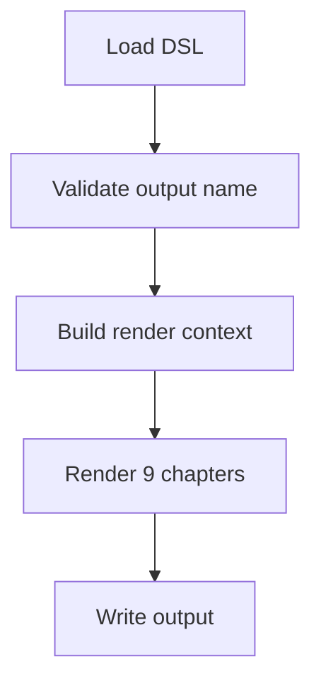

副作用：
- 读取 DSL 文件。
- 写入 document.output_file 指定的 Markdown 文件。
- 使用 --backup 时写入备份文件。

| 条件 | 行为 |
| --- | --- |
| output_file 泛化或含路径片段 | 返回输入错误且不写文件。 |
| 目标文件已存在且未指定覆盖策略 | 返回写入错误并提示使用 --overwrite 或 --backup。 |

使用方：
- Codex
- 仓库维护者
- 技能使用者

#### 4.6.6 实现机制说明

渲染器先检查 output_file 具体性，再构建显示名和支持数据上下文，按九章顺序拼接 Markdown，最后应用写入策略。

| 机制 | 用途 | 输入 | 处理方式 | 输出 | 结构意义 |
| --- | --- | --- | --- | --- | --- |
| Markdown 渲染管线 | 把 DSL 内容确定性转为固定 9 章 Markdown。 | V2 DSL document | validate_output_filename、build_support_context、render_chapter_1 至 render_chapter_9、write_output。 | Markdown 文件 | 集中控制章节结构、表格列、转义、支持数据和输出文件安全。 |

###### 4.6.6.1 Markdown 渲染管线

**渲染管线说明**

render_markdown.py 使用固定函数渲染 1 到 9 章，默认隐藏 evidence 支持块，同时始终为 Mermaid fence 输出 diagram-id 注释。

**渲染关键职责**

| 职责 | 实现 |
| --- | --- |
| 章节结构 | render_chapter_1 到 render_chapter_9。 |
| 输出安全 | validate_output_filename 和 write_output。 |
| Mermaid 元数据 | render_diagram_id_comment。 |

#### 4.6.7 已知限制

渲染器聚焦 Markdown 输出。

| 限制 | 影响 | 缓解/后续 |
| --- | --- | --- |
| render_markdown.py 不替代 validate_dsl.py 的完整 schema/语义校验。 | 直接渲染未校验 DSL 时可能只触发部分运行时错误。 | 正式流程先运行 validate_dsl.py。 |
| 默认拒绝覆盖已有输出文件。 | 目标文件存在时需要明确 --overwrite 或 --backup。 | 本次输出目标不存在时使用默认写入策略。 |

### 4.7 安装器模块

#### 4.7.1 模块定位与源码/产物范围

提供 copy-only 本地技能安装能力，验证源仓库结构，解析 Codex home，报告依赖状态，并在目标不存在时复制运行时白名单条目。

覆盖安装脚本和安装说明文档。

| 文件 | 角色 | 语言 | 备注 |
| --- | --- | --- | --- |
| scripts/install_skill.py | copy-only 安装 CLI | python |  |
| docs/install.md | 安装和依赖说明 | markdown |  |

消费输入：
- 仓库运行时文件
- --codex-home 参数
- CODEX_HOME 环境变量

拥有输出：
- $CODEX_HOME/skills/create-structure-md 安装副本
- 安装计划和依赖状态报告

不负责范围：
- 不覆盖已有安装
- 不安装 Python 或 Node 依赖
- 不自动删除失败产物

#### 4.7.2 配置

安装器配置来自 CLI 参数和环境变量。

| 原型 | 当前/默认值 | 来源 | 含义 |
| --- | --- | --- | --- |
| --dry-run | False | default | 只打印计划，不写入目标目录。 |
| --codex-home 或 CODEX_HOME | ~/.codex | default | 决定目标 skills/create-structure-md 路径。 |

#### 4.7.3 依赖

安装器依赖 Python 和文件系统；依赖状态报告会探测 jsonschema、node 和 mmdc。

| 名称 | 类型 | 关系 | 用途 | 失败行为 |
| --- | --- | --- | --- | --- |
| Python 3 | runtime | uses | 运行安装脚本。 | 命令无法启动。 |
| 文件系统 | filesystem | writes | 创建安装目标并复制运行时条目。 | 安装失败并提示人工检查。 |

#### 4.7.4 数据对象

安装器消费运行时文件白名单并产出安装目录。

| 名称 | 类型 | 角色 | 生产方 | 消费方 | 结构/契约 |
| --- | --- | --- | --- | --- | --- |
| RUNTIME_ENTRIES | python tuple | 复制白名单 | 安装器模块 | copy_skill | SKILL.md、requirements.txt、references、schemas、scripts、examples |
| 安装目标目录 | directory | 安装产物 | 安装器模块 | Codex runtime | $CODEX_HOME/skills/create-structure-md |

#### 4.7.5 对外接口

通过 install_skill.py CLI 暴露安装能力。

| 接口名称 | 接口功能描述 | 接口类型 |
| --- | --- | --- |
| install_skill.py | 把仓库运行时白名单文件复制到 Codex skills 目录，并报告依赖状态。 | command_line |

##### 4.7.5.1 install_skill.py

原型：python3 scripts/install_skill.py [--dry-run] [--codex-home &lt;dir&gt;]

用途：把仓库运行时白名单文件复制到 Codex skills 目录，并报告依赖状态。

位置：scripts/install_skill.py#main

| 参数名 | 参数类型 | 参数描述 | 输入/输出 |
| --- | --- | --- | --- |
| --dry-run | flag | 只打印安装计划，不创建目标目录。 | input |
| --codex-home | path | 显式指定 Codex home；否则读取 CODEX_HOME 或 ~/.codex。 | input |

| 返回名 | 返回类型 | 描述 | 条件 |
| --- | --- | --- | --- |
| exit_code | int | 0 表示 dry-run 或安装成功，1 表示源或目标检查失败。 | 命令结束时返回。 |

install_skill.py 执行流程

展示 install_skill.py 的命令行处理路径。

<!-- diagram-id: MER-IFACE-INSTALL-CLI -->
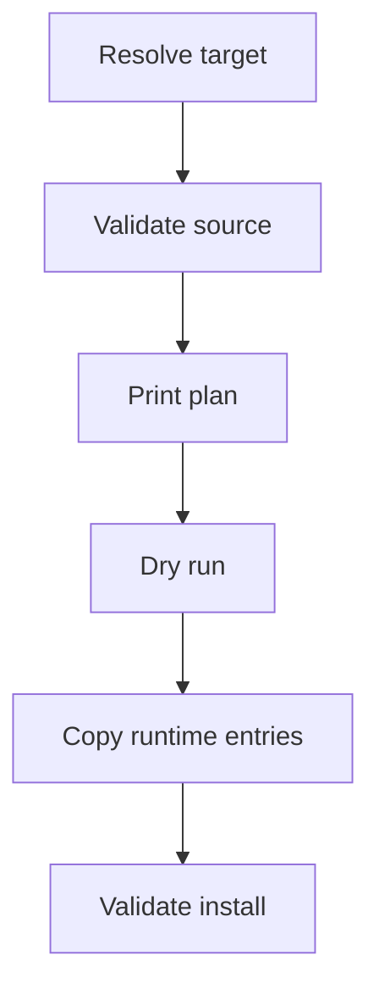

副作用：
- 读取源文件。
- 非 dry-run 且目标不存在时创建目标目录并复制白名单条目。

| 条件 | 行为 |
| --- | --- |
| 目标技能目录已存在 | 失败退出并打印用户可自行执行的清理命令。 |
| 复制中途失败 | 提示人工检查并给出用户审查后执行的清理命令。 |

使用方：
- 仓库维护者
- 技能安装者

#### 4.7.6 实现机制说明

安装器先验证源结构，再打印计划和依赖状态；非 dry-run 且目标不存在时创建目录并复制白名单。

| 机制 | 用途 | 输入 | 处理方式 | 输出 | 结构意义 |
| --- | --- | --- | --- | --- | --- |
| copy-only 安装流程 | 把仓库运行时技能文件复制到 Codex skills 目录。 | 仓库根目录和目标 Codex home | validate_source、print_plan、collect_dependency_status、copy_skill、validate_source(target)。 | 安装目录或错误报告 | 保守避免覆盖已有目标，降低本地技能安装风险。 |

###### 4.7.6.1 copy-only 安装流程

**安装流程说明**

install_skill.py 在复制前验证源仓库必需文件和 references 引用，目标已存在时失败并打印用户可自行执行的清理命令。

**运行时白名单**

| 条目 | 用途 |
| --- | --- |
| SKILL.md | 技能入口。 |
| references/ | 技能规则文档。 |
| schemas/ | DSL schema。 |
| scripts/ | 校验、渲染和安装脚本。 |
| examples/ | V2 DSL 示例。 |

#### 4.7.7 已知限制

安装器刻意保守。

| 限制 | 影响 | 缓解/后续 |
| --- | --- | --- |
| 不提供 --force、覆盖、合并或符号链接安装。 | 已有目标时需要用户自行审查和清理。 | 先运行 --dry-run 查看目标路径。 |
| 不自动安装 Python 或 Mermaid 依赖。 | 安装完成不代表严格 Mermaid 校验环境可用。 | 按 docs/install.md 手动安装 requirements 和 Mermaid CLI。 |

### 4.8 示例与测试模块

#### 4.8.1 模块定位与源码/产物范围

提供 V2 DSL 示例、拒绝 fixture 和 unittest 测试，覆盖 schema、语义、Mermaid、渲染、安装、文档契约和端到端流程。

覆盖 examples、tests、fixtures 和历史设计/计划资料。

| 文件 | 角色 | 语言 | 备注 |
| --- | --- | --- | --- |
| examples/minimal-from-code.dsl.json | 从代码场景生成的最小 V2 DSL 示例 | json |  |
| examples/minimal-from-requirements.dsl.json | 从需求场景生成的最小 V2 DSL 示例 | json |  |
| tests/ | unittest 测试集合 | python |  |
| docs/superpowers/specs/ | V2 设计规格和分阶段规格 | markdown |  |
| docs/superpowers/plans/ | V2 分阶段执行计划 | markdown |  |

消费输入：
- 脚本模块
- schema
- examples
- fixtures
- 本地 Mermaid CLI 环境

拥有输出：
- 测试结果
- .codex-tmp 下保留的测试产物
- 示例渲染输出

不负责范围：
- 不作为生产安装产物复制 tests/docs
- 不替代用户验收

#### 4.8.2 配置

测试运行参数来自 unittest 命令。

| 原型 | 当前/默认值 | 来源 | 含义 |
| --- | --- | --- | --- |
| -s tests | tests | default | 指定测试发现目录。 |
| -v | 可选 | cli_argument | 输出详细测试名称。 |

#### 4.8.3 依赖

测试模块依赖 Python unittest、被测脚本、示例和可选 Mermaid strict 环境。

| 名称 | 类型 | 关系 | 用途 | 失败行为 |
| --- | --- | --- | --- | --- |
| Python 3 | runtime | uses | 运行 unittest。 | 测试命令无法启动。 |
| unittest | library | uses | 发现和运行测试用例。 | 测试无法执行。 |
| V2 DSL 示例 | test_fixture | consumes | 验证示例可校验、可渲染。 | 示例契约回归无法覆盖。 |
| mmdc | tool | invokes | 运行严格 Mermaid 相关端到端测试。 | 严格 Mermaid 测试失败或跳过。 |

#### 4.8.4 数据对象

测试模块拥有示例、fixture 和保留测试产物。

| 名称 | 类型 | 角色 | 生产方 | 消费方 | 结构/契约 |
| --- | --- | --- | --- | --- | --- |
| V2 DSL examples | json | 测试 fixture 和用户参考样例 | 示例与测试模块 | validate_dsl、render_markdown、测试模块 | dsl_version 0.2.0 示例 |
| tests/fixtures | json | 测试 fixture | 示例与测试模块 | unittest 测试 | 包含 valid-v2-foundation 和 rejected-v1-phase2 |
| .codex-tmp 测试产物 | directory | 保留验证产物 | 端到端测试 | 维护者 | 测试说明明确保留产物，清理需用户执行命令 |

#### 4.8.5 对外接口

通过 unittest discover 工作流暴露测试执行入口。

| 接口名称 | 接口功能描述 | 接口类型 |
| --- | --- | --- |
| unittest discover | 发现并执行 tests 目录中的契约测试和端到端测试。 | command_line |

##### 4.8.5.1 unittest discover

原型：python3 -m unittest discover -s tests -v

用途：发现并执行 tests 目录中的契约测试和端到端测试。

位置：tests/#main

| 参数名 | 参数类型 | 参数描述 | 输入/输出 |
| --- | --- | --- | --- |
| -s tests | path | 测试发现目录。 | input |
| -v | flag | 输出详细测试名称。 | input |

| 返回名 | 返回类型 | 描述 | 条件 |
| --- | --- | --- | --- |
| exit_code | int | 0 表示测试全部通过，非 0 表示失败或错误。 | 测试运行结束时返回。 |

unittest discover 执行流程

展示 unittest discover 的命令行处理路径。

<!-- diagram-id: MER-IFACE-TEST-WORKFLOW -->
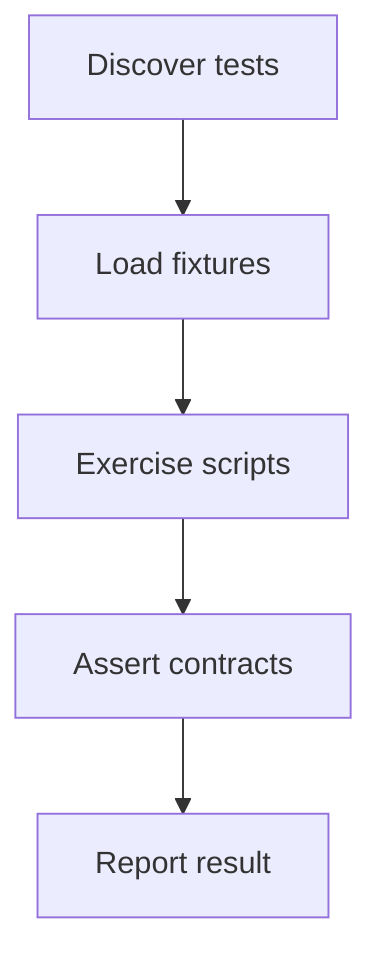

副作用：
- 读取 tests、examples、fixtures 和脚本文件。
- 部分端到端测试会在 .codex-tmp 下保留测试产物。

| 条件 | 行为 |
| --- | --- |
| 断言失败 | unittest 报告失败用例和 traceback。 |
| 严格 Mermaid 环境不可用 | 相关测试按探测结果失败或跳过。 |

使用方：
- 仓库维护者
- CI 或本地测试运行者

#### 4.8.6 实现机制说明

测试用例通过 importlib 加载脚本模块，构造或读取 fixture，调用 main 或 subprocess，断言错误码、输出文本和渲染结构。

| 机制 | 用途 | 输入 | 处理方式 | 输出 | 结构意义 |
| --- | --- | --- | --- | --- | --- |
| 契约测试编排 | 保护 DSL、渲染、Mermaid、安装和文档规则不回归。 | tests、examples、scripts | 测试加载模块、运行 CLI、生成临时目录、比较输出和错误消息。 | unittest 成功或失败报告 | 把技能契约变成可执行回归保护。 |

###### 4.8.6.1 契约测试编排

**测试编排说明**

测试集合覆盖 V2 foundation、Chapter 4 模块模型、内容块、Mermaid 门禁、示例文档、安装器和端到端工作流；部分测试会保留 .codex-tmp 产物供人工审查。

**测试覆盖范围**

| 范围 | 代表测试 |
| --- | --- |
| DSL 校验 | test_validate_dsl.py, test_validate_dsl_semantics.py |
| V2 模型 | test_v2_foundation_rules.py, test_v2_phase2_module_model.py, test_v2_phase3_content_blocks.py |
| 渲染与 Mermaid | test_render_markdown.py, test_validate_mermaid.py, test_v2_phase4_renderer_and_mermaid_gates.py |
| 安装和端到端 | test_install_skill.py, test_phase7_e2e.py |

#### 4.8.7 已知限制

测试受本地工具环境影响。

| 限制 | 影响 | 缓解/后续 |
| --- | --- | --- |
| 严格 Mermaid 测试依赖本地 node/mmdc 和浏览器运行环境。 | 环境异常会导致相关测试失败或跳过。 | 先用 validate_mermaid.py --check-env 探测。 |
| 测试和本次生成都会保留 .codex-tmp 产物。 | 工作区可能出现较多临时文件，需要人工判断是否清理。 | 遵守不删除约束，只报告路径和可选清理命令。 |

## 5. 运行时视图

### 5.1 运行时概述

系统无常驻进程；运行时由一组 Python CLI 命令构成，典型生成路径是准备 DSL、校验 DSL、执行 Mermaid pre-render gate、渲染 Markdown、执行 post-render gate。

### 5.2 运行单元说明

| 运行单元 | 类型 | 入口 | 职责 | 关联模块 | 备注 |
| --- | --- | --- | --- | --- | --- |
| DSL 校验命令 | CLI command | python3 scripts/validate_dsl.py | 校验 V2 DSL 结构和语义。 | DSL 校验器模块、DSL Schema 模块、V2 共享规则模块 | 无常驻进程。 |
| Mermaid 门禁命令 | CLI command | python3 scripts/verify_v2_mermaid_gates.py | 执行 pre-render 和 post-render Mermaid 门禁。 | Mermaid 校验与门禁模块、V2 共享规则模块 | 严格模式会写入临时验证产物。 |
| Markdown 渲染命令 | CLI command | python3 scripts/render_markdown.py | 生成最终结构设计 Markdown 文件。 | Markdown 渲染器模块、V2 共享规则模块 | 默认不覆盖已有输出文件。 |
| 技能安装命令 | CLI command | python3 scripts/install_skill.py | 复制运行时技能文件到 Codex skills 目录。 | 安装器模块、技能契约与参考文档模块、DSL Schema 模块、DSL 校验器模块、Mermaid 校验与门禁模块、Markdown 渲染器模块 | dry-run 不写文件。 |
| unittest 测试命令 | CLI command | python3 -m unittest discover -s tests -v | 运行仓库回归测试。 | 示例与测试模块、DSL Schema 模块、DSL 校验器模块、Mermaid 校验与门禁模块、Markdown 渲染器模块、安装器模块 | 部分测试保留 .codex-tmp 产物。 |

### 5.3 运行时流程图

运行时流程图

展示主要 CLI 运行单元之间的关系。

<!-- diagram-id: MER-RUNTIME-FLOW -->
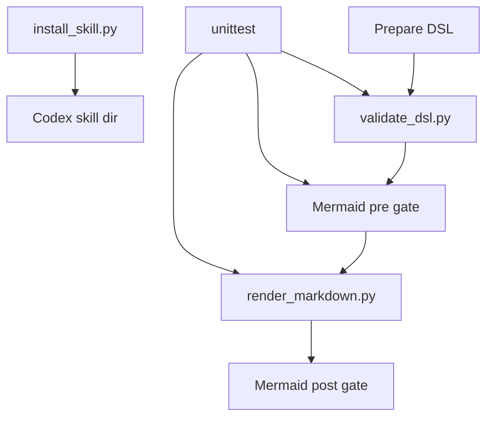

### 5.4 运行时序图（推荐）

文档生成时序图

展示一次完整文档生成的命令交互顺序。

<!-- diagram-id: MER-RUNTIME-SEQUENCE -->
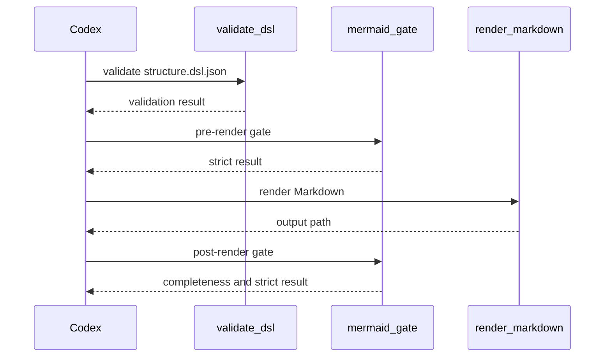

### 5.5 补充运行时图表

无补充内容。

## 6. 配置、数据与依赖关系

系统级配置主要来自 CLI 参数和环境变量；系统级数据产物包括 DSL、Markdown、Mermaid 复核工件、严格校验临时产物、安装目录、示例和测试 fixture。

### 6.1 配置项说明

| 配置项 | 来源 | 使用方 | 用途 | 备注 |
| --- | --- | --- | --- | --- |
| DSL 输入文件路径 | CLI positional argument | validate_dsl.py、render_markdown.py、verify_v2_mermaid_gates.py | 指定待校验、渲染或门禁检查的 V2 DSL JSON。 |  |
| Markdown 输出目录 | render_markdown.py --output-dir | Markdown 渲染器模块 | 决定最终 Markdown 文件写入目录。 | 默认当前目录。 |
| 证据渲染模式 | render_markdown.py --evidence-mode | Markdown 渲染器模块 | 控制 evidence、traceability、source snippet 是否在最终 Markdown 中 inline 显示。 | 默认 hidden。 |
| Mermaid 严格校验工作目录 | validate_mermaid.py/verify_v2_mermaid_gates.py --work-dir | Mermaid 校验与门禁模块 | 保存 strict validation 的临时 mmd/svg 产物。 | 不是最终交付物。 |
| Codex home | --codex-home、CODEX_HOME、~/.codex | 安装器模块 | 决定技能安装目标目录。 | 解析优先级见 docs/install.md。 |

### 6.2 关键结构数据与产物

| 数据/产物 | 类型 | 归属 | 生产方 | 消费方 | 备注 |
| --- | --- | --- | --- | --- | --- |
| structure.dsl.json | json | 文档生成流程 | Codex 或上游分析者 | 校验器、Mermaid 门禁、渲染器 | 必须使用 dsl_version 0.2.0。 |
| create-structure-md_STRUCTURE_DESIGN.md | markdown | Markdown 渲染器模块 | render_markdown.py | 用户和仓库维护者 | 单个系统专属结构设计说明书。 |
| mermaid-readability-review.json | json | Mermaid 门禁流程 | Codex 工作流 | verify_v2_mermaid_gates.py | 覆盖 expected diagrams 的可读性复核工件。 |
| Mermaid strict 临时产物 | mmd/svg | Mermaid 校验与门禁模块 | validate_mermaid.py | 维护者审查 | 位于 --work-dir 下，不是最终交付物。 |
| $CODEX_HOME/skills/create-structure-md | directory | 安装器模块 | install_skill.py | Codex runtime | 只包含运行时白名单条目。 |
| examples/*.dsl.json | json | 示例与测试模块 | 仓库维护者 | 测试模块和用户参考 | V2 DSL 示例。 |
| tests/* | python/json | 示例与测试模块 | 仓库维护者 | unittest | 契约测试和 fixture。 |

### 6.3 依赖项说明

| 依赖项 | 类型 | 使用方 | 用途 | 备注 |
| --- | --- | --- | --- | --- |
| Python 3 | runtime | 所有 CLI 脚本 | 运行校验、渲染、安装和测试脚本。 | 当前脚本均以 python3 执行。 |
| jsonschema | library | DSL 校验器模块 | 执行 Draft 2020-12 JSON Schema 校验。 | requirements.txt 声明该依赖。 |
| node | tool | Mermaid 校验与门禁模块 | 运行 Mermaid CLI。 | strict Mermaid validation 需要。 |
| mmdc | tool | Mermaid 校验与门禁模块 | 解析和渲染 Mermaid 图源以证明严格可渲染。 | 缺失时 static-only 不能作为最终 V2 门禁。 |
| 本地文件系统 | filesystem | 渲染器、安装器、Mermaid strict 校验、测试模块 | 读取 DSL、写 Markdown、复制安装文件和保存临时产物。 | 用户要求本次不执行删除操作。 |
| unittest | library | 示例与测试模块 | 发现并运行 Python 测试。 | Python 标准库。 |

### 6.4 补充图表

无补充内容。

## 7. 跨模块协作关系

### 7.1 协作关系概述

模块间协作以文件契约和 CLI 命令串联为主：schema 与共享规则约束 DSL，校验器和 Mermaid 门禁阻断无效输入，渲染器生成 Markdown，测试模块持续验证这些契约。

### 7.2 跨模块协作说明

| 场景 | 发起模块 | 参与模块 | 协作方式 | 描述 |
| --- | --- | --- | --- | --- |
| DSL 校验 | DSL 校验器模块 | DSL Schema 模块、V2 共享规则模块 | import 和 schema 文件读取 | validate_dsl.py 读取 schema，并导入 V2 共享规则和 Phase 2/3 语义检查。 |
| Mermaid 前后置门禁 | Mermaid 校验与门禁模块 | V2 共享规则模块、Markdown 渲染器模块 | CLI 串联和 expected diagram 元数据 | 门禁在渲染前校验 DSL 图，在渲染后通过 diagram-id 元数据确认 Markdown 中图完整出现。 |
| Markdown 渲染 | Markdown 渲染器模块 | V2 共享规则模块、技能契约与参考文档模块 | 共享规则和文档结构契约 | 渲染器复用 V2 版本规则，并按 document-structure 固定章节输出。 |
| 本地技能安装 | 安装器模块 | 技能契约与参考文档模块、DSL Schema 模块、DSL 校验器模块、Mermaid 校验与门禁模块、Markdown 渲染器模块 | 运行时白名单复制 | 安装器复制 SKILL.md、references、schemas、scripts、examples 和 requirements.txt，不复制 docs/tests。 |
| 回归测试 | 示例与测试模块 | DSL Schema 模块、DSL 校验器模块、Mermaid 校验与门禁模块、Markdown 渲染器模块、安装器模块、技能契约与参考文档模块 | fixture、importlib 和 subprocess | 测试模块加载示例和脚本，断言 CLI、渲染和文档契约行为。 |

### 7.3 跨模块协作关系图

跨模块协作关系图

展示主要跨模块协作路径。

<!-- diagram-id: MER-COLLABORATION-RELATIONSHIP -->
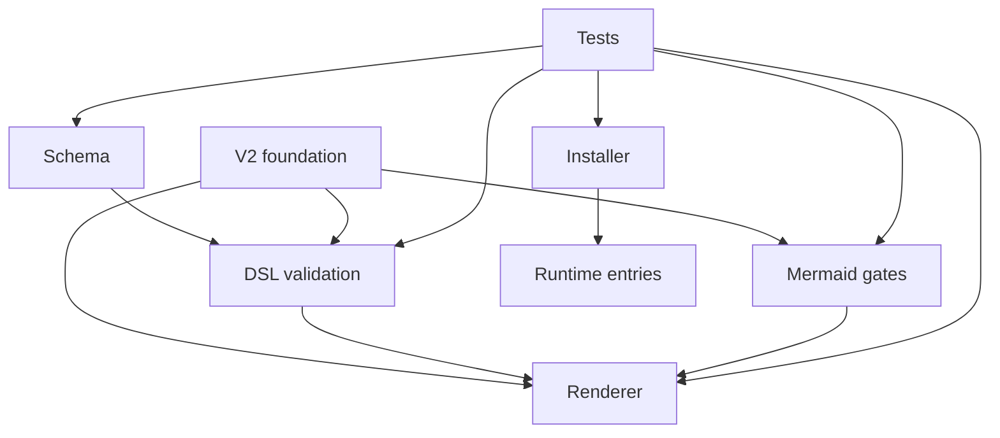

### 7.4 补充协作图表

无补充内容。

## 8. 关键流程

### 8.1 关键流程概述

关键流程覆盖当前工程最重要的运行路径：生成结构设计文档、校验 DSL、执行 Mermaid 门禁、安装本地技能和运行回归测试。

### 8.2 关键流程清单

| 流程 | 触发条件 | 参与模块 | 参与运行单元 | 主要步骤 | 输出结果 | 备注 |
| --- | --- | --- | --- | --- | --- | --- |
| 生成结构设计说明书 | 需要生成结构设计说明书。 | 技能契约与参考文档模块、DSL Schema 模块、DSL 校验器模块、Mermaid 校验与门禁模块、Markdown 渲染器模块 | DSL 校验命令、Mermaid 门禁命令、Markdown 渲染命令 | 在技能外扫描仓库并整理模块、接口、依赖和流程事实。；写入 V2 structure.dsl.json。；运行 DSL 校验。 | create-structure-md_STRUCTURE_DESIGN.md |  |
| 校验 DSL | 已有 structure.dsl.json 需要进入渲染或门禁。 | DSL 校验器模块、DSL Schema 模块、V2 共享规则模块 | DSL 校验命令 | 读取 DSL JSON 并检查 dsl_version。；加载 schema 并执行 Draft 2020-12 结构校验。；注册 ID 并检查章节、引用、内容块和支持数据。 | 校验成功或错误报告 |  |
| 执行 Mermaid 门禁 | DSL 中存在 Mermaid 图且需要 V2 最终门禁。 | Mermaid 校验与门禁模块、Markdown 渲染器模块 | Mermaid 门禁命令 | 准备 mermaid-readability-review.json，覆盖 expected diagrams。；验证复核工件绑定同一 DSL。；pre-render 严格校验 DSL 中已有 Mermaid 图。 | pre-render/post-render gate result |  |
| 安装本地技能 | 需要把本仓库安装为本地 Codex skill。 | 安装器模块、技能契约与参考文档模块、DSL Schema 模块、DSL 校验器模块、Mermaid 校验与门禁模块、Markdown 渲染器模块 | 技能安装命令 | 解析 --codex-home 和 CODEX_HOME，计算目标目录。；验证源仓库包含必需文件和 references 引用。；打印复制计划和依赖状态。 | 安装目录或保守失败报告 |  |
| 运行回归测试 | 需要验证仓库脚本、示例和文档契约。 | 示例与测试模块、DSL Schema 模块、DSL 校验器模块、Mermaid 校验与门禁模块、Markdown 渲染器模块、安装器模块 | unittest 测试命令 | 运行 unittest discover。；加载脚本模块、examples 和 fixtures。；执行断言并报告结果。 | unittest 测试报告 |  |

### 8.3 生成结构设计说明书

#### 8.3.1 流程概述

从已准备好的结构内容生成一个模块或系统专属结构设计 Markdown 文档。

关联模块：技能契约与参考文档模块、DSL Schema 模块、DSL 校验器模块、Mermaid 校验与门禁模块、Markdown 渲染器模块

关联运行单元：DSL 校验命令、Mermaid 门禁命令、Markdown 渲染命令

#### 8.3.2 步骤说明

| 序号 | 执行方 | 说明 | 输入 | 输出 | 关联模块 | 关联运行单元 |
| --- | --- | --- | --- | --- | --- | --- |
| 1 | Codex | 在技能外扫描仓库并整理模块、接口、依赖和流程事实。 | 当前工程源码和文档 | 结构设计内容 | 技能契约与参考文档模块、示例与测试模块 |  |
| 2 | Codex | 写入 V2 structure.dsl.json。 | 结构设计内容 | structure.dsl.json | 技能契约与参考文档模块、DSL Schema 模块 |  |
| 3 | DSL 校验器 | 运行 DSL 校验。 | structure.dsl.json | Validation succeeded 或错误报告 | DSL 校验器模块、DSL Schema 模块、V2 共享规则模块 | DSL 校验命令 |
| 4 | Mermaid 门禁 | 验证可读性复核工件并执行 pre-render strict gate。 | structure.dsl.json 和 review artifact | pre-render gate result | Mermaid 校验与门禁模块 | Mermaid 门禁命令 |
| 5 | Markdown 渲染器 | 渲染单个 Markdown 输出文件。 | structure.dsl.json | create-structure-md_STRUCTURE_DESIGN.md | Markdown 渲染器模块 | Markdown 渲染命令 |
| 6 | Mermaid 门禁 | 执行 post-render 完整性和严格 Markdown Mermaid 校验。 | DSL 和 rendered Markdown | post-render gate result | Mermaid 校验与门禁模块、Markdown 渲染器模块 | Mermaid 门禁命令 |

#### 8.3.3 异常/分支说明

| 条件 | 处理方式 | 关联模块 | 关联运行单元 |
| --- | --- | --- | --- |
| 目标 Markdown 已存在 | 渲染器默认失败；需要用户明确选择 --overwrite 或 --backup 后再运行。 | Markdown 渲染器模块 | Markdown 渲染命令 |
| 严格 Mermaid 门禁失败 | 修正 DSL Mermaid 源或本地 mmdc 环境后重新运行门禁。 | Mermaid 校验与门禁模块 | Mermaid 门禁命令 |

#### 8.3.4 流程图

生成结构设计说明书流程图

展示生成结构设计说明书的关键步骤。

<!-- diagram-id: MER-FLOW-GENERATE-DOCUMENT -->
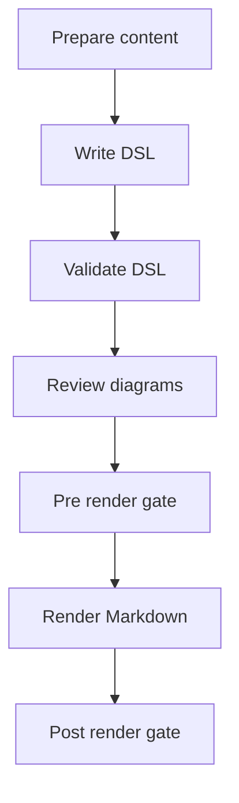

### 8.4 校验 DSL

#### 8.4.1 流程概述

确保 DSL 在结构、语义、引用和安全文本层面符合 V2 契约。

关联模块：DSL 校验器模块、DSL Schema 模块、V2 共享规则模块

关联运行单元：DSL 校验命令

#### 8.4.2 步骤说明

| 序号 | 执行方 | 说明 | 输入 | 输出 | 关联模块 | 关联运行单元 |
| --- | --- | --- | --- | --- | --- | --- |
| 1 | DSL 校验器 | 读取 DSL JSON 并检查 dsl_version。 | dsl_file | V2 document 或版本错误 | DSL 校验器模块、V2 共享规则模块 | DSL 校验命令 |
| 2 | DSL 校验器 | 加载 schema 并执行 Draft 2020-12 结构校验。 | DSL document 和 schema | schema errors 或进入语义校验 | DSL 校验器模块、DSL Schema 模块 | DSL 校验命令 |
| 3 | DSL 校验器 | 注册 ID 并检查章节、引用、内容块和支持数据。 | schema 通过的 DSL | ValidationReport | DSL 校验器模块、V2 共享规则模块 | DSL 校验命令 |

#### 8.4.3 异常/分支说明

| 条件 | 处理方式 | 关联模块 | 关联运行单元 |
| --- | --- | --- | --- |
| schema 校验失败 | 打印 schema validation failed 并返回非 0，语义校验不继续。 | DSL 校验器模块、DSL Schema 模块 | DSL 校验命令 |

#### 8.4.4 流程图

校验 DSL流程图

展示校验 DSL的关键步骤。

<!-- diagram-id: MER-FLOW-VALIDATE-DSL -->
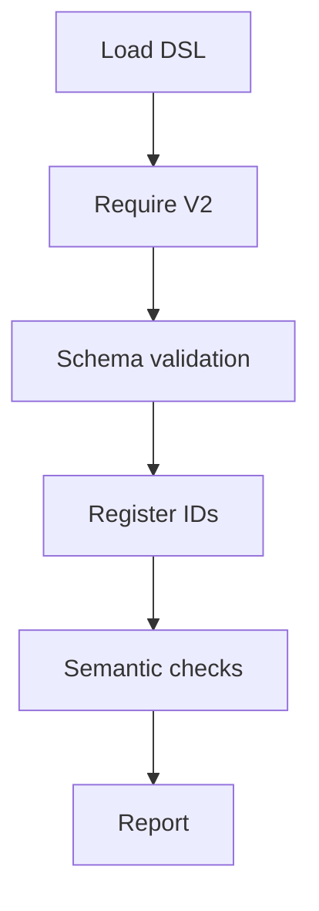

### 8.5 执行 Mermaid 门禁

#### 8.5.1 流程概述

在渲染前后证明 Mermaid 图经过可读性复核、严格校验，并完整出现在最终 Markdown 中。

关联模块：Mermaid 校验与门禁模块、Markdown 渲染器模块

关联运行单元：Mermaid 门禁命令

#### 8.5.2 步骤说明

| 序号 | 执行方 | 说明 | 输入 | 输出 | 关联模块 | 关联运行单元 |
| --- | --- | --- | --- | --- | --- | --- |
| 1 | Codex | 准备 mermaid-readability-review.json，覆盖 expected diagrams。 | structure.dsl.json | review artifact | Mermaid 校验与门禁模块 | Mermaid 门禁命令 |
| 2 | Mermaid 门禁 | 验证复核工件绑定同一 DSL。 | DSL 和 artifact | artifact gate result | Mermaid 校验与门禁模块 | Mermaid 门禁命令 |
| 3 | Mermaid 校验器 | pre-render 严格校验 DSL 中已有 Mermaid 图。 | DSL diagrams | strict validation result | Mermaid 校验与门禁模块 | Mermaid 门禁命令 |
| 4 | Mermaid 门禁 | post-render 检查 diagram-id 元数据和 Markdown 严格校验。 | rendered Markdown | post-render gate result | Mermaid 校验与门禁模块、Markdown 渲染器模块 | Mermaid 门禁命令 |

#### 8.5.3 异常/分支说明

| 条件 | 处理方式 | 关联模块 | 关联运行单元 |
| --- | --- | --- | --- |
| 复核工件缺失或覆盖不全 | 门禁失败并指出缺失 diagram id。 | Mermaid 校验与门禁模块 | Mermaid 门禁命令 |
| node 或 mmdc 缺失 | 严格校验失败；static-only 不能作为最终 V2 门禁。 | Mermaid 校验与门禁模块 | Mermaid 门禁命令 |

#### 8.5.4 流程图

执行 Mermaid 门禁流程图

展示执行 Mermaid 门禁的关键步骤。

<!-- diagram-id: MER-FLOW-MERMAID-GATE -->
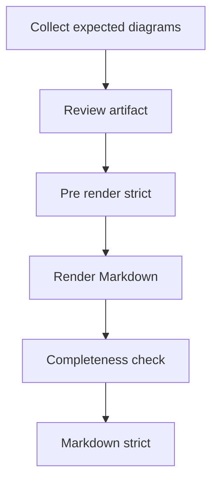

### 8.6 安装本地技能

#### 8.6.1 流程概述

把仓库中的运行时白名单文件复制到 Codex skills 目录，保持不覆盖和不安装依赖的保守策略。

关联模块：安装器模块、技能契约与参考文档模块、DSL Schema 模块、DSL 校验器模块、Mermaid 校验与门禁模块、Markdown 渲染器模块

关联运行单元：技能安装命令

#### 8.6.2 步骤说明

| 序号 | 执行方 | 说明 | 输入 | 输出 | 关联模块 | 关联运行单元 |
| --- | --- | --- | --- | --- | --- | --- |
| 1 | 安装器 | 解析 --codex-home 和 CODEX_HOME，计算目标目录。 | CLI 参数和环境变量 | target path | 安装器模块 | 技能安装命令 |
| 2 | 安装器 | 验证源仓库包含必需文件和 references 引用。 | 仓库根目录 | source validation result | 安装器模块、技能契约与参考文档模块 | 技能安装命令 |
| 3 | 安装器 | 打印复制计划和依赖状态。 | source 和 target | plan and dependency status | 安装器模块 | 技能安装命令 |
| 4 | 安装器 | 目标不存在时复制 RUNTIME_ENTRIES。 | 运行时白名单 | installed skill directory | 安装器模块、技能契约与参考文档模块、DSL Schema 模块、DSL 校验器模块、Mermaid 校验与门禁模块、Markdown 渲染器模块 | 技能安装命令 |

#### 8.6.3 异常/分支说明

| 条件 | 处理方式 | 关联模块 | 关联运行单元 |
| --- | --- | --- | --- |
| 目标目录已存在 | 失败退出并打印用户可自行执行的 rm -r 清理命令。 | 安装器模块 | 技能安装命令 |

#### 8.6.4 流程图

安装本地技能流程图

展示安装本地技能的关键步骤。

<!-- diagram-id: MER-FLOW-INSTALL-SKILL -->
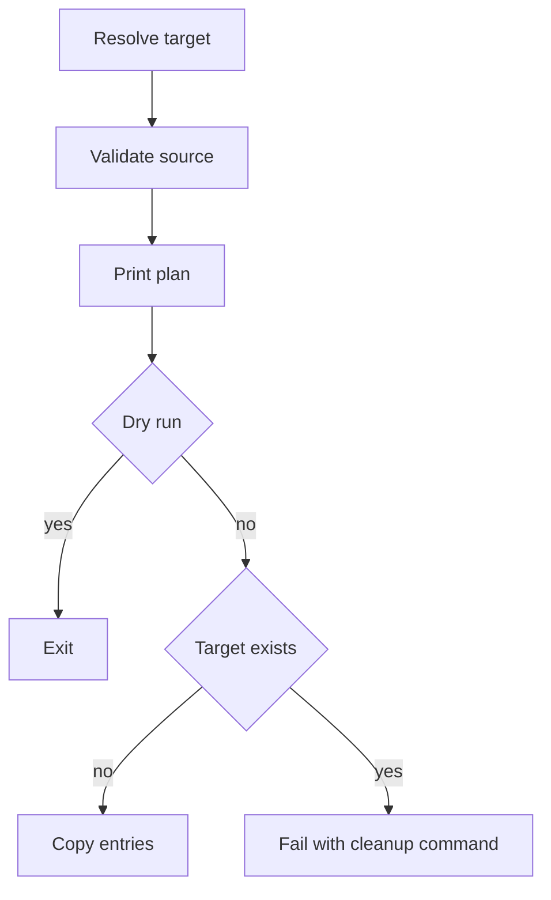

### 8.7 运行回归测试

#### 8.7.1 流程概述

通过 unittest 发现并运行测试，验证 V2 DSL、渲染、Mermaid 门禁、安装器、示例和文档契约。

关联模块：示例与测试模块、DSL Schema 模块、DSL 校验器模块、Mermaid 校验与门禁模块、Markdown 渲染器模块、安装器模块

关联运行单元：unittest 测试命令

#### 8.7.2 步骤说明

| 序号 | 执行方 | 说明 | 输入 | 输出 | 关联模块 | 关联运行单元 |
| --- | --- | --- | --- | --- | --- | --- |
| 1 | 测试运行者 | 运行 unittest discover。 | tests 目录 | test suite | 示例与测试模块 | unittest 测试命令 |
| 2 | 测试模块 | 加载脚本模块、examples 和 fixtures。 | scripts、examples、fixtures | test context | 示例与测试模块、DSL Schema 模块、DSL 校验器模块、Mermaid 校验与门禁模块、Markdown 渲染器模块、安装器模块 | unittest 测试命令 |
| 3 | 测试模块 | 执行断言并报告结果。 | test context | pass/fail report | 示例与测试模块 | unittest 测试命令 |

#### 8.7.3 异常/分支说明

| 条件 | 处理方式 | 关联模块 | 关联运行单元 |
| --- | --- | --- | --- |
| 任一断言失败 | unittest 输出失败用例，维护者按模块定位回归。 | 示例与测试模块 | unittest 测试命令 |

#### 8.7.4 流程图

运行回归测试流程图

展示运行回归测试的关键步骤。

<!-- diagram-id: MER-FLOW-RUN-TESTS -->
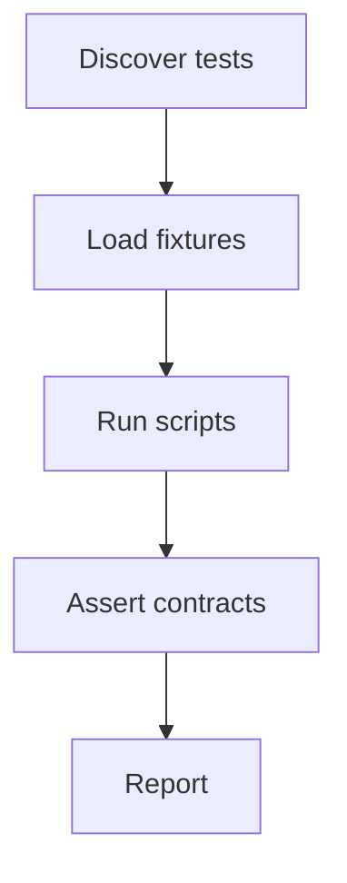

## 9. 结构问题与改进建议

### 9.1 风险清单

| ID | 风险 | 影响 | 缓解措施 | 置信度 |
| --- | --- | --- | --- | --- |
| RISK-MERMAID-LOCAL-ENV | 严格 Mermaid 校验依赖本地 node、mmdc 和浏览器运行环境。 | 工具缺失或浏览器无法启动会阻断 V2 最终门禁。 | 保留 --check-env 和 strict gate；失败时先修复环境，static-only 仅在用户明确接受时作为非最终诊断。 | inferred |
| RISK-TEMP-ARTIFACTS | .codex-tmp 产物当前容易出现在工作区状态中。 | 多次生成或测试后可能让 git status 难以阅读。 | 由维护者决定 .codex-tmp 版本策略；本次遵守约束，不执行删除操作。 | observed |
| RISK-ENTRY-DISCOVERY | 缺少顶层 README 或 pyproject 时项目入口发现成本较高。 | 首次接手者需要从 SKILL.md、docs/install.md 和 tests 中推断命令。 | 补充简短 README 或 pyproject 元数据。 | observed |

### 9.2 假设清单

| ID | 假设 | 依据 | 验证建议 | 置信度 |
| --- | --- | --- | --- | --- |
| ASM-MODULE-GROUPING | 本文的模块划分按文件职责和运行路径组织，而不是按 Python package 边界组织。 | 仓库没有包元数据，scripts 中多个文件通过 import 共享规则。 | 维护者可根据未来包结构调整模块粒度。 | inferred |
| ASM-PROJECT-VERSION | 工程未从 pyproject 或包元数据读取 project_version，因此文档中 project_version 保持空值。 | 扫描未发现 pyproject.toml、setup.cfg 或 setup.py。 | 若后续增加项目元数据，可在 DSL document.project_version 中同步。 | observed |

### 9.3 低置信度项目

无低置信度项目。

### 9.4 结构问题与改进建议

当前工程核心边界清晰，V2 DSL 与门禁实现较完整。结构层面的改进重点在于提升入口可发现性、明确临时产物版本策略，以及把严格 Mermaid 环境要求写得更便于排查。

#### 结构改进概述

建议补充顶层 README 或 pyproject 元数据，减少新维护者从 SKILL.md、docs/install.md 和 tests 中拼接入口信息的成本；同时明确 .codex-tmp 是否应被版本化或忽略，避免临时验证产物长期污染工作区状态。

#### 结构问题与改进建议

| 问题 | 影响 | 建议 |
| --- | --- | --- |
| 缺少顶层 README 或 pyproject 元数据 | 新维护者需要先阅读多个文件才能定位入口、测试命令和安装方式。 | 增加简短 README，复用 docs/install.md 的安装和测试说明。 |
| .gitignore 未包含 .codex-tmp | 技能运行和测试保留的临时产物可能进入工作区状态。 | 由维护者决定是否版本化临时产物；如不版本化，可人工更新 .gitignore。 |
| 严格 Mermaid 环境失败原因可能较分散 | node/mmdc 已存在但浏览器运行环境异常时排查成本较高。 | 在安装文档中补充常见 strict Mermaid 环境诊断步骤。 |
