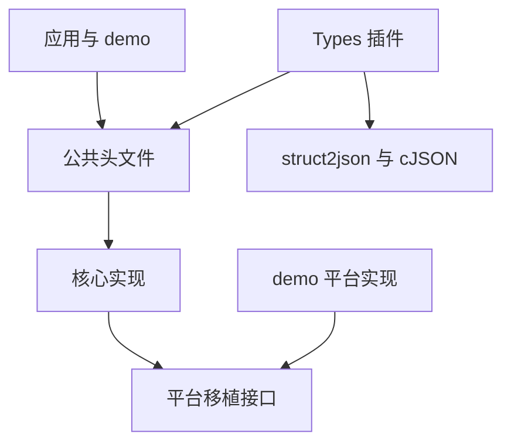
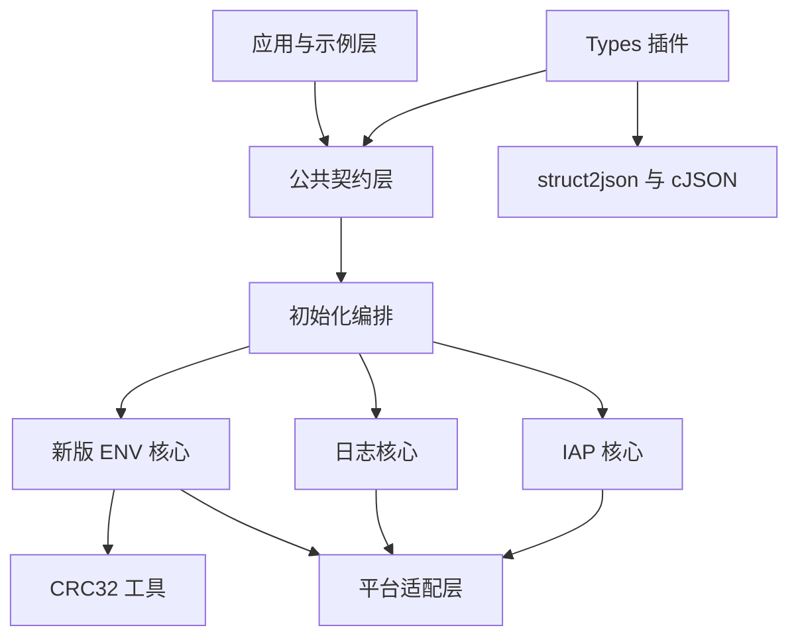
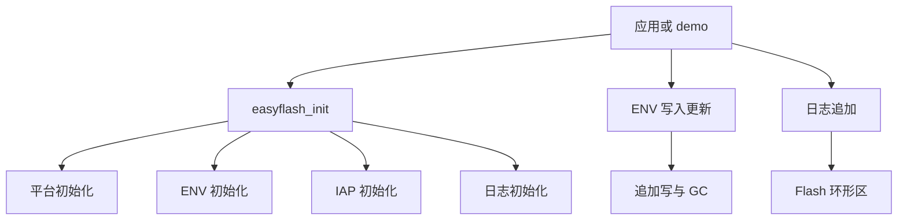
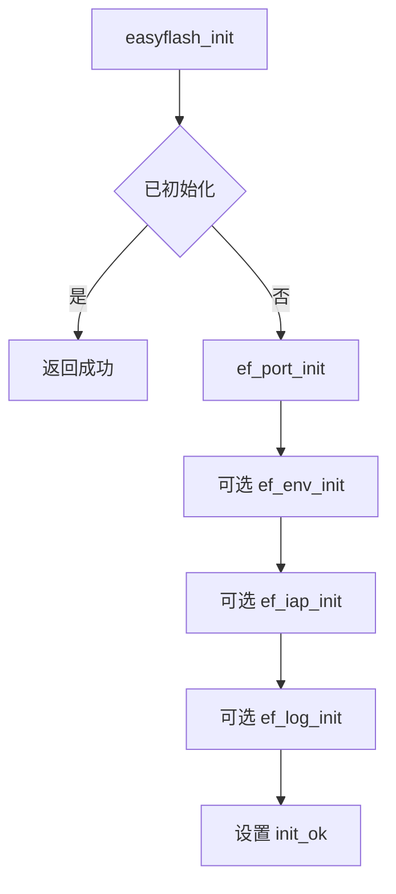
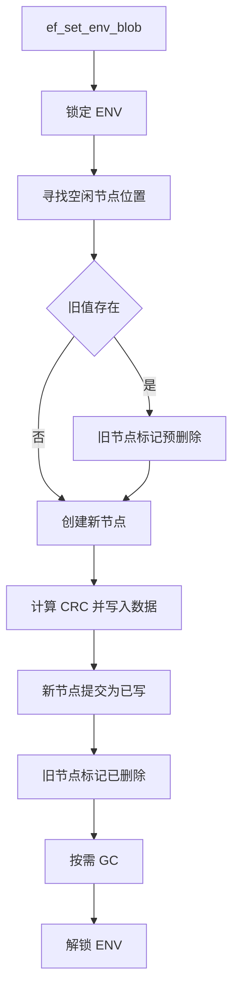
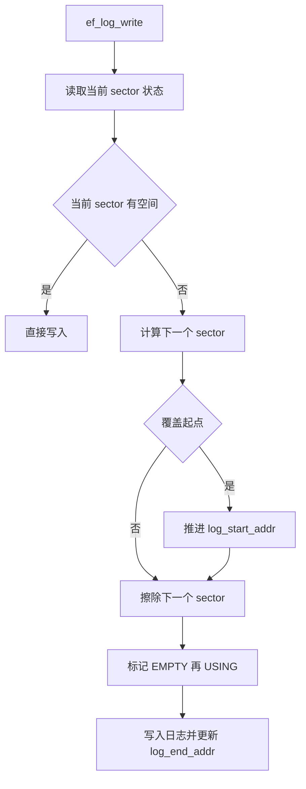
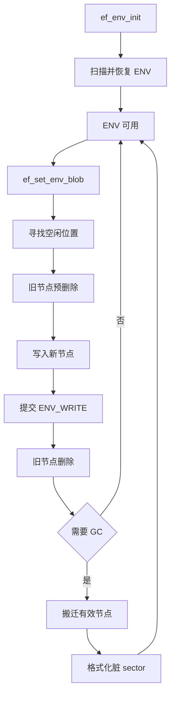
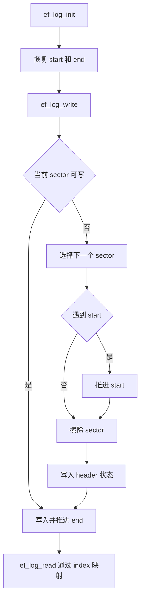
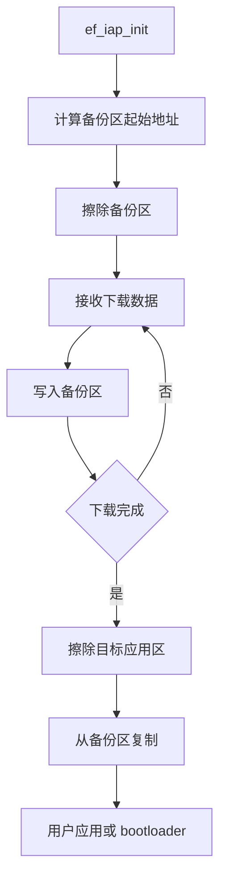
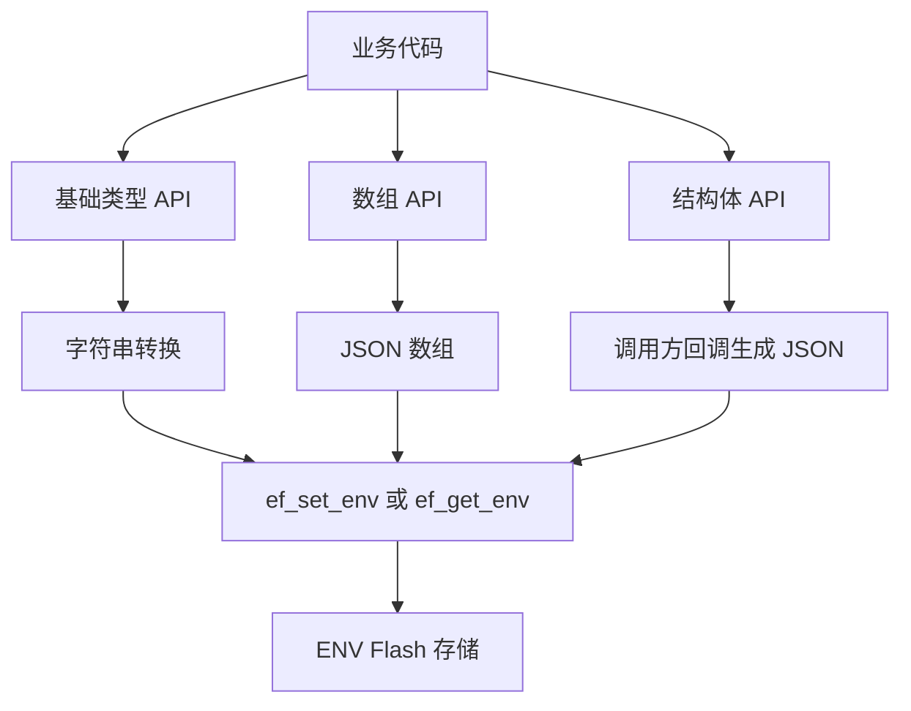

# EasyFlash 仓库结构设计说明书

## 1. 文档说明

| 字段 | 值 |
| --- | --- |
| 文档版本 | 0.3.0 |
| 状态 | draft |
| 语言 | zh-CN |
| 生成时间 | 2026-05-16T20:37:55+08:00 |
| 仓库 | EasyFlash（/home/hyx/easyflash） |
| 仓库类型 | mixed |
| 主要语言 | C、Markdown |

### 范围
| 类型 | 范围 | 说明 |
| --- | --- | --- |
| 包含 | easyflash/inc | 公共 API、配置宏、错误码、ENV 数据结构与外部调用契约。 |
| 包含 | easyflash/src | 初始化编排、ENV 持久化、日志、IAP 和 CRC 工具的核心实现。 |
| 包含 | easyflash/port | 平台移植模板，定义调用方必须实现或替换的 Flash、锁与日志接口。 |
| 包含 | easyflash/plugins/types | 基于 EasyFlash ENV 的可选类型封装插件，含 struct2json/cJSON 依赖代码。 |
| 包含 | demo | STM32、RT-Thread、SPI Flash、日志和 IAP 集成示例，用于说明真实平台如何补齐 port 层。 |
| 不包含 | 目标板运行结果 | 本次只做静态仓库阅读，未连接硬件、未执行擦写、断电恢复或升级流程。 |
| 不包含 | 第三方库逐行设计 | RT-Thread、STM32 标准外设库、SFUD、cJSON/struct2json 只作为集成依赖和边界说明。 |

### 可信度
| 项目 | 内容 |
| --- | --- |
| 级别 | medium |
| 摘要 | 结论基于静态符号快照、核心调用关系和关键源文件阅读；未做编译、单测或硬件实测。 |
| 验证缺口 | 未在 STM32 或 SPI Flash 目标板验证 EF_WRITE_GRAN、擦除粒度、掉电恢复与 GC 时序。 未针对每个 demo 工程执行构建验证。 Types 插件 README 存在编码显示问题，插件行为主要以源码为准。 |

## 2. 仓库概述与阅读路线

EasyFlash 是一个嵌入式 Flash 存储库，以少量公共 API 封装 ENV 键值持久化、Flash 日志保存、IAP 备份升级和可选类型化 ENV 插件。仓库同时携带平台移植模板与多个 STM32 demo。

| 项目 | 内容 |
| --- | --- |
| 问题域 | 资源受限 MCU 上的非易失化数据保存、日志落盘、固件备份区管理和跨平台 Flash 擦写适配。 |
| 仓库目标 | 把与芯片相关的 Flash 读、擦、写、锁和打印能力收敛到 port 层，让核心库用统一的地址布局、状态位和公共 API 处理上层持久化需求。 |
| 目标读者 | 首次接入 EasyFlash 的嵌入式工程师 需要维护 ENV 存储或掉电恢复逻辑的库维护者 要移植到新 Flash/RTOS/裸机平台的集成者 评审 IAP、日志或类型插件边界的技术负责人 |

### 核心能力
| 能力 | 描述 | 入口 | 备注 |
| --- | --- | --- | --- |
| 库级初始化与功能编排 | 应用调用 easyflash_init 后，库先进入平台初始化，再按 EF_USING_ENV、EF_USING_IAP、EF_USING_LOG 宏决定是否初始化 ENV、IAP 和日志子系统。 | easyflash/inc/easyflash.h::easyflash_init easyflash/src/easyflash.c::easyflash_init | easyflash_init 内部有 init_ok 防重入，初始化失败时不会置为成功。 |
| ENV 键值持久化 | 新版 ENV 模式把键值节点追加写入 Flash sector，通过状态表、CRC、cache 和 GC 维持有效值集合；旧版 legacy 文件保留兼容路径。 | easyflash/inc/easyflash.h::ef_set_env_blob easyflash/inc/easyflash.h::ef_get_env_blob easyflash/src/ef_env.c::ef_env_init | 默认从 V4.0 起使用 NG 模式；ef_cfg.h 明确 legacy 已不推荐继续使用。 |
| Flash 日志环形区 | 日志模块把 LOG_AREA_SIZE 分成若干擦除块，用 sector header 状态表示 EMPTY、USING、FULL，并用 log_start_addr/log_end_addr 管理环形写入和读取索引。 | easyflash/inc/easyflash.h::ef_log_write easyflash/inc/easyflash.h::ef_log_read easyflash/src/ef_log.c::ef_log_init | 仅在 EF_USING_LOG 打开时编译使用，日志区位置会跟随 ENV 区之后。 |
| IAP 备份区操作 | IAP 模块按启用的 ENV/LOG 区域偏移计算备份应用起始地址，提供擦除备份区、写入下载片段、从备份区复制到用户应用或 bootloader 的接口。 | easyflash/inc/easyflash.h::ef_write_data_to_bak easyflash/inc/easyflash.h::ef_copy_spec_app_from_bak easyflash/src/ef_iap.c::ef_iap_init | IAP 数据区大小不由 EasyFlash 固定，调用方需要传入应用大小并保证地址规划安全。 |
| 类型化 ENV 插件 | Types 插件把 ENV 字符串封装成 bool、整数、浮点、数组和结构体 JSON 序列化接口，复用底层 ef_get_env/ef_set_env。 | easyflash/plugins/types/ef_types.h::ef_types_init easyflash/plugins/types/ef_types.c::ef_set_struct | 结构体能力依赖 struct2json 和 cJSON，插件不改变底层 Flash 布局。 |

### 阅读路线
先建立公共接口和配置边界，再读初始化主线，最后进入 ENV、LOG、IAP 与插件机制。

| 顺序 | 主题 | 为什么读 | 推荐文件 | 目标收获 |
| --- | --- | --- | --- | --- |
| 1 | 公共接口与配置 | 先看应用能调用什么、哪些宏决定编译和地址布局。 | easyflash/inc/easyflash.h（集中声明初始化、ENV、IAP、LOG、CRC 和 port 函数。） easyflash/inc/ef_cfg.h（定义 EF_USING_*、EF_START_ADDR、ENV_AREA_SIZE、LOG_AREA_SIZE、EF_ERASE_MIN_SIZE、EF_WRITE_GRAN 等集成参数。） easyflash/inc/ef_def.h（定义错误码、版本号、ENV 节点结构和状态枚举。） | 知道 EasyFlash 的功能开关、地址分区和公共调用面。 |
| 2 | 初始化主线 | 理解所有功能如何从一个入口被串起来，以及 port 层如何提供默认 ENV 集合。 | easyflash/src/easyflash.c（easyflash_init 的编排入口。） easyflash/port/ef_port.c（平台移植模板，说明必须由项目补齐的函数。） | 掌握应用初始化到各功能子系统初始化的顺序。 |
| 3 | ENV 新版存储机制 | ENV 是仓库最核心、最复杂的机制，包含状态位、追加写、cache、恢复和 GC。 | easyflash/src/ef_env.c（默认 NG ENV 模式实现。） easyflash/src/ef_env_legacy.c（旧版一次性保存模式，仅用于理解兼容边界。） easyflash/src/ef_env_legacy_wl.c（带磨损均衡思想的旧版兼容实现。） | 理解 ENV 节点如何写入、提交、删除、恢复和搬迁。 |
| 4 | 可选功能 | LOG 和 IAP 都复用 port 层，但拥有独立地址规划和状态管理。 | easyflash/src/ef_log.c（Flash 环形日志实现。） easyflash/src/ef_iap.c（IAP 备份区读写与复制实现。） | 知道可选功能如何叠加在 ENV 区之后，以及它们怎样使用底层 Flash 操作。 |
| 5 | 插件与示例 | 插件展示如何在 ENV 之上封装业务类型；demo 展示真实平台如何实现 port。 | easyflash/plugins/types/ef_types.c（类型插件的封装逻辑。） demo/env/stm32f10x/non_os/components/easyflash/port/ef_port.c（STM32 内部 Flash port 示例。） demo/env/stm32f10x/non_os_spi_flash/components/easyflash/port/ef_port.c（SFUD SPI Flash port 示例。） | 知道集成者需要在哪里写平台代码，以及插件与核心库的关系。 |

| 阅读顺序 | 内容 |
| --- | --- |
| 先读 | easyflash/inc/easyflash.h easyflash/inc/ef_cfg.h easyflash/src/easyflash.c easyflash/src/ef_env.c |
| 后读 | easyflash/src/ef_log.c easyflash/src/ef_iap.c easyflash/plugins/types/ef_types.c demo/env/stm32f10x/non_os/components/easyflash/port/ef_port.c |
| 可暂跳过 | demo/env/*/Libraries demo/env/*/RT-Thread-1.2.2 easyflash/plugins/types/struct2json/src/cJSON.c |

## 3. 目录地图

仓库顶层分为可移植 EasyFlash 库本体、插件和 demo。库本体的 inc/src/port 三段是维护主轴；demo 下的大量 RTOS、外设库和 BSP 文件用于平台示例，不应和库核心混读。

### 目录分组
| 分组 | 职责 | 路径 | 阅读时机 | 备注 |
| --- | --- | --- | --- | --- |
| 公共头文件 | 定义应用可调用 API、配置宏、错误码、版本号和 ENV 元数据结构。 | easyflash/inc | 开始任何移植、调试或功能评审前。 | easyflash.h 是 API 入口；ef_cfg.h 是项目必须改写的配置模板；ef_def.h 是核心状态语义。 |
| 核心实现 | 实现初始化编排、ENV、LOG、IAP 和 CRC32。 | easyflash/src | 需要理解运行主线、状态机、Flash 布局或故障恢复时。 | ef_env.c 是默认新版 ENV；ef_env_legacy*.c 是兼容旧模式。 |
| 平台移植模板 | 提供 ef_port_init/read/erase/write/env_lock/env_unlock/log/print 的模板定义。 | easyflash/port | 把 EasyFlash 接到新芯片、新 Flash 或 RTOS 前。 | 模板中的读写函数留空，真实项目需要参考 demo port 实现。 |
| Types 插件 | 在 ENV 字符串接口上提供基础类型、数组和结构体 JSON 序列化包装。 | easyflash/plugins/types | 业务希望少写字符串转换代码，或需要结构体持久化示例时。 | 插件依赖 struct2json/cJSON，属于可选层，不参与 easyflash_init。 |
| struct2json/cJSON 依赖 | 为 Types 插件提供 JSON 序列化、反序列化和内存 hook 支持。 | easyflash/plugins/types/struct2json | 调试类型插件内存分配、JSON 解析或结构体转换问题时。 | 首次理解 EasyFlash 核心时可以跳过。 |
| 平台与功能 demo | 展示 STM32F10x、STM32F4xx、RT-Thread、裸机、内部 Flash、SPI Flash、日志和 IAP 的集成方式。 | demo/env demo/log demo/iap | 需要参考真实 ef_port.c、ef_cfg.h 或应用调用顺序时。 | demo 携带大量平台库源码，阅读时优先看 app、components/easyflash、README。 |

### 重要文件
| 文件 | 角色 | 重要性 |
| --- | --- | --- |
| easyflash/inc/easyflash.h | 公共 API 汇总 | 所有外部入口和 port hook 声明集中在这里，是仓库阅读第一站。 |
| easyflash/inc/ef_cfg.h | 配置模板 | 决定是否启用 ENV/IAP/LOG、Flash 起始地址、擦除粒度、写粒度和各功能区大小。 |
| easyflash/inc/ef_def.h | 公共类型与状态定义 | 定义 EF_SW_VERSION、EfErrCode、env_status_t、env_node_obj_t 等机制词汇。 |
| easyflash/src/easyflash.c | 库初始化编排 | easyflash_init 串联 port、ENV、IAP、LOG，是所有功能进入运行态的主线。 |
| easyflash/src/ef_env.c | 新版 ENV 核心 | 包含 sector header、ENV header、cache、状态表、追加写、删除、恢复、GC 等核心机制。 |
| easyflash/src/ef_env_legacy.c | 旧版 ENV 兼容实现 | 保留 V4.0 前的 legacy 行为，有助于区分默认 NG 模式和兼容模式。 |
| easyflash/src/ef_env_legacy_wl.c | 旧版磨损均衡兼容实现 | 用另一个 legacy 变体处理 ENV 区数据页切换和保存，适合对比新版 GC 模型。 |
| easyflash/src/ef_log.c | Flash 日志实现 | 实现 LOG 区环形写入、读取索引转换、sector 状态和清空流程。 |
| easyflash/src/ef_iap.c | IAP 备份区实现 | 实现备份应用区地址计算、擦除、下载片段写入和从备份区复制到目标区。 |
| easyflash/src/ef_utils.c | CRC32 工具 | ENV 节点创建和读取依赖 CRC32 校验来判断节点是否有效。 |
| easyflash/port/ef_port.c | 移植模板 | 声明真实平台必须补齐的读、擦、写、锁和打印能力。 |
| easyflash/plugins/types/ef_types.c | 类型化插件实现 | 展示如何在 ENV 字符串之上构建基础类型、数组和结构体持久化 API。 |
| demo/env/stm32f10x/non_os/components/easyflash/port/ef_port.c | STM32 内部 Flash port 示例 | 展示 ef_port_read/erase/write 如何落到 STM32 标准外设库，以及锁如何屏蔽中断。 |
| demo/env/stm32f10x/non_os_spi_flash/components/easyflash/port/ef_port.c | SFUD SPI Flash port 示例 | 展示同一 port 契约如何绑定外部 SPI Flash 设备。 |

应用从 easyflash.h 进入 easyflash.c；核心 src 模块只通过 ef_port_* 触达具体 Flash；demo 和插件位于核心库外侧，分别提供移植样例和可选封装。

### 目录关系

EasyFlash 主要目录之间的依赖和阅读方向。

### 边界说明
| 区域 | 说明 |
| --- | --- |
| demo/env/*/Libraries | 这些目录是 STM32 标准外设库或 CMSIS 代码，不是 EasyFlash 设计核心。 |
| demo/env/*/RT-Thread-1.2.2 | RT-Thread 源码用于 demo 构建和运行环境，理解 EasyFlash 时只需关注其提供的线程、串口和 shell 集成。 |
| easyflash/plugins/types/struct2json | 这是插件依赖，不改变 EasyFlash 核心的 Flash 布局和初始化主线。 |

## 4. 系统分层与模块职责

EasyFlash 的分层可以按调用方向理解为：应用与 demo 调公共 API，初始化编排层根据配置启用功能核心，功能核心通过 port 契约访问平台 Flash，可选插件在公共 API 之上提供更高层类型封装。

### 模块分层

EasyFlash 模块之间的主要调用方向。

### 分层
| 层 | 角色 | 职责 | 路径 | 备注 |
| --- | --- | --- | --- | --- |
| 应用与示例层 | 发起初始化、读写 ENV、写日志、执行 IAP，并提供真实平台配置样例。 | 调用 easyflash_init 和功能 API 定义产品级默认 ENV 集合 提供 demo 的 main、RT-Thread 线程或 IAP 数据接收入口 | demo | 库本体不依赖 demo；demo 依赖库和平台外设。 |
| 公共契约层 | 把编译开关、地址布局、错误码、结构体和公共函数声明暴露给应用与核心实现。 | 声明 EasyFlash 的 API 调用面 承载 EF_USING_* 与 Flash 区域配置 定义 ENV 节点状态、错误码和版本号 | easyflash/inc | ef_cfg.h 是集成者必须按平台修改的配置点。 |
| 核心功能层 | 实现库初始化、ENV、LOG、IAP 和 CRC 机制。 | 根据配置宏初始化各功能 维护 Flash 上的数据布局和状态转换 把所有硬件访问收敛到 port 函数 | easyflash/src | 核心功能层应该被当作平台无关逻辑阅读。 |
| 平台适配层 | 把平台无关的读、擦、写、锁和打印需求映射到具体芯片、Flash 和 RTOS。 | 实现 ef_port_read、ef_port_erase、ef_port_write 提供 ENV cache 锁和日志输出 在 ef_port_init 中返回默认 ENV 集合 | easyflash/port demo/env/*/components/easyflash/port | 仓库模板留空，demo 展示 STM32 内部 Flash 和 SFUD SPI Flash 两类绑定方式。 |
| 可选插件层 | 在 ENV 字符串能力之上提供类型化读写和结构体 JSON 序列化。 | 转换基础类型和字符串数组 把数组转换成 JSON 字符串保存 通过 struct2json/cJSON 支撑结构体持久化 | easyflash/plugins/types | 插件是消费者而非核心依赖，不参与 easyflash_init 自动初始化。 |

### 模块职责
| 层 | 模块 | 目的 | 源码路径 | 阅读时机 |
| --- | --- | --- | --- | --- |
| 应用与示例层 | Demo 应用 | 展示不同平台和功能场景下如何调用 EasyFlash。 | demo/env demo/log demo/iap | 需要照着一个真实平台接入库时。 |
| 公共契约层 | 公共 API 与配置契约 | 为应用、核心实现和插件提供统一头文件与配置入口。 | easyflash/inc/easyflash.h easyflash/inc/ef_cfg.h easyflash/inc/ef_def.h | 需要判断库能做什么、必须配置什么、哪些符号是公开 API 时。 |
| 核心功能层 | 初始化编排 | 把平台初始化和启用的功能模块按顺序拉起。 | easyflash/src/easyflash.c | 追踪应用从 easyflash_init 进入库的第一条主线时。 |
| 核心功能层 | 新版 ENV 核心 | 以追加写、状态表、CRC、cache 和 GC 方式维护键值持久化。 | easyflash/src/ef_env.c | 要理解默认 ENV 模式、掉电恢复、追加写或 GC 行为时。 |
| 核心功能层 | Legacy ENV 兼容实现 | 保留 V4.0 前 ENV 行为和带磨损均衡变体，服务旧配置或迁移场景。 | easyflash/src/ef_env_legacy.c easyflash/src/ef_env_legacy_wl.c | 需要理解升级迁移、兼容宏或旧固件行为时。 |
| 核心功能层 | Flash 日志核心 | 把连续日志写入受限的 Flash 擦除块，并按环形区读取和覆盖旧日志。 | easyflash/src/ef_log.c | 需要理解 EF_USING_LOG、环形覆盖或日志区清空时。 |
| 核心功能层 | IAP 备份区核心 | 提供固件备份区擦除、写入和复制工具函数。 | easyflash/src/ef_iap.c | 需要做固件下载、备份区复制或 bootloader 区擦写时。 |
| 核心功能层 | CRC32 工具 | 为 ENV 节点内容计算 CRC32。 | easyflash/src/ef_utils.c | 排查 ENV 节点 crc_is_ok 或兼容性问题时。 |
| 平台适配层 | 平台移植接口 | 把平台无关核心对 Flash 和同步的要求映射到具体硬件。 | easyflash/port/ef_port.c demo/env/stm32f10x/non_os/components/easyflash/port/ef_port.c demo/env/stm32f10x/non_os_spi_flash/components/easyflash/port/ef_port.c demo/env/stm32f4xx/components/easyflash/port/ef_port.c | 移植到新平台、排查 Flash 错误码或中断锁行为时。 |
| 可选插件层 | Types 类型插件 | 复用 ENV 字符串存储，为基础类型、数组和结构体提供更友好的读写 API。 | easyflash/plugins/types/ef_types.c easyflash/plugins/types/ef_types.h | 希望把 ENV 用作类型化配置存储时。 |
| 可选插件层 | struct2json 与 cJSON 依赖 | 为 Types 插件提供 JSON 对象、数组和结构体转换能力。 | easyflash/plugins/types/struct2json | 调试 JSON 序列化或内存 hook 时。 |

#### Demo 应用

| 项目 | 内容 |
| --- | --- |
| 所在层 | 应用与示例层 |
| 负责 | 示例 main、RT-Thread 线程和 IAP 数据接收流程 示例工程的默认 ENV 内容 示例平台构建环境 |
| 消费 | easyflash.h 公共 API 平台外设库、RTOS 或 SFUD |
| 产出 | 可参考的集成方式 真实 port 实现样例 |
| 不负责 | EasyFlash 核心算法 公共 API 兼容性 |
| 备注 | 大量外设库文件可以先跳过。 |

##### 协作
| 协作模块 | 关系 |
| --- | --- |
| 公共 API 与配置契约 | 通过公共 API 调用库功能。 |
| 平台移植接口 | 为示例平台提供具体 port 实现。 |

#### 公共 API 与配置契约

| 项目 | 内容 |
| --- | --- |
| 所在层 | 公共契约层 |
| 负责 | API 声明 配置宏模板 错误码和 ENV 公共类型 版本号 EF_SW_VERSION |
| 消费 | 应用选择的 EF_USING_* 宏和 Flash 地址参数 |
| 产出 | 编译期功能开关 核心模块可共享的结构和状态定义 |
| 不负责 | Flash 擦写实现 具体平台默认 ENV 值 |
| 备注 | 不要把 ef_cfg.h 当成可直接生产使用的配置，它含有必须由用户填值的宏。 |

##### 协作
| 协作模块 | 关系 |
| --- | --- |
| 初始化编排 | 声明 easyflash_init 并提供其编译条件。 |
| 新版 ENV 核心 | 提供 ENV 结构和状态枚举。 |
| 平台移植接口 | 声明 port 层函数。 |

#### 初始化编排

| 项目 | 内容 |
| --- | --- |
| 所在层 | 核心功能层 |
| 负责 | easyflash_init 防重入状态 port、ENV、IAP、LOG 初始化顺序 初始化结果打印 |
| 消费 | EF_USING_ENV、EF_USING_IAP、EF_USING_LOG ef_port_init 返回的默认 ENV 集合 |
| 产出 | 已初始化的 EasyFlash 运行状态 初始化成功或失败错误码 |
| 不负责 | 各功能模块内部状态机 平台 Flash 驱动 |
| 备注 | 静态调用索引对函数内 extern 声明不总是能建立完整边；源码上下文显示 ef_port_init 和 ef_env_init 确实被调用。 |

##### 协作
| 协作模块 | 关系 |
| --- | --- |
| 平台移植接口 | 先调用 ef_port_init 获取默认 ENV 集合。 |
| 新版 ENV 核心 | 在启用 ENV 时调用 ef_env_init。 |
| IAP 备份区核心 | 在启用 IAP 时调用 ef_iap_init。 |
| Flash 日志核心 | 在启用 LOG 时调用 ef_log_init。 |

#### 新版 ENV 核心

| 项目 | 内容 |
| --- | --- |
| 所在层 | 核心功能层 |
| 负责 | sector header 与 ENV header 布局 ENV 写入、查找、删除、恢复、GC 流程 ENV cache 与 sector cache 默认 ENV 迁移和版本自动更新 |
| 消费 | EF_START_ADDR、ENV_AREA_SIZE、EF_ERASE_MIN_SIZE、EF_WRITE_GRAN 默认 ENV 集合 ef_port_read/erase/write/env_lock/env_unlock ef_calc_crc32 |
| 产出 | 持久化 ENV 节点 有效 ENV 集合视图 GC 后整理过的 sector |
| 不负责 | Flash 驱动 业务 ENV 语义 legacy 模式的 RAM 缓冲策略 |
| 备注 | 这是仓库中函数数和调用边最多的核心文件。 |

##### 协作
| 协作模块 | 关系 |
| --- | --- |
| 公共 API 与配置契约 | 实现 easyflash.h 中的 ENV API。 |
| CRC32 工具 | 用 CRC32 判断节点头、名称和值是否完整有效。 |
| 平台移植接口 | 所有 Flash 访问和锁都经由 port 层。 |

#### Legacy ENV 兼容实现

| 项目 | 内容 |
| --- | --- |
| 所在层 | 核心功能层 |
| 负责 | legacy 模式下的 ENV 加载和保存 legacy 写入字节统计 legacy 自动更新 |
| 消费 | legacy 相关编译配置 ef_port_read/erase/write |
| 产出 | 与旧版本兼容的 ENV 行为 |
| 不负责 | 默认 NG 模式 新版 sector GC 模型 |
| 备注 | ef_cfg.h 注释说明 legacy 已不推荐继续使用。 |

##### 协作
| 协作模块 | 关系 |
| --- | --- |
| 公共 API 与配置契约 | 实现同名 ENV API 的兼容版本。 |
| 平台移植接口 | 复用相同 Flash 访问接口。 |

#### Flash 日志核心

| 项目 | 内容 |
| --- | --- |
| 所在层 | 核心功能层 |
| 负责 | LOG 区起始地址计算 log_start_addr/log_end_addr 日志 sector 状态和 header 日志读写、清空和已用大小计算 |
| 消费 | LOG_AREA_SIZE、EF_ERASE_MIN_SIZE、EF_START_ADDR、ENV_AREA_SIZE ef_port_read/erase/write |
| 产出 | Flash 上的环形日志流 可通过 index 读取的日志视图 |
| 不负责 | 日志格式语义 应用日志生产策略 |
| 备注 | 写入接口要求 size 按 4 字节对齐。 |

##### 协作
| 协作模块 | 关系 |
| --- | --- |
| 初始化编排 | 由 easyflash_init 在 EF_USING_LOG 下初始化。 |
| 平台移植接口 | 借助 port 层擦写日志区。 |

#### IAP 备份区核心

| 项目 | 内容 |
| --- | --- |
| 所在层 | 核心功能层 |
| 负责 | bak_app_start_addr 计算 备份应用区擦除 下载数据写入备份区 从备份区复制到应用区或 bootloader |
| 消费 | EF_START_ADDR、ENV_AREA_SIZE、LOG_AREA_SIZE ef_port_read/erase/write 调用方传入的目标地址、大小和可选写函数 |
| 产出 | 备份区写入结果 应用区或 bootloader 区复制结果 |
| 不负责 | 下载协议 bootloader 跳转策略 镜像签名和完整性策略 |
| 备注 | IAP 功能的安全策略主要由调用方承担。 |

##### 协作
| 协作模块 | 关系 |
| --- | --- |
| 初始化编排 | 由 easyflash_init 在 EF_USING_IAP 下初始化。 |
| 平台移植接口 | 借助 port 层操作 Flash。 |
| Demo 应用 | demo/iap 展示 YMODEM 场景如何写备份区。 |

#### CRC32 工具

| 项目 | 内容 |
| --- | --- |
| 所在层 | 核心功能层 |
| 负责 | ef_calc_crc32 实现 |
| 消费 | ENV header、name、value 字节流 |
| 产出 | ENV 节点校验值 |
| 不负责 | 节点状态提交 Flash 读写 |
| 备注 | CRC 工具本身很小，但对掉电恢复判断很关键。 |

##### 协作
| 协作模块 | 关系 |
| --- | --- |
| 新版 ENV 核心 | ENV 节点创建和读取时使用 CRC32 校验。 |

#### 平台移植接口

| 项目 | 内容 |
| --- | --- |
| 所在层 | 平台适配层 |
| 负责 | 默认 ENV 集合返回 Flash read/erase/write 绑定 ENV cache 锁 调试和常规打印输出 |
| 消费 | 平台 Flash 驱动 RTOS 或裸机同步原语 串口或日志输出能力 |
| 产出 | 供核心层调用的 ef_port_* 行为 |
| 不负责 | ENV 状态机 LOG 环形算法 IAP 地址策略 |
| 备注 | 模板不执行真实硬件操作，demo port 才是可运行参考。 |

##### 协作
| 协作模块 | 关系 |
| --- | --- |
| 新版 ENV 核心 | ENV 所有 Flash 与锁操作都通过 port。 |
| Flash 日志核心 | LOG 读、擦、写都通过 port。 |
| IAP 备份区核心 | IAP 写备份区和复制目标区都通过 port 或调用方传入写函数。 |

#### Types 类型插件

| 项目 | 内容 |
| --- | --- |
| 所在层 | 可选插件层 |
| 负责 | 基础类型与字符串转换 数组 JSON 化和反解析 结构体 set 回调封装 |
| 消费 | ef_get_env、ef_set_env cJSON struct2json 内存 hook |
| 产出 | 类型化 ENV API JSON 字符串形式的数组或结构体 ENV 值 |
| 不负责 | 底层 ENV Flash 存储 结构体字段 schema 业务内存生命周期 |
| 备注 | 源码和头文件中存在 ef_get_struct 文本，但符号索引未稳定识别该入口，生产使用前应以编译验证为准。 |

##### 协作
| 协作模块 | 关系 |
| --- | --- |
| 新版 ENV 核心 | 最终仍由 ENV API 保存字符串。 |
| struct2json 与 cJSON 依赖 | 借助 cJSON/struct2json 处理 JSON。 |

#### struct2json 与 cJSON 依赖

| 项目 | 内容 |
| --- | --- |
| 所在层 | 可选插件层 |
| 负责 | cJSON 数据结构与 JSON 打印/解析 struct2json 宏和内存 hook |
| 消费 | 插件传入的 S2jHook 插件构造的 JSON 对象 |
| 产出 | 可保存到 ENV 的 JSON 字符串 从 JSON 恢复的结构体对象 |
| 不负责 | ENV 键值命名 Flash 持久化提交 |
| 备注 | 首次阅读库核心时可以延后。 |

##### 协作
| 协作模块 | 关系 |
| --- | --- |
| Types 类型插件 | 被类型插件直接调用。 |

### 边界说明
| 主题 | 说明 |
| --- | --- |
| 核心和 port 的边界 | 核心层永远不应该直接依赖某个 STM32 或 SFUD 函数；这些绑定属于 port 或 demo。 |
| 插件和核心的边界 | Types 插件只是 ENV API 的消费者，不能假设底层 Flash 布局，也不参与 easyflash_init。 |
| legacy 文件的阅读顺序 | 默认理解应以 ef_env.c 为主，legacy 文件用于兼容性和迁移背景。 |

## 5. 仓库主线

仓库主线围绕三个行为展开：应用初始化库、写入或更新 ENV、向 Flash 日志区追加数据。IAP 与 Types 插件是重要能力，但更适合在第六章按机制深读。

### 仓库主线总览

应用进入 EasyFlash 后的主要功能路径。

### 5.1 库初始化主线

把平台依赖和被启用的功能模块拉到可用状态。

| 项目 | 名称 | 类型 | 描述 | 参考 |
| --- | --- | --- | --- | --- |
| 入口 | easyflash_init | api | 应用或 demo 调用的库级初始化入口。 | easyflash/src/easyflash.c::easyflash_init |

| 序号 | 步骤 | 影响 | 模块 | 参考 |
| --- | --- | --- | --- | --- |
| 1 | 调用方进入 easyflash_init；若 init_ok 已经为真，直接返回 EF_NO_ERR。 | 防止重复初始化破坏模块状态。 | 初始化编排、公共 API 与配置契约 | easyflash/src/easyflash.c::easyflash_init |
| 2 | easyflash_init 先调用 ef_port_init，port 层返回 default_env_set 和 default_env_set_size。 | 核心库获得平台初始化结果和默认 ENV 集合。 | 初始化编排、平台移植接口 | easyflash/src/easyflash.c::easyflash_init easyflash/port/ef_port.c::ef_port_init |
| 3 | 如果 EF_USING_ENV 打开且前一步成功，调用 ef_env_init 加载 ENV 区并检查恢复。 | ENV 模块建立起有效键值视图。 | 初始化编排、新版 ENV 核心 | easyflash/src/easyflash.c::easyflash_init easyflash/src/ef_env.c::ef_env_init |
| 4 | 如果 EF_USING_IAP 打开且前一步成功，调用 ef_iap_init 计算备份应用区起始地址。 | IAP 模块知道备份区位于 ENV/LOG 区之后的偏移。 | 初始化编排、IAP 备份区核心 | easyflash/src/easyflash.c::easyflash_init easyflash/src/ef_iap.c::ef_iap_init |
| 5 | 如果 EF_USING_LOG 打开且前一步成功，调用 ef_log_init 定位日志环形区起止位置。 | 日志模块可进行读写和清空。 | 初始化编排、Flash 日志核心 | easyflash/src/easyflash.c::easyflash_init easyflash/src/ef_log.c::ef_log_init |
| 6 | 所有启用模块都成功后，easyflash_init 设置 init_ok 并打印初始化结果。 | 库进入可用状态；失败时保持未初始化。 | 初始化编排、平台移植接口 | easyflash/src/easyflash.c::easyflash_init easyflash/port/ef_port.c::ef_log_info |

#### 初始化顺序

easyflash_init 内部的模块初始化顺序。

| 项目 | 内容 |
| --- | --- |
| 结果 | 应用可以继续调用 ENV、LOG 或 IAP API；哪些 API 可用取决于编译宏。 |
| 备注 | 源码使用 extern 在函数内声明模块初始化函数；静态调用分析对 ef_env_init 和 ef_port_init 未完全解析，需要结合源码上下文阅读。 |

### 5.2 ENV 写入与更新主线

把一个 key/value 保存为新的 Flash ENV 节点，并处理旧值删除与 GC。

| 项目 | 名称 | 类型 | 描述 | 参考 |
| --- | --- | --- | --- | --- |
| 入口 | ef_set_env_blob | api | 新版 ENV 的 blob 写入入口；ef_set_env 和 ef_set_and_save_env 最终也会进入该路径。 | easyflash/src/ef_env.c::ef_set_env_blob |

| 序号 | 步骤 | 影响 | 模块 | 参考 |
| --- | --- | --- | --- | --- |
| 1 | ef_set_env_blob 检查 ENV 是否初始化，未初始化时返回 EF_ENV_INIT_FAILED。 | 避免在 ENV 区尚未建立有效视图时写入。 | 新版 ENV 核心 | easyflash/src/ef_env.c::ef_set_env_blob |
| 2 | 进入 port 锁保护，然后调用内部 set_env。 | 保护 ENV cache 和 Flash 状态更新的临界区。 | 新版 ENV 核心、平台移植接口 | easyflash/src/ef_env.c::ef_set_env_blob easyflash/port/ef_port.c::ef_port_env_lock |
| 3 | set_env 先通过 new_env_by_kv/new_env/alloc_env 确认可容纳新节点；空间不足时触发 GC 后重试。 | 决定新 ENV 节点可以写到哪个 sector 的空闲位置。 | 新版 ENV 核心 | easyflash/src/ef_env.c::set_env easyflash/src/ef_env.c::new_env_by_kv easyflash/src/ef_env.c::gc_collect |
| 4 | 如果旧 key 已存在，先把旧节点标记为 ENV_PRE_DELETE，随后创建新节点。 | 在新值写成功前，旧值仍可被恢复。 | 新版 ENV 核心 | easyflash/src/ef_env.c::find_env easyflash/src/ef_env.c::del_env easyflash/src/ef_env.c::create_env_blob |
| 5 | create_env_blob 写 ENV header、key、value，计算 CRC32，最后把节点状态提交为 ENV_WRITE。 | 新节点变成可被查找和读取的有效 ENV。 | 新版 ENV 核心、CRC32 工具、平台移植接口 | easyflash/src/ef_env.c::create_env_blob easyflash/src/ef_utils.c::ef_calc_crc32 easyflash/src/ef_env.c::write_status |
| 6 | 新节点写入成功后，再把旧节点标记为 ENV_DELETED，并在 sector 满或 gc_request 时做 GC。 | 提交更新并回收脏 sector。 | 新版 ENV 核心 | easyflash/src/ef_env.c::del_env easyflash/src/ef_env.c::gc_collect |
| 7 | ef_set_env_blob 解锁并返回错误码。 | 调用方获得写入结果。 | 新版 ENV 核心、平台移植接口 | easyflash/src/ef_env.c::ef_set_env_blob easyflash/port/ef_port.c::ef_port_env_unlock |

#### ENV 更新路径

新版 ENV 写入时的主要状态转换。

| 项目 | 内容 |
| --- | --- |
| 结果 | 成功时 Flash 上新增一个 ENV_WRITE 节点，旧节点被删除或等待 GC；失败时通过 PRE_DELETE/恢复逻辑尽量保持旧值可恢复。 |
| 备注 | 新版 ENV 里的 ef_save_env 与 ef_set_and_save_env 主要保留旧版本兼容语义。 |

### 5.3 日志追加主线

把应用日志追加写入 Flash 环形区，在空间到达 sector 边界时擦除并推进起止地址。

| 项目 | 名称 | 类型 | 描述 | 参考 |
| --- | --- | --- | --- | --- |
| 入口 | ef_log_write | api | 应用传入按 4 字节对齐的日志缓冲区。 | easyflash/src/ef_log.c::ef_log_write |

| 序号 | 步骤 | 影响 | 模块 | 参考 |
| --- | --- | --- | --- | --- |
| 1 | ef_log_write 断言写入 size 按 4 字节对齐，并检查日志模块 init_ok。 | 过滤未初始化和非 word 对齐的写入。 | Flash 日志核心 | easyflash/src/ef_log.c::ef_log_write |
| 2 | 读取 log_end_addr 所在 sector 状态，若状态异常则返回 EF_WRITE_ERR。 | 确认当前写入位置所在 sector 可继续处理。 | Flash 日志核心、平台移植接口 | easyflash/src/ef_log.c::get_sector_status easyflash/port/ef_port.c::ef_port_read |
| 3 | 若当前 sector 仍有空间，直接写入；若写满，则把 sector 标记为 FULL。 | 追加日志并维护当前 sector 状态。 | Flash 日志核心、平台移植接口 | easyflash/src/ef_log.c::ef_log_write easyflash/src/ef_log.c::write_sector_status |
| 4 | 剩余数据跨 sector 时，计算下一个 sector；若覆盖到 log_start_addr，则推进 log_start_addr。 | 环形区覆盖最旧日志，保证新日志可继续写入。 | Flash 日志核心 | easyflash/src/ef_log.c::get_next_flash_sec_addr easyflash/src/ef_log.c::ef_log_write |
| 5 | 擦除目标 sector，依次写 EMPTY、USING 状态，再写入数据和更新 log_end_addr。 | 让 Flash 日志环继续前进。 | Flash 日志核心、平台移植接口 | easyflash/src/ef_log.c::ef_log_write easyflash/port/ef_port.c::ef_port_erase easyflash/port/ef_port.c::ef_port_write |

#### 日志追加路径

日志写入时的环形区推进方式。

| 项目 | 内容 |
| --- | --- |
| 结果 | 日志数据被追加到 LOG 区；当空间绕回时，旧日志被覆盖，读取路径通过 log_index2addr 映射用户 index。 |
| 备注 | 读取路径同样需要理解环形绕回：ef_log_read 根据 index 和 header 开销把逻辑位置转换为物理地址。 |

### 跨主线说明
| 主题 | 说明 |
| --- | --- |
| 配置宏决定主线长度 | EF_USING_ENV、EF_USING_IAP、EF_USING_LOG 均为编译期宏，关闭后对应模块不会被 easyflash_init 拉起。 |
| 所有 Flash 访问都通过 port | ENV、LOG、IAP 都不直接调用 STM32/SFUD 驱动；真实读擦写必须由平台实现 ef_port_*。 |
| 错误码沿主线返回 | 初始化和写入主线都以 EfErrCode 表示结果，但具体硬件失败细节取决于 port 层。 |

## 6. 关键机制深读

### 6.1 新版 ENV 存储、恢复与 GC 机制

ENV 是 EasyFlash 最核心的持久化能力，也是仓库中状态、数据布局和调用关系最复杂的部分。理解它之后，配置、移植、掉电恢复和 Flash 寿命风险才有上下文。

| 项目 | 内容 |
| --- | --- |
| 阅读前提 | 先读 easyflash/inc/easyflash.h 中的 ENV API 声明。 先读 easyflash/inc/ef_cfg.h 中的 EF_START_ADDR、ENV_AREA_SIZE、EF_ERASE_MIN_SIZE、EF_WRITE_GRAN。 先理解第 5 章的初始化主线。 |
| 相关模块 | 新版 ENV 核心、公共 API 与配置契约、平台移植接口、CRC32 工具 |

| 源码焦点 | 关注原因 |
| --- | --- |
| easyflash/src/ef_env.c::ef_env_init | 新版 ENV 初始化入口，包含配置断言、cache 初始化、加载和自动更新。 |
| easyflash/src/ef_env.c::ef_load_env | 启动时扫描 sector、恢复 GC 和恢复异常 ENV 的入口。 |
| easyflash/src/ef_env.c::ef_set_env_blob | 公共写入入口，负责初始化检查和锁保护。 |
| easyflash/src/ef_env.c::set_env | 写入、旧值预删除、新值创建、旧值删除和 GC 的中心流程。 |
| easyflash/src/ef_env.c::create_env_blob | ENV 节点物理写入、CRC 计算和状态提交。 |
| easyflash/src/ef_env.c::gc_collect | sector 回收触发和执行逻辑。 |

新版 ENV 把 ENV_AREA_SIZE 划成多个 sector，每个 sector 有 store/dirty 状态和 magic，每个 ENV 节点有独立 header、CRC、name、value 和状态表。写入采用追加模式：先找空位，再把旧值标记为预删除，写入新节点并提交为 ENV_WRITE，最后把旧节点删除。sector 脏数据累积后由 GC 搬迁有效 ENV 并格式化旧 sector。

#### 新版 ENV 状态流

ENV 初始化、写入和 GC 的主要阶段。

#### 流程
| 序号 | 步骤 | 数据或状态 | 参考 | 备注 |
| --- | --- | --- | --- | --- |
| 1 | ef_env_init 校验默认 ENV 集合、ENV 区大小、擦除粒度、sector 数量和写粒度对齐要求。 | ENV_AREA_SIZE、EF_ERASE_MIN_SIZE、EF_WRITE_GRAN、SECTOR_NUM。 | easyflash/src/ef_env.c::ef_env_init easyflash/inc/ef_cfg.h::ENV_AREA_SIZE easyflash/inc/ef_cfg.h::EF_WRITE_GRAN | ENV_AREA_SIZE 必须至少覆盖两个 sector，否则 GC 没有空 sector 可用。 |
| 2 | 初始化 cache 表后，设置 env_start_addr、default_env_set 和 default_env_set_size。 | env_start_addr、env_cache_table、sector_cache_table。 | easyflash/src/ef_env.c::ef_env_init easyflash/src/ef_env.c::env_cache_node_t easyflash/src/ef_env.c::sector_cache_node_t | cache 只缓存查找加速信息，不是持久化真相。 |
| 3 | ef_load_env 扫描所有 sector header；如果全部检查失败，则调用 ef_env_set_default 重新写入默认 ENV。 | sector_hdr_data_t、sector_meta_data_t、SECTOR_STORE_UNUSED。 | easyflash/src/ef_env.c::ef_load_env easyflash/src/ef_env.c::sector_iterator easyflash/src/ef_env.c::ef_env_set_default | 这是启动时容错入口之一。 |
| 4 | 加载期间进入 ENV cache 锁，检查上次未完成的 GC 和 ENV 写入；遇到 ENV_PRE_DELETE 可尝试 move_env 恢复旧值，遇到 ENV_PRE_WRITE 则标为错误头。 | ENV_PRE_DELETE、ENV_PRE_WRITE、ENV_ERR_HDR、gc_request。 | easyflash/src/ef_env.c::check_and_recovery_gc_cb easyflash/src/ef_env.c::check_and_recovery_env_cb easyflash/src/ef_env.c::move_env | 恢复逻辑用状态位把中断在不同阶段的写入区分开。 |
| 5 | 公共写入口 ef_set_env_blob 检查 init_ok 并锁定 ENV cache，然后进入 set_env。 | init_ok、port 锁。 | easyflash/src/ef_env.c::ef_set_env_blob easyflash/port/ef_port.c::ef_port_env_lock | 裸机 demo 用关中断实现锁，RTOS 平台可替换为互斥或临界区。 |
| 6 | set_env 调用 new_env_by_kv 计算新节点长度并寻找空位；空间不足时 new_env 可触发 gc_collect 后重试。 | ENV_HDR_DATA_SIZE、EF_WG_ALIGN、sector->empty_env、gc_request。 | easyflash/src/ef_env.c::set_env easyflash/src/ef_env.c::new_env_by_kv easyflash/src/ef_env.c::alloc_env easyflash/src/ef_env.c::gc_collect | 节点长度包含 header、按写粒度对齐后的 key 和 value。 |
| 7 | 如果 key 已存在，先调用 del_env 将旧节点写成 ENV_PRE_DELETE，而不是直接删除。 | ENV_PRE_DELETE、ENV_DELETED、sector dirty 状态。 | easyflash/src/ef_env.c::find_env easyflash/src/ef_env.c::del_env | 预删除提供了新值写失败后的恢复窗口。 |
| 8 | create_env_blob 组装 env_hdr_data，计算 CRC32，写 header、key、value，最后用 write_status 提交 ENV_WRITE。 | env_hdr_data_t、ENV_MAGIC_WORD、ENV_WRITE、crc32。 | easyflash/src/ef_env.c::create_env_blob easyflash/src/ef_env.c::write_env_hdr easyflash/src/ef_env.c::align_write easyflash/src/ef_utils.c::ef_calc_crc32 | 最后提交状态是关键：只有状态和 CRC 都合格的节点才应被当作有效值。 |
| 9 | 新值成功后，set_env 再把旧节点完整删除；若 sector 变满或 gc_request 为真，则进行 GC。 | SECTOR_STORE_USING、SECTOR_STORE_FULL、EF_SEC_REMAIN_THRESHOLD、EF_GC_EMPTY_SEC_THRESHOLD。 | easyflash/src/ef_env.c::set_env easyflash/src/ef_env.c::update_sec_status easyflash/src/ef_env.c::gc_collect | sector 满不等于立刻擦除；它会请求或触发 GC。 |
| 10 | do_gc 遍历 dirty 或 GC 状态 sector，把仍有效的 ENV 搬到新空间，然后 format_sector 擦除并重建 sector header。 | SECTOR_DIRTY_TRUE、SECTOR_DIRTY_GC、SECTOR_MAGIC_WORD、SECTOR_NOT_COMBINED。 | easyflash/src/ef_env.c::do_gc easyflash/src/ef_env.c::move_env easyflash/src/ef_env.c::format_sector | GC 本质是有效节点搬迁加旧 sector 格式化。 |

#### 关键状态与数据
| 名称 | 类型 | 说明 | 参考 |
| --- | --- | --- | --- |
| sector_hdr_data_t | storage_layout | sector 头部包含 store/dirty 状态表、magic、combined 和 reserved 字段，是判断 sector 是否可用、脏、满或待 GC 的依据。 | easyflash/src/ef_env.c::sector_hdr_data_t |
| sector_meta_data_t | struct | 运行时 sector 元数据，包含 check_ok、store/dirty 状态、sector 起始地址、剩余空间和下一个空 ENV 地址。 | easyflash/src/ef_env.c::sector_meta_data_t |
| env_hdr_data_t | storage_layout | ENV 节点头部保存状态表、magic、总长度、CRC32、名称长度和值长度，后面跟随按写粒度对齐的 name/value。 | easyflash/src/ef_env.c::env_hdr_data_t |
| env_status_t | enum | ENV_UNUSED、ENV_PRE_WRITE、ENV_WRITE、ENV_PRE_DELETE、ENV_DELETED、ENV_ERR_HDR 表示节点生命周期和恢复入口。 | easyflash/inc/ef_def.h::env_status_t |
| env_node_obj_t | struct | 读取或遍历 ENV 时使用的运行时对象，含节点状态、CRC 是否有效、名称、长度和起始/value 地址。 | easyflash/inc/ef_def.h::env_node_obj_t |
| EF_WRITE_GRAN | macro | Flash 写粒度，源码注释只支持 1、8、32 bit。ENV 节点 name/value 和写入补齐都依赖它。 | easyflash/inc/ef_cfg.h::EF_WRITE_GRAN |
| gc_request | state | 内部 GC 请求标记，空间不足、sector 满或恢复检查可触发它，gc_collect 完成后清除。 | easyflash/src/ef_env.c::gc_collect |

#### 常见误解
| 误解 | 更正 |
| --- | --- |
| ef_set_env 会原地覆盖旧值。 | 新版 ENV 追加写新节点，再把旧节点从预删除推进到删除，必要时由 GC 搬迁有效节点。 |
| 关闭 cache 会改变 Flash 上的数据格式。 | cache 只影响查找加速；持久化布局由 sector header、ENV header、状态表和 name/value 决定。 |
| sector 标为 FULL 后立刻擦除。 | FULL 只表示不再继续追加；真正擦除发生在 GC 选择 dirty/GC sector 并搬迁有效 ENV 之后。 |
| CRC 只校验 value。 | create_env_blob 对 name_len、value_len、name、对齐填充和值共同计算 CRC32。 |

#### 验证缺口
| 验证缺口 |
| --- |
| 未通过断电注入验证 ENV_PRE_DELETE、ENV_PRE_WRITE、SECTOR_DIRTY_GC 的恢复路径。 |
| 未在实际 Flash 上验证 EF_WRITE_GRAN 为 1、8、32 bit 时的对齐写行为。 |
| 未执行长时间写入测试来评估 GC 触发频率和 sector 磨损。 |

| 项目 | 内容 |
| --- | --- |
| 可信度 | medium |

### 6.2 Flash 日志环形区机制

日志模块展示了 EasyFlash 如何在只能按块擦除的 Flash 上实现追加写和覆盖旧数据。它与 ENV 共享 port 层，但拥有独立的区间、header 状态和索引映射。

| 项目 | 内容 |
| --- | --- |
| 阅读前提 | 先理解 EF_USING_LOG、LOG_AREA_SIZE、EF_ERASE_MIN_SIZE 的配置含义。 先知道 LOG 区在启用 ENV 时位于 ENV_AREA_SIZE 之后。 先读第 5 章日志追加主线。 |
| 相关模块 | Flash 日志核心、平台移植接口、公共 API 与配置契约 |

| 源码焦点 | 关注原因 |
| --- | --- |
| easyflash/src/ef_log.c::ef_log_init | 初始化 LOG 区起始地址并定位当前日志起止。 |
| easyflash/src/ef_log.c::find_start_and_end_addr | 扫描 sector header，恢复 log_start_addr 和 log_end_addr。 |
| easyflash/src/ef_log.c::ef_log_write | 日志追加、跨 sector、擦除、状态推进和环形覆盖的核心入口。 |
| easyflash/src/ef_log.c::ef_log_read | 把逻辑 index 映射到环形区物理地址并处理绕回读取。 |
| easyflash/src/ef_log.c::ef_log_clean | 重置整个日志区并初始化 sector 状态。 |

LOG 区由若干 EF_ERASE_MIN_SIZE 大小的 sector 组成。每个 sector 前部有日志 header，状态可为 EMPTY、USING、FULL 或 header error。log_start_addr 指向最旧有效日志，log_end_addr 指向下一次写入位置。写入跨 sector 时会擦除下一个 sector、写入 header 状态并推进 end；如果即将覆盖 start，则 start 也前移，从而形成 Flash 上的环形缓冲。

#### 日志环形区

LOG 区写入和覆盖旧日志的循环关系。

#### 流程
| 序号 | 步骤 | 数据或状态 | 参考 | 备注 |
| --- | --- | --- | --- | --- |
| 1 | ef_log_init 断言 LOG_AREA_SIZE 非零、擦除粒度有效、LOG 区大小至少两个 sector。 | LOG_AREA_SIZE、EF_ERASE_MIN_SIZE。 | easyflash/src/ef_log.c::ef_log_init easyflash/inc/ef_cfg.h::LOG_AREA_SIZE | 至少两个 sector 才能形成可覆盖的环。 |
| 2 | 初始化时根据是否启用 ENV 计算 log_area_start_addr；启用 ENV 时 LOG 区紧跟 ENV_AREA_SIZE。 | log_area_start_addr。 | easyflash/src/ef_log.c::ef_log_init easyflash/inc/ef_cfg.h::EF_START_ADDR easyflash/inc/ef_cfg.h::ENV_AREA_SIZE | LOG 区和 IAP 备份区的地址都依赖功能启用组合。 |
| 3 | find_start_and_end_addr 扫描日志 sector header，确定现有日志的开始和结束位置；如果无法恢复则通过 ef_log_clean 初始化。 | log_start_addr、log_end_addr、SectorStatus。 | easyflash/src/ef_log.c::find_start_and_end_addr easyflash/src/ef_log.c::ef_log_clean | 这一阶段决定重启后继续追加的位置。 |
| 4 | ef_log_write 要求 size 按 4 字节对齐，并拒绝未初始化状态。 | init_ok、写入 size。 | easyflash/src/ef_log.c::ef_log_write | 公共 API 不负责重排非 word 对齐数据。 |
| 5 | 在当前 sector 为 USING 或 EMPTY 时，先尽量写完当前 sector 的剩余区域，写满后把该 sector 标为 FULL。 | SECTOR_STATUS_USING、SECTOR_STATUS_EMPUT、SECTOR_STATUS_FULL。 | easyflash/src/ef_log.c::ef_log_write easyflash/src/ef_log.c::write_sector_status | 源码中 EMPTY 状态宏拼写为 EMPUT，需要按现有代码理解。 |
| 6 | 剩余数据需要新 sector 时，通过 get_next_flash_sec_addr 计算下一个 sector；如果它正是 log_start_addr，则推进 start 以覆盖最旧日志。 | log_start_addr、log_end_addr、log_area_start_addr。 | easyflash/src/ef_log.c::get_next_flash_sec_addr easyflash/src/ef_log.c::ef_log_write | 覆盖是环形日志的预期行为，不是异常路径。 |
| 7 | 擦除目标 sector，写 EMPTY 和 USING 状态，再从 LOG_SECTOR_HEADER_SIZE 之后写入日志数据。 | LOG_SECTOR_HEADER_SIZE、LOG_SECTOR_MAGIC。 | easyflash/src/ef_log.c::ef_log_write easyflash/port/ef_port.c::ef_port_erase easyflash/port/ef_port.c::ef_port_write | 每个 sector 的 header 开销会影响逻辑 index 到物理地址的换算。 |
| 8 | ef_log_read 使用 ef_log_get_used_size、log_index2addr 和 log_seq_read 处理顺序读取和绕回读取。 | 逻辑 index、log_start_addr、log_end_addr。 | easyflash/src/ef_log.c::ef_log_read easyflash/src/ef_log.c::log_index2addr easyflash/src/ef_log.c::log_seq_read | 当 start 大于 end 时，读取可能拆成两段：尾部到区域末尾，再从区域起始读。 |

#### 关键状态与数据
| 名称 | 类型 | 说明 | 参考 |
| --- | --- | --- | --- |
| log_start_addr | state | 指向最旧有效日志的地址，覆盖旧日志时会推进到下一个 sector。 | easyflash/src/ef_log.c::log_start_addr |
| log_end_addr | state | 指向下一次写入的地址，写入成功后随数据量推进。 | easyflash/src/ef_log.c::log_end_addr |
| log_area_start_addr | state | LOG 区物理起始地址；启用 ENV 时等于 EF_START_ADDR + ENV_AREA_SIZE，否则等于 EF_START_ADDR。 | easyflash/src/ef_log.c::ef_log_init |
| SectorStatus | enum | 日志 sector 的运行状态，包括 EMPTY、USING、FULL 和 header error。 | easyflash/src/ef_log.c::SectorStatus |
| LOG_SECTOR_HEADER_SIZE | macro | 每个日志 sector 预留的 header 大小，读取 index 转地址时必须扣除这些 header 字节。 | easyflash/src/ef_log.c::LOG_SECTOR_HEADER_SIZE |

#### 常见误解
| 误解 | 更正 |
| --- | --- |
| 日志区写满后写入会失败。 | 日志区是环形区，写入跨回起点时会覆盖最旧日志。 |
| ef_log_read 的 index 就是 Flash 物理偏移。 | index 是逻辑日志偏移，必须通过 log_index2addr 加上 sector header 开销并处理绕回。 |
| LOG 区总是从 EF_START_ADDR 开始。 | 启用 ENV 时 LOG 区从 EF_START_ADDR + ENV_AREA_SIZE 开始。 |

#### 验证缺口
| 验证缺口 |
| --- |
| 未在真实 Flash 上验证日志写满、绕回和断电重启后的起止地址恢复。 |
| 未验证 EF_ERASE_MIN_SIZE 与 LOG_AREA_SIZE 组合不合规时的失败行为。 |
| 未对跨 sector 读取边界做自动化测试。 |

| 项目 | 内容 |
| --- | --- |
| 可信度 | medium |

### 6.3 IAP 备份区写入与复制机制

IAP 模块让 EasyFlash 不只保存配置和日志，还能参与固件升级数据的临时存放与复制。它直接操作大段 Flash，地址规划和错误处理风险高，必须清楚边界。

| 项目 | 内容 |
| --- | --- |
| 阅读前提 | 先确认 EF_USING_IAP 是否启用。 先理解 EF_START_ADDR、ENV_AREA_SIZE、LOG_AREA_SIZE 对备份区起始地址的影响。 先知道 ef_port_write/erase/read 的平台实现是否支持目标区。 |
| 相关模块 | IAP 备份区核心、平台移植接口、Demo 应用、公共 API 与配置契约 |

| 源码焦点 | 关注原因 |
| --- | --- |
| easyflash/src/ef_iap.c::ef_iap_init | 计算 bak_app_start_addr。 |
| easyflash/src/ef_iap.c::ef_write_data_to_bak | 把下载片段写入备份应用区。 |
| easyflash/src/ef_iap.c::ef_copy_spec_app_from_bak | 从备份区读出并调用指定写函数复制到用户应用区。 |
| easyflash/src/ef_iap.c::ef_copy_bl_from_bak | 从备份区复制 bootloader 数据。 |
| demo/iap/ymodem+rtt.c::ymodem_on_data | demo 中下载数据写入备份区的调用场景。 |

IAP 初始化从 EF_START_ADDR 开始，根据是否启用 ENV 和 LOG 累加 ENV_AREA_SIZE、LOG_AREA_SIZE，得到 bak_app_start_addr。下载过程可先擦除备份区，再用 ef_write_data_to_bak 按片段写入；复制阶段用 ef_copy_spec_app_from_bak 从备份区按 32 word 缓冲读出，并调用默认 ef_port_write 或调用方传入的 app_write 写到目标地址。

#### IAP 备份复制路径

IAP 模块从地址计算到备份写入再到复制的主要流程。

#### 流程
| 序号 | 步骤 | 数据或状态 | 参考 | 备注 |
| --- | --- | --- | --- | --- |
| 1 | ef_iap_init 以 EF_START_ADDR 为基础，若启用 ENV 则跳过 ENV_AREA_SIZE，若启用 LOG 则再跳过 LOG_AREA_SIZE。 | bak_app_start_addr。 | easyflash/src/ef_iap.c::ef_iap_init easyflash/inc/ef_cfg.h::EF_START_ADDR easyflash/inc/ef_cfg.h::ENV_AREA_SIZE easyflash/inc/ef_cfg.h::LOG_AREA_SIZE | IAP 备份区默认排在 EasyFlash 管理的 ENV/LOG 区之后。 |
| 2 | ef_erase_bak_app 使用 ef_get_bak_app_start_addr 和 app_size 擦除备份应用区。 | app_size、备份区地址。 | easyflash/src/ef_iap.c::ef_erase_bak_app easyflash/src/ef_iap.c::ef_get_bak_app_start_addr easyflash/port/ef_port.c::ef_port_erase | 擦除不可逆，调用方必须保证 app_size 不越界。 |
| 3 | ef_write_data_to_bak 接收一段下载数据、当前写入大小和总大小，必要时裁剪最后一包避免越过 total_size。 | data、size、cur_size、total_size。 | easyflash/src/ef_iap.c::ef_write_data_to_bak | 函数只按 total_size 裁剪，不验证镜像签名或包序。 |
| 4 | 写入备份区时调用 ef_port_write，成功后增加 cur_size，失败则返回 EF_WRITE_ERR。 | bak_app_start_addr + cur_size。 | easyflash/src/ef_iap.c::ef_write_data_to_bak easyflash/port/ef_port.c::ef_port_write | port 层决定写入是否需要对齐、是否校验写后内容。 |
| 5 | ef_copy_spec_app_from_bak 按 32 word 缓冲从备份区读取数据，再调用 app_write 写到 user_app_addr + cur_size。 | buff[32]、user_app_addr、app_size、app_write 回调。 | easyflash/src/ef_iap.c::ef_copy_spec_app_from_bak easyflash/port/ef_port.c::ef_port_read | ef_copy_app_from_bak 只是把 app_write 设为默认 ef_port_write 的便捷包装。 |
| 6 | ef_copy_bl_from_bak 类似复制 bootloader 区，但目标地址和大小由调用方提供。 | bl_addr、bl_size。 | easyflash/src/ef_iap.c::ef_copy_bl_from_bak | bootloader 区擦写比普通应用区风险更高，必须由平台启动链路额外保护。 |

#### 关键状态与数据
| 名称 | 类型 | 说明 | 参考 |
| --- | --- | --- | --- |
| bak_app_start_addr | state | IAP 备份应用区起始地址，由 EF_START_ADDR 加上启用的 ENV/LOG 区大小得到。 | easyflash/src/ef_iap.c::ef_iap_init |
| cur_size | runtime_value | 下载或复制过程中的当前进度，ef_write_data_to_bak 会在写入成功后递增它。 | easyflash/src/ef_iap.c::ef_write_data_to_bak |
| app_write | runtime_value | 复制到用户应用区时可由调用方提供的写函数，用于替换默认 ef_port_write。 | easyflash/src/ef_iap.c::ef_copy_spec_app_from_bak |
| IAP 下载 demo | artifact | demo/iap 目录用 YMODEM + RT-Thread 场景展示下载数据进入备份区的使用方式。 | demo/iap/ymodem+rtt.c::ymodem_on_data |

#### 常见误解
| 误解 | 更正 |
| --- | --- |
| EasyFlash IAP 模块包含完整 OTA 协议。 | IAP 模块只提供 Flash 备份区擦写和复制工具；下载协议、校验、签名、回滚策略由应用或 bootloader 负责。 |
| 备份区起始地址固定为 EF_START_ADDR。 | 启用 ENV 或 LOG 后，备份区会顺延到这些区域之后。 |
| ef_copy_app_from_bak 会先擦除目标应用区。 | 擦除目标区应由调用方显式调用 ef_erase_user_app 或 ef_erase_spec_user_app 后再复制。 |

#### 验证缺口
| 验证缺口 |
| --- |
| 未验证备份区、应用区、bootloader 区是否在具体 demo linker script 中无重叠。 |
| 未验证下载中断后 cur_size 和备份区内容的一致性策略。 |
| 未验证从备份区复制到运行中应用区时的中断、看门狗和重启策略。 |

| 项目 | 内容 |
| --- | --- |
| 可信度 | medium |

### 6.4 Types 插件的类型化 ENV 封装机制

核心 ENV API 面向字符串和 blob，业务代码常常需要把整数、浮点、数组或结构体转换成字符串。Types 插件展示了在不修改 Flash 布局的前提下，如何把 ENV 作为更高层类型存储使用。

| 项目 | 内容 |
| --- | --- |
| 阅读前提 | 先理解 ENV 的基础 get/set API。 先确认项目是否把 easyflash/plugins/types 和 struct2json include 路径加入构建。 先理解 struct2json/cJSON 的内存 hook 由 ef_types_init 初始化。 |
| 相关模块 | Types 类型插件、struct2json 与 cJSON 依赖、新版 ENV 核心、公共 API 与配置契约 |

| 源码焦点 | 关注原因 |
| --- | --- |
| easyflash/plugins/types/ef_types.c::ef_types_init | 初始化 struct2json 的内存 hook。 |
| easyflash/plugins/types/ef_types.c::ef_get_bool | 基础类型读取的代表路径，先取字符串再转换。 |
| easyflash/plugins/types/ef_types.c::ef_set_array | 数组写入的内部通用函数，把 C 数组转成 JSON 字符串后保存。 |
| easyflash/plugins/types/ef_types.c::ef_get_array | 数组读取的内部通用函数，把 ENV 字符串解析成 cJSON 数组再回填 C 数组。 |
| easyflash/plugins/types/ef_types.c::ef_set_struct | 结构体写入路径，通过调用方 set_cb 得到 cJSON 对象并保存 JSON 字符串。 |

Types 插件不直接访问 Flash，也不拥有新的持久化布局。基础类型通过 ef_get_env/ef_set_env 做字符串和 C 类型互转；数组通过 cJSON 数组序列化为无格式 JSON 字符串；结构体通过调用方提供的回调在 struct 和 cJSON 之间转换，再把 JSON 字符串交给 ENV API 保存。

#### Types 插件封装路径

类型化 API 到底层 ENV 的转换路径。

#### 流程
| 序号 | 步骤 | 数据或状态 | 参考 | 备注 |
| --- | --- | --- | --- | --- |
| 1 | 应用可调用 ef_types_init，把 S2jHook 交给 struct2json；如果传空或不调用，则使用 C 库 malloc/free 默认行为。 | S2jHook、s2jHook。 | easyflash/plugins/types/ef_types.c::ef_types_init easyflash/plugins/types/struct2json/src/s2j.c::s2j_init | RTOS 项目通常需要传入自己的 malloc/free。 |
| 2 | 基础类型读取先调用 ef_get_env 拿到字符串，再用 atoi、atol、atof 等函数转换成 C 类型。 | ENV 字符串值。 | easyflash/plugins/types/ef_types.c::ef_get_bool easyflash/plugins/types/ef_types.c::ef_get_long easyflash/plugins/types/ef_types.c::ef_get_double | 找不到 ENV 时插件打印提示并返回 0、false 或空值。 |
| 3 | 基础类型写入把数字格式化为字符串，再调用 ef_set_env 保存。 | char_value 临时缓冲。 | easyflash/plugins/types/ef_types.c::ef_set_double easyflash/plugins/types/ef_types.c::ef_set_int | 底层仍进入 ENV 的字符串写入主线。 |
| 4 | 数组写入由 ef_set_array 创建 cJSON 数组，按元素类型添加 item，再用 cJSON_PrintUnformatted 得到 JSON 字符串并保存到 ENV。 | ef_array_types、cJSON array、char_value。 | easyflash/plugins/types/ef_types.c::ef_set_array easyflash/plugins/types/struct2json/src/cJSON.c::cJSON_CreateArray | JSON 字符串大小会直接影响 ENV 节点长度和 Flash 空间消耗。 |
| 5 | 数组读取由 ef_get_array 解析 ENV 字符串为 cJSON 数组，再按类型把每个 item 写回调用方缓冲区。 | 调用方提供的数组缓冲区。 | easyflash/plugins/types/ef_types.c::ef_get_array easyflash/plugins/types/struct2json/src/cJSON.c::cJSON_Parse | 调用方需要保证输出缓冲区足够大。 |
| 6 | 结构体写入由调用方 set_cb 把结构体转成 cJSON 对象，ef_set_struct 将其打印为 JSON 字符串后调用 ef_set_env。 | ef_types_set_cb、cJSON 对象、JSON 字符串。 | easyflash/plugins/types/ef_types.c::ef_set_struct easyflash/plugins/types/ef_types.h::ef_types_set_cb | 结构体字段 schema 和 JSON 内容完全由调用方回调定义。 |

#### 关键状态与数据
| 名称 | 类型 | 说明 | 参考 |
| --- | --- | --- | --- |
| ef_array_types | enum | 内部枚举区分 bool、char、short、int、long、float、double 和 string 数组。 | easyflash/plugins/types/ef_types.c::ef_array_types |
| S2jHook | struct | struct2json 的内存管理 hook，用于把 JSON/结构体对象分配释放接到项目自己的内存系统。 | easyflash/plugins/types/struct2json/inc/s2jdef.h::S2jHook |
| ef_types_set_cb | runtime_value | 调用方提供的结构体转 cJSON 回调，ef_set_struct 依赖它获得可序列化对象。 | easyflash/plugins/types/ef_types.h::ef_types_set_cb |
| JSON 字符串 ENV 值 | runtime_value | 数组和结构体最终都被序列化为普通 ENV 字符串，因此受 ENV 名称长度、value 长度和 Flash 剩余空间约束。 | easyflash/plugins/types/ef_types.c::ef_set_array easyflash/plugins/types/ef_types.c::ef_set_struct |

#### 常见误解
| 误解 | 更正 |
| --- | --- |
| Types 插件会改变 ENV 的底层 Flash 格式。 | 插件只把值转换成字符串或 JSON 字符串，底层仍由 ENV 模块按同一节点格式保存。 |
| 数组读取会自动分配目标数组。 | ef_get_array 家族把结果写入调用方传入的缓冲区，调用方负责容量。 |
| 结构体持久化不需要调用方定义序列化规则。 | 结构体转 JSON 和 JSON 转结构体依赖调用方提供的回调和 struct2json 宏。 |

#### 验证缺口
| 验证缺口 |
| --- |
| 未编译验证 ef_get_struct 的头文件声明与源码实现是否能在当前构建配置下正常使用。 |
| 未测试 JSON 字符串过大时与 ENV 节点最大长度、GC 的交互。 |
| 未验证不同 C 库或 RTOS 内存 hook 下的 cJSON 分配释放行为。 |

| 项目 | 内容 |
| --- | --- |
| 可信度 | medium |

## 7. 配置、移植与集成边界

EasyFlash 的集成边界很清楚：应用选择功能宏和地址布局，port 层绑定真实 Flash 与同步/打印能力，核心库负责平台无关状态机。任何生产移植都必须先补齐 ef_cfg.h 和 ef_port.c。

### 必需配置
| 名称 | 类型 | 用途 | 位置 | 要求 | 备注 |
| --- | --- | --- | --- | --- | --- |
| EF_USING_ENV | macro | 决定是否编译并初始化 ENV 功能。 | 功能开关配置（easyflash/inc/ef_cfg.h::EF_USING_ENV） | 需要键值持久化时。 | 模板默认打开 ENV。 |
| EF_USING_IAP | macro | 决定是否编译并初始化 IAP 备份区操作接口。 | 功能开关配置（easyflash/inc/ef_cfg.h::EF_USING_IAP） | 需要固件备份区写入或复制能力时。 | 模板中默认注释关闭。 |
| EF_USING_LOG | macro | 决定是否编译并初始化 Flash 日志功能。 | 功能开关配置（easyflash/inc/ef_cfg.h::EF_USING_LOG） | 需要把日志保存到 Flash 时。 | 启用后 LOG 区会参与 IAP 备份区起始地址计算。 |
| EF_START_ADDR | macro | 定义 EasyFlash 管理区域的物理起点。 | Flash 备份区起始地址配置（easyflash/inc/ef_cfg.h::EF_START_ADDR） | 启用任何 EasyFlash 存储能力时。 | 不能与应用代码、bootloader、文件系统或其他持久化区重叠。 |
| EF_ERASE_MIN_SIZE | macro | 告诉 ENV 和 LOG 以多大粒度划分和擦除 sector。 | Flash 最小擦除粒度配置（easyflash/inc/ef_cfg.h::EF_ERASE_MIN_SIZE） | 任何 Flash 操作都需要。 | ENV_AREA_SIZE 与 LOG_AREA_SIZE 必须按它对齐。 |
| EF_WRITE_GRAN | macro | 定义 ENV 写入对齐规则。 | Flash 写粒度配置（easyflash/inc/ef_cfg.h::EF_WRITE_GRAN） | 启用 ENV 时。 | 源码注释只支持 1、8、32 bit，需要按 Flash 类型选择。 |
| ENV_AREA_SIZE | macro | 定义 ENV 存储可用空间。 | ENV 区大小配置（easyflash/inc/ef_cfg.h::ENV_AREA_SIZE） | 启用 EF_USING_ENV 时。 | 新版 ENV 至少需要两个擦除 sector，且要预留 GC 空间。 |
| LOG_AREA_SIZE | macro | 定义日志环形区可用空间。 | LOG 区大小配置（easyflash/inc/ef_cfg.h::LOG_AREA_SIZE） | 启用 EF_USING_LOG 时。 | 源码要求至少两个 EF_ERASE_MIN_SIZE。 |
| EF_ENV_VER_NUM | macro | 在默认 ENV 集合变化时配合 EF_ENV_AUTO_UPDATE 触发自动更新。 | 默认 ENV 版本号（easyflash/inc/ef_cfg.h::EF_ENV_VER_NUM） | 启用 ENV 并需要自动同步新增默认 ENV 时。 | ef_def.h 提供默认 0，但 ef_cfg.h 注释要求用户在增加默认 ENV 时主动调整。 |

### 必需适配
| 名称 | 类型 | 职责 | 消费者 | 位置 | 缺失影响 |
| --- | --- | --- | --- | --- | --- |
| ef_port_init | port_function | 执行必要硬件初始化，并通过 default_env/default_env_size 返回默认 ENV 集合。 | easyflash_init。 | 平台初始化和默认 ENV 集合提供者（easyflash/port/ef_port.c::ef_port_init） | 库无法取得默认 ENV 集合，ENV 初始化没有基线数据。 |
| ef_port_read | port_function | 从 Flash 指定地址读取 size 字节到 word 缓冲区。 | ENV、LOG、IAP。 | Flash 读取接口（easyflash/port/ef_port.c::ef_port_read） | 启动扫描、日志读取、IAP 复制都无法工作。 |
| ef_port_erase | port_function | 按平台擦除粒度擦除指定地址区间，并返回 EF_ERASE_ERR 或 EF_NO_ERR。 | ENV GC、LOG 清空与跨 sector 写、IAP 擦除。 | Flash 擦除接口（easyflash/port/ef_port.c::ef_port_erase） | 空间回收和备份区准备不可用。 |
| ef_port_write | port_function | 把 word 缓冲区写入 Flash，并按平台能力做必要校验。 | ENV 节点写入、LOG 追加、IAP 备份区写入。 | Flash 写入接口（easyflash/port/ef_port.c::ef_port_write） | 核心持久化写入全部不可用。 |
| ef_port_env_lock 与 ef_port_env_unlock | platform_hook | 保护 ENV cache、状态位写入和恢复过程不被并发打断。 | ENV 写入、删除、加载恢复。 | ENV 临界区锁（easyflash/port/ef_port.c::ef_port_env_lock） | 多线程或中断环境下可能出现 cache 与 Flash 状态不一致。 |
| ef_log_debug、ef_log_info、ef_print | logging_hook | 输出调试、常规日志和用户可见信息。 | 初始化、ENV、LOG、IAP 和断言。 | 打印输出适配（easyflash/port/ef_port.c::ef_log_info） | 功能仍可能运行，但排错信息和断言定位不可用。 |

### 集成路径
| 路径 | 场景 | 推荐入口 | 步骤 | 示例 | 备注 |
| --- | --- | --- | --- | --- | --- |
| 最小 ENV 集成 | 应用只需要配置持久化，不启用 LOG/IAP。 | 在启动时调用 easyflash_init，然后使用 ef_get_env/ef_set_env 或 blob API。（easyflash/inc/easyflash.h::easyflash_init） | 在项目中加入 easyflash/inc、easyflash/src、easyflash/port。 在 ef_cfg.h 中打开 EF_USING_ENV，设置 EF_START_ADDR、ENV_AREA_SIZE、EF_ERASE_MIN_SIZE、EF_WRITE_GRAN。 实现 ef_port_init/read/erase/write/env_lock/env_unlock/log/print。 在 ef_port_init 中返回默认 ENV 集合。 启动时调用 easyflash_init，成功后再调用 ENV API。 | demo/env/stm32f10x/non_os demo/env/stm32f10x/non_os_spi_flash demo/env/stm32f4xx | 生产配置应确认 ENV_AREA_SIZE 至少两个擦除块，并留有足够 GC 余量。 |
| SPI Flash 集成 | ENV 或 LOG 不写 MCU 内部 Flash，而是写外部 SPI Flash。 | 把 port read/erase/write 绑定到 SFUD 或项目 SPI Flash 驱动。（demo/env/stm32f10x/non_os_spi_flash/components/easyflash/port/ef_port.c::ef_port_write） | 初始化外部 Flash 驱动，例如 demo 中的 sfud_init。 让 ef_port_read 调用外部 Flash 读函数。 让 ef_port_erase 调用外部 Flash 擦除函数并映射错误码。 让 ef_port_write 调用外部 Flash 写函数并映射错误码。 按外部 Flash 的 sector 和写粒度设置 EF_ERASE_MIN_SIZE、EF_WRITE_GRAN。 | demo/env/stm32f10x/non_os_spi_flash/components/easyflash/port/ef_port.c demo/env/stm32f10x/non_os_spi_flash/components/sfud | 外部 Flash 的地址通常是芯片内部偏移，不一定是 MCU 绝对地址。 |
| 日志保存集成 | 应用需要把运行日志保存到 Flash 并支持环形覆盖。 | 启用 EF_USING_LOG，初始化后调用 ef_log_write 和 ef_log_read。（easyflash/inc/easyflash.h::ef_log_write） | 在 ef_cfg.h 中启用 EF_USING_LOG。 设置 LOG_AREA_SIZE，确保它至少包含两个 EF_ERASE_MIN_SIZE。 确认 LOG 区不会与 ENV 区和 IAP 备份区重叠。 写入日志时保证 size 按 4 字节对齐。 按业务保留策略接受环形覆盖最旧日志。 | demo/log | LOG 模块不定义日志记录格式，只处理二进制 word 流保存。 |
| IAP 备份区集成 | bootloader 或应用需要把下载镜像暂存到备份区，再复制到目标区。 | 启用 EF_USING_IAP，使用 ef_erase_bak_app、ef_write_data_to_bak、ef_copy_app_from_bak。（easyflash/inc/easyflash.h::ef_write_data_to_bak） | 在 ef_cfg.h 中启用 EF_USING_IAP。 确认 EF_START_ADDR、ENV_AREA_SIZE、LOG_AREA_SIZE 之后的备份区足够容纳镜像。 下载前擦除备份区。 按数据包调用 ef_write_data_to_bak 并维护 cur_size。 复制前擦除目标应用区或 bootloader 区。 复制后由应用或 bootloader 执行完整性校验和重启切换。 | demo/iap | EasyFlash 不负责签名、回滚、断点续传或启动跳转策略。 |
| Types 插件集成 | 业务希望用类型化 API 操作 ENV，而不是手写字符串转换。 | 加入插件源文件和 include 路径，调用 ef_types_init 后使用 ef_set_int、ef_set_array、ef_set_struct 等接口。（easyflash/plugins/types/ef_types.h::ef_types_init） | 把 easyflash/plugins/types 和 easyflash/plugins/types/struct2json/inc 加入头文件路径。 把 ef_types.c、s2j.c、cJSON.c 加入构建。 在 RTOS 项目中通过 S2jHook 提供 malloc/free。 先调用 easyflash_init，再按需调用 ef_types_init。 用类型 API 保存值，并评估 JSON 字符串占用的 ENV 空间。 | easyflash/plugins/types/README.md easyflash/plugins/types/struct2json/readme.md | 插件 README 编码显示可能与当前终端不一致，行为判断以源码和头文件为准。 |

### 外部依赖与边界
| 依赖 | 类型 | 用于 | 集成角色 | 备注 |
| --- | --- | --- | --- | --- |
| 目标 Flash 硬件或驱动 | hardware | platform_port | 提供实际读、擦、写能力。 | 内部 Flash、外部 SPI Flash 或其他 NVM 都必须映射为 ef_port_*。 |
| STM32 标准外设库 | library | demo/env/stm32f10x 和 demo/env/stm32f4xx | demo 中用于擦写内部 Flash、配置时钟和外设。 | 不是 EasyFlash 核心库依赖。 |
| RT-Thread | os | 部分 demo | 提供线程、shell、串口和 YMODEM 场景。 | 裸机 demo 不需要它。 |
| SFUD | library | SPI Flash demo port | 提供外部 SPI Flash 的读擦写接口。 | 生产项目可替换为自己的 Flash 驱动。 |
| cJSON 与 struct2json | library | Types 插件 | 提供 JSON 对象、数组、结构体序列化和内存 hook。 | 只在使用 Types 插件时需要。 |
| YMODEM 或其他下载协议 | protocol | IAP demo 或产品升级流程 | 把固件数据包交给 ef_write_data_to_bak。 | EasyFlash 本体不实现协议栈。 |

| 主题 | 责任方 | 原因 |
| --- | --- | --- |
| Flash 分区安全审查 | application | EasyFlash 只按宏使用地址，无法知道产品 linker script、bootloader 和其他存储区是否冲突。 |
| 固件镜像签名、回滚和启动切换 | application | IAP 模块只提供备份区擦写和复制，不提供升级安全策略。 |
| Flash 寿命和磨损预算 | platform | 擦写寿命取决于硬件、业务写频率、ENV/LOG 区大小和 GC 触发。 |
| 多线程同步策略 | platform | 库只调用 ef_port_env_lock/unlock，具体用关中断、互斥锁还是调度锁由平台决定。 |
| 日志内容格式和保留策略 | application | LOG 模块只保存 word 对齐字节流并按环形区覆盖旧数据。 |

## 8. 风险、假设与验证缺口

本次说明书以静态阅读为基础，结构判断可信度中等；真正的风险主要集中在 Flash 参数配置、掉电恢复、GC/IAP 实测和平台 port 行为。

### 风险
| 风险 | 影响 | 缓解 | 相关模块 | 相关机制 | 可信度 |
| --- | --- | --- | --- | --- | --- |
| EF_START_ADDR、ENV_AREA_SIZE、LOG_AREA_SIZE 和 IAP 备份区可能与应用代码、bootloader 或其他存储区重叠。 | 轻则写入失败，重则破坏固件或启动区。 | 结合 linker script、Flash map 和启用功能组合画出产品级分区表，并在构建期断言大小。 | 公共 API 与配置契约、IAP 备份区核心、Flash 日志核心、新版 ENV 核心 | IAP 备份区写入与复制机制、Flash 日志环形区机制、新版 ENV 存储、恢复与 GC 机制 | medium |
| EF_WRITE_GRAN 与目标 Flash 真实写粒度不一致。 | ENV header、key、value 对齐写可能失败，CRC 校验和恢复逻辑会出现异常。 | 按芯片手册和驱动实现验证 1、8、32 bit 写粒度，并补充写后回读测试。 | 新版 ENV 核心、平台移植接口 | 新版 ENV 存储、恢复与 GC 机制 | medium |
| ENV 写入和 GC 依赖 ENV_PRE_DELETE、ENV_PRE_WRITE、SECTOR_DIRTY_GC 等状态恢复，但本次未做断电注入。 | 极端断电点可能导致最新值丢失、旧值恢复失败或 GC 重试异常。 | 在硬件或 Flash 仿真层按关键状态点注入复位，重启后检查 ENV 可读性和 GC 是否收敛。 | 新版 ENV 核心 | 新版 ENV 存储、恢复与 GC 机制 | medium |
| easyflash/port/ef_port.c 是空模板，直接使用不会执行真实读擦写。 | 库 API 可能表面返回成功但没有数据落盘。 | 生产工程必须替换 port 实现，并参考 demo 的 STM32/SFUD port 做写后校验和错误码映射。 | 平台移植接口 | 新版 ENV 存储、恢复与 GC 机制、Flash 日志环形区机制、IAP 备份区写入与复制机制 | high |
| IAP 模块只负责备份区擦写和复制，不提供镜像签名、版本回滚、防断电提交或启动切换策略。 | 未验证镜像可能被复制到运行区，或升级中断后系统不可启动。 | 在 bootloader 或应用层增加镜像校验、状态机、回滚标志和看门狗策略。 | IAP 备份区核心、Demo 应用 | IAP 备份区写入与复制机制 | medium |
| Types 插件依赖 cJSON/struct2json 和 S2jHook，数组和结构体路径会分配临时 JSON 字符串或结构体对象。 | 内存 hook 配置错误可能造成泄漏、野指针或堆不可用。 | 为 RTOS 平台传入明确的 malloc/free，给数组和结构体 API 增加内存压力测试。 | Types 类型插件、struct2json 与 cJSON 依赖 | Types 插件的类型化 ENV 封装机制 | medium |

### 假设
| 假设 | 依据 | 验证建议 | 可信度 |
| --- | --- | --- | --- |
| 本说明书把 /home/hyx/easyflash 作为仓库根，把 easyflash/ 作为库本体，把 demo/ 作为示例和平台参考。 | 目录结构和核心文件分布都指向 easyflash/inc、easyflash/src、easyflash/port 和 demo。 | 如果项目实际只关注 easyflash/ 子目录，可将 demo 内容降级为外部集成示例。 | high |
| 默认 ENV 模式为 ef_env.c 的 NG 模式，而非 ef_env_legacy.c 或 ef_env_legacy_wl.c。 | ef_cfg.h 注释说明 V4.0 起默认使用 NG 模式，legacy 已不推荐继续使用。 | 检查项目构建宏是否定义 legacy 相关开关。 | medium |
| easyflash/inc/easyflash.h 是外部使用者应依赖的稳定入口。 | 该头文件集中声明 easyflash_init、ENV、IAP、LOG、CRC 和 port 函数。 | 用 demo 工程或外部项目构建确认 include 路径和宏组合。 | high |
| Types 插件是可选扩展，不属于 easyflash_init 默认拉起路径。 | 插件位于 easyflash/plugins/types，源码通过 ef_get_env/ef_set_env 消费 ENV API。 | 检查使用插件的应用是否显式加入插件源码并调用 ef_types_init。 | high |

### 验证缺口
| 缺口 | 类型 | 重要性 | 建议验证 | 相关章节 | 可信度 |
| --- | --- | --- | --- | --- | --- |
| 未对库本体、Types 插件或 demo 工程执行编译。 | missing_build_validation | 条件编译宏、include 路径、旧式 C 语法和平台库依赖可能影响真实可用性。 | 选择一个 demo 工程和一个最小库集成工程执行构建，并记录启用宏组合。 | repository_overview integration_boundaries | medium |
| 未在目标板或 Flash 仿真上运行 ENV、LOG、IAP 流程。 | missing_runtime_validation | Flash 擦写时序、对齐、写后回读和驱动错误码只能通过运行验证。 | 在 STM32 内部 Flash 和 SPI Flash 两类 demo 上分别执行初始化、ENV 写读、LOG 写读和 IAP 备份写入。 | repository_mainline key_mechanisms | medium |
| 未验证 ENV 写入和 GC 中断后的恢复路径。 | missing_runtime_validation | ENV 机制设计明显面向掉电恢复，静态阅读无法确认所有中断点都能恢复。 | 在 create_env_blob、del_env、move_env、format_sector 的关键写状态后注入复位并检查重启结果。 | key_mechanisms | medium |
| easyflash/plugins/types/README.md 在当前终端显示为乱码。 | analysis_gap | 插件使用说明中的细节可能无法从 README 直接核对。 | 用正确编码重新打开 README，或以源码和头文件作为插件行为依据。 | key_mechanisms integration_boundaries | medium |
| 未核对 demo 或生产 linker script 中 IAP 备份区、用户应用区和 bootloader 区的实际边界。 | uncertain_behavior | IAP 复制和擦除的风险取决于真实 Flash 分区，而不是单个 C 文件。 | 为目标平台绘制 Flash map，并把 ef_cfg.h 宏、app_size、bl_size 与 linker script 对齐。 | key_mechanisms integration_boundaries | medium |

### 低可信项
| 项目 | 位置 | 说明 | 原因 | 需要证据 |
| --- | --- | --- | --- | --- |
| legacy_mode_conditions | chapters/04-module-layers.json | legacy 模式具体由哪些宏组合选择，本次没有完整展开预处理条件。 | 说明书重点放在默认 NG 模式，legacy 文件作为兼容边界处理。 | 检查构建脚本或预处理输出，确认 ef_env.c、ef_env_legacy.c、ef_env_legacy_wl.c 的互斥条件。 |
| types_get_struct_resolution | chapters/06-key-mechanisms/typed-env-plugin.json | 静态符号索引未稳定识别 ef_get_struct，但源码和头文件中存在相关文本。 | 可能受条件编译、源码形态或符号索引能力影响。 | 直接编译插件或人工检查 ef_types.c 第 199 行附近实现。 |
| demo_build_matrix | integration_boundaries | demo 工程数量多，本次未区分每个工程的工具链、宏配置和可运行状态。 | 仓库包含大量第三方库和平台支持代码，本次只抽取与 EasyFlash 结构直接相关的路径。 | 逐个 demo 执行构建或读取工程文件生成构建矩阵。 |
