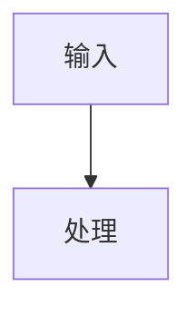

# create-structure-md Skill Design

## Status

Ready for user review.

## Purpose

`create-structure-md` is a local personal Codex skill for creating a single software structure design document. It does not analyze code, infer requirements, run repository intelligence tools, or decide what the system means. Codex performs any code or requirement understanding outside the skill. This skill only turns Codex-prepared structured design content into a validated `STRUCTURE_DESIGN.md`.

The skill optimizes for document quality, repeatability, and renderable Mermaid diagrams. Mermaid is a first-class output surface, not a decorative afterthought.

## Confirmed Requirements

- Skill name: `create-structure-md`.
- Scope: local personal skill.
- Final output: one Markdown file named `STRUCTURE_DESIGN.md`.
- Intermediate outputs: one or more JSON DSL files may be created in a temporary working directory.
- Language: Chinese by default, with English terms where they are clearer or conventional.
- Mermaid only: Graphviz, DOT, SVG files, and image export are out of scope as final outputs.
- Mermaid diagrams are written as Markdown Mermaid code blocks; no separate image files are generated.
- `render_mermaid.py` is an independent script because Mermaid validity is critical.
- DSL coverage is complete for the document, not only a minimal subset.
- Every design item should carry confidence where useful: `observed`, `inferred`, or `unknown`.
- DSL JSON contains document content only. Validation policy fields such as `empty_allowed`, `required`, `min_rows`, or rendering control flags must not appear in DSL instances.
- Necessary source snippets are allowed when they improve the document.
- Architecture issues such as cycles, reverse dependencies, and unclear ownership are recorded honestly when Codex supplies them.
- The final Markdown uses fixed 9 chapters. Section-specific non-empty rules are enforced by Python validation scripts and documented for Codex before it writes the DSL.
- Examples and tests are required.

## Non-Goals

The skill will not:

- Inspect or understand a target repository.
- Generate `repo_facts.json`.
- Include `analyze_repo.py`.
- Depend on Tree-sitter, Doxygen, pyreverse, cflow, libclang, or Graphviz.
- Create multiple Markdown chapter files.
- Generate Word, PDF, SVG, PNG, or other rendered document formats as final deliverables.
- Include C2000, TI driverlib, CPU1/CPU2, ISR, or embedded-C-specific profiles in the first version.
- Automatically delete temporary files or generated artifacts.

## Alternatives Considered

### Full Repository Analysis Pipeline

The old direction used static analysis scripts, repository facts, evidence indexes, and rendering. That is too broad for this skill. It mixes two responsibilities: understanding a project and creating a document. The user explicitly narrowed the skill to document creation.

### Direct Markdown Generation

Codex could write `STRUCTURE_DESIGN.md` directly from its understanding. This is simple, but it gives up validation, reusable examples, Mermaid checks, and consistent structure. It also makes later improvements hard because document shape is embedded in free-form Markdown.

### DSL-Driven Single Document

This is the selected approach. Codex creates a complete JSON DSL in a temporary directory, validates the DSL, validates Mermaid blocks independently, and renders a single Markdown file through a template. This keeps the skill focused while preserving quality gates.

## Proposed Skill Structure

```text
create-structure-md/
├── SKILL.md
├── references/
│   ├── dsl-spec.md
│   ├── document-structure.md
│   ├── mermaid-rules.md
│   └── review-checklist.md
├── schemas/
│   └── structure-design.schema.json
├── scripts/
│   ├── validate_dsl.py
│   ├── render_mermaid.py
│   └── render_markdown.py
├── templates/
│   └── STRUCTURE_DESIGN.md.tpl
├── examples/
│   ├── minimal-from-code.dsl.json
│   └── minimal-from-requirements.dsl.json
└── tests/
    ├── test_validate_dsl.py
    ├── test_render_mermaid.py
    └── test_render_markdown.py
```

## Skill Workflow

1. Codex understands the target codebase, requirements, or user-provided notes outside this skill.
2. Codex invokes `create-structure-md` when the user asks for a software structure design document.
3. The skill instructs Codex to create a temporary working directory, such as `/tmp/create-structure-md-<run-id>`.
4. Codex writes one complete DSL JSON file and may write smaller staged JSON files first.
5. Codex runs `validate_dsl.py` against the complete DSL.
6. Codex runs `render_mermaid.py` to validate Mermaid diagram blocks.
7. Codex runs `render_markdown.py` to create `STRUCTURE_DESIGN.md`.
8. Codex reviews the generated document with `references/review-checklist.md`.
9. Codex reports the output path, temporary working directory path, and any assumptions or low-confidence items.

Temporary files are not automatically deleted. If cleanup is needed, Codex should provide the command for the user to run.

## DSL Design

The DSL is the contract between Codex's understanding and the renderer. It should be expressive enough to create the whole document, but not so elaborate that Codex fights the schema.

Top-level fields:

- `dsl_version`: schema version.
- `document`: rendered as chapter 1, with title, project name, versions, status, source type, generation metadata, and output filename.
- `system_overview`: rendered as chapter 2, with a compact system summary and core capabilities.
- `architecture_views`: rendered as chapter 3, with architecture summary, fixed module introduction table, and required module relationship Mermaid diagram.
- `module_design`: rendered as chapter 4, with one subsection per module from chapter 3.
- `runtime_view`: rendered as chapter 5, with runtime units, runtime flow, and optional runtime sequence diagram.
- `configuration_data_dependencies`: rendered as chapter 6, with configuration items, key structural data/artifacts, and dependencies.
- `cross_module_collaboration`: rendered as chapter 7, with cross-module collaboration scenarios and collaboration diagrams.
- `key_flows`: rendered as chapter 8, with key flow index and one Mermaid flow diagram per listed flow.
- `structure_issues_and_suggestions`: rendered as chapter 9, as optional free-form Markdown text.
- `evidence`, `traceability`, `risks`, `assumptions`, and `source_snippets`: DSL support data only. They may inform rendered chapters, but they do not become standalone Markdown chapters.

Important repeated fields:

- `id`: stable local identifier.
- `name`: human-readable Chinese name.
- `description`: concise explanation.
- `confidence`: `observed`, `inferred`, or `unknown`.
- `evidence_refs`: references to evidence items supplied in the DSL.
- `notes`: short supplemental notes where needed.

### Common Content Nodes

Most rendered chapters follow this lightweight structure:

```json
{
  "summary": "",
  "notes": [],
  "required_tables": {},
  "required_diagrams": {},
  "recommended_diagrams": {},
  "extra_tables": [],
  "extra_diagrams": []
}
```

Required tables and diagrams are schema-controlled and have fixed meanings. Extra tables and diagrams are Codex-controlled supplemental content, validated only for renderability.

Common table node:

```json
{
  "id": "TBL-001",
  "title": "表格标题",
  "columns": [
    { "key": "name", "title": "名称" }
  ],
  "rows": [
    { "name": "示例" }
  ]
}
```

Common Mermaid diagram node:

```json
{
  "id": "MER-001",
  "kind": "module_relationship",
  "title": "图标题",
  "diagram_type": "flowchart",
  "description": "",
  "source": "flowchart TD\n  A[模块A] --> B[模块B]",
  "confidence": "observed"
}
```

The first version supports these `diagram_type` values:

```json
[
  "flowchart",
  "graph",
  "sequenceDiagram",
  "classDiagram",
  "stateDiagram-v2",
  "erDiagram",
  "journey",
  "gantt",
  "timeline",
  "mindmap",
  "quadrantChart",
  "requirementDiagram",
  "C4Context",
  "C4Container",
  "C4Component",
  "C4Dynamic"
]
```

Mermaid diagrams are embedded under the section that renders them. There is no global diagram routing field and no attempt to model Mermaid nodes or edges in the DSL.

### Validation Policy Outside DSL

DSL instances must not include validation policy fields. In particular, JSON written by Codex must not contain `empty_allowed`, `required`, `min_rows`, `max_rows`, `render_when_empty`, or similar control fields. The DSL says what the document contains; `validate_dsl.py` decides whether that content is sufficient.

The selected policy split is:

- `schemas/structure-design.schema.json` enforces structural shape, required object fields, primitive types, fixed table columns, and enum values.
- `validate_dsl.py` enforces semantic rules that need project-wide knowledge: non-empty table rows, one-to-one references, module coverage, flow coverage, and Mermaid source presence.
- `references/dsl-spec.md` and `references/document-structure.md` tell Codex which fields are required before it writes the DSL.
- `render_markdown.py` assumes the DSL has already passed validation. It renders optional empty content with fixed wording, but it does not decide whether required content may be missing.

Requiredness is documented as rules beside each chapter below, not encoded as fields in JSON examples.

### Chapter 1: Document Information

`document` renders as a compact information table.

```json
{
  "document": {
    "title": "软件结构设计说明书",
    "project_name": "",
    "project_version": "",
    "document_version": "",
    "status": "draft",
    "generated_at": "",
    "generated_by": "Codex",
    "language": "zh-CN",
    "source_type": "mixed",
    "scope_summary": "",
    "not_applicable_policy": "固定章节；按章节规则处理空内容",
    "output_file": "STRUCTURE_DESIGN.md"
  }
}
```

### Chapter 2: System Overview

`system_overview` is intentionally brief. It should not duplicate architecture or module details.

```json
{
  "system_overview": {
    "summary": "",
    "purpose": "",
    "core_capabilities": [
      {
        "id": "CAP-001",
        "name": "",
        "description": "",
        "confidence": "observed"
      }
    ],
    "notes": []
  }
}
```

### Chapter 3: Architecture Views

Chapter 3 is the architecture overview. It must include a fixed module introduction table and at least one module relationship Mermaid diagram. It does not include an architecture-view inventory table.

```json
{
  "architecture_views": {
    "summary": "",
    "notes": [],
    "required_tables": {
      "module_intro": {
        "id": "TBL-ARCH-MODULES",
        "title": "各模块介绍",
        "columns": [
          { "key": "module_name", "title": "模块名称" },
          { "key": "responsibility", "title": "主要职责" },
          { "key": "inputs", "title": "输入/依赖" },
          { "key": "outputs", "title": "输出/提供能力" },
          { "key": "notes", "title": "备注" }
        ],
        "rows": []
      }
    },
    "required_diagrams": {
      "module_relationship": {
        "id": "MER-ARCH-MODULES",
        "kind": "module_relationship",
        "title": "模块关系图",
        "diagram_type": "flowchart",
        "description": "展示系统内部主要模块及其关系。",
        "source": "",
        "confidence": "observed"
      }
    },
    "extra_tables": [],
    "extra_diagrams": []
  }
}
```

Rules:

- `required_tables.module_intro` must exist.
- `module_intro.columns` are fixed to `module_name`, `responsibility`, `inputs`, `outputs`, and `notes`.
- `module_intro.rows` must contain at least one module. If no module can be identified, Codex must revise its structure understanding before rendering.
- `required_diagrams.module_relationship` must exist.
- `module_relationship.diagram_type` is not fixed, but it must be one of the supported Mermaid diagram types.
- `module_relationship.source` must be non-empty and pass Mermaid validation.
- `extra_tables` and `extra_diagrams` may be used for additional architecture material.

### Chapter 4: Module Design

Chapter 4 expands each module listed in chapter 3. Every module must be explainable. If a module has no external interface or no internal call graph, Codex must re-partition the modules instead of emitting `未识别`.

```json
{
  "module_design": {
    "summary": "",
    "notes": [],
    "modules": [
      {
        "id": "MOD-001",
        "name": "",
        "summary": "",
        "responsibilities": [],
        "external_interface_summary": {
          "description": "",
          "callers": [],
          "interface_style": "",
          "boundary_notes": []
        },
        "external_interface_details": {
          "required_tables": {
            "external_interfaces": {
              "id": "TBL-MOD-001-IFACE",
              "title": "对外函数接口",
              "columns": [
                { "key": "interface_name", "title": "接口名称" },
                { "key": "interface_type", "title": "接口类型" },
                { "key": "description", "title": "说明" },
                { "key": "inputs", "title": "输入" },
                { "key": "outputs", "title": "输出" },
                { "key": "notes", "title": "备注" }
              ],
              "rows": []
            }
          },
          "extra_tables": [],
          "extra_diagrams": []
        },
        "required_diagrams": {
          "internal_call_graph": {
            "id": "MER-MOD-001-CALLS",
            "kind": "internal_call_graph",
            "title": "内部主要函数调用图",
            "diagram_type": "flowchart",
            "description": "展示模块内部主要函数调用关系。",
            "source": "",
            "confidence": "observed"
          }
        },
        "extra_tables": [],
        "extra_diagrams": [],
        "source_snippets": [],
        "notes": [],
        "confidence": "observed"
      }
    ]
  }
}
```

Rules:

- `module_design.modules` must cover every module in `architecture_views.required_tables.module_intro.rows` by matching `modules[].name` to `module_intro.rows[].module_name`.
- Each module renders as its own subsection.
- Each module must have a non-empty `summary`.
- Each module must have at least one responsibility.
- `external_interface_summary.description` must be non-empty.
- `external_interface_summary.interface_style` is free text, not an enum.
- `external_interface_details.required_tables.external_interfaces` must exist.
- The external interface table has fixed columns: `interface_name`, `interface_type`, `description`, `inputs`, `outputs`, and `notes`.
- The external interface table must have at least one row.
- Each external interface row must include non-empty `interface_name` and `description`.
- `required_diagrams.internal_call_graph` must exist.
- `internal_call_graph.diagram_type` must be one of the supported Mermaid diagram types.
- `internal_call_graph.source` must be non-empty and pass Mermaid validation.
- If these requirements cannot be satisfied, final rendering stops and Codex must revise the module partitioning.

### Chapter 5: Runtime View

Chapter 5 explains how the system runs. A runtime unit is something that is started, triggered, scheduled, or continuously executed, such as a CLI command, service process, worker, event loop, interrupt path, library call path, or document-generation phase.

```json
{
  "runtime_view": {
    "summary": "",
    "notes": [],
    "required_tables": {
      "runtime_units": {
        "id": "TBL-RUNTIME-UNITS",
        "title": "运行单元说明",
        "columns": [
          { "key": "unit_name", "title": "运行单元" },
          { "key": "unit_type", "title": "类型" },
          { "key": "entrypoint", "title": "入口/触发方式" },
          { "key": "responsibility", "title": "运行职责" },
          { "key": "related_modules", "title": "关联模块" },
          { "key": "notes", "title": "备注" }
        ],
        "rows": []
      }
    },
    "required_diagrams": {
      "runtime_flow": {
        "id": "MER-RUNTIME-FLOW",
        "kind": "runtime_flow",
        "title": "运行时流程图",
        "diagram_type": "flowchart",
        "description": "展示系统启动、运行单元协作和主要调度路径。",
        "source": "",
        "confidence": "observed"
      }
    },
    "recommended_diagrams": {
      "runtime_sequence": {
        "id": "MER-RUNTIME-SEQUENCE",
        "kind": "runtime_sequence",
        "title": "运行时序图",
        "diagram_type": "sequenceDiagram",
        "description": "推荐生成，用于展示关键运行路径中对象或模块之间的时序交互。",
        "source": "",
        "confidence": "observed"
      }
    },
    "extra_tables": [],
    "extra_diagrams": []
  }
}
```

Rules:

- `required_tables.runtime_units` must exist and its columns are fixed.
- `runtime_units.rows` must contain at least one runtime unit.
- `required_diagrams.runtime_flow` must exist.
- `runtime_flow.diagram_type` must be one of the supported Mermaid diagram types.
- `runtime_flow.source` must be non-empty and pass Mermaid validation.
- `recommended_diagrams.runtime_sequence` is recommended but not required. If Codex does not generate it, the field may be omitted or left empty and the renderer does not output it. If it has a non-empty `source`, it must use `sequenceDiagram` and pass Mermaid validation.

### Chapter 6: Configuration, Data, and Dependencies

Chapter 6 is named `配置、数据与依赖关系`. It uses tables as the primary expression form. It does not define a recommended Mermaid diagram because mixing configuration, data, products, and dependencies into one diagram is usually unclear. Codex may add `extra_diagrams` only when a diagram has one clear subject.

```json
{
  "configuration_data_dependencies": {
    "summary": "",
    "notes": [],
    "required_tables": {
      "configuration_items": {
        "id": "TBL-CONFIG-ITEMS",
        "title": "配置项说明",
        "columns": [
          { "key": "config_name", "title": "配置项" },
          { "key": "source", "title": "来源" },
          { "key": "used_by", "title": "使用方" },
          { "key": "purpose", "title": "用途" },
          { "key": "notes", "title": "备注" }
        ],
        "rows": []
      },
      "structural_data_artifacts": {
        "id": "TBL-STRUCTURAL-DATA-ARTIFACTS",
        "title": "关键结构数据与产物",
        "columns": [
          { "key": "artifact_name", "title": "结构数据/产物" },
          { "key": "artifact_type", "title": "类型" },
          { "key": "owner", "title": "归属/维护方" },
          { "key": "producer", "title": "产生方" },
          { "key": "consumer", "title": "使用方" },
          { "key": "notes", "title": "备注" }
        ],
        "rows": []
      },
      "dependencies": {
        "id": "TBL-DEPENDENCIES",
        "title": "依赖项说明",
        "columns": [
          { "key": "dependency_name", "title": "依赖项" },
          { "key": "dependency_type", "title": "类型" },
          { "key": "used_by", "title": "使用方" },
          { "key": "purpose", "title": "用途" },
          { "key": "notes", "title": "备注" }
        ],
        "rows": []
      }
    },
    "extra_tables": [],
    "extra_diagrams": []
  }
}
```

Rules:

- `required_tables.configuration_items` must exist and its columns are fixed.
- `configuration_items.rows` may be empty. If empty, the final Markdown renders a fixed `不适用` statement instead of an empty table.
- `required_tables.structural_data_artifacts` must exist, its columns are fixed, and `rows` must contain at least one item.
- `required_tables.dependencies` must exist, its columns are fixed, and `rows` must contain at least one item.
- `extra_diagrams` are allowed only for a single clear subject, such as product flow or template dependency. There is no recommended combined diagram for this chapter.

### Chapter 7: Cross-Module Collaboration

Chapter 7 is named `跨模块协作关系`. It explains how multiple modules work together. It must not repeat the per-module interface details from chapter 4.

```json
{
  "cross_module_collaboration": {
    "summary": "",
    "notes": [],
    "required_tables": {
      "collaboration_scenarios": {
        "id": "TBL-COLLABORATION-SCENARIOS",
        "title": "跨模块协作说明",
        "columns": [
          { "key": "scenario", "title": "协作场景" },
          { "key": "initiator_module", "title": "发起模块" },
          { "key": "participant_modules", "title": "参与模块" },
          { "key": "collaboration_method", "title": "协作方式" },
          { "key": "description", "title": "说明" }
        ],
        "rows": []
      }
    },
    "required_diagrams": {
      "collaboration_relationship": {
        "id": "MER-COLLABORATION-RELATIONSHIP",
        "kind": "collaboration_relationship",
        "title": "跨模块协作关系图",
        "diagram_type": "flowchart",
        "description": "展示多个模块在协作场景中的调用、消息、数据传递或控制流。",
        "source": "",
        "confidence": "observed"
      }
    },
    "extra_tables": [],
    "extra_diagrams": []
  }
}
```

Rules:

- `required_tables.collaboration_scenarios` must exist and its columns are fixed.
- `collaboration_scenarios.rows` must contain at least one collaboration scenario.
- `required_diagrams.collaboration_relationship` must exist.
- `collaboration_relationship.diagram_type` must be one of the supported Mermaid diagram types.
- `collaboration_relationship.source` must be non-empty and pass Mermaid validation.
- This chapter describes cross-module collaboration only. It must not duplicate chapter 4 external interface tables or turn into a function signature list.

### Chapter 8: Key Flows

Chapter 8 is named `关键流程`. It explains the most important end-to-end flows. The flow index table is an index, not the whole content: every listed flow must have a matching detail node and a Mermaid diagram.

```json
{
  "key_flows": {
    "summary": "",
    "notes": [],
    "required_tables": {
      "flow_index": {
        "id": "TBL-KEY-FLOWS",
        "title": "关键流程清单",
        "columns": [
          { "key": "flow_id", "title": "流程ID" },
          { "key": "flow_name", "title": "流程名称" },
          { "key": "trigger_condition", "title": "触发条件" },
          { "key": "participants", "title": "参与模块/运行单元" },
          { "key": "main_steps", "title": "主要步骤" },
          { "key": "output_result", "title": "输出结果" },
          { "key": "notes", "title": "备注" }
        ],
        "rows": []
      }
    },
    "flows": [
      {
        "flow_id": "FLOW-001",
        "name": "",
        "overview": "",
        "steps": [],
        "branches_or_exceptions": [],
        "related_modules": [],
        "diagram": {
          "id": "MER-FLOW-001",
          "kind": "key_flow",
          "title": "关键流程图",
          "diagram_type": "flowchart",
          "description": "",
          "source": "",
          "confidence": "observed"
        }
      }
    ],
    "extra_tables": [],
    "extra_diagrams": []
  }
}
```

Rules:

- `required_tables.flow_index` must exist and its columns are fixed.
- `flow_index.rows` must contain at least one key flow.
- Every `flow_index.rows[].flow_id` must match exactly one `flows[].flow_id`.
- Every `flows[].flow_id` must appear exactly once in `flow_index.rows`.
- Every flow must have non-empty `name`, `overview`, and `steps`.
- Every flow must have a `diagram`.
- Every flow diagram must use a supported Mermaid `diagram_type`.
- Every flow diagram `source` must be non-empty and pass Mermaid validation.

### Chapter 9: Structure Issues and Suggestions

Chapter 9 is named `结构问题与改进建议`. It is intentionally free-form so Codex can summarize useful structural observations without forcing another table model.

```json
{
  "structure_issues_and_suggestions": ""
}
```

Rules:

- `structure_issues_and_suggestions` is a string.
- It may be an empty string.
- Codex may write Markdown text in this string, such as paragraphs or bullet lists.
- It must not contain a structured table or diagram object in the DSL.
- If empty, the final Markdown renders `未识别到明确的结构问题与改进建议。`

## Markdown Document Structure

`STRUCTURE_DESIGN.md` should use a stable single-file outline:

```text
# 软件结构设计说明书

1. 文档信息
2. 系统概览
3. 架构视图
4. 模块设计
5. 运行时视图
6. 配置、数据与依赖关系
7. 跨模块协作关系
8. 关键流程
9. 结构问题与改进建议
```

The final document always keeps the fixed chapters. Section-specific non-empty rules override the general fallback. Missing required content means the DSL is invalid and Codex must revise its structured content before rendering.

The chapters render as follows:

```text
1. 文档信息
   - Compact document metadata table.

2. 系统概览
   - System summary, purpose, core capabilities, and brief notes.

3. 架构视图
   3.1 架构概述
   3.2 各模块介绍
   3.3 模块关系图
   3.4 补充架构图表

4. 模块设计
   4.x 模块名
   4.x.1 模块概述
   4.x.2 模块职责
   4.x.3 对外接口说明
   4.x.4 对外接口详情
   4.x.5 内部主要函数调用图
   4.x.6 补充说明

5. 运行时视图
   5.1 运行时概述
   5.2 运行单元说明
   5.3 运行时流程图
   5.4 运行时序图（推荐，存在时渲染）
   5.5 补充运行时图表

6. 配置、数据与依赖关系
   6.1 配置项说明
   6.2 关键结构数据与产物
   6.3 依赖项说明
   6.4 补充图表

7. 跨模块协作关系
   7.1 协作关系概述
   7.2 跨模块协作说明
   7.3 跨模块协作关系图
   7.4 补充协作图表

8. 关键流程
   8.1 关键流程概述
   8.2 关键流程清单
   8.x 流程名
   8.x.1 流程概述
   8.x.2 步骤说明
   8.x.3 异常/分支说明
   8.x.4 流程图

9. 结构问题与改进建议
   - Free-form Markdown string, or a fixed empty-state sentence.
```

## Mermaid Requirements

All diagrams in the final Markdown must be Mermaid code blocks:

````markdown

````

Mermaid diagrams are section-local child nodes. The DSL does not use global diagram routing metadata.

Supported `diagram_type` values:

```json
[
  "flowchart",
  "graph",
  "sequenceDiagram",
  "classDiagram",
  "stateDiagram-v2",
  "erDiagram",
  "journey",
  "gantt",
  "timeline",
  "mindmap",
  "quadrantChart",
  "requirementDiagram",
  "C4Context",
  "C4Container",
  "C4Component",
  "C4Dynamic"
]
```

`render_mermaid.py` should validate Mermaid text without network access. Because the skill is expected to support Mermaid broadly rather than maintain a partial custom grammar, strict validation should delegate to a local Mermaid-compatible parser or CLI when one is available. If strict validation tooling is unavailable, the script must say so clearly and must not claim that diagrams were proven renderable.

The script should provide two modes:

- `--strict`: use local Mermaid tooling to parse or render-check diagram source. This is the default mode for final document generation.
- `--static`: run deterministic checks that catch common structural mistakes. This mode is useful for tests and quick feedback, but it is not a substitute for strict validation.

Static checks:

- Code block language is `mermaid`.
- Diagram body is non-empty.
- `diagram_type` is one of the supported enum values.
- The first meaningful line is compatible with `diagram_type`.
- Markdown fences are balanced.
- Disallowed Graphviz/DOT constructs such as `digraph`, `rankdir`, and `node -> node;` are rejected when they appear as diagram source. Mermaid arrows such as `-->` and `->>` remain allowed.
- Diagram IDs are unique.

The script should fail closed for malformed diagram blocks. It should print actionable errors that name the diagram ID and field path.

## Script Responsibilities

### `validate_dsl.py`

Validates the complete JSON DSL against `schemas/structure-design.schema.json` and performs semantic checks that JSON Schema cannot express well.

Core checks:

- Required top-level fields exist.
- IDs are unique within their collections.
- References point to existing IDs.
- `confidence` values use the allowed enum.
- Required document sections can be rendered.
- DSL instances do not contain validation policy fields such as `empty_allowed`, `required`, `min_rows`, `max_rows`, or `render_when_empty`.
- Chapter 3 has the required module introduction table and module relationship diagram.
- Chapter 4 covers every module listed in chapter 3.
- Chapter 4 module details have non-empty external interface tables and non-empty internal call graph diagrams.
- Chapter 5 has at least one runtime unit and a non-empty runtime flow diagram.
- Chapter 6 allows an empty configuration item table but requires non-empty structural data/artifact and dependency tables.
- Chapter 7 has at least one collaboration scenario and a non-empty collaboration relationship diagram.
- Chapter 8 has at least one key flow, the flow index and `flows` array are one-to-one by `flow_id`, and every listed flow has a non-empty Mermaid diagram.
- Chapter 9 is a string and may be empty.

### `render_mermaid.py`

Extracts and validates Mermaid definitions from DSL or rendered Markdown. It does not render images. It exists to keep diagram correctness visible and independently testable.

### `render_markdown.py`

Renders `STRUCTURE_DESIGN.md` from the DSL and `templates/STRUCTURE_DESIGN.md.tpl` using Python standard-library rendering. It should not invent content. Missing optional content is rendered as a short explicit statement rather than silently disappearing.

## Error Handling

Validation failures should stop rendering. Rendering failures should preserve the DSL and temporary working directory so the issue can be inspected. Error messages should include the failing file, JSON path or diagram ID, and a short correction hint.

If Codex lacks enough content to populate a section that is allowed to be empty, it should use the section's documented empty representation rather than making up facts.

If Codex lacks enough content to populate a required non-empty section, final generation must stop and require Codex to revise its structured content. Chapter 4 missing module details specifically require module re-partitioning.

If Mermaid strict validation tooling is unavailable, final generation should stop with a clear message unless the user explicitly accepts static-only validation for that run.

## Testing Strategy

Tests should cover:

- The two example DSL files validate successfully.
- Missing required fields fail validation with clear errors.
- Invalid references fail validation.
- Invalid `confidence` values fail validation.
- Mermaid diagrams with Graphviz/DOT syntax fail validation.
- Valid Mermaid examples across multiple diagram types pass lightweight validation.
- Rendering creates exactly one `STRUCTURE_DESIGN.md`.
- Rendered Markdown includes balanced fences and no Graphviz code block.
- Chapter 3 fails validation if the fixed module introduction table or required module relationship diagram is missing.
- Chapter 4 fails validation if any listed module lacks an external interface row or internal call graph source.
- Chapter 5 fails validation if runtime units are empty or runtime flow Mermaid source is missing.
- Chapter 6 passes validation with an empty configuration item table but fails if structural data/artifacts or dependencies are empty.
- Chapter 7 fails validation if collaboration scenarios are empty or the collaboration diagram source is missing.
- Chapter 8 fails validation if flow index rows and `flows` entries do not match one-to-one by `flow_id`, or if any flow lacks a Mermaid diagram.
- Chapter 9 accepts an empty string.
- DSL examples and tests prove that `empty_allowed` and similar validation policy fields do not appear in JSON instances.

## Examples

Two example DSL files are required:

- `minimal-from-code.dsl.json`: describes a document generated after Codex has understood an existing codebase.
- `minimal-from-requirements.dsl.json`: describes a document generated from requirements or design notes without an implemented codebase.

The examples should stay small enough to read quickly but complete enough to exercise every required top-level DSL section.

## Implementation Notes

The first implementation should avoid optional Python dependencies. Python standard library is preferred for JSON validation glue, Markdown rendering, and tests. Mermaid validation is the exception: strict Mermaid confidence should come from local Mermaid tooling rather than an incomplete hand-written grammar.

The skill should keep `SKILL.md` concise. Detailed DSL fields, document outline, Mermaid rules, and review criteria belong in `references/` so Codex loads them only when needed.

## Review Checklist

Before implementation begins, verify:

- The design keeps project understanding outside the skill.
- The output contract is one `STRUCTURE_DESIGN.md`.
- Mermaid is the only supported diagram output.
- Graphviz is fully removed.
- Temporary JSON files are allowed but not part of the final deliverable.
- The DSL includes confidence and evidence support.
- DSL instances contain content only, while requiredness and emptiness rules live in schema, validator code, and reference documentation.
- Tests cover schema, Mermaid validation, and Markdown rendering.
- The design is small enough for one implementation plan.
