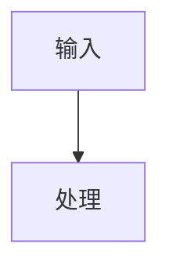

# create-structure-md Skill Design

## Status

Ready for user review.

## Purpose

`create-structure-md` is a local personal Codex skill for creating a single software structure design document. It does not analyze code, infer requirements, run repository intelligence tools, or decide what the system means. Codex performs any code or requirement understanding outside the skill. This skill only turns Codex-prepared structured design content into a validated `STRUCTURE_DESIGN.md`.

The skill optimizes for document quality, repeatability, and renderable Mermaid diagrams. Mermaid is a first-class output surface, not a decorative afterthought.

## Confirmed Requirements

- Skill name: `create-structure-md`.
- Scope: local personal skill.
- Final output: one Markdown file named `STRUCTURE_DESIGN.md`.
- Intermediate outputs: one or more JSON DSL files may be created in a temporary working directory.
- Language: Chinese by default, with English terms where they are clearer or conventional.
- Mermaid only: Graphviz, DOT, SVG files, and image export are out of scope as final deliverables.
- Mermaid diagrams are written as Markdown Mermaid code blocks; no final image files are generated.
- `validate_mermaid.py` is an independent script because Mermaid validity is critical.
- DSL coverage is complete for the document, not only a minimal subset.
- Key design items and fixed table rows carry confidence according to the DSL schema: `observed`, `inferred`, or `unknown`.
- DSL JSON contains document content only. Validation policy fields such as `empty_allowed`, `required`, `min_rows`, or rendering control flags must not appear in DSL instances.
- Necessary source snippets are allowed when they improve the document.
- Architecture issues such as cycles, reverse dependencies, and unclear ownership are recorded honestly when Codex supplies them.
- The final Markdown uses fixed 9 chapters. Section-specific non-empty rules are enforced by Python validation scripts and documented for Codex before it writes the DSL.
- Runtime Python dependencies are explicit and minimal. `jsonschema` is required for schema validation; Jinja2 is not used.
- Examples and tests are required.

## Non-Goals

The skill will not:

- Inspect or understand a target repository.
- Generate `repo_facts.json`.
- Include `analyze_repo.py`.
- Depend on Tree-sitter, Doxygen, pyreverse, cflow, libclang, or Graphviz.
- Create multiple Markdown chapter files.
- Generate Word, PDF, SVG, PNG, or other rendered document formats as final deliverables.
- Include C2000, TI driverlib, CPU1/CPU2, ISR, or embedded-C-specific profiles in the first version.
- Automatically delete temporary files or generated artifacts.

## Alternatives Considered

### Full Repository Analysis Pipeline

The old direction used static analysis scripts, repository facts, evidence indexes, and rendering. That is too broad for this skill. It mixes two responsibilities: understanding a project and creating a document. The user explicitly narrowed the skill to document creation.

### Direct Markdown Generation

Codex could write `STRUCTURE_DESIGN.md` directly from its understanding. This is simple, but it gives up validation, reusable examples, Mermaid checks, and consistent structure. It also makes later improvements hard because document shape is embedded in free-form Markdown.

### DSL-Driven Single Document

This is the selected approach. Codex creates a complete JSON DSL in a temporary directory, validates the DSL, validates Mermaid blocks independently, and renders a single Markdown file programmatically. This keeps the skill focused while preserving quality gates.

## Proposed Skill Structure

```text
create-structure-md/
├── SKILL.md
├── requirements.txt
├── references/
│   ├── dsl-spec.md
│   ├── document-structure.md
│   ├── mermaid-rules.md
│   └── review-checklist.md
├── schemas/
│   └── structure-design.schema.json
├── scripts/
│   ├── validate_dsl.py
│   ├── validate_mermaid.py
│   └── render_markdown.py
├── examples/
│   ├── minimal-from-code.dsl.json
│   └── minimal-from-requirements.dsl.json
└── tests/
    ├── test_validate_dsl.py
    ├── test_validate_mermaid.py
    └── test_render_markdown.py
```

`requirements.txt` contains required Python runtime dependencies:

```text
jsonschema
```

Jinja2 is intentionally not used in the MVP. Markdown rendering is code-driven so fixed chapter order, fixed table headers, empty states, support-data insertion, and Markdown escaping stay under deterministic renderer control.

## Input Readiness Contract

`create-structure-md` must be invoked only after Codex has already prepared enough structured design content outside this skill.

Before invoking the skill, Codex must have enough information to populate all required chapters without fabrication, including:

- module list and stable module IDs
- module responsibilities
- module relationships
- module-level external capabilities or interface requirements
- module internal structure information
- runtime units and runtime flow
- configuration, structural data/artifact, and dependency information when applicable
- cross-module collaboration scenarios
- key flows and one diagram concept per key flow
- confidence values and support-data references where the schema requires or allows them
- evidence references or source snippets when available and safe to disclose

If these inputs are not available, Codex must not invoke the renderer and must not invent missing content to satisfy validation. Codex should first perform project or requirements understanding outside this skill, then create the DSL and invoke this skill.

## Skill Workflow

1. Codex understands the target codebase, requirements, or user-provided notes outside this skill.
2. Codex invokes `create-structure-md` when the user asks for a software structure design document.
3. The skill instructs Codex to create a temporary working directory.
4. Codex writes one complete DSL JSON file and may write smaller staged JSON files first.
5. Codex runs `validate_dsl.py` against the complete DSL.
6. Codex runs `validate_mermaid.py` to validate Mermaid diagram blocks.
7. Codex runs `render_markdown.py` to create `STRUCTURE_DESIGN.md`.
8. Codex reviews the generated document with `references/review-checklist.md`.
9. Codex reports the output path, temporary working directory path, and any assumptions or low-confidence items.

Temporary files are not automatically deleted. If cleanup is needed, Codex should provide the command for the user to run.

## Output Location

Default final output path:

- If the user provides an output directory, write `STRUCTURE_DESIGN.md` there.
- Otherwise write `STRUCTURE_DESIGN.md` to the target repository root, or to the current working directory when no target repository root is known.
- The final file name must be exactly `STRUCTURE_DESIGN.md`.

Temporary work directory:

- Preferred: `<workspace>/.codex-tmp/create-structure-md-<run-id>/`.
- Fallback: system temp directory, such as `/tmp/create-structure-md-<run-id>`, if the workspace temp directory cannot be created.
- Temporary files are not automatically deleted. Codex reports the temporary work directory path after generation.
- The workspace `.gitignore` should include `.codex-tmp/` unless the user intentionally wants to version temporary artifacts. Codex should not edit `.gitignore` automatically unless requested.

Output overwrite policy:

- `render_markdown.py` must not overwrite an existing `STRUCTURE_DESIGN.md` by default.
- If the target file already exists, default rendering fails with a clear message.
- `--overwrite` explicitly replaces the existing output file.
- `--backup` first preserves the existing file as `STRUCTURE_DESIGN.md.bak-<YYYYMMDD_HHMMSS>`, then writes the new output.
- The backup timestamp comes from the local system clock when `render_markdown.py` runs and uses `%Y%m%d_%H%M%S`.
- `--backup` and `--overwrite` are mutually exclusive.
- If the computed backup path already exists, rendering fails and tells the user to retry. It must not overwrite or delete an existing backup.

## DSL Design

The DSL is the contract between Codex's understanding and the renderer. It should be expressive enough to create the whole document, but not so elaborate that Codex fights the schema.

Top-level fields:

- `dsl_version`: schema version.
- `document`: rendered as chapter 1, with title, project name, versions, status, source type, generation metadata, and output filename.
- `system_overview`: rendered as chapter 2, with a compact system summary and core capabilities.
- `architecture_views`: rendered as chapter 3, with architecture summary, fixed module introduction table, and required module relationship Mermaid diagram.
- `module_design`: rendered as chapter 4, with one subsection per module from chapter 3.
- `runtime_view`: rendered as chapter 5, with runtime units, runtime flow, and optional runtime sequence diagram.
- `configuration_data_dependencies`: rendered as chapter 6, with configuration items, key structural data/artifacts, and dependencies.
- `cross_module_collaboration`: rendered as chapter 7, with cross-module collaboration scenarios and collaboration diagrams.
- `key_flows`: rendered as chapter 8, with key flow index and one Mermaid flow diagram per listed flow.
- `structure_issues_and_suggestions`: rendered as chapter 9, as optional free-form Markdown text.
- `evidence`, `traceability`, `risks`, `assumptions`, and `source_snippets`: DSL support data only. They may inform rendered chapters, but they do not become standalone Markdown chapters.

Important repeated fields and metadata:

- `id`: stable local identifier.
- `name`: human-readable Chinese name.
- `description`: concise explanation.
- `confidence`: `observed`, `inferred`, or `unknown`.
- `evidence_refs`: references to evidence items supplied in the DSL.
- `traceability_refs`: references to traceability items supplied in the DSL.
- `source_snippet_refs`: references to safe source snippets supplied in the DSL.
- `notes`: short supplemental notes where needed.

Common metadata, when allowed by a schema object, has this shape:

```json
{
  "confidence": "observed",
  "evidence_refs": [],
  "traceability_refs": [],
  "source_snippet_refs": []
}
```

Rules:

- `confidence` must be `observed`, `inferred`, or `unknown`.
- `evidence_refs` must reference `evidence[].id`.
- `traceability_refs` must reference `traceability[].id`.
- `source_snippet_refs` must reference `source_snippets[].id`.
- Required content items with `confidence: unknown` are automatically summarized by the renderer at the end of chapter 9 under `低置信度项`.

ID prefix conventions:

- Module IDs use `MOD-...`.
- Runtime unit IDs use `RUN-...`.
- Flow IDs use `FLOW-...`.
- Mermaid diagram IDs use `MER-...`.
- Extra table IDs use `TBL-...`.
- Evidence IDs use `EV-...`.
- Traceability IDs use `TR-...`.
- Risk IDs use `RISK-...`.
- Assumption IDs use `ASM-...`.
- Source snippet IDs use `SNIP-...`.

The validator checks prefixes and uniqueness, but the MVP does not require a strict three-digit numeric suffix. IDs such as `MOD-001` and `MOD-RENDER-001` are both acceptable when unique.

Any field ending with `_id` or `_ids` is a strict reference unless it is the defining ID field itself. It must reference an existing object in the appropriate ID collection. Free-text fields must not be used for cross-node references.

Markdown safety:

- All DSL string fields are plain text unless the field name explicitly ends with `_markdown`, the field is `structure_issues_and_suggestions`, the field is a Mermaid diagram `source`, or the field is `source_snippets[].content`.
- Plain text fields must not inject Markdown structure into the final document.
- The renderer must escape Markdown-sensitive content in plain text fields, including table pipes, table-cell newlines, fenced-code markers, leading heading markers, and raw HTML blocks.
- Mermaid diagram `source` fields must contain Mermaid source only and must not contain Markdown fences. The renderer adds the final Mermaid code fences.
- Source snippet content is rendered as evidence code and must be fenced or escaped safely by the renderer so it cannot break the surrounding Markdown.

### MVP DSL Shape

The MVP uses semantic chapter fields instead of generic `required_tables`, `required_diagrams`, or `recommended_diagrams` wrappers. Fixed tables and fixed diagrams are named directly by their chapter meaning. Free-form supplemental content remains in `extra_tables` and `extra_diagrams`.

```json
{
  "dsl_version": "0.1.0",
  "document": {},
  "system_overview": {},
  "architecture_views": {
    "summary": "",
    "module_intro": { "rows": [] },
    "module_relationship_diagram": {},
    "extra_tables": [],
    "extra_diagrams": []
  },
  "module_design": {
    "summary": "",
    "modules": []
  },
  "runtime_view": {
    "summary": "",
    "runtime_units": { "rows": [] },
    "runtime_flow_diagram": {},
    "runtime_sequence_diagram": {},
    "extra_tables": [],
    "extra_diagrams": []
  },
  "configuration_data_dependencies": {
    "summary": "",
    "configuration_items": { "rows": [] },
    "structural_data_artifacts": { "rows": [] },
    "dependencies": { "rows": [] },
    "extra_tables": [],
    "extra_diagrams": []
  },
  "cross_module_collaboration": {
    "summary": "",
    "collaboration_scenarios": { "rows": [] },
    "collaboration_relationship_diagram": {},
    "extra_tables": [],
    "extra_diagrams": []
  },
  "key_flows": {
    "summary": "",
    "flow_index": { "rows": [] },
    "flows": [],
    "extra_tables": [],
    "extra_diagrams": []
  },
  "structure_issues_and_suggestions": "",
  "evidence": [],
  "traceability": [],
  "risks": [],
  "assumptions": [],
  "source_snippets": []
}
```

Fixed table nodes contain only rows:

```json
{
  "rows": [
    { "name": "示例" }
  ]
}
```

The renderer owns the fixed title and visible columns for each semantic table key. The validator checks that rows use the fixed content fields and metadata fields, and satisfy chapter-specific non-empty rules. DSL instances must not repeat fixed table `id`, `title`, or `columns`.

Some fixed table rows include metadata fields that are required for validation but are not necessarily rendered as visible table columns. For example, `module_intro.rows[].module_id` is the stable matching key for chapter 4, while chapter 3 still renders the fixed five user-facing columns: module name, responsibility, inputs, outputs, and notes.

Extra table node:

```json
{
  "id": "TBL-001",
  "title": "表格标题",
  "columns": [
    { "key": "name", "title": "名称" }
  ],
  "rows": [
    { "name": "示例" }
  ]
}
```

Extra table rules:

- `columns[].key` must be unique.
- `columns[].title` must be non-empty.
- Rows may use only declared column keys plus schema-approved metadata fields.
- Missing declared column keys render as empty strings.
- Unknown row keys fail validation.

Common Mermaid diagram node:

```json
{
  "id": "MER-001",
  "kind": "module_relationship",
  "title": "图标题",
  "diagram_type": "flowchart",
  "description": "",
  "source": "flowchart TD\n  A[模块A] --> B[模块B]",
  "confidence": "observed"
}
```

MVP Mermaid `diagram_type` values are fully supported and tested:

```json
[
  "flowchart",
  "graph",
  "sequenceDiagram",
  "classDiagram",
  "stateDiagram-v2"
]
```

Mermaid diagrams are embedded under the section that renders them. There is no global diagram routing field and no attempt to model Mermaid nodes or edges in the DSL.

All other Mermaid diagram types are not supported in the MVP.

### Validation Policy Outside DSL

DSL instances must not include validation policy fields. In particular, JSON written by Codex must not contain `empty_allowed`, `required`, `min_rows`, `max_rows`, `render_when_empty`, or similar control fields. The DSL says what the document contains; `validate_dsl.py` decides whether that content is sufficient.

The selected policy split is:

- `schemas/structure-design.schema.json` enforces structural shape, required object fields, primitive types, fixed table row content/metadata fields, and enum values.
- `validate_dsl.py` must use the required `jsonschema` Python dependency to validate `schemas/structure-design.schema.json` before running semantic checks.
- `validate_dsl.py` then enforces semantic rules that need project-wide knowledge: non-empty table rows, one-to-one references, module coverage, flow coverage, and Mermaid source presence.
- `references/dsl-spec.md` and `references/document-structure.md` tell Codex which fields are required before it writes the DSL.
- `render_markdown.py` assumes the DSL has already passed validation. It renders optional empty content with fixed wording, escapes plain text, owns fixed table headers, and programmatically generates the fixed 9 chapters.

Requiredness is documented as rules beside each chapter below, not encoded as fields in JSON examples.

### Support Data Structures

Support data is referenced by design nodes and rendered near those nodes or at the end of chapter 9. It does not become standalone Markdown chapters.

```json
{
  "evidence": [
    {
      "id": "EV-001",
      "kind": "source",
      "title": "",
      "location": "",
      "description": "",
      "confidence": "observed"
    }
  ],
  "traceability": [
    {
      "id": "TR-001",
      "source_id": "REQ-001",
      "source_type": "requirement",
      "target_type": "module",
      "target_id": "MOD-001",
      "description": ""
    }
  ],
  "risks": [
    {
      "id": "RISK-001",
      "description": "",
      "impact": "",
      "mitigation": "",
      "confidence": "inferred",
      "evidence_refs": [],
      "traceability_refs": [],
      "source_snippet_refs": []
    }
  ],
  "assumptions": [
    {
      "id": "ASM-001",
      "description": "",
      "rationale": "",
      "validation_suggestion": "",
      "confidence": "unknown",
      "evidence_refs": [],
      "traceability_refs": [],
      "source_snippet_refs": []
    }
  ]
}
```

Rules:

- `evidence[].kind` must be `source`, `requirement`, `note`, or `analysis`.
- `traceability[].source_type` must be `requirement`, `note`, `code`, or `user_input`.
- `traceability[].target_type` must be `module`, `capability`, `flow`, `flow_step`, `runtime_unit`, `collaboration`, `configuration_item`, `data_artifact`, or `dependency`.
- `traceability_refs` reference `traceability[].id`; source identifiers such as `REQ-001` belong in `traceability[].source_id`.
- `risks` and `assumptions` are appended to chapter 9 by the renderer when present.
- Common metadata is allowed on module introduction rows, `module_design.modules[]`, provided capability rows, runtime unit rows, chapter 6 rows, collaboration scenario rows, flow objects, flow steps, branch/exception items, risks, and assumptions.

### Chapter 1: Document Information

`document` renders as a compact information table.

```json
{
  "document": {
    "title": "软件结构设计说明书",
    "project_name": "",
    "project_version": "",
    "document_version": "",
    "status": "draft",
    "generated_at": "",
    "generated_by": "Codex",
    "language": "zh-CN",
    "source_type": "mixed",
    "scope_summary": "",
    "not_applicable_policy": "固定章节；按章节规则处理空内容",
    "output_file": "STRUCTURE_DESIGN.md"
  }
}
```

Rules:

- `status` must be `draft`, `reviewed`, or `final`.
- `source_type` must be `code`, `requirements`, `mixed`, or `notes`.
- `generated_at` should be an ISO-8601 local datetime with timezone when available.
- `language` defaults to `zh-CN`.
- `output_file` must equal `STRUCTURE_DESIGN.md`.

### Chapter 2: System Overview

`system_overview` is intentionally brief. It should not duplicate architecture or module details.

```json
{
  "system_overview": {
    "summary": "",
    "purpose": "",
    "core_capabilities": [
      {
        "id": "CAP-001",
        "name": "",
        "description": "",
        "confidence": "observed"
      }
    ],
    "notes": []
  }
}
```

### Chapter 3: Architecture Views

Chapter 3 is the architecture overview. It must include a fixed module introduction table and at least one module relationship Mermaid diagram. It does not include an architecture-view inventory table.

```json
{
  "architecture_views": {
    "summary": "",
    "notes": [],
    "module_intro": {
      "rows": [
        {
          "module_id": "MOD-001",
          "module_name": "",
          "responsibility": "",
          "inputs": "",
          "outputs": "",
          "notes": "",
          "confidence": "observed",
          "evidence_refs": [],
          "traceability_refs": [],
          "source_snippet_refs": []
        }
      ]
    },
    "module_relationship_diagram": {
      "id": "MER-ARCH-MODULES",
      "kind": "module_relationship",
      "title": "模块关系图",
      "diagram_type": "flowchart",
      "description": "展示系统内部主要模块及其关系。",
      "source": "",
      "confidence": "observed"
    },
    "extra_tables": [],
    "extra_diagrams": []
  }
}
```

Rules:

- `module_intro` must exist.
- `module_intro.rows` must include `module_id` plus five visible table fields: `module_name`, `responsibility`, `inputs`, `outputs`, and `notes`, plus common metadata.
- `module_intro.rows[].module_id` is validation metadata, not a visible table column. It must be non-empty and unique.
- `module_intro.rows` must contain at least one module. If no module can be identified, Codex must revise its structure understanding before rendering.
- `module_relationship_diagram` must exist.
- `module_relationship_diagram.diagram_type` is not fixed, but it must be one of the supported Mermaid diagram types.
- `module_relationship_diagram.source` must be non-empty and pass Mermaid validation.
- `extra_tables` and `extra_diagrams` may be used for additional architecture material.

### Chapter 4: Module Design

Chapter 4 expands each module listed in chapter 3. Every module must be explainable at the structure-design level. This chapter describes module-level capabilities, interface requirements, and internal structure relationships. It must not become a function-level API reference, function signature list, or detailed design document.

```json
{
  "module_design": {
    "summary": "",
    "notes": [],
    "modules": [
      {
        "id": "MOD-001",
        "name": "",
        "summary": "",
        "responsibilities": [],
        "external_capability_summary": {
          "description": "",
          "consumers": [],
          "interface_style": "",
          "boundary_notes": []
        },
        "external_capability_details": {
          "provided_capabilities": {
            "rows": [
              {
                "capability_name": "",
                "interface_style": "",
                "description": "",
                "inputs": "",
                "outputs": "",
                "notes": "",
                "confidence": "observed",
                "evidence_refs": [],
                "traceability_refs": [],
                "source_snippet_refs": []
              }
            ]
          },
          "extra_tables": [],
          "extra_diagrams": []
        },
        "internal_structure": {
          "summary": "",
          "diagram": {
            "id": "MER-MOD-001-STRUCT",
            "kind": "internal_structure",
            "title": "模块内部结构关系图",
            "diagram_type": "flowchart",
            "description": "展示模块内部组成、数据/控制关系或子职责关系。",
            "source": "",
            "confidence": "observed"
          },
          "textual_structure": "",
          "not_applicable_reason": ""
        },
        "extra_tables": [],
        "extra_diagrams": [],
        "evidence_refs": [],
        "traceability_refs": [],
        "source_snippet_refs": [],
        "notes": [],
        "confidence": "observed"
      }
    ]
  }
}
```

Rules:

- `module_design.modules` must cover every module in `architecture_views.module_intro.rows` by matching `modules[].id` to `module_intro.rows[].module_id`.
- Each module renders as its own subsection.
- Each module must have a non-empty `id`, `name`, and `summary`.
- Each module must have at least one responsibility.
- `external_capability_summary.description` must be non-empty.
- `external_capability_summary.interface_style` is free text, not an enum.
- `external_capability_details.provided_capabilities` must exist.
- The provided capabilities table uses fixed visible row fields: `capability_name`, `interface_style`, `description`, `inputs`, `outputs`, and `notes`, plus common metadata fields.
- The provided capabilities table must have at least one row.
- Each provided capability row must include non-empty `capability_name` and `description`.
- Each provided capability row must include `confidence`.
- `internal_structure.summary` must be non-empty.
- `internal_structure.diagram.source` is preferred. If present, it must use a supported Mermaid `diagram_type` and pass Mermaid validation.
- If `internal_structure.diagram.source` is empty, `internal_structure.textual_structure` must be non-empty and describe the module's internal composition, data/control relationships, or sub-responsibility relationships.
- `internal_structure.not_applicable_reason` may explain why a diagram is not useful, but it cannot by itself satisfy internal structure validation.
- Missing a function call graph is not a reason to force module re-partitioning.
- If a module has neither an internal structure diagram nor a textual internal structure description, final rendering stops and Codex must revise the module design.
- Function names may appear as observed evidence or existing interface names when useful, but the chapter must not center on function prototypes, parameter lists, return-value definitions, or full call chains.

### Chapter 5: Runtime View

Chapter 5 explains how the system runs. A runtime unit is something that is started, triggered, scheduled, or continuously executed, such as a CLI command, service process, worker, event loop, interrupt path, library call path, or document-generation phase.

```json
{
  "runtime_view": {
    "summary": "",
    "notes": [],
    "runtime_units": {
      "rows": [
        {
          "unit_id": "RUN-001",
          "unit_name": "",
          "unit_type": "",
          "entrypoint": "",
          "responsibility": "",
          "related_module_ids": [],
          "notes": "",
          "confidence": "observed",
          "evidence_refs": [],
          "traceability_refs": [],
          "source_snippet_refs": []
        }
      ]
    },
    "runtime_flow_diagram": {
      "id": "MER-RUNTIME-FLOW",
      "kind": "runtime_flow",
      "title": "运行时流程图",
      "diagram_type": "flowchart",
      "description": "展示系统启动、运行单元协作和主要调度路径。",
      "source": "",
      "confidence": "observed"
    },
    "runtime_sequence_diagram": {
      "id": "MER-RUNTIME-SEQUENCE",
      "kind": "runtime_sequence",
      "title": "运行时序图",
      "diagram_type": "sequenceDiagram",
      "description": "推荐生成，用于展示关键运行路径中对象或模块之间的时序交互。",
      "source": "",
      "confidence": "observed"
    },
    "extra_tables": [],
    "extra_diagrams": []
  }
}
```

Rules:

- `runtime_units` must exist and its rows use fixed visible fields: `unit_name`, `unit_type`, `entrypoint`, `responsibility`, `related_module_ids`, and `notes`, plus `unit_id` and common metadata.
- `runtime_units.rows[].unit_id` must be non-empty, unique, and use the `RUN-...` prefix.
- `runtime_units.rows[].related_module_ids` must reference module IDs from `architecture_views.module_intro.rows`.
- `runtime_units.rows` must contain at least one runtime unit.
- `runtime_flow_diagram` must exist.
- `runtime_flow_diagram.diagram_type` must be one of the supported Mermaid diagram types.
- `runtime_flow_diagram.source` must be non-empty and pass Mermaid validation.
- `runtime_sequence_diagram` is recommended but not required. If Codex does not generate it, the field may be omitted or left empty and the renderer does not output it. If it has a non-empty `source`, it must use `sequenceDiagram` and pass Mermaid validation.

### Chapter 6: Configuration, Data, and Dependencies

Chapter 6 is named `配置、数据与依赖关系`. It uses tables as the primary expression form. It does not define a recommended Mermaid diagram because mixing configuration, data, products, and dependencies into one diagram is usually unclear. Codex may add `extra_diagrams` only when a diagram has one clear subject.

```json
{
  "configuration_data_dependencies": {
    "summary": "",
    "notes": [],
    "configuration_items": {
      "rows": []
    },
    "structural_data_artifacts": {
      "rows": []
    },
    "dependencies": {
      "rows": []
    },
    "extra_tables": [],
    "extra_diagrams": []
  }
}
```

Rules:

- `configuration_items` must exist and its rows use fixed visible fields: `config_name`, `source`, `used_by`, `purpose`, and `notes`, plus common metadata.
- `configuration_items.rows` may be empty. If empty, the final Markdown renders a fixed `不适用` statement instead of an empty table.
- `structural_data_artifacts` must exist and its rows use fixed visible fields: `artifact_name`, `artifact_type`, `owner`, `producer`, `consumer`, and `notes`, plus common metadata.
- `structural_data_artifacts.rows` may be empty. If empty, the final Markdown renders `未识别到需要在结构设计阶段单独说明的关键结构数据或产物。`
- Codex must not invent generic artifacts only to populate this table.
- `dependencies` must exist and its rows use fixed visible fields: `dependency_name`, `dependency_type`, `used_by`, `purpose`, and `notes`, plus common metadata.
- `dependencies.rows` may be empty. If empty, the final Markdown renders `未识别到需要在结构设计阶段单独说明的外部依赖项。`
- Every non-empty chapter 6 row must include `confidence`.
- `dependencies` describes external, environment, tool, file, template, service, or product dependencies that need structural explanation. Internal module dependencies belong in chapter 3 module relationship diagrams or chapter 7 collaboration relationships.
- `extra_diagrams` are allowed only for a single clear subject, such as product flow or template dependency. There is no recommended combined diagram for this chapter.

### Chapter 7: Cross-Module Collaboration

Chapter 7 is named `跨模块协作关系`. It explains how multiple modules work together. It must not repeat the per-module interface details from chapter 4.

```json
{
  "cross_module_collaboration": {
    "summary": "",
    "notes": [],
    "collaboration_scenarios": {
      "rows": [
        {
          "scenario": "",
          "initiator_module_id": "MOD-001",
          "participant_module_ids": [],
          "collaboration_method": "",
          "description": "",
          "confidence": "observed",
          "evidence_refs": [],
          "traceability_refs": [],
          "source_snippet_refs": []
        }
      ]
    },
    "collaboration_relationship_diagram": {
      "id": "MER-COLLABORATION-RELATIONSHIP",
      "kind": "collaboration_relationship",
      "title": "跨模块协作关系图",
      "diagram_type": "flowchart",
      "description": "展示多个模块在协作场景中的调用、消息、数据传递或控制流。",
      "source": "",
      "confidence": "observed"
    },
    "extra_tables": [],
    "extra_diagrams": []
  }
}
```

Rules:

- `collaboration_scenarios` must exist and its rows use fixed visible fields: `scenario`, `initiator_module_id`, `participant_module_ids`, `collaboration_method`, and `description`, plus common metadata.
- `initiator_module_id` and `participant_module_ids` must reference module IDs from `architecture_views.module_intro.rows`.
- If chapter 3 defines two or more modules, `collaboration_scenarios.rows` must contain at least one collaboration scenario.
- If chapter 3 defines two or more modules, `collaboration_relationship_diagram` must exist, have a supported `diagram_type`, and have non-empty `source` that passes Mermaid validation.
- If chapter 3 defines exactly one module, `collaboration_scenarios.rows` may be empty and `collaboration_relationship_diagram` may be omitted or have empty `source`.
- In single-module mode, if Codex provides collaboration rows or a diagram source, they must still pass normal validation.
- In single-module mode with no collaboration content, the renderer outputs: `本系统当前仅识别到一个结构模块，暂无跨模块协作关系。`
- This chapter describes cross-module collaboration only. It must not duplicate chapter 4 external interface tables or turn into a function signature list.

### Chapter 8: Key Flows

Chapter 8 is named `关键流程`. It explains the most important end-to-end flows. The flow index table is an index, not the whole content: every listed flow must have a matching detail node and a Mermaid diagram.

```json
{
  "key_flows": {
    "summary": "",
    "notes": [],
    "flow_index": {
      "rows": [
        {
          "flow_id": "FLOW-001",
          "flow_name": "",
          "trigger_condition": "",
          "participant_module_ids": [],
          "participant_runtime_unit_ids": [],
          "main_steps": "",
          "output_result": "",
          "notes": ""
        }
      ]
    },
    "flows": [
      {
        "flow_id": "FLOW-001",
        "name": "",
        "overview": "",
        "steps": [
          {
            "order": 1,
            "description": "",
            "actor": "",
            "related_module_ids": [],
            "related_runtime_unit_ids": [],
            "input": "",
            "output": "",
            "confidence": "observed",
            "evidence_refs": [],
            "traceability_refs": [],
            "source_snippet_refs": []
          }
        ],
        "branches_or_exceptions": [
          {
            "condition": "",
            "handling": "",
            "related_module_ids": [],
            "related_runtime_unit_ids": [],
            "confidence": "inferred",
            "evidence_refs": [],
            "traceability_refs": [],
            "source_snippet_refs": []
          }
        ],
        "related_module_ids": [],
        "related_runtime_unit_ids": [],
        "confidence": "observed",
        "evidence_refs": [],
        "traceability_refs": [],
        "source_snippet_refs": [],
        "diagram": {
          "id": "MER-FLOW-001",
          "kind": "key_flow",
          "title": "关键流程图",
          "diagram_type": "flowchart",
          "description": "",
          "source": "",
          "confidence": "observed"
        }
      }
    ],
    "extra_tables": [],
    "extra_diagrams": []
  }
}
```

Rules:

- `flow_index` must exist and its rows use fixed fields: `flow_id`, `flow_name`, `trigger_condition`, `participant_module_ids`, `participant_runtime_unit_ids`, `main_steps`, `output_result`, and `notes`.
- `flow_index.rows` must contain at least one key flow.
- Every `flow_index.rows[].flow_id` must match exactly one `flows[].flow_id`.
- Every `flows[].flow_id` must appear exactly once in `flow_index.rows`.
- `participant_module_ids` and `related_module_ids` must reference module IDs from chapter 3.
- `participant_runtime_unit_ids` and `related_runtime_unit_ids` must reference runtime unit IDs from chapter 5.
- Every flow must have non-empty `name`, `overview`, `confidence`, and `steps`.
- `flows[].steps` must be a non-empty array of step objects.
- Each step must have integer `order >= 1`, non-empty `description`, and `confidence`.
- Step `order` values must be unique within one flow.
- `branches_or_exceptions` may be empty. If present, each item must have non-empty `condition`, `handling`, and `confidence`.
- Every flow must have a `diagram`.
- Every flow diagram must use a supported Mermaid `diagram_type`.
- Every flow diagram `source` must be non-empty and pass Mermaid validation.

### Chapter 9: Structure Issues and Suggestions

Chapter 9 is named `结构问题与改进建议`. It is intentionally free-form so Codex can summarize useful structural observations without forcing another table model.

```json
{
  "structure_issues_and_suggestions": ""
}
```

Rules:

- `structure_issues_and_suggestions` is a string.
- It may be an empty string.
- Codex may write lightweight Markdown text in this string, such as paragraphs, unordered lists, ordered lists, emphasis, and inline code.
- It must not contain any Markdown headings, Mermaid code blocks, Markdown tables, unbalanced fenced code blocks, HTML blocks, embedded diagrams, raw graph definitions, or structured table/diagram objects.
- The renderer owns all chapter 9 headings, including `风险`, `假设`, and `低置信度项`.
- If empty, the final Markdown renders `未识别到明确的结构问题与改进建议。`

### Source Snippet Rules

Source snippets are optional evidence, not design content.

```json
{
  "source_snippets": [
    {
      "id": "SNIP-001",
      "path": "src/main.py",
      "line_start": 12,
      "line_end": 28,
      "language": "python",
      "purpose": "证明 CLI 入口调用文档生成流程",
      "content": "",
      "confidence": "observed"
    }
  ]
}
```

Rules:

- Source snippets may support observed facts such as entrypoints, module boundaries, dependency relations, or flow evidence.
- Each snippet must include `id`, `path`, `line_start`, `line_end`, `language`, `purpose`, `content`, and `confidence`.
- Source snippets may contain existing source code, including existing function, class, struct, enum, data model, or implementation fragments.
- Snippets must not introduce newly invented APIs, structs, enums, data models, or implementation logic.
- Prototype/detail-design lint rules do not apply inside `source_snippets.content`, but they do apply to normal design text.
- Snippets must be rendered explicitly as evidence snippets, not as design definitions.
- Snippets must not include secrets, credentials, tokens, private keys, passwords, or personal data. Codex must redact such content before writing the DSL.
- Snippets should be short. More than 20 lines produces a validation warning. More than 50 lines fails validation unless `--allow-long-snippets` is passed.
- Snippets must not substitute for module responsibility, interface requirement, internal structure, or flow descriptions.
- Rendered snippets appear near the relevant module, runtime unit, collaboration scenario, or flow only when helpful. They must not become a standalone appendix.
- If a snippet is used, `confidence` should normally be `observed`.

### Support Data Rendering Rules

Support data does not become standalone Markdown chapters.

- `evidence`: referenced through `evidence_refs` on related modules, capabilities, runtime units, collaborations, or flows when the schema explicitly allows those refs, and rendered near those items as `依据：EV-001, EV-002`.
- `traceability`: referenced through `traceability_refs` on related modules, capabilities, or flows when the schema explicitly allows those refs, and rendered near those items as `关联来源：REQ-001 / NOTE-002`.
- `risks`: appended to the end of chapter 9 under `风险` when present.
- `assumptions`: appended to the end of chapter 9 under `假设` when present.
- Low-confidence key items with `confidence: unknown` are summarized at the end of chapter 9 under `低置信度项`.
- `source_snippets`: rendered only near items that reference them through `source_snippet_refs`.

## Markdown Document Structure

`STRUCTURE_DESIGN.md` should use a stable single-file outline:

```text
# 软件结构设计说明书

1. 文档信息
2. 系统概览
3. 架构视图
4. 模块设计
5. 运行时视图
6. 配置、数据与依赖关系
7. 跨模块协作关系
8. 关键流程
9. 结构问题与改进建议
```

The final document always keeps the fixed chapters. Section-specific non-empty rules override the general fallback. Missing required content means the DSL is invalid and Codex must revise its structured content before rendering.

The chapters render as follows:

```text
1. 文档信息
   - Compact document metadata table.

2. 系统概览
   - System summary, purpose, core capabilities, and brief notes.

3. 架构视图
   3.1 架构概述
   3.2 各模块介绍
   3.3 模块关系图
   3.4 补充架构图表

4. 模块设计
   4.x 模块名
   4.x.1 模块概述
   4.x.2 模块职责
   4.x.3 对外能力说明
   4.x.4 对外接口需求清单
   4.x.5 模块内部结构关系图
   4.x.6 补充说明

5. 运行时视图
   5.1 运行时概述
   5.2 运行单元说明
   5.3 运行时流程图
   5.4 运行时序图（推荐，存在时渲染）
   5.5 补充运行时图表

6. 配置、数据与依赖关系
   6.1 配置项说明
   6.2 关键结构数据与产物
   6.3 依赖项说明
   6.4 补充图表

7. 跨模块协作关系
   7.1 协作关系概述
   7.2 跨模块协作说明
   7.3 跨模块协作关系图
   7.4 补充协作图表

8. 关键流程
   8.1 关键流程概述
   8.2 关键流程清单
   8.x 流程名
   8.x.1 流程概述
   8.x.2 步骤说明
   8.x.3 异常/分支说明
   8.x.4 流程图

9. 结构问题与改进建议
   - Free-form Markdown string, or a fixed empty-state sentence.
```

## Mermaid Requirements

All diagrams in the final Markdown must be Mermaid code blocks:

````markdown

````

Mermaid diagrams are section-local child nodes. The DSL does not use global diagram routing metadata.

MVP `diagram_type` values are fully supported and tested:

```json
[
  "flowchart",
  "graph",
  "sequenceDiagram",
  "classDiagram",
  "stateDiagram-v2"
]
```

All other Mermaid diagram types are unsupported in the MVP.

Mermaid diagram `source` values in the DSL must not contain Markdown fences. The renderer adds the final Mermaid code fences.

`validate_mermaid.py` should validate Mermaid text without network access. Because the skill is expected to support Mermaid reliably rather than maintain a partial custom grammar, strict validation should delegate to local Mermaid CLI tooling. If strict validation tooling is unavailable, the script must say so clearly and must not claim that diagrams were proven renderable.

`validate_mermaid.py` does not produce final image artifacts. In strict mode, it may render Mermaid diagrams to temporary files under the temporary working directory solely for validation. Those temporary files are not part of the final deliverable.

Strict validation requires local dependencies:

- `node`
- `@mermaid-js/mermaid-cli`
- `mmdc` available on `PATH`

The script should provide three modes:

- `--strict`: use local Mermaid tooling to parse or render-check diagram source. This is the default mode for final document generation.
- `--static`: run deterministic checks that catch common structural mistakes. This mode is useful for tests and quick feedback, but it is not a substitute for strict validation.
- `--check-env`: report whether strict validation dependencies are available.

CLI contract:

```bash
python scripts/validate_mermaid.py --from-dsl structure.dsl.json --strict
python scripts/validate_mermaid.py --from-dsl structure.dsl.json --static
python scripts/validate_mermaid.py --from-markdown STRUCTURE_DESIGN.md --strict
python scripts/validate_mermaid.py --from-markdown STRUCTURE_DESIGN.md --static
python scripts/validate_mermaid.py --check-env
```

Rules:

- `--from-dsl <path>` and `--from-markdown <path>` are mutually exclusive.
- `--check-env` is used by itself and does not require an input file.
- `--strict` and `--static` are mutually exclusive.
- If neither `--strict` nor `--static` is passed, the script defaults to `--strict`.
- DSL input extracts all Mermaid diagram node `source` fields.
- Markdown input extracts fenced code blocks whose language is `mermaid`.
- Errors must include diagram ID and JSON path for DSL input, or Mermaid block index for Markdown input.

Static checks:

- Code block language is `mermaid`.
- Diagram body is non-empty.
- `diagram_type` is one of the supported MVP enum values.
- The first meaningful line is compatible with `diagram_type`.
- Markdown fences are balanced.
- Mermaid source from the DSL does not contain Markdown fences.
- Disallowed Graphviz/DOT constructs such as `digraph`, `rankdir`, and `node -> node;` are rejected when they appear as diagram source. Mermaid arrows such as `-->` and `->>` remain allowed.
- Diagram IDs are unique.

The script should fail closed for malformed diagram blocks. It should print actionable errors that name the diagram ID and field path.

## Script Responsibilities

### `validate_dsl.py`

Validates the complete JSON DSL against `schemas/structure-design.schema.json` with `jsonschema`, then performs semantic checks that JSON Schema cannot express well.

Core checks:

- Required top-level fields exist.
- IDs are unique within their collections.
- IDs use the documented prefixes.
- References point to existing IDs.
- `confidence` values use the allowed enum.
- Required content items with `confidence: unknown` can be collected for chapter 9 low-confidence rendering.
- Required document sections can be rendered.
- DSL instances do not contain validation policy fields such as `empty_allowed`, `required`, `min_rows`, `max_rows`, or `render_when_empty`.
- Fixed table nodes do not contain `id`, `title`, or `columns`; they contain `rows`, and row objects contain only schema-approved content fields and support metadata.
- Extra table nodes include `id`, `title`, `columns`, and `rows`; `columns[].key` values are unique; rows only use declared column keys plus allowed metadata.
- Plain text fields do not contain unsafe Markdown injection patterns; Mermaid diagram source does not contain Markdown fences.
- Chapter 3 has the module introduction table and module relationship diagram.
- Chapter 3 module IDs are unique.
- Chapter 4 covers every module listed in chapter 3 by matching `module_design.modules[].id` to `architecture_views.module_intro.rows[].module_id`.
- Chapter 4 module details have non-empty provided capability rows and non-empty internal structure information.
- Chapter 5 has at least one runtime unit and a non-empty runtime flow diagram.
- Chapter 5 runtime unit IDs are unique and `related_module_ids` references exist.
- Chapter 6 allows empty configuration item, structural data/artifact, and dependency tables.
- Chapter 7 enforces collaboration rows and collaboration diagram only when chapter 3 has two or more modules.
- Chapter 8 has at least one key flow, the flow index and `flows` array are one-to-one by `flow_id`, flow references use valid module/runtime-unit IDs, every listed flow has structured steps and a non-empty Mermaid diagram.
- Chapter 9 is a string, may be empty, uses only allowed lightweight Markdown, and contains no headings.
- Source snippets satisfy path, line, language, purpose, content, confidence, redaction, and length rules.

CLI option:

- `--allow-long-snippets` permits source snippets longer than 50 lines after warning. Without this flag, snippets longer than 50 lines fail validation.

### `validate_mermaid.py`

Extracts and validates Mermaid definitions from DSL or rendered Markdown. It does not produce final image artifacts. In strict mode, it may create temporary render-check artifacts under the temporary working directory solely for validation. It exists to keep diagram correctness visible and independently testable.

### `render_markdown.py`

Programmatically renders `STRUCTURE_DESIGN.md` from the DSL. It does not use Jinja2 or a `.tpl` template. It should not invent content. It owns fixed chapter order, fixed table headers, empty-state text, support-data insertion, Mermaid fence generation, source snippet rendering, chapter 9 appended sections, and Markdown escaping.

CLI options:

- `--output-dir <path>` writes `STRUCTURE_DESIGN.md` to that directory.
- `--overwrite` explicitly replaces an existing `STRUCTURE_DESIGN.md`.
- `--backup` preserves an existing `STRUCTURE_DESIGN.md` as `STRUCTURE_DESIGN.md.bak-YYYYMMDD_HHMMSS` before writing the new file.
- `--overwrite` and `--backup` are mutually exclusive.

## Error Handling

Validation failures should stop rendering. Rendering failures should preserve the DSL and temporary working directory so the issue can be inspected. Error messages should include the failing file, JSON path or diagram ID, and a short correction hint.

If Codex lacks enough content to populate a section that is allowed to be empty, it should use the section's documented empty representation rather than making up facts.

If Codex lacks enough content to populate a required non-empty section, final generation must stop and require Codex to revise its structured content. Chapter 4 missing module-level capabilities or internal structure requires revising module design. Missing a function call graph alone does not require module re-partitioning.

If Mermaid strict validation tooling is unavailable, final generation should stop with a clear message unless the user explicitly accepts static-only validation for that run.

If `STRUCTURE_DESIGN.md` already exists, rendering fails by default. The user must explicitly choose `--overwrite` or `--backup`. `--backup` preserves the existing file using `STRUCTURE_DESIGN.md.bak-YYYYMMDD_HHMMSS` and must not overwrite an existing backup.

If a source snippet exceeds 50 lines, validation fails unless `--allow-long-snippets` is passed. Snippets longer than 20 lines and up to 50 lines produce a warning.

## Testing Strategy

Tests should cover:

- The two example DSL files validate successfully.
- `validate_dsl.py` runs `jsonschema` validation before semantic validation.
- Missing required fields fail validation with clear errors.
- Invalid references fail validation.
- Invalid ID prefixes fail validation.
- Invalid `confidence` values fail validation.
- Mermaid diagrams with Graphviz/DOT syntax fail validation.
- Mermaid diagram source containing Markdown fences fails validation.
- Valid Mermaid examples across MVP core diagram types pass lightweight validation.
- Non-core Mermaid diagram types fail validation in the MVP.
- Rendering creates exactly one `STRUCTURE_DESIGN.md`.
- Rendering fails by default when `STRUCTURE_DESIGN.md` already exists.
- Rendering with `--overwrite` replaces an existing output.
- Rendering with `--backup` preserves an existing output as `STRUCTURE_DESIGN.md.bak-YYYYMMDD_HHMMSS` before writing the new output, and does not overwrite an existing backup.
- Rendered Markdown includes balanced fences and no Graphviz code block.
- Plain text DSL fields are escaped so they cannot inject headings, tables, Mermaid fences, or raw HTML into the final document.
- Chapter 3 fails validation if the fixed module introduction table or required module relationship diagram is missing.
- Chapter 3 and chapter 4 fail validation if module IDs do not match one-to-one.
- Required fixed tables fail validation if they contain `columns`; extra tables fail validation if they omit `columns`.
- Extra tables fail validation for duplicate column keys or row keys not declared by columns.
- Chapter 4 fails validation if any listed module lacks a provided capability row.
- Chapter 4 fails validation if any listed module lacks both an internal structure diagram and textual internal structure.
- Chapter 5 fails validation if runtime units are empty or runtime flow Mermaid source is missing.
- Chapter 5 fails validation if runtime unit IDs are duplicate or if runtime unit module references do not exist.
- Chapter 6 passes validation with empty configuration item, structural data/artifact, and dependency tables.
- Chapter 7 passes validation with empty collaboration rows and empty diagram when chapter 3 has exactly one module.
- Chapter 7 fails validation with empty collaboration rows or empty diagram when chapter 3 has two or more modules.
- Chapter 8 fails validation if flow index rows and `flows` entries do not match one-to-one by `flow_id`, if module/runtime-unit references do not exist, if any flow lacks structured steps, or if any flow lacks a Mermaid diagram.
- Flow step tests cover required fields, unique `order`, branch/exception optionality, and metadata refs.
- Chapter 9 accepts an empty string.
- Chapter 9 fails validation for any Markdown headings, Mermaid code blocks, Markdown tables, unbalanced fences, or HTML blocks.
- Support data tests cover evidence, traceability, risks, assumptions, refs, and automatic low-confidence summary collection.
- Source snippet tests cover required fields, line range sanity, redaction checks, warning at more than 20 lines, failure at more than 50 lines, and `--allow-long-snippets`.
- DSL examples and tests prove that `empty_allowed` and similar validation policy fields do not appear in JSON instances.

## Examples

Two example DSL files are required:

- `minimal-from-code.dsl.json`: describes a document generated after Codex has understood an existing codebase.
- `minimal-from-requirements.dsl.json`: describes a document generated from requirements or design notes without an implemented codebase.

The examples should stay small enough to read quickly but complete enough to exercise every required top-level DSL section.

## Implementation Notes

The first implementation should avoid unnecessary Python dependencies. `jsonschema` is required for JSON Schema validation. Markdown rendering, semantic validation glue, and tests should otherwise prefer the Python standard library. Jinja2 is not used in the MVP. Mermaid validation is the other exception: strict Mermaid confidence should come from local Mermaid CLI tooling rather than an incomplete hand-written grammar.

Future document types can reuse Python rendering helpers for headings, tables, Mermaid blocks, empty states, support-data references, and source snippets. The MVP does not introduce a template engine to solve future migration early.

The skill should keep `SKILL.md` concise. Detailed DSL fields, document outline, Mermaid rules, and review criteria belong in `references/` so Codex loads them only when needed.

## Review Checklist

Before implementation begins, verify:

- The design keeps project understanding outside the skill.
- The output contract is one `STRUCTURE_DESIGN.md`.
- Final output path and temporary work directory rules are explicit.
- Existing output files are protected by default, with explicit `--overwrite` and `--backup` modes.
- Mermaid is the only supported diagram output.
- Mermaid validation script is named `validate_mermaid.py` and final generation defaults to strict validation.
- Mermaid MVP supports only the five core diagram types.
- Graphviz is fully removed.
- Markdown rendering is code-driven and does not use `templates/` or Jinja2.
- Temporary JSON files are allowed but not part of the final deliverable.
- The DSL includes confidence, evidence, traceability, risk, assumption, and source snippet support.
- Common metadata and ID reference rules are explicit.
- Plain text and Markdown-capable fields have clear escaping and validation rules.
- DSL instances contain content only, while requiredness and emptiness rules live in schema, validator code, and reference documentation.
- Fixed tables keep columns in renderer/schema/reference, not in DSL instances.
- Tests cover schema, Mermaid validation, Markdown rendering, overwrite behavior, single-module chapter 7 behavior, chapter 6 empty tables, support data, source snippets, and Markdown injection resistance.
- The design is small enough for one implementation plan.
