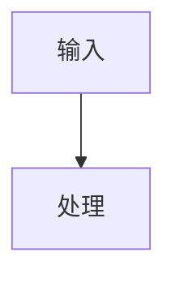

# create-structure-md Skill Design

## Status

Ready for user review.

## Purpose

`create-structure-md` is a local personal Codex skill for creating a single software structure design document. It does not analyze code, infer requirements, run repository intelligence tools, or decide what the system means. Codex performs any code or requirement understanding outside the skill. This skill only turns Codex-prepared structured design content into a validated `STRUCTURE_DESIGN.md`.

The skill optimizes for document quality, repeatability, and renderable Mermaid diagrams. Mermaid is a first-class output surface, not a decorative afterthought.

## Confirmed Requirements

- Skill name: `create-structure-md`.
- Scope: local personal skill.
- Final output: one Markdown file named `STRUCTURE_DESIGN.md`.
- Intermediate outputs: one or more JSON DSL files may be created in a temporary working directory.
- Language: Chinese by default, with English terms where they are clearer or conventional.
- Mermaid only: Graphviz, DOT, SVG files, and image export are out of scope as final outputs.
- Mermaid diagrams are written as Markdown Mermaid code blocks; no separate image files are generated.
- `render_mermaid.py` is an independent script because Mermaid validity is critical.
- DSL coverage is complete for the document, not only a minimal subset.
- Every design item should carry confidence where useful: `observed`, `inferred`, or `unknown`.
- Necessary source snippets are allowed when they improve the document.
- Architecture issues such as cycles, reverse dependencies, and unclear ownership are recorded honestly when Codex supplies them.
- Examples and tests are required.

## Non-Goals

The skill will not:

- Inspect or understand a target repository.
- Generate `repo_facts.json`.
- Include `analyze_repo.py`.
- Depend on Tree-sitter, Doxygen, pyreverse, cflow, libclang, or Graphviz.
- Create multiple Markdown chapter files.
- Generate Word, PDF, SVG, PNG, or other rendered document formats as final deliverables.
- Include C2000, TI driverlib, CPU1/CPU2, ISR, or embedded-C-specific profiles in the first version.
- Automatically delete temporary files or generated artifacts.

## Alternatives Considered

### Full Repository Analysis Pipeline

The old direction used static analysis scripts, repository facts, evidence indexes, and rendering. That is too broad for this skill. It mixes two responsibilities: understanding a project and creating a document. The user explicitly narrowed the skill to document creation.

### Direct Markdown Generation

Codex could write `STRUCTURE_DESIGN.md` directly from its understanding. This is simple, but it gives up validation, reusable examples, Mermaid checks, and consistent structure. It also makes later improvements hard because document shape is embedded in free-form Markdown.

### DSL-Driven Single Document

This is the selected approach. Codex creates a complete JSON DSL in a temporary directory, validates the DSL, validates Mermaid blocks independently, and renders a single Markdown file through a template. This keeps the skill focused while preserving quality gates.

## Proposed Skill Structure

```text
create-structure-md/
├── SKILL.md
├── references/
│   ├── dsl-spec.md
│   ├── document-structure.md
│   ├── mermaid-rules.md
│   └── review-checklist.md
├── schemas/
│   └── structure-design.schema.json
├── scripts/
│   ├── validate_dsl.py
│   ├── render_mermaid.py
│   └── render_markdown.py
├── templates/
│   └── STRUCTURE_DESIGN.md.tpl
├── examples/
│   ├── minimal-from-code.dsl.json
│   └── minimal-from-requirements.dsl.json
└── tests/
    ├── test_validate_dsl.py
    ├── test_render_mermaid.py
    └── test_render_markdown.py
```

## Skill Workflow

1. Codex understands the target codebase, requirements, or user-provided notes outside this skill.
2. Codex invokes `create-structure-md` when the user asks for a software structure design document.
3. The skill instructs Codex to create a temporary working directory, such as `/tmp/create-structure-md-<run-id>`.
4. Codex writes one complete DSL JSON file and may write smaller staged JSON files first.
5. Codex runs `validate_dsl.py` against the complete DSL.
6. Codex runs `render_mermaid.py` to validate Mermaid diagram blocks.
7. Codex runs `render_markdown.py` to create `STRUCTURE_DESIGN.md`.
8. Codex reviews the generated document with `references/review-checklist.md`.
9. Codex reports the output path, temporary working directory path, and any assumptions or low-confidence items.

Temporary files are not automatically deleted. If cleanup is needed, Codex should provide the command for the user to run.

## DSL Design

The DSL is the contract between Codex's understanding and the renderer. It should be expressive enough to create the whole document, but not so elaborate that Codex fights the schema.

Top-level fields:

- `dsl_version`: schema version.
- `document`: title, project name, version, status, authoring context, date.
- `source_basis`: user-provided inputs, code-derived observations, requirement documents, notes, and evidence supplied by Codex.
- `summary`: system purpose, design scope, major decisions.
- `architecture`: architecture style, views, layers, boundaries, quality attributes.
- `modules`: module inventory and module details.
- `runtime`: processes, tasks, jobs, event loops, command flows, or other runtime units when relevant.
- `data_and_dependencies`: dependencies, data ownership, data flow, external integrations.
- `interfaces`: provided and required capabilities, collaboration contracts, API surfaces at design level.
- `flows`: key workflows, sequences, state transitions, and operational scenarios.
- `risks_and_assumptions`: risks, assumptions, unknowns, architecture issues.
- `traceability`: mappings between requirements, modules, flows, risks, and evidence.
- `mermaid`: diagram definitions, diagram IDs, diagram type, placement hints, and source item mappings.
- `appendices`: optional source snippets, glossary, evidence list, or extended notes.

Important repeated fields:

- `id`: stable local identifier.
- `name`: human-readable Chinese name.
- `description`: concise explanation.
- `confidence`: `observed`, `inferred`, or `unknown`.
- `evidence_refs`: references to evidence items supplied in the DSL.
- `notes`: short supplemental notes where needed.

## Markdown Document Structure

`STRUCTURE_DESIGN.md` should use a stable single-file outline:

```text
# 软件结构设计说明书

1. 文档信息
2. 设计依据与范围
3. 系统概览
4. 架构视图
5. 模块设计
6. 运行时视图
7. 数据与依赖关系
8. 接口与协作关系
9. 关键流程
10. 约束、风险与假设
11. 追踪关系
12. 附录
```

Sections may be omitted only when the DSL marks them as not applicable and the rendered document explains why. The default is to keep the section and state that no relevant item was identified.

## Mermaid Requirements

All diagrams in the final Markdown must be Mermaid code blocks:

````markdown

````

Codex may choose the Mermaid diagram type according to content, including `flowchart`, `graph`, `sequenceDiagram`, `classDiagram`, `stateDiagram-v2`, `erDiagram`, `journey`, `gantt`, `timeline`, `mindmap`, `quadrantChart`, `requirementDiagram`, `C4Context`, or any Mermaid syntax supported by common Markdown renderers.

`render_mermaid.py` should validate Mermaid text without network access. Because the skill is expected to support Mermaid broadly rather than maintain a partial custom grammar, strict validation should delegate to a local Mermaid-compatible parser or CLI when one is available. If strict validation tooling is unavailable, the script must say so clearly and must not claim that diagrams were proven renderable.

The script should provide two modes:

- `--strict`: use local Mermaid tooling to parse or render-check diagram source. This is the default mode for final document generation.
- `--static`: run deterministic checks that catch common structural mistakes. This mode is useful for tests and quick feedback, but it is not a substitute for strict validation.

Static checks:

- Code block language is `mermaid`.
- Diagram body is non-empty.
- The first meaningful line declares a Mermaid diagram type or Mermaid directive accepted by the validator.
- Node IDs referenced from DSL placement metadata exist in the DSL.
- Markdown fences are balanced.
- Disallowed Graphviz/DOT constructs such as `digraph`, `rankdir`, and `node -> node;` are rejected when they appear as diagram source. Mermaid arrows such as `-->` and `->>` remain allowed.
- Diagram IDs are unique.

The script should fail closed for malformed diagram blocks. It should print actionable errors that name the diagram ID and field path.

## Script Responsibilities

### `validate_dsl.py`

Validates the complete JSON DSL against `schemas/structure-design.schema.json` and performs semantic checks that JSON Schema cannot express well.

Core checks:

- Required top-level fields exist.
- IDs are unique within their collections.
- References point to existing IDs.
- `confidence` values use the allowed enum.
- Mermaid diagram placements point to valid section IDs or item IDs.
- Required document sections can be rendered.
- Architecture issue entries have severity and rationale.

### `render_mermaid.py`

Extracts and validates Mermaid definitions from DSL or rendered Markdown. It does not render images. It exists to keep diagram correctness visible and independently testable.

### `render_markdown.py`

Renders `STRUCTURE_DESIGN.md` from the DSL and `templates/STRUCTURE_DESIGN.md.tpl` using Python standard-library rendering. It should not invent content. Missing optional content is rendered as a short explicit statement rather than silently disappearing.

## Error Handling

Validation failures should stop rendering. Rendering failures should preserve the DSL and temporary working directory so the issue can be inspected. Error messages should include the failing file, JSON path or diagram ID, and a short correction hint.

If Codex lacks enough content to populate an important section, it should write an explicit `unknown` or `not_applicable` item in the DSL rather than making up facts.

If Mermaid strict validation tooling is unavailable, final generation should stop with a clear message unless the user explicitly accepts static-only validation for that run.

## Testing Strategy

Tests should cover:

- The two example DSL files validate successfully.
- Missing required fields fail validation with clear errors.
- Invalid references fail validation.
- Invalid `confidence` values fail validation.
- Mermaid diagrams with Graphviz/DOT syntax fail validation.
- Valid Mermaid examples across multiple diagram types pass lightweight validation.
- Rendering creates exactly one `STRUCTURE_DESIGN.md`.
- Rendered Markdown includes balanced fences and no Graphviz code block.

## Examples

Two example DSL files are required:

- `minimal-from-code.dsl.json`: describes a document generated after Codex has understood an existing codebase.
- `minimal-from-requirements.dsl.json`: describes a document generated from requirements or design notes without an implemented codebase.

The examples should stay small enough to read quickly but complete enough to exercise every required top-level DSL section.

## Implementation Notes

The first implementation should avoid optional Python dependencies. Python standard library is preferred for JSON validation glue, Markdown rendering, and tests. Mermaid validation is the exception: strict Mermaid confidence should come from local Mermaid tooling rather than an incomplete hand-written grammar.

The skill should keep `SKILL.md` concise. Detailed DSL fields, document outline, Mermaid rules, and review criteria belong in `references/` so Codex loads them only when needed.

## Review Checklist

Before implementation begins, verify:

- The design keeps project understanding outside the skill.
- The output contract is one `STRUCTURE_DESIGN.md`.
- Mermaid is the only supported diagram output.
- Graphviz is fully removed.
- Temporary JSON files are allowed but not part of the final deliverable.
- The DSL includes confidence and evidence support.
- Tests cover schema, Mermaid validation, and Markdown rendering.
- The design is small enough for one implementation plan.
