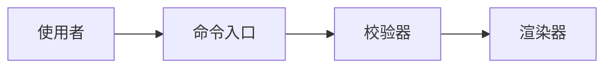
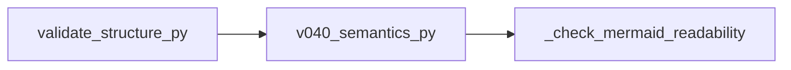
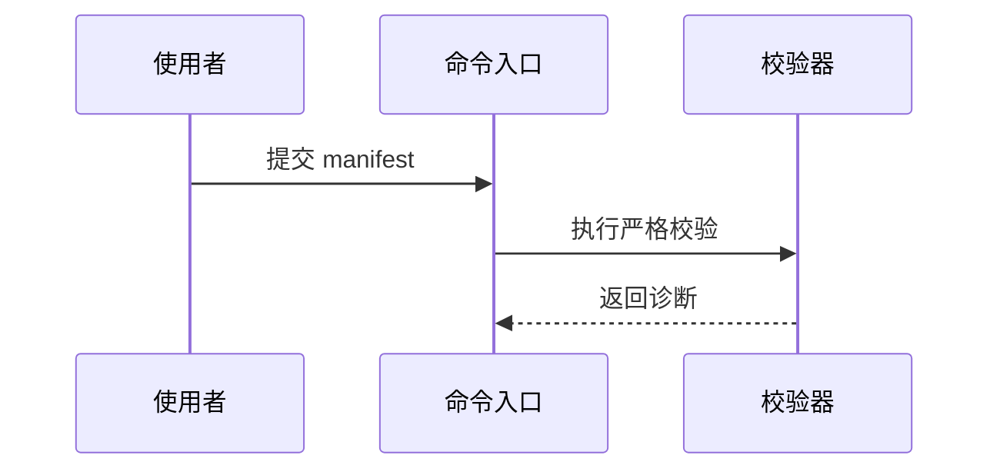
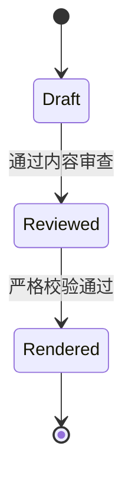
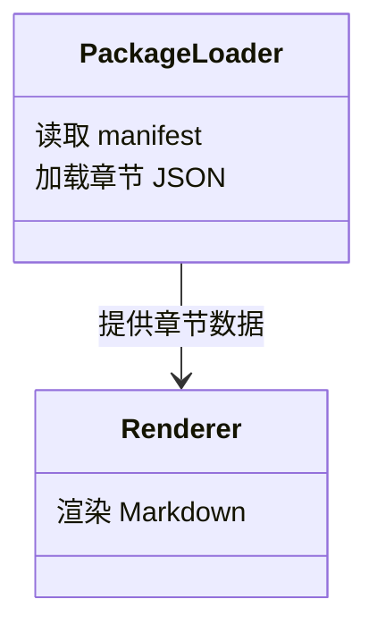

# Mermaid Rules

This file is auxiliary validation guidance for Mermaid blocks. It points back to `references/dsl-authoring-guide.md` as the single canonical authoring reference and must not redefine or fork that guide.

## Active Gate

Every Mermaid block must render through Mermaid CLI when Mermaid blocks exist.

Mermaid blocks can appear in detail files and shared-block static chapters, but not in `main_flow_overview` or `module_overview`.

Architecture overview, every main flow detail, and every module detail must contain at least one Mermaid block.

Missing `mmdc` is an error.

Render failure is an error.

Missing SVG output after zero exit is an error.

## Relationship To Authoring Guidance

Use `references/dsl-authoring-guide.md` as the canonical source for Mermaid diagram selection guidance.

This file records validation, readability, and construction constraints for Mermaid blocks:

- Mermaid blocks must be short enough to review directly in the DSL.
- Mermaid labels must be human-readable.
- Visible labels must not expose internal IDs.
- Mermaid blocks must not contain process logs, command transcripts, raw scan logs, rejected drafts, or subagent reports.
- Mermaid blocks must not dump call graphs, directory trees, or API references.
- Missing Mermaid in architecture overview, any main flow detail, or any module detail is a final-review failure.
- Static readability guidance does not replace CLI rendering.

## Block Shape

Write Mermaid as a `mermaid` block, not as a `code` block.

```json
{
  "type": "mermaid",
  "title": "组件协作",
  "diagram_type": "flowchart",
  "source": "flowchart LR\n  app[应用] --> api[公共 API]\n  api --> storage[存储层]"
}
```

Rules:

- `title` is required and should name what the diagram explains.
- `diagram_type` must describe the Mermaid family used in `source`.
- The first non-empty line of `source` must match the diagram family, such as `flowchart LR`, `sequenceDiagram`, `stateDiagram-v2`, or `classDiagram`.
- Use `\n` line breaks in JSON strings.
- Keep one Mermaid block focused on one relationship, path, lifecycle, or responsibility model.

## Writing Flowcharts

Use `flowchart` for layers, components, dependencies, data movement, initialization, build/release paths, and ownership boundaries.

Prefer:



Rules:

- Prefer `flowchart LR` for left-to-right flows and `flowchart TB` for layered top-to-bottom structures.
- Use simple internal node IDs like `cli`, `validator`, and `renderer`.
- Put human-readable labels in brackets, such as `validator[校验器]`.
- Keep visible labels short and reader-facing.
- Avoid legacy `graph` syntax; use `flowchart`.
- Avoid file trees, function-by-function call graphs, and every-helper dependency maps.

Avoid:



## Writing Sequence Diagrams

Use `sequenceDiagram` when order matters: API calls, request/response paths, storage read/write paths, retries, callbacks, or handoffs between actors.

Prefer:



Rules:

- Declare participants with readable aliases.
- Keep messages at the reader's task level, not function-call level.
- Use arrows to show important responsibility handoffs.
- Do not include stack traces, log lines, command transcripts, or internal retry noise.

## Writing State Diagrams

Use `stateDiagram-v2` for lifecycle, phase, validity, mode, or job-state explanations.

Prefer:



Rules:

- Keep state names stable and reader-facing.
- Use transitions to explain why the state changes.
- Do not model every temporary implementation flag.

## Writing Class Diagrams

Use `classDiagram` only for stable type, interface, or responsibility relationships that help readers understand ownership.

Prefer:



Rules:

- Use class diagrams sparingly.
- Show responsibility relationships, not complete APIs.
- Do not list every method, field, struct member, enum, or macro.

## Render-Safe Style

- Keep Mermaid source ASCII-compatible except for visible human labels.
- Use stable internal IDs made from letters, numbers, and underscores.
- Avoid spaces, punctuation, slashes, and hyphens in internal IDs.
- Put spaces and natural language in visible labels, not internal IDs.
- Prefer short edge labels.
- Avoid Markdown fences inside Mermaid source.
- Avoid extremely large diagrams; split the explanation into prose plus a smaller diagram when the graph grows hard to review.
- Before final acceptance, run strict validation so `mmdc` proves the diagram renders.
